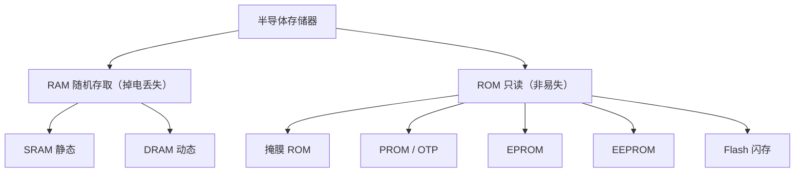

# 05-01 半导体存储器原理与指标

建立存储体、地址译码、控制逻辑和性能指标模型。

> [!info] 导航
> 上一节：[[04-09 汇编与 C-C++ 混合编程]] · 课程总览：[[计算机系统/微机原理与接口技术B/MOC - 微机原理与接口技术|总 MOC]] · 本章目录：[[计算机系统/微机原理与接口技术B/05 半导体存储器/MOC - 05 半导体存储器|第 5 章 MOC]] · 下一节：[[05-02 SRAM、DRAM 与内存技术]]
>
> **内容主线**：[[#5.1 半导体存储器概述|半导体存储器概述]] → [[#5.1.1 半导体存储器的分类|半导体存储器的分类]] → [[#5.1.2 存储原理与地址译码|存储原理与地址译码]] → [[#1. 存储体|存储体]]

## 5.1 半导体存储器概述

存储器是计算机实现记忆功能的核心部件，用于存放待处理的数据和中间计算结果以及系统或用户程序等供处理器读写和执行。显然，容量越大（即能存储的信息越多）、存取速度越快、成本越低，则性能价格比越高。但是，这三方面的性能之间常常存在矛盾，较好的解决方法是采取分级存储结构，通过合理的设计获得快慢搭配、协调工作的存储系统。

![[计算机系统/微机原理与接口技术B/附件/第5章/Pasted image 20260719160743.png]]
*图 5-1　典型的现代微机系统的存储组织*

典型的现代微机系统的存储组织如图 5-1 所示，呈现金字塔形结构，越往上存储器件的存取速度越快，CPU 的访问频度越高，同时单位存储量的价格也越高，占系统的存储容量的比例越小。可以看到，CPU 片内寄存器位于塔顶，存取速度最快，但数量很少；向下依次是 CPU 内的 Cache(高速缓冲存储器)、主板的 Cache、主存储器、辅助存储器（半导体盘、磁盘等，一般以联机方式工作）和大容量辅助存储器（光盘、磁带等，可脱机工作）。位于塔底的存储设备的容量最大，单位存储成本最低，但存取速度可能较慢或最慢。

简单地从一个微处理器角度看，存储器分为两类：一类是可以通过标准数据总线直接访问的内部存储器，用于存储当前与 CPU 频繁交换的信息，其工作速度快，但容量较小；另一类是外部存储器，用于存储 CPU 暂不处理的信息，其容量很大，故也称为海量存储器，即所谓的外存。外存中的信息既可被方便地修改，又可长期保存，但 CPU 需要配置专门的接口和驱动设备才能实现访问，对它的存取速度也较内存慢得多。当其信息需要处理时，要先通过接口电路调入内存，再由 CPU 处理。高速缓存通过专门的控制电路，提供大容量内存的高效、高可靠的分级访问功能。

在内存方面，随着大规模集成电路技术的发展，半导体存储器的集成度、可靠性和存取速度等性能迅速提高，制造工艺更为简便，而成本迅速下降。在外存方面，采用快擦写存储器（Flash ROM）的 U 盘目前已基本取代了传统的软磁盘，成为主要的移动存储手段，而低功耗、高可靠的固态硬盘也开始逐步代替机械式大容量磁介质硬盘。

为了便于系统扩展和升级，部分微处理器引入了专门的存储器管理单元（MMU），通过分段、分页及保护机制，支持高速虚拟存储器，实现多用户、多任务应用系统。

本章先介绍存储器的主要指标，典型半导体存储器的组成、结构、工作原理以及存储器的容量扩充方法，然后介绍 8086/8088 CPU 的存储器系统设计，讨论 80386/Pentium CPU 系统的存储器连接以及多级存储器和虚拟存储器技术。

### 5.1.1 半导体存储器的分类

从制造工艺的角度分类，半导体存储器可分为双极型和金属氧化物半导体型。

1. 双极（Bipolar）型半导体型由 TTL（Transistor-Transistor Logic）晶体管逻辑电路构成。这类存储器件的工作速度快，可与 CPU 处在同一量级，但集成度低、功耗大、价格偏高，在现代微机系统中常用作高速缓存器、控制存储器。

2. 金属氧化物半导体（Metal-Oxide-Semiconductor）型简称 MOS 型，有多种制作工艺，如 NMOS、HMOS、CMOS、CHMOS 等，可用来制作多种半导体存储器件，如静态 RAM、动态 RAM、EPROM 等。这类存储器的集成度高、功耗低、价格便宜，但存取速度较双极型器件慢。微机的内存主要为 MOS 型。

按应用与存取方式不同，半导体存储器又分为随机存取存储器 RAM（Random Access Memory）和只读存储器 ROM（Read Only Memory）两大类，如图 5-2 所示。

![[计算机系统/微机原理与接口技术B/附件/第5章/Pasted image 20260719160751.png]]
*图 5-2　半导体存储器的分类示意图*

1. RAM 在使用中可由程序随时读/写存储单元内容，一般用于存放输入/输出数据、中间结果或加载的用户应用程序。

2. ROM 在工作时，其内容只能读出，不能写入，一般用于存放工作程序或固定不变的参数表等。掩膜 ROM 的内容是不能改变的，而 EPROM 等的内容在特定条件下（如紫外线光照或高电压、大电流、特殊时序等）才能擦除改写。这类存储器存储的内容在断电后仍能长期保持，具有非挥发性（Non-Volatile），其中 E²PROM、Flash ROM 可支持电擦除，并可由程序在线改写。此外，还有一类结合了两者特性的非挥发随机存取存储器（NVRAM）。

微机工作时，一般先从 ROM 中的引导程序启动系统，需要时再从外存中读取系统程序和应用程序，加载到内存 RAM 中；在多数嵌入式系统应用中，往往直接运行存放在只读存储器中的系统和应用程序。在程序的运行过程中，中间结果一般存放在 RAM 中，程序也可根据需要将结果送入外存。保存在外存中的程序和数据可以根据需要被调入内存再次运行或修改。

近年来，为满足微处理器应用的需要，各种大容量、高速、高集成度、低功耗存储器及相关技术发展很快，先后出现了伪静态存储器 PSRAM、高速缓存器 Cache、快速页模式 FPM-RAM、扩展数据输出 EDO-RAM、Rambus-DRAM 和各种同步高速 RAM（同步动态 SDRAM、同步图形 SGRAM、双倍及多速率 SDRAM，即 DDR、DDR2、DDR3 等）、高性能大容量快擦除存储器等技术。大容量 RAM 在使用上则将多片甚至多种芯片组合集成到一起，配上控制电路构成标准存储器模块（Memory Module，习惯上又称为内存条）。

### 5.1.2 存储原理与地址译码

![[计算机系统/微机原理与接口技术B/附件/第5章/Pasted image 20260719160758.png]]
*图 5-3　用于微机系统的半导体存储器芯片结构一般*

用于微机系统的半导体存储器芯片结构一般如图 5-3 所示，由保存数据的存储体矩阵、片内地址译码电路、译码驱动电路、读/写控制电路、三态缓冲器和控制逻辑等组成。

#### 1. 存储体

一个基本存储电路（或称为记忆单元）能存储 1 位二进制数，若干基本存储电路组成一个存储单元，如一个 8 位的二进制数需 8 个基本存储电路。容量为 $M \times N$（如 $64K \times 8$）位的存储器则包含 $M \times N$ 个基本存储电路。这些基本存储电路有规则地排列在一起便构成了存储体，是存储器的基础和核心。面向微机的存储单元一般可组合存储 1 字节（8 位）或 1 字节的 2、4、8 倍信息，即存放 8、16、32、64 位二进制信息。不同类型存储器具有不同的存储体结构，以实现快速读/写、大容量存储或非易失存储等性能。

#### 2. 地址译码与驱动

译码与驱动电路一般包含译码器和驱动器两部分。译码器（Decoder）是将每个编码信号译成一个特定输出信号的电路，存储器一般产生 $N$ 选 1 的线性有序输出，即对于某一地址编码信号，$N$ 个输出线上有唯一的一路有效（高或低）电平信号与之对应。例如，5 位二进制编码信号可得到 32 个译码信号，当 $A_4A_3A_2A_1A_0=(00000)$ 时，输出译码信号 $X_0 \sim X_{31}$ 中仅有 $X_0$ 输出为有效信号（如高电平），其他 $X_1 \sim X_{31}$ 输出均为无效信号（如低电平）。$A_4A_3A_2A_1A_0=00001$ 时，仅有 $X_1$ 有效，其他均为无效，以此类推。

为了区分存储体中具体的存储单元，给每个单元规定一个编号，标识相应的存储单元，简称地址。为了准确读/写指定的存储单元，计算机需要采用专门的地址译码电路，包括片内译码和片选译码两级：片选译码采用高位地址，片内译码利用低位地址信号进行译码。

常用的片内地址译码有单译码和双译码两种方式。

##### 1. 单译码方式

![[计算机系统/微机原理与接口技术B/附件/第5章/Pasted image 20260719160805.png]]
*图 5-4　$N$ 选 1 单译码存储器组织*

图 5-4 是一个 $N$ 选 1 译码器。译码器输出驱动 $N=2^n$ 条译码信号线，若单元 I/O 字线由 $M$ 位组成，某条字线被选中，则对应此线上的 $M$ 位信号便同时被读出或写入，经输出缓冲放大器输出或输入一个 $M$ 位的字。在图 5-4 中，若 $n=4$，字线 $N=16$，$M$ 为 8 位，则地址译码器的地址输入线 $n$ 应为 4 位，$2^4=16$ 个状态，分别控制 16 条字线（$S_0 \sim S_{15}$）。当地址信号为 0000 时，选中字线 $S_0$，若进行读出操作，则该字线上的 8 位同时被读出；类推地址信号 0001 对应 $S_1$，0010 对应 $S_2 \cdots \cdots$ 地址信号 1111 选中第 16 条字线 $S_{15}$。此时如果是写操作，则该字线上的 8 位便同时被写入存储单元。

单译码方式主要用于早期的小容量半导体存储器，对于现代大容量的存储器，则多采用 X/Y 双译码方式。

##### 2. X/Y 双译码方式

X/Y 双译码方式又称为复合译码方式，在内部采用两级译码电路。由于地址译码信号个数 $n$ 较大时，字单元选择线的条数 $N$ 必然很多，这时可将 $n$ 个信号分成 $g$ 和 $r$ 两组，如 $N=2^n=2^{g+r}=2^g \times 2^r=X \times Y$，对 $N$ 个状态的译码分别由 X 译码和 Y 译码两部分完成。

![[计算机系统/微机原理与接口技术B/附件/第5章/Pasted image 20260719160813.png]]
*图 5-5　双译码方式*

以 $n=12$ 为例，可以分为 $N=2^{12}=2^6 \times 2^6=64 \times 64=4096$，其双译码方式如图 5-5 所示。

4096 个单元排成 $64 \times 64$ 的矩阵，需要 12 条地址线 $A_{11} \sim A_0$，分成 X 和 Y 两部分，$A_5 \sim A_0$ 输入至 X 方向（行）译码器，它输出 64 条选择线，分别选择 64 行（$X_0 \sim X_{63}$）；$A_{11} \sim A_6$ 输入至 Y 译码器，输出的 64 条位选择线分别选择 $Y_0 \sim Y_{63}$ 列，控制各列的位线。设 $A_{11} \sim A_0=000000000000$，则 X 地址译码输出 $X_0$ 为高电平有效，选中 $X_0$ 行，则 $X_0$ 行控制的 $(0,0)$、$(0,1)$、$(0,2)、\cdots、(0,63)$ 各位都可被选中进行读（写）操作，具体选中哪一位，取决于 Y 地址译码，在该图例中，Y 地址译码输出 $Y_0$ 应为高电平，列线 $Y_0$ 有效，此列控制的位线控制门打开，故 X、Y 双向译码结果是选中 $(0,0)$ 对应一组基本存储电路，即可对那一组存储电路进行读（写）操作。如果一个存储字为 8 位，就需要 8 个这样的存储单元。当一个地址被选中时，构成该地址单元的 8 位阵列状态数据同时被读出（或写入）。

在半导体存储器中，一个或几个 X、Y 阵列被集成在一块芯片上。如果将存储字的 8 位都集成在一块芯片内，这种存储器为字结构芯片，如 Intel 2764(EPROM)、Intel 6116(RAM) 存储容量分别为 $8K \times 8$ 位、$2K \times 8$ 位；如果芯片中集成的是各存储字的同一位或几位，这种芯片则称为位结构芯片，如 Intel 2164A（RAM）、$\mu$PD424256（RAM）存储容量分别为 $64K \times 1$ 位和 $256K \times 4$ 位。

与单译码方式比较，双译码寻址可显著减少输出选择线的数目。单译码时 $K$ 位地址需要 $2^K$ 个状态输出线，在双译码结构中，假设 $K$ 为偶数，则 $K/2$ 个输入端可以有 $2^{K/2}$ 个输出状态，X 和 Y 两个地址译码器共有 $2^{K/2} \times 2^{K/2}=2^K$ 个输出状态，译码输出线却只有 $2^{K/2}+2^{K/2}$。以 16 位地址为例，若采用单译码方式，译码输出需要 $2^{16}$（即 65536）条选择线；若采用 X、Y 各 8 线双译码方式，构成 $256 \times 256$ 的矩阵，输出状态仍为 65536 个，但译码输出选择线只需 $256+256=512$ 条，大大减少了选择线的数目。存储器容量越大，这种存储结构的优点越突出。

#### 3. 控制逻辑

读/写控制电路包括读出放大器、写入电路和读/写控制电路，以完成对被选中单元中各位的读出或写入操作。控制逻辑接收来自片选译码（$\overline{CS}$ 或 $\overline{CE}$）、存储器读/写信号，经读/写控制电路实现存储单元的读/写操作。

微机系统中存储器的读/写操作是在 CPU 的控制下对指定单元进行访问，只有当接收到来自 CPU 的存储器读/写命令后，才能实现正确的读/写操作。三态缓冲器提供存储单元与数据 I/O 总线的正确操作，当未访问该存储器芯片时，三态缓冲器输出处于高阻（Z）状态。

### 5.1.3 主要性能指标

#### 1. 存储容量

存储器的容量是指一个存储器芯片所能存储的二进制信息量。
$$
存储容量=存储单元数 \times I/O数据线位数
$$

如某芯片有 2048 个存储单元，每个单元存放 8 位二进制数，则其容量为 $2048\times8$（16384）位，或写为 $2048\times8$ 位（16384）。为简化书写，习惯上以 1K 表示 1024（故容量 $2048\times8$ 位简记为 $2K\times8$ b 或 16K b）。同样，以 1M 表示 $1K\times1K$ 等。

目前，CPU 的字长已经达到 16、32、64 位，可以访问 1、2、4、8 个字节单元。在微机系统中，存储器几乎都以字节为基本单元，所以常用存储器的字节数来表示系统存储器的容量，如 8088（PC/XT）存储空间 1M，80386 的 4M 存储器，均指字节数（1 MB 和 4 MB）。

#### 2. 最大存取时间

存储器的存取时间定义为一次访问存储器（对指定单元写入或读出）所需时间，这个时间的上限值即最大存取时间，一般为几纳秒到几百纳秒（ns）。最大存取时间越短，芯片的工作速度越快。

#### 3. 供电电压、逻辑电平、接口方式

传统的存储器多采用 +5 V 供电，标准 TTL 逻辑电平，并行数据接口。近年来，低电压 CMOS 技术大量应用，+3.3 V、+2.5 V、+1.8 V、+1.5 V（分别称为 LVTTL、SSTL_2、SSTL_18、SSTL_15 兼容）等标准电压和逻辑电平的陆续引进，为实现低功耗、高速运行提供了条件；另外，采用串行接口可以大大简化存储器接口电路，提高可靠性，因此串行接口被广泛用于 E²PROM 甚至高速 RAM 芯片接口。串行接口技术详见第 7 章。

另外，面向多处理器或控制器接口的存储器，如同步和异步的 FIFO-RAM、双口（Dual Port）RAM 或串行双口 E²PROM 也成为设计中的一类重要选择。

#### 4. 其他指标

功耗、可靠性、集成度、价格等也是用户所关心的指标。

需要说明的是，实际选型时上述各项指标往往相互矛盾，要求存储器同时具有这些高性能参数是困难的，应根据实际情况权衡，并根据需要合理设计存储器结构。

