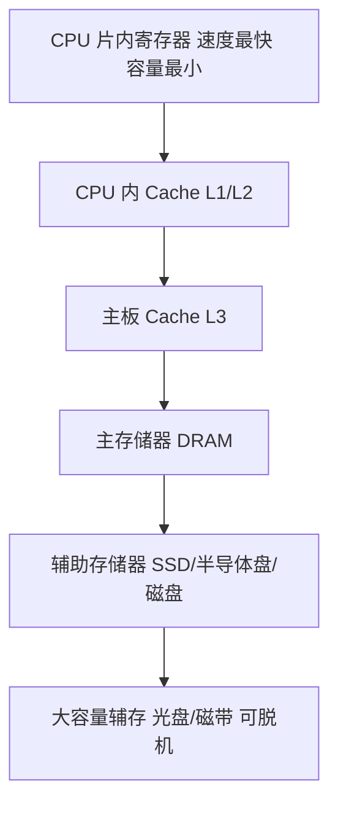

# 05-01 半导体存储器原理与指标

建立存储体、地址译码、控制逻辑和性能指标模型。

> [!info] 导航
> 上一节：[[04-09 汇编与 C-C++ 混合编程]] · 课程总览：[[计算机系统/微机原理与接口技术B/MOC - 微机原理与接口技术|总 MOC]] · 本章目录：[[计算机系统/微机原理与接口技术B/05 半导体存储器/MOC - 05 半导体存储器|第 5 章 MOC]] · 下一节：[[05-02 SRAM、DRAM 与内存技术]]
>
> **内容主线**：[[#5.1 半导体存储器概述|半导体存储器概述]] → [[#5.1.1 半导体存储器的分类|半导体存储器的分类]] → [[#5.1.2 存储原理与地址译码|存储原理与地址译码]] → [[#5.1.3 主要性能指标|主要性能指标]]

## 5.1 半导体存储器概述

> [!abstract] 存储器的地位与三类矛盾
> 存储器是计算机实现记忆功能的核心部件，用于存放待处理的数据、中间计算结果以及系统或用户程序。
> 容量、存取速度、成本三方面常常相互矛盾，较好的解决方法是采取**分级存储结构**，通过快慢搭配、协调工作获得高性价比存储系统。详见 [[05-06 存储层次、Cache 与虚拟存储器]]。

![[计算机系统/微机原理与接口技术B/附件/第5章/Pasted image 20260719160743.png]]
*图 5-1　典型的现代微机系统的存储组织*

> [!info] 金字塔层次结构特点
> - 越往塔顶：存取速度越快、CPU 访问频度越高、单位价格越高、占系统存储容量比例越小。
> - **塔顶**：CPU 片内寄存器，速度最快但数量很少。
> - **向下依次**：CPU 内 Cache、主板 Cache、主存储器、辅助存储器（半导体盘、磁盘等，联机工作）、大容量辅助存储器（光盘、磁带等，可脱机工作）。
> - **塔底**：容量最大、单位成本最低，但存取速度可能最慢。

> [!note] 内存储器与外存储器
> 从微处理器角度看，存储器分为两类：
> - **内部存储器（内存）**：通过标准数据总线直接访问，存储当前与 CPU 频繁交换的信息，工作速度快但容量较小。
> - **外部存储器（外存/海量存储器）**：存储 CPU 暂不处理的信息，容量大；可修改且可长期保存，但需专门接口和驱动设备，存取速度较内存慢得多。信息需要处理时，先通过接口电路调入内存，再由 CPU 处理。

> [!tip] 技术发展趋势
> - **内存方面**：半导体存储器集成度、可靠性、存取速度迅速提高，制造工艺简便，成本下降。
> - **外存方面**：Flash ROM 的 U 盘已基本取代软磁盘成为主要移动存储手段；低功耗、高可靠的固态硬盘逐步代替机械式大容量磁介质硬盘。
> - **存储管理**：部分微处理器引入专门的存储器管理单元（MMU），通过分段、分页及保护机制支持高速虚拟存储器，实现多用户、多任务应用系统。

### 5.1.1 半导体存储器的分类

从制造工艺的角度分类，半导体存储器可分为双极型和金属氧化物半导体型。

| 工艺类型 | 构成 | 速度 | 集成度 | 功耗 | 价格 | 典型用途 |
| :--- | :--- | :--- | :--- | :--- | :--- | :--- |
| **双极型（Bipolar）** | TTL 晶体管逻辑电路 | 快，与 CPU 同量级 | 低 | 大 | 偏高 | 高速缓存器、控制存储器 |
| **MOS 型** | NMOS / HMOS / CMOS / CHMOS 等 | 较双极型慢 | 高 | 低 | 便宜 | 微机内存（静态 RAM、动态 RAM、EPROM 等） |

![[计算机系统/微机原理与接口技术B/附件/第5章/Pasted image 20260719160751.png]]
*图 5-2　半导体存储器的分类示意图*

> [!info] RAM 与 ROM 的基本区别
> - **RAM（Random Access Memory）**：使用中可由程序随时读/写存储单元内容，一般用于存放输入/输出数据、中间结果或加载的用户应用程序。
> - **ROM（Read Only Memory）**：工作时只能读出、不能写入，一般用于存放工作程序或固定不变的参数表等。掩膜 ROM 内容不可改变；EPROM 等在特定条件下（紫外线光照或高电压、大电流、特殊时序）才能擦除改写；E²PROM、Flash ROM 可支持电擦除，并可由程序在线改写。
> - **NVRAM**：结合两者特性的非挥发随机存取存储器。

> [!note] 微机工作时的存储器分工
> 1. 微机一般先从 ROM 中的引导程序启动系统，需要时再从外存读取系统程序和应用程序，加载到内存 RAM 中；
> 2. 嵌入式系统应用中，往往直接运行存放在只读存储器中的系统和应用程序；
> 3. 程序运行过程中，中间结果一般存放在 RAM 中，程序也可根据需要将结果送入外存；
> 4. 保存在外存中的程序和数据可根据需要被调入内存再次运行或修改。

> [!tip] 近年发展的存储器技术
> - **PSRAM**（伪静态存储器）、**Cache**（高速缓存器）；
> - **FPM-RAM**（快速页模式）、**EDO-RAM**（扩展数据输出）、**Rambus-DRAM**；
> - 同步高速 RAM：**SDRAM**、**SGRAM**、**DDR/DDR2/DDR3** 等；
> - 高性能大容量快擦除存储器；
> - 大容量 RAM 多片集成 + 控制电路 → 标准存储器模块（Memory Module，内存条）。

### 5.1.2 存储原理与地址译码

![[计算机系统/微机原理与接口技术B/附件/第5章/Pasted image 20260719160758.png]]
*图 5-3　用于微机系统的半导体存储器芯片结构一般*

> [!info] 半导体存储器芯片的组成
> 用于微机系统的半导体存储器芯片由以下部分组成：
> - 保存数据的**存储体矩阵**
> - **片内地址译码电路**
> - **译码驱动电路**
> - **读/写控制电路**
> - **三态缓冲器**
> - **控制逻辑**

#### 1. 存储体

> [!abstract] 基本存储电路与存储单元
> - 一个**基本存储电路**（记忆单元）能存储 1 位二进制数；
> - 若干基本存储电路组成一个**存储单元**（如 8 位二进制数需 8 个基本存储电路）；
> - 容量为 $M \times N$（如 $64K \times 8$）位的存储器包含 $M \times N$ 个基本存储电路；
> - 面向微机的存储单元一般可存放 8、16、32、64 位二进制信息。

> [!note] 字结构芯片 vs 位结构芯片
> | 芯片类型 | 集成方式 | 典型芯片与容量 |
> | :--- | :--- | :--- |
> | **字结构芯片** | 存储字的 8 位都集成在一块芯片内 | Intel 2764（EPROM）$8K \times 8$ 位；Intel 6116（RAM）$2K \times 8$ 位 |
> | **位结构芯片** | 芯片中集成各存储字的同一位或几位 | Intel 2164A（RAM）$64K \times 1$ 位；$\mu$PD424256（RAM）$256K \times 4$ 位 |

#### 2. 地址译码与驱动

> [!info] 译码与驱动电路
> - **译码器（Decoder）**：将每个编码信号译成一个特定输出信号，存储器一般产生 $N$ 选 1 的线性有序输出。对于某一地址编码，$N$ 个输出线上有唯一的一路有效电平与之对应。
> - **示例**：5 位二进制编码可得到 32 个译码信号。$A_4A_3A_2A_1A_0=00000$ 时，仅 $X_0$ 输出有效（高电平），其他 $X_1 \sim X_{31}$ 输出无效（低电平）；$A_4A_3A_2A_1A_0=00001$ 时，仅 $X_1$ 有效，以此类推。

> [!important] 两级地址译码
> 为准确读/写指定存储单元，计算机采用专门的地址译码电路，包括两级：
> - **片选译码**：采用高位地址，用于选择具体的存储器芯片。
> - **片内译码**：利用低位地址信号进行译码，用于选择芯片内部的具体单元。
>
> 常用的片内地址译码方式有**单译码**和**双译码**两种。

##### 1. 单译码方式

![[计算机系统/微机原理与接口技术B/附件/第5章/Pasted image 20260719160805.png]]
*图 5-4　$N$ 选 1 单译码存储器组织*

> [!info] 单译码工作原理
> 译码器输出驱动 $N=2^n$ 条译码信号线，若单元 I/O 字线由 $M$ 位组成，某条字线被选中，则对应此线上的 $M$ 位信号便同时被读出或写入，经输出缓冲放大器输出或输入一个 $M$ 位的字。
>
> **示例**：$n=4$，字线 $N=16$，$M=8$ 位 → 地址输入线 4 位，$2^4=16$ 个状态控制 16 条字线 $S_0 \sim S_{15}$。
> - 地址 0000 → 选中 $S_0$，读出该字线上的 8 位；
> - 地址 0001 → $S_1$；0010 → $S_2$；…；1111 → $S_{15}$。

> [!warning] 单译码适用范围
> 单译码方式主要用于早期的小容量半导体存储器。现代大容量存储器多采用 X/Y 双译码方式。

##### 2. X/Y 双译码方式

> [!abstract] 双译码方式原理
> 又称复合译码方式，内部采用两级译码电路。当地址译码信号个数 $n$ 较大时，将 $n$ 个信号分成 $g$ 和 $r$ 两组：
> $$N=2^n=2^{g+r}=2^g \times 2^r=X \times Y$$
> 对 $N$ 个状态的译码分别由 X 译码和 Y 译码两部分完成。

![[计算机系统/微机原理与接口技术B/附件/第5章/Pasted image 20260719160813.png]]
*图 5-5　双译码方式*

> [!example] $n=12$ 双译码示例
> $N=2^{12}=2^6 \times 2^6=64 \times 64=4096$，4096 个单元排成 $64 \times 64$ 矩阵，需要 12 条地址线 $A_{11} \sim A_0$：
> - $A_5 \sim A_0$ → X 方向（行）译码器，输出 64 条选择线选择 64 行（$X_0 \sim X_{63}$）；
> - $A_{11} \sim A_6$ → Y 译码器，输出 64 条位选择线选择 $Y_0 \sim Y_{63}$ 列。
>
> 设 $A_{11} \sim A_0=000000000000$：X 译码输出 $X_0$ 高电平有效选中 $X_0$ 行，该行 $(0,0)$、$(0,1)$、…、$(0,63)$ 各位都可被选中；Y 译码输出 $Y_0$ 高电平有效，列线 $Y_0$ 控制门打开。最终 X、Y 双向译码结果选中 $(0,0)$ 对应的一组基本存储电路进行读/写操作。
>
> 若一个存储字为 8 位，则需要 8 个这样的存储单元；当一个地址被选中时，构成该地址单元的 8 位阵列状态数据同时被读出（或写入）。

> [!important] 单译码 vs 双译码的选择线数量对比
> | 比较项 | 单译码 | 双译码（$K$ 为偶数） |
> | :--- | :--- | :--- |
> | 译码输出状态数 | $2^K$ | $2^{K/2} \times 2^{K/2} = 2^K$ |
> | 译码输出选择线数 | $2^K$ | $2^{K/2} + 2^{K/2}$ |
>
> **16 位地址示例**：
> - 单译码：$2^{16}=65536$ 条选择线；
> - 双译码（X、Y 各 8 线，$256 \times 256$ 矩阵）：输出状态仍为 65536 个，但译码输出选择线只需 $256+256=512$ 条，**大大减少**。
>
> 存储器容量越大，双译码结构的优点越突出。

#### 3. 控制逻辑

> [!info] 读/写控制电路
> 读/写控制电路包括读出放大器、写入电路和读/写控制电路，以完成对被选中单元中各位的读出或写入操作。
> 控制逻辑接收来自片选译码（$\overline{CS}$ 或 $\overline{CE}$）、存储器读/写信号，经读/写控制电路实现存储单元的读/写操作。

> [!warning] 三态缓冲器的作用
> 微机系统中存储器的读/写操作在 CPU 控制下对指定单元进行访问，只有接收到 CPU 的存储器读/写命令后才能实现正确的读/写操作。
> 三态缓冲器提供存储单元与数据 I/O 总线的正确操作；当未访问该存储器芯片时，三态缓冲器输出处于**高阻（Z）状态**。

### 5.1.3 主要性能指标

#### 1. 存储容量

> [!important] 存储容量公式
> $$\text{存储容量} = \text{存储单元数} \times \text{I/O 数据线位数}$$
> - 示例：某芯片有 2048 个存储单元，每个单元存放 8 位二进制数，则容量为 $2048 \times 8 = 16384$ 位，简记为 $2K \times 8$ b 或 16K b。
> - 习惯上：$1K = 1024$，$1M = 1K \times 1K$。

> [!note] 字节单位的容量表示
> 目前 CPU 字长达 16、32、64 位，可访问 1、2、4、8 个字节单元。微机系统中存储器几乎以字节为基本单元，常用字节数表示系统存储容量：
> - 8088（PC/XT）存储空间 1M = **1 MB**；
> - 80386 的 4M 存储器 = **4 MB**。

#### 2. 最大存取时间

> [!important] 存取时间定义
> 存储器的存取时间 = 一次访问存储器（对指定单元写入或读出）所需时间。
> - **最大存取时间**：存取时间的上限值，一般为几纳秒到几百纳秒（ns）。
> - 最大存取时间越短，芯片工作速度越快。

#### 3. 供电电压、逻辑电平、接口方式

> [!info] 供电电压与接口方式演进
> | 项目 | 传统存储器 | 现代存储器 |
> | :--- | :--- | :--- |
> | 供电电压 | +5 V | +3.3 V、+2.5 V、+1.8 V、+1.5 V |
> | 逻辑电平 | 标准 TTL | LVTTL、SSTL_2、SSTL_18、SSTL_15 |
> | 接口方式 | 并行数据接口 | 并行 + 串行接口（E²PROM、高速 RAM） |
>
> - 低电压 CMOS 技术大量应用，为实现低功耗、高速运行提供条件；
> - 串行接口可大大简化存储器接口电路、提高可靠性，广泛用于 E²PROM 甚至高速 RAM 芯片接口（详见第 7 章）；
> - 面向多处理器/控制器接口的存储器：同步/异步 FIFO-RAM、双口（Dual Port）RAM、串行双口 E²PROM。

#### 4. 其他指标

> [!warning] 性能指标权衡
> 其他用户关心的指标包括：**功耗、可靠性、集成度、价格**。
>
> 实际选型时上述各项指标往往相互矛盾，要求存储器同时具有这些高性能参数是困难的，应根据实际情况权衡，并根据需要合理设计存储器结构。
