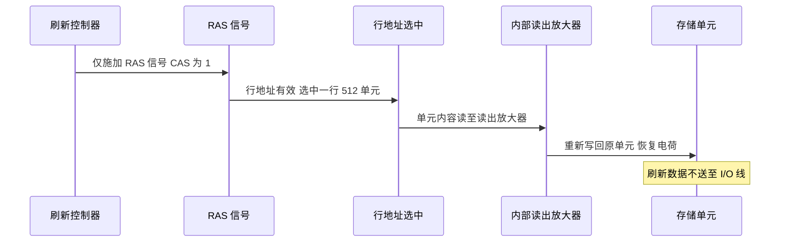

# 05-02 SRAM、DRAM 与内存技术

比较静态、动态存储单元及刷新和同步存储技术。

> [!info] 导航
> 上一节：[[05-01 半导体存储器原理与指标]] · 课程总览：[[计算机系统/微机原理与接口技术B/MOC - 微机原理与接口技术|总 MOC]] · 本章目录：[[计算机系统/微机原理与接口技术B/05 半导体存储器/MOC - 05 半导体存储器|第 5 章 MOC]] · 下一节：[[05-03 ROM、EPROM、EEPROM 与 Flash]]
>
> **内容主线**：[[#5.2 随机存取存储器（RAM）|随机存取存储器（RAM）]] → [[#5.2.1 静态 RAM（SRAM）|静态 RAM（SRAM）]] → [[#5.2.2 动态 RAM（DRAM）|动态 RAM（DRAM）]] → [[#5.2.3 随机存取存储器 RAM 的应用|RAM 的应用]]

## 5.2 随机存取存储器（RAM）

### 5.2.1 静态 RAM（SRAM）

#### 1. SRAM 原理

##### 1. 基本存储电路

> [!abstract] SRAM 基本原理与易失性
> 基本存储电路主要由 **R-S 触发器**构成，其两个稳态分别表示存储内容为 0 或 1。
> - **正常电源供电时**：存入的数据可以保存和读出；只要不写入新数据，触发器状态就保持不变，读操作不会改变它。
> - **断电后**：原存储的信息将全部丢失，这就是所谓的"**易失性**"。

##### 2. 外围电路

> [!info] SRAM 外围电路组成
> 1. **地址译码器**：对输入的外部地址信号译码，用以选择要访问的单元。目前所用的 SRAM 存储器通常采用双译码结构。
> 2. **I/O 控制电路**：处于数据总线和被选中的单元之间。
>    - $\text{R}/\overline{\text{W}}$：读/写控制信号；
>    - 也可用独立的 $\overline{\text{RD}}$（存储器读）和 $\overline{\text{WR}}$（存储器写），负脉冲有效；
>    - $\overline{\text{CE}}$ 或 $\overline{\text{CS}}$：片选信号。低电平时芯片被选中使能并能正常读/写；高电平时表示未选中。

![[计算机系统/微机原理与接口技术B/附件/第5章/Pasted image 20260719160824.png]]
*图 5-6　SRAM 双译码结构*

#### 2. 典型存储器芯片 HM6264BL

> [!info] HM6264BL 芯片参数
> - **类型**：低功耗 CMOS SRAM
> - **容量**：$8K \times 8$ b
> - **供电**：单 +5 V
> - **接口**：输入/输出电平与 TTL 兼容
> - **最大存取时间**：$70 \sim 120$ ns

##### 1. HM6264BL 引脚

![[计算机系统/微机原理与接口技术B/附件/第5章/Pasted image 20260719160830.png]]
*图 5-7　引脚及引脚信号含义*

> [!info] 封装与引脚
> HM6264BL 芯片采用双列直插封装，28 个引脚，引脚及引脚信号含义如图 5-7 所示。

##### 2. HM6264BL 的工作方式

> [!note] 双片选控制的设计原因
> 表 5-1 为 HM6264BL 工作方式功能表（真值表）。
> HM6264BL 采用典型的高/低电平（$CS_2$ 和 $\overline{CS_1}$）双片选控制，主要因为在早期电池供电的存储器系统设计时，需要构造特殊的掉电保护电路，当供电电压低于一定值时封锁 $CS_2$。

**表 5-1　HM6264BL 工作方式功能表**

| $\overline{CS_1}$ | $CS_2$ | $\overline{WE}$ | $\overline{OE}$ | 工作方式 | I/O 信号 |
| :---: | :---: | :---: | :---: | :--- | :---: |
| 1 | × | × | × | 低功耗 | 高阻 |
| × | 0 | × | × | 低功耗 | 高阻 |
| 0 | 1 | 1 | 1 | 输出禁止 | 高阻 |
| 0 | 1 | 1 | 0 | 读 | 数据输出 |
| 0 | 1 | 0 | × | 写 | 数据输入 |

##### 3. HM6264BL 读/写周期时序（以读取时间 70 ns 的 HM6264BL 为例）

> [!important] 读周期关键时间参数
> 实现存储器读操作必须使 $\overline{CS_1}$ 和 $\overline{OE}$ 为低，$CS_2$ 为高。
> - **读取时间 $t_{AA}$**：地址信号有效起，经过该时间后读出数据出现在外部数据线上。HM6264BL 最大只需 70 ns。
> - 数据能否送到外部数据总线上还取决于片选和输出允许信号：从 $\overline{CS_1}$、$CS_2$ 有效到内部总线稳定时间 $t_{CO}$；从 $\overline{OE}$ 有效到输出稳定时间 $t_{OE}$。

![[计算机系统/微机原理与接口技术B/附件/第5章/Pasted image 20260719160840.png]]
*图 5-8　HM6264BL 读周期时序*

**表 5-2　HM6264BL 读周期参数**

| 参数 | 符号 | 最小 / ns | 最大 / ns |
| :--- | :---: | :---: | :---: |
| 读周期时间 | $t_{RC}$ | 70 | — |
| 读出时间 | $t_{AA}$ | — | 70 |
| 片选到输出 | $t_{CO}$ | — | 70 |
| 输出允许到输出稳定 | $t_{OE}$ | — | 35 |
| 输出禁止到数据线高阻 | $t_{OHZ}$ | 10 | — |
| 片选无效到数据线高阻 | $t_{HZ}$ | 0 | 30 |
| 地址改变后数据保持 | $t_{OH}$ | 10 | — |

> [!warning] 读周期 vs 读取时间
> - **读周期**：该芯片进行两次连续的读操作时起点必须间隔的最小时间。
> - **读取时间**：从地址有效到数据读出的时间。
> - **读周期 $\geq$ 读取时间**。

![[计算机系统/微机原理与接口技术B/附件/第5章/Pasted image 20260719160850.png]]
*图 5-9　HM6264BL 写周期时序*

**表 5-3　HM6264BL 写周期参数**

| 参数 | 符号 | 最小 / ns | 最大 / ns |
| :--- | :---: | :---: | :---: |
| 写周期时间 | $t_{WC}$ | 70 | — |
| 片选宽度 | $t_{CW}$ | 60 | — |
| 地址有效到写结束 | $t_{AW}$ | 60 | — |
| 写脉冲宽度 | $t_{WP}$ | 40 | — |
| 数据保持到写有效 | $t_{DW}$ | 30 | — |

> [!warning] 写周期注意事项
> 实现写操作必须 $\overline{CS_1}$、$CS_2$、$\overline{WE}$ 都有效。
> **在地址改变期间，$\overline{WE}$ 必须为高，避免误写入操作。**

### 5.2.2 动态 RAM（DRAM）

#### 1. 单管基本动态存储电路

![[计算机系统/微机原理与接口技术B/附件/第5章/Pasted image 20260719160900.png]]
*图 5-10　单管基本动态存储电路*

> [!abstract] DRAM 基本原理与刷新必要性
> 基本动态存储电路利用 MOS 管栅极和源极之间的**电容 $C$** 来存储信息。以电容上"有""无"电荷两种状态区分二进制"1"或"0"。
>
> 由于工艺问题，$C$ 的电容值小于数据线分布电容 $C_D$，存在两个问题：
> 1. **读出破坏性**：每个数据读出后，$C$ 上的电荷经 $C_D$ 释放，信息易被破坏，所以每个数据读出后要重新恢复 $C$ 上的电荷量。
> 2. **电荷泄漏**：即使无读操作，电容随时间变化放电也会造成信息丢失。
>
> 为保持 $C$ 中信息，需周期性地充电，这一过程称为**（动态）刷新**。刷新周期通常为 $2 \sim 8$ ms。

> [!important] SRAM vs DRAM 大对比
> | 比较项 | SRAM（静态 RAM） | DRAM（动态 RAM） |
> | :--- | :--- | :--- |
> | 基本存储电路 | R-S 触发器 | 单管 + 电容 |
> | 是否需刷新 | 否 | 是，刷新周期 $2 \sim 8$ ms |
> | 集成度 | 低 | 高 |
> | 功耗 | 较大 | 小 |
> | 存取速度 | 快 | 较 SRAM 慢 |
> | 外围电路 | 简单，不需刷新电路 | 复杂，需刷新电路 |
> | 价格 | 高 | 低 |
> | 易失性 | 易失 | 易失 |
> | 典型用途 | 高速缓存、小容量系统 | 大容量 RAM 主存储器 |

> [!tip] SRAM 与 DRAM 的选用原则
> - **DRAM**：集成度高、功耗小、价格低，一般用于组成大容量 RAM 存储器；但需外部刷新电路，设计较复杂。
> - **SRAM**：集成度低、价格高，但接口简单；容量不大时（常规小型系统或高速缓存）选用 SRAM 更为实用。

#### 2. 典型芯片 $\mu$PD424256

##### 1. 内部结构

> [!info] $\mu$PD424256 芯片参数
> - **容量**：$256K \times 4$ b
> - **片内译码需**：$\log_2 256K=18$ 条地址线
> - **地址线分两部分**：行地址 + 列地址，外部地址引线只有 **9 条**
> - **地址分时送入**：利用内部多路开关和锁存器

![[计算机系统/微机原理与接口技术B/附件/第5章/Pasted image 20260719160907.png]]
*图 5-11　μPD424256 内部结构*

##### 2. 读/写控制

> [!important] $\mu$PD424256 行列地址锁存与片选机制
> - 行、列地址译码后选中 256K 个单元中的一个进行访问。
> - **行地址选通信号 $\overline{\text{RAS}}$**：先把出现在地址线上的 9 位地址信号锁存至行地址锁存器。
> - **列地址选通信号 $\overline{\text{CAS}}$**：把后出现在地址线上的 9 位地址锁入列地址锁存器。
> - **读/写控制**：$\overline{\text{WE}}$ 有效（低电平）→ 写入；$\overline{\text{WE}}$ 无效（高电平）且 $\overline{\text{OE}}$ 有效 → 读出。
> - **无片选信号 $\overline{CS}$**：$\overline{\text{RAS}}$ 和 $\overline{\text{CAS}}$ 均有效即表示芯片被选中。

##### 3. $\mu$PD424256 工作时序

![[计算机系统/微机原理与接口技术B/附件/第5章/Pasted image 20260719160918.png]]
*图 5-12　μPD424256 读写周期时序*

> [!info] 读周期时序要求
> 1. 行地址必须在 $\overline{\text{RAS}}$ 信号有效之前送到芯片地址输入端，以确保被选中单元信息正确读出。
> 2. $\overline{\text{CAS}}$ 信号应迟后 $\overline{\text{RAS}}$ 一段时间，并迟后于列地址送到芯片地址输入端的时间。
> 3. $\overline{\text{RAS}}$、$\overline{\text{CAS}}$ 应有一定宽度，才能保证被选中单元信息的正确读出。
> 4. 读有效（$\overline{\text{WE}}=1$）应在 $\overline{\text{CAS}}$ 有效之前建立。

> [!info] 写周期时序要求
> $\overline{\text{RAS}}$ 与 $\overline{\text{CAS}}$ 之间的关系，以及它们与地址信号之间的关系同读周期。不同点：
> 1. 写命令（$\overline{\text{WE}}=0$）应在 $\overline{\text{CAS}}$ 信号有效之前建立，且在 $\overline{\text{RAS}}$（或 $\overline{\text{CAS}}$）变高前结束。
> 2. 写入的数据必须在 $\overline{\text{CAS}}$ 有效之前出现在 I/O 引脚，才能保证数据可靠写入。

> [!note] "读-修改-写"时序
> 指令中常需要对某个单元的内容读出后修改再写回。为提高操作速度，存储器设计了专门的"读-修改-写"周期，基本上是读/写周期的组合。

> [!note] 页模式周期
> 为提高数据块操作时数据传送的速度，存储器设计有页模式操作：
> - 该模式下 $\overline{\text{RAS}}$ 不变，由 $\overline{\text{CAS}}$ 信号对不同的列地址进行操作。
> - $\overline{\text{RAS}}$ 脉冲宽度有最大限度，即每次能连续扫描的列数有限。
> - 页模式操作时，可实现读/写及"读-修改-写"操作。

##### 4. 刷新周期

> [!important] $\mu$PD424256 刷新机制
> 刷新操作通过执行**只有 $\overline{\text{RAS}}$ 信号**的 DRAM 访问周期来实现：
> - 刷新时，$\overline{\text{RAS}}$ 信号期间行地址有效，选中存储矩阵中的一行单元；
> - 将其内容分别读至相应的内部读出放大器后又重新写回单元；
> - 对由行地址决定的 **512 个组合**逐一施加 $\overline{\text{RAS}}$ 信号，$\mu$PD424256 芯片内部的所有单元都进行一次刷新；
> - **刷新周期为 8 ms**；
> - 因刷新期间 $\overline{\text{CAS}}=1$，刷新数据不会出现在 I/O 线上。

### 5.2.3 随机存取存储器 RAM 的应用

> [!abstract] 提高存储器速度的两条途径
> 随着 CPU 存取速度的不断提高，要求存储器读/写速度随之提高。技术上：
> 1. **提高存储器容量和速度**：主要通过 DRAM 改进，缩短延迟、提高带宽并结合应用采取专门措施；
> 2. **引入高速缓存技术**：提高系统级存储器读/写速度。

#### 1. 基于预测技术的 DRAM

> [!info] FPM 与 EDO 的本质
> 加快普通 DRAM 访问速度的简单实用方法是在芯片上附加逻辑电路（地址多路转换、地址选通、刷新逻辑、读/写控制逻辑等），通过预测增加带宽。
> - **FPM（Fast Page Mode）** → FPM-DRAM
> - **EDO（Extended Data Output）** → EDO-DRAM

> [!note] 快速页模式 FPM
> - 通常在 DRAM 阵列中读取单元时，先提供行地址并置 $\overline{\text{RAS}}$ 为低，然后通过周期性的 $\overline{\text{CAS}}$ 实现多个列存取。
> - $\overline{\text{RAS}}$/$\overline{\text{CAS}}$ 选择时充电线路在稳定前会有延迟，制约了存储器的读/写速度。
> - 在大多数情况下，要存取的数据在 RAM 中是连续存放的（下一单元常位于当前单元的下一地址），FPM 采用这一预测技术（这里的页指 DRAM 芯片一行存储单元中的一个 2048 位区间），增加了快速页读或写操作来缩短页模式周期。

> [!note] EDO 模式
> - 在 FPM 基础上，增加了超页（Hyper Page）读或写以及超页"读-修改-写"等操作。
> - 利用地址预测，可在当前读/写周期中启动下一个存取单元的读/写周期，宏观上缩短地址选择的时间。
> - 采用 EDO 技术可比 FPM 提高效率 10%～15%。
> - 在 EDO 技术上引入突发模式，即假定对若干后续地址进行预取操作。

#### 2. 同步 DRAM（SDRAM）

> [!important] 异步 DRAM vs 同步 DRAM
> | 比较项 | 异步 DRAM（FPM/EDO） | 同步 DRAM（SDRAM） |
> | :--- | :--- | :--- |
> | 接口 | 异步 | 同步接口 |
> | 时钟 | 不与 CPU 共享时钟 | CPU 和 RAM 通过相同时钟锁在一起 |
> | CPU 等待 | 必须保持监测各种信号，等待 DRAM 内部操作 | 经过指定时钟数后直接从总线获得数据 |
> | 典型等待时间 | $50 \sim 70$ ns | 由时钟频率决定 |
> | 优点 | — | 乱序执行 CPU 可在等待时完成其他工作 |
>
> SDRAM 芯片速度通常用其最高输出频率表示：66 MHz（15 ns）、100 MHz（10 ns）、133 MHz（7.5 ns）。
> 注意：多片 SDRAM 集成为模块（内存条）时，实现信号同步会引入额外延迟，模块的稳定工作频率要低于芯片最高输出频率。

> [!info] SDRAM 关键技术
> - **多存储体结构**：内含 2 或 4 个交错的存储阵列体（bank），CPU 从一个阵列体访问数据的同时，另一个阵列体已准备好读/写数据。通过存储阵列体的紧密切换，读取效率可成倍提高。
> - **突发传输模式**：第一个列地址输入之后，芯片内部自动产生后续若干（2、4、8 个或 FP 全页）连续的列地址，从而可以快速输出后续地址数据（预取）。突发数据长度可通过修改突发计数器对应的寄存器设定。
> - **"全页"方式**：只在时钟脉冲的上升沿对 $\overline{\text{RAS}}$ 及其有关的控制信号进行采样，之后不再需要这些信号，$\overline{\text{RAS}}$ 信号仅需持续一个时钟周期，呈现为窄脉冲（不同于传统 DRAM 要求 $\overline{\text{RAS}}$ 信号在整个操作过程中始终保持有效）。

> [!note] SDRAM 刷新方式
> - **自动刷新（Auto-refresh）**：标准方式，当 CKE 信号有效且时钟允许时进行刷新。
> - **自刷新（Self-refresh）**：当芯片处于低功耗情况（CKE 及时钟禁止）时芯片自行刷新。

> [!info] 典型 SDRAM 芯片 GM72V28441
> - **厂商**：LGS 公司
> - **容量**：$8M \times 4$ b $\times$ 4 bank
> - **标准**：符合 PC66/100/133 标准
> - **接口与电源**：LVTTL 接口，3.3 V 电源
> - **刷新**：每 64 ms 包含 4096 个刷新周期，具有双刷新操作
> - **访问模式**：可编程突发访问模式，顺序或间隔，长度 1、2、4、8 或 FP（全页）
> - **CAS 延迟**：可编程 2 或 3 个时钟
> - **存储阵列块**：4 个，可独立或同时操作
> - **操作**：可突发读/突发写或者突发读/单独写

![[计算机系统/微机原理与接口技术B/附件/第5章/Pasted image 20260719160932.png]]
*图 5-13　GM72V28441 芯片引脚图及功能框图*

> [!important] DDR SDRAM 双沿传输
> DDR SDRAM（Double Data Rate SDRAM，双倍数据速率同步动态随机存储器）在**时钟上升沿和下降沿都传输数据**，因此在相同 I/O 时钟频率下，其理论数据传输次数是单倍数据速率 SDRAM 的两倍。
> - 双沿传输提高了带宽，但系统功耗仍取决于工作电压、频率、负载、电路活动率和终端方式，**不能据此断言"不会增加能耗"**。
> - 第一代 DDR 常称 DDR 或 DDR1，典型工作电压为 2.5 V，采用 SSTL_2 接口电平。

> [!warning] DDR 代际演进注意事项
> 后续 DDR2、DDR3、DDR4 和 DDR5 通过预取、Bank 组织、信号完整性、供电与命令协议等多方面改进提高带宽和容量。
> - **预取深度**描述一次核心阵列访问向 I/O 缓冲区传送的数据量，**不等同于**"一个时钟周期执行若干次完整存储器访问"。
> - 各代 DDR 的电气规范、引脚和控制协议不同，**通常不能直接互换**。
> - 实际选型必须与处理器的内存控制器和主板设计匹配。

**表 5-4　DDR 标准对照（保留到 DDR4）**

| DDR 标准 | 发表年份 | 总线时钟 /MHz | 内存时钟 /MHz | 预取（最小突发） | 传输速率 /(TMs) | 电压 /V | DIMM 引脚数 | SO-DIMM 引脚数 | Micro-DIMM 引脚数 |
| :---: | :---: | :---: | :---: | :---: | :---: | :---: | :---: | :---: | :---: |
| DDR1 | 2000 | 100～200 | 100～200 | 2n | 200～400 | 2.5/2.6 | 188 | 200 | 172 |
| DDR2 | 2003 | 200～533.33 | 100～266.67 | 4n | 400～1066.67 | 1.8 | 240 | 200 | 214 |
| DDR3 | 2007 | 400～1066.67 | 100～266.67 | 8n | 800～2133.33 | 1.5/1.35 | 240 | 204 | 214 |
| DDR4 | 2014 | 800～1600 | 200～400 | 8n | 1600～3200 | 1.2/1.05 | 288 | 256 | — |

#### 3. 基于协议/内部串行接口的 RDRAM

> [!note] RDRAM 简介
> RDRAM（Rambus DRAM）是 DDR SDRAM 相对昂贵的替换品，由美国 Rambus 公司开发。
> - **与 DDR 和 SDRAM 不同**：RDRAM 引入新一代高速简单内存架构，采用**串行数据传输模式**，使整个系统性能得到提高。
> - **本质**：基于协议的 DRAM。
> - **淘汰原因**：无法保证与原有制造工艺兼容、专利费用、制造成本及价格高昂等。
