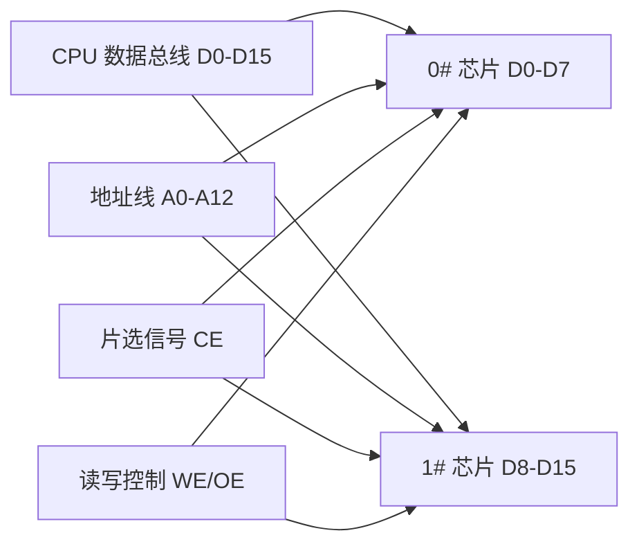
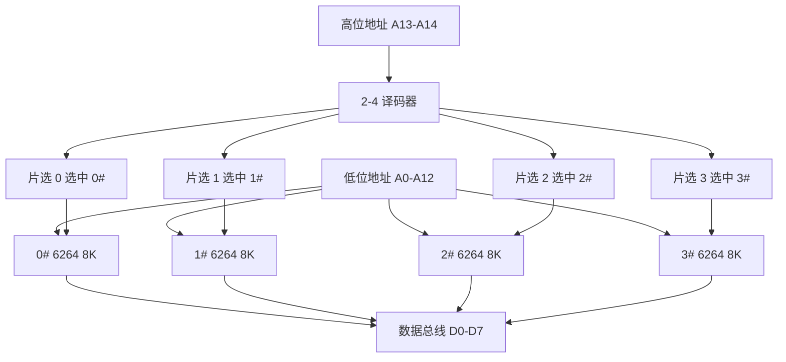

# 05-04 存储器选型、连接与容量扩展

解决位扩展、字扩展、电平和时序匹配问题。

> [!info] 导航
> 上一节：[[05-03 ROM、EPROM、EEPROM 与 Flash]] · 课程总览：[[计算机系统/微机原理与接口技术B/MOC - 微机原理与接口技术|总 MOC]] · 本章目录：[[计算机系统/微机原理与接口技术B/05 半导体存储器/MOC - 05 半导体存储器|第 5 章 MOC]] · 下一节：[[05-05 CPU 与存储器的地址译码连接]]
>
> **内容主线**：[[#5.4 存储器连接与扩充应用|存储器连接与扩充应用]] → [[#5.4.1 存储器芯片选择|存储器芯片选择]] → [[#5.4.2 存储器容量扩充|存储器容量扩充]] → [[#5.4.3 RAM 存储模块|RAM 存储模块]]

## 5.4 存储器连接与扩充应用

> [!check] 接口设计检查表
> 依次确认容量与数据宽度、地址范围与片选译码、电平兼容、读写时序、总线负载以及未对齐访问行为。位扩展解决"每个地址有多少位"，字扩展解决"共有多少个可寻址单元"。

> [!abstract] CPU 与存储器连接的核心问题
> 在微机设计和应用中往往需要用一组存储器芯片构成一个存储系统，或根据需要扩充存储器容量。
> - CPU 与存储器交换信息时一般是**先输出地址，再送出读/写控制信号，并通过数据总线进行信息交换**。
> - 每个存储器都有特定的读、写及擦除时序，读/写系统（如 CPU）必须在时序上支持相应的操作过程。
>
> 由于 CPU 和存储器往往根据各自的技术标准由不同厂商生产，要保证正确的访问，除了要求连接电平标准相同，还必须考虑信号连接、时序配合等问题。

> [!warning] 总线驱动能力与地址对齐
> - **总线驱动能力**：CPU 的负载驱动能力有限。存储器芯片多为 MOS 电路，直流负载很小，主要负载为电容负载。小型系统中 CPU 可直接与存储器芯片连接；与大容量存储器连接时应考虑总线驱动问题。
> - **地址对齐**：
>   - 16 位字长 CPU（8086/80286）：偶数地址（$A_0=0$）字访问效率高；
>   - 32 位数据总线 CPU（80386/Pentium）：地址对齐（$A_1A_0=00$）时能高效实现双字（32 位）数据访问。
>   - 有些 CPU（如 Intel 8096）要求低位地址必须对齐；80x86 CPU 在低位地址不对齐时需要多个读/写周期完成 16/32 位操作。

### 5.4.1 存储器芯片选择

#### 1. 存储器类型选择

> [!info] RAM 与 ROM 的选型原则
> | 类型 | 特点 | 适用场景 |
> | :--- | :--- | :--- |
> | **静态 RAM** | 接口简单，一般不需外围电路 | 智能仪器仪表、小型系统 |
> | **动态 RAM** | 集成度高、成本低，需专门刷新电路 | 需要较大存储容量的计算机产品 |
> | **掩膜 ROM / PROM** | 不可改写 | 大批量生产的微电子产品或计算机产品 |
> | **EPROM / Flash ROM** | 可多次修改程序 | 产品研制和小批量生产、用户自行编程 |
> | **E²PROM** | 掉电保护数据/参数 | 系统工作过程中写入且需掉电保护的数据 |
> | **串行 E²PROM** | 接口简单、工作可靠 | 大量系统设计 |
> | **Flash ROM** | 可在线升级 | 程序存储，尤其支持软件在线升级 |

> [!tip] 利用后备电源实现 SRAM 掉电保护
> 利用后备电源（一般是可充电电池）配合掉电保护电路，可以使静态 RAM 在正常电源掉电时数据不丢失，这时需要选择有**双（高、低电平）片选**的低功耗 RAM 芯片。

> [!important] 存储器系统设计步骤
> 1. 先确定整机存储容量；
> 2. 再确定选用存储芯片的类型和数量；
> 3. 之后划分 RAM、ROM 区，画出地址分配图；
> 4. 存储器空间的划分和地址编码靠地址线实现。
>
> **多片存储芯片构成的存储器地址编码原则**：
> - **低位地址总线**：作为片内寻址；
> - **高位地址总线**：用来产生存储芯片的片选信号。
>
> 需要设计专门的片选译码电路，详见 [[05-05 CPU 与存储器的地址译码连接]]。

#### 2. 连接接口电平

> [!info] 接口电平标准
> 通常，CPU 总线与存储器连接引脚的电平标准应相同，同为 TTL、CMOS、LVTTL、SSTL2、SSTL18 等标准电平，必要时需增加电平转换电路。

#### 3. 存储器芯片与 CPU 的时序配合

> [!abstract] 时序配合的核心要求
> 存储器的存取时间是反映其工作速度的重要指标。选用存储芯片时，需要分别从 CPU 和存储器芯片两个方面进行分析，保证存储器芯片读/写存取时间等工作时序和参数与 CPU 的时序和参数相匹配。
>
> 在 CPU 和存储器的数据手册中已设计规定了各自读/写操作时的地址、数据和控制总线信号的时序，连接时必须注意它们的配合，如当 CPU 发出读数据信号时，存储器能输出数据并稳定在数据总线上，保证读操作能顺利进行。

![[计算机系统/微机原理与接口技术B/附件/第5章/Pasted image 20260719161106.png]]
*图 5-21　存储器芯片与 CPU 的时序配合示意图*

> [!example] 8088 CPU 与 HM6264BL 读周期时序配合
> 8088 CPU 工作在 4.77 MHz 时钟频率下：
>
> **步骤 1**：从 $T_1$ 状态开始到地址信号有效的最长时间
> $$TCLAV_{max} = 110\ \text{ns}$$
>
> **步骤 2**：HM6264BL 读取时间（参考图 5-8）
> $$t_{AA\max} = 70\ \text{ns}$$
>
> **步骤 3**：从 $T_1$ 开始到 HM6264BL 中指定单元读出信息到数据总线上的时间
> $$TCLAV_{max} + t_{AA\max} = 110 + 70 = 180\ \text{ns}$$
>
> **步骤 4**：8088 CPU 在 $T_3$ 状态下跳沿采样数据总线，要求数据比 $T_3$ 后沿提前 $TDVCL$ 时间达到稳定
> $$3T - TDVCL = 3 \times 200 - 30 = 570\ \text{ns}$$
>
> **步骤 5**：时序裕量
> $$570 - 180 = 390\ \text{ns}$$
>
> **结论**：HM6264BL 从 $T_1$ 开始约 180 ns 后数据即可有效，早于 8088 要求的 570 ns 截止时间，具有约 390 ns 的时序裕量。二者的读周期时序能够配合。

> [!tip] 时序不匹配的处理方法
> 如果存储器芯片读或写周期的工作速度不能满足 CPU 的要求，可在 CPU 的相应周期内**插入一个或数个 $T_w$ 周期**，人为地延长 CPU 读/写时间，使两者相配。
>
> 为简化外围电路及充分发挥 CPU 的工作速度，应尽可能选择与 CPU 时序相配的芯片。

### 5.4.2 存储器容量扩充

> [!abstract] 位扩充与字扩充
> - **位扩充**：芯片数 = 总容量 ÷ 单片容量（字数不变、位数增加）；各芯片地址线并联、数据线分别接不同位。
> - **字扩充**：芯片数 = 总字数 ÷ 单片字数（位数不变、字数增加）；需片选译码把各芯片映射到不同地址区间。

当一片存储器芯片的容量不能满足系统要求时，需多片组合以扩充字长（位扩充）或字数（字扩充）。下面以 SRAM 为例说明容量扩充的方法，ROM 的处理方法与此类似。

#### 1. 存储器位扩充

> [!info] 位扩充示例：$8K \times 8$ b → $8K \times 16$ b
> 用 $8K \times 8$ b 的 SRAM 芯片 HM6264 扩充形成 $8K \times 16$ b 的芯片组，所需芯片为 $16\ \text{b} / 8\ \text{b} = 2$ 片。
>
> **连接方式**：
> - 两个芯片（0# 和 1#）的地址线 $A_0 \sim A_{12}$ 分别连在一起；
> - 各芯片相应的片选信号及读/写控制信号也都分别连在一起；
> - 两个芯片只有数据线各自独立：一片连低 8 位（$D_0 \sim D_7$），另一片连高 8 位（$D_8 \sim D_{15}$）。
>
> 每个 16 位数据的高、低字节分别存储于两个芯片单元中，一次读/写操作同时访问两个芯片的相同地址单元。

![[计算机系统/微机原理与接口技术B/附件/第5章/Pasted image 20260719161116.png]]
*图 5-22　存储器位扩充示意图*

#### 2. 存储单元数扩充

> [!info] 字扩充示例：$8K \times 8$ b → $32K \times 8$ b
> 用 $8K \times 8$ b 芯片 6264 构成 $32K \times 8$ b 存储区，所需芯片数为 $32K / 8K = 4$ 片。
>
> **连接方式**：
> - 各 6264 芯片的地址线 $A_0 \sim A_{12}$、数据线 $D_0 \sim D_7$ 及读/写信号都是同名信号连在一起；
> - 字数扩充使 $32K \times 8$ b 芯片组较 $8K \times 8$ b 芯片增加了两位地址信号 $A_{13}$、$A_{14}$；
> - $A_{13} \sim A_{14}$ 译码后产生 4 个片选信号，分别选中 4 个 $8K \times 8$ b 芯片；
> - **$A_0 \sim A_{12}$** 实现片内寻址，**$A_{13} \sim A_{14}$** 实现片间寻址。

![[计算机系统/微机原理与接口技术B/附件/第5章/Pasted image 20260719161124.png]]
*图 5-23　存储单元数扩充示意图*

**表 5-7　$32K \times 8$ b 存储器地址范围分配**

| $8K \times 8$ b 芯片号 | $A_{14}$ | $A_{13}$ | $A_{12} \sim A_0$ | 地址范围（空间） |
| :---: | :---: | :---: | :---: | :--- |
| 0# | 0 | 0 | $00 \cdots 0 \sim 11 \cdots 1$ | 00000H～01FFFH |
| 1# | 0 | 1 | $00 \cdots 0 \sim 11 \cdots 1$ | 02000H～03FFFH |
| 2# | 1 | 0 | $00 \cdots 0 \sim 11 \cdots 1$ | 04000H～05FFFH |
| 3# | 1 | 1 | $00 \cdots 0 \sim 11 \cdots 1$ | 06000H～07FFFH |

> [!tip] 字位同时扩充
> 存储器的单元数和位数都需要扩充时，如用 $8K \times 8$ b 芯片构成 $32K \times 16$ b 存储区，需要 $4 \times 2 = 8$ 个芯片。
> - **先扩充位数**：每 2 个芯片一组，构成 4 个 $8K \times 16$ b 芯片组；
> - **再扩充单元数**：将这 4 个芯片组组合成 $32K \times 16$ b 存储块。

### 5.4.3 RAM 存储模块

> [!abstract] 内存条（Memory Module）
> 高集成度 RAM 模块就是习惯上所说的内存条，其产生与发展与 CPU 性能的提高密切相关。
> - 利用 DRAM 基本存储电路存储信息；
> - 把动态刷新电路集成在片内，克服了 DRAM 需要加外部刷新电路的缺点；
> - **兼有静态和动态 RAM 的优点**。
>
> 高集成度 RAM 将多片高容量 DRAM 芯片装配在条状印制线路板上，线路板配有标准单边或双边沿连接插脚，可直接插入微机主板的存储器插座，加上相应的控制电路，构成具有规定字长宽度及奇偶校验特性的存储器模块。

> [!info] PC 系统常用模块分类
> | 模块类型 | 数据字长 | 主要应用 |
> | :--- | :--- | :--- |
> | 30 线 SIMM | 8+1 位 | 80386 以下系统 |
> | 72 线 SIMM | 32+4 位 | 80486 系统 |
> | 168 线 DIMM | 64+8 位 | Pentium 以上机型（PC66/100/133） |
> | 184 线 DIMM（DDR SDRAM） | 64+8 位 | Pentium 4 系统 |
> | 240 线 DIMM（DDR2/DDR3） | 64+8 位 | 后续系统 |
> | 288 线 DIMM（DDR4） | 64+8 位 | 现代系统 |
>
> 主要应用参数包括前端总线频率、传输速率、存储容量等。

![[计算机系统/微机原理与接口技术B/附件/第5章/Pasted image 20260719161134.png]]
*图 5-24　典型 DIMM 内存模块及其组织结构*

> [!example] 典型内存条示例
> **30 线 SIMM**（LGS 产品 GMM79100）：
> - 构成：二片 $1M \times 4$ b + 一片 $1M \times 1$ b（奇偶校验位）→ $1M \times 9$ b
> - 刷新频率：1 kHz；5 V 供电；FPM 模式；存取速度 60/70 ns
>
> **72 线 SIMM**（GMM7324210）：
> - 构成：8 片 $4M \times 4$ b → $4M \times 32$ b DRAM SIMM
> - EDO 模式；5 V；刷新频率 4 kHz；存取速度 50/60 ns
>
> **168 线 SDRAM DIMM**（Samsung KMM375S1620BT，Pentium Ⅱ/Ⅲ）：
> - 容量：$16M \times 72$ b（128 MB 带奇偶校验）
> - 18 片 $16M \times 4$ b SDRAM + 2K SPD 串行 E²PROM + PLL
> - 工作电压：3.3±0.3 V，LVTTL 兼容
> - 支持突发模式，自动/自刷新频率 44 kHz/64 ms
> - 符合 PC100 标准，最高频率 125 MHz
> - **SPD**：支持 SPD 的母板可从 E²PROM 读取 SDRAM 工作参数，避免参数设置不当引起系统不稳定
>
> **DDR SDRAM DIMM**（Micron，Pentium 4）：
> - 模块数据字长 72（64+8 位 ECC 校验纠错位）
> - 184 线 DDR：MT18VDDT3272D（256 MB）、MT18VDDT6472D（512 MB）、MT18VDDT12872D（1 GB）
> - 传输速率 PC1600/PC2400
> - 240 线 DDR2：MT9HTF3272（256 MB）、MT9HTF6472（512 MB）、MT9HTF12872（1 GB）
> - 前端总线频率 400 MT/s 和 533 MT/s；传输速率 PC2-3200 或 PC2-4200

> [!warning] DDR 代际选型注意事项
> DDR SDRAM 已经历多代演进，不同平台可能采用 DDR3、DDR4、DDR5 或面向特定场景的其他存储技术。
> 教材中的 DDR3/DDR4 参数用于说明代际变化；**实际选型必须同时匹配**：
> - 处理器内存控制器
> - 主板布线
> - 模块类型
> - 工作电压
> - 速率等级
> - 容量与纠错需求
