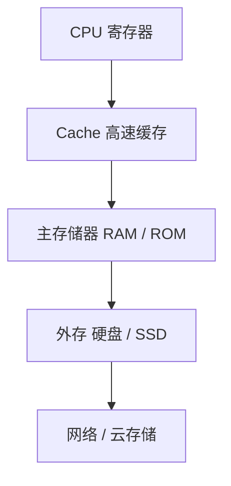

# 05-06 存储层次、Cache 与虚拟存储器

从局部性和地址转换理解多层存储系统。

> [!info] 导航
> 上一节：[[05-05 CPU 与存储器的地址译码连接]] · 课程总览：[[计算机系统/微机原理与接口技术B/MOC - 微机原理与接口技术|总 MOC]] · 本章目录：[[计算机系统/微机原理与接口技术B/05 半导体存储器/MOC - 05 半导体存储器|第 5 章 MOC]] · 下一节：[[06-01 I-O 接口结构与端口编址]]
>
> **内容主线**：[[#5.6 微机系统的内存结构|微机系统的内存结构]] → [[#5.6.1 分级存储结构|分级存储结构]] → [[#5.6.2 高速缓存 Cache|高速缓存 Cache]] → [[#5.6.3 虚拟存储器与段页结构|虚拟存储器与段页结构]]

## 5.6 微机系统的内存结构

随着技术的发展，存储器的综合性能指标在不断提高，同时系统的总体性能和需求在不断提高。除了一般意义下使用内部存储器技术，现代微机系统越来越多地采用分级存储技术，通过引入高速缓存和虚拟存储器提高系统的速度，扩大存储空间，实现高速处理和多任务、多用户系统应用。

目前，微机系统一般采用三级存储器体系结构，即高速缓冲存储器、内部存储器和外部（辅助）存储器。CPU 可以直接访问高速缓存和内存，但不能直接访问外部存储器。

### 5.6.1 分级存储结构

在半导体存储器中，只有双极型静态 RAM 的存取速度与 CPU 速度处于同一数量级，但其价格较贵、功耗大、集成度低，体积相对 DRAM 更大，因此不可能所有的存储器都采用静态 RAM，这就需要设计一种分级管理机制，在主存和 CPU 之间加一个容量相对小的双极型静态 RAM，作为高速缓冲存储器（简称 Cache），并实行专门的控制。

另一方面，现代微机系统对内存空间的要求越来越大，内/外存储器存在着巨大的差异，而多用户、多任务运行环境在客观上允许程序和数据对内存资源分时复用，在这种情况下，通过特殊的存储器管理机制，可以把处理器直接“透明”访问的存储空间扩大到整个虚拟存储器。

![[计算机系统/微机原理与接口技术B/附件/第5章/Pasted image 20260719161225.png]]
*图 5-30　现代微机系统通常采用*

现代微机系统通常采用如图 5-30 所示的三级分层存储结构：① 高速缓存 Cache，由静态 RAM 构成；② 主内存，采用动态 RAM 构成；③ 虚拟存储器，由硬盘等构成。对于使用最频繁的容量不大的程序和数据用高速缓存 Cache 存放，对经常使用的数据或程序存放于主内存中，而对不常用或暂时不用的大部分程序和数据就存放在磁盘（虚拟存储器）中。对内存的这种多层次的管理方式，可以有效地解决速度和成本之间的矛盾。

### 5.6.2 高速缓存 Cache

高速缓存 Cache 的引入是为了减小乃至消除 CPU 与内存之间的存取速度差异对系统性能带来的影响。Cache 中一般保存有一份内存中部分内容的副本，该部分内容是最近曾被 CPU 使用过的数据和程序代码。Cache 的有效性是利用了程序对存储器的访问在时间和空间上所具有的局部区域性，即对大多数程序来说，在某个时间段内会集中重复地访问某一个特定的区域。同时，在正常情况下，访问 Cache 的速度要比访问内存的速度快 3～8 倍，所以 Cache 的使用可缩短 CPU 访问存储器的时间，从而提升系统的整体运行效率。

![[计算机系统/微机原理与接口技术B/附件/第5章/Pasted image 20260719161232.png]]
*图 5-31　高速缓存 Cache示意图*

Cache 存储器位于主存和 CPU 之间，容量较小，由静态 RAM 构成。微机采用 Cache 控制器来协调 CPU 和 Cache、主存之间的数据传输，CPU 不仅与 Cache 相连，与主存也保持通路，如图 5-31 所示。

Cache 控制器把 CPU 的访问地址与 Cache 标签进行比较。若所需缓存行存在且状态允许访问，则发生**命中**（Hit）；否则发生**未命中**（Miss），需要从更低层级取回缓存行，并可能写回被替换的脏数据。命中延迟通常显著低于主存延迟，但并非天然“零等待”；它取决于 Cache 层级、容量、相联度、访问宽度、处理器流水线和时钟设计。命中率也不是固定常数，而由程序的时间局部性、空间局部性、工作集大小和映射冲突等共同决定。

处理器通常设置多级 Cache：较靠近执行核心的层级容量小、延迟低，较远的层级容量较大、延迟较高，并可能由多个核心共享。多级结构的目标是在容量、延迟、带宽、功耗和芯片面积之间折中。评价整体效果时应结合各级局部命中率与全局未命中率，而不能用单一百分比概括所有系统和工作负载。

对程序员来说，Cache 是透明的。所谓“透明”，是指程序员自己不能对 Cache 进行操作和控制。Cache 由一个目录（或称为标志）和一个数据存储器组成。每当 CPU 需读/写数据时，它首先访问标志存储器，以确定会不会命中 Cache 以及 Cache 内是否有所需的信息。如果 Cache 标志不符合，说明 Cache 内没有所需的数据字，这种情况就是 Cache 不命中。如果 Cache 标志符合，就可以对 Cache 数据存储体进行读/写操作。但未命中时，对内存访问可能比访问无 Cache 的内存要插入更多的等待周期。而程序中的调用和跳转指令会造成非区域性操作，也会导致命中率降低。因而，提高命中率是设计 Cache 的主要目标。

为了便于替换和管理，通常把 Cache 和内存等分成相同大小的块（或行），每一块由若干字（或字节）组成。每当对一个内存地址进行访问时，都必须通过“内存-Cache”地址映像变换机构判定该访问字所在的块是否已在 Cache 中。如果在 Cache 中（Cache 命中），则经地址映像变换机构将内存地址变换成 Cache 地址去访问，这时 Cache 与 CPU 之间进行单字宽信息的交换；如果不在 Cache 中，则产生 Cache 块失效，这时需要从访问内存的通路中把包含该字的信息一起通过多字宽通路调入 Cache，同时将被访问字直接从单字宽通路送往 CPU。Cache 中原来的内容就会被覆盖掉一部分。置换算法通常有“先进先出（FIFO）”和“最近最少使用（LRU）”两种，通常在置换控制器中由硬件逻辑实现。

从内存将某些内容调入高速缓存，通常是以“页”为单位进行的，如以 256 字节为一页。高速缓存中各页的位置与内存中相应页的映像关系，决定了对高速缓存的管理策略，也影响 Cache 的命中率。主要的映像关系有以下 3 种。

1. 全相联方式：Cache 和内存均分为若干字节数相同的页。内存中的任一页都可调入 Cache 的任一页中，所调入页的页号需全部存入地址索引机构。寻址时将寻址地址同标志地址（页号）进行比较。

2. 直接映射方式：Cache 中全部单元被划分成固定大小的页，内存先被划分成段，再被划分成与 Cache 大小相同的页。Cache 中的各页只接收内存中相同页号的内容，地址索引机构中存放的标志地址是内存的段号，而不是页号。寻址时只比较段号，不需比较页号，减少了地址比较次数。

3. 分组关联方式：前两种方式的折中，Cache 和内存都分为若干对应的组，然后组内直接映射、组间全关联映射，允许不同段的相同页号的内容同时存放在 Cache 中。

### 5.6.3 虚拟存储器与段页结构

虚拟存储器采用硬件和软件的综合技术，将主存（内部存储器）和辅存（外部存储器）的地址空间统一编址，形成一个庞大的存储空间。在这个存储空间里，应用程序编程运行，完全不必考虑主存是否装得下或者放在辅存的程序装入到主存中的实际位置。

目前，多用户、多任务软件多使用虚拟内存，如 Windows、Linux 等操作系统。具有专门的存储器管理单元（MMU）的 CPU 基本上提供专门的管理机制，尤其是 Intel 80386 以后的 CPU 都提供虚地址保护模式，专门用于虚拟存储器程序的运行和数据处理，提供相应的分段与分页机制。

由第 2 章可知，80386/Pentium CPU 保护模式下 MMU 使用 48 位存储器指针，指针由两部分组成：选择符和偏移量。选择符 16 位长，偏移量 32 位长，如指针 1230:9ABC5678H。该指针称为虚拟地址，在程序中指定指令或数据的存储位置。

其中，选择符放在 CPU 的段选择符寄存器中，指针的这一部分实际上选择的是 CPU 虚拟地址空间中一个特定的段。偏移量放在 CPU 用户可访问的寄存器中，或用于直接寻址。如进行指令代码的访问（取指），偏移量可放在 EIP 寄存器中，指针提供要访问的存储器段中的偏移量，即要执行的指令码的开头 1 字节的相对偏移地址。由于偏移量长 32 位，段空间可达 4 GB。事实上，段的大小是可变的，可以是 1 B～4 GB。

在分段机制中，系统和应用程序可用的虚拟地址空间为 64 TB，空间分成了 32TB 的全局存储器地址空间和 32 TB 的局部存储器地址空间，但是 80386 等 32 位 CPU 在 32 位模式下，地址总线只支持 4 GB 的物理地址空间，因此同一时间只有虚存的一部分信息可以放在物理存储器中，需要动态交换并有效管理。

事实上，Intel 80386/Pentium CPU 支持分段和分页两种存储管理机制，可以将 48 位虚拟地址映射到硬件所需的 32 位物理地址。分段机制下每个存储块大小不一，可以在 4 GB 范围内自行定义，每个段最多可以分配 4 GB 的物理地址空间，最少 1 字节。物理空间多次交换后可能变得非常零碎，因此存储和管理的对象较为复杂。分页机制管理下的对象是固定大小的存储块，如 4 KB（80386 及以上）或 4 MB（Pentium 及以上）等，称为页（Page）。这时把整个线性地址空间和整个物理地址空间都看成由很多页组成，线性地址空间的任何一页都可以映射到物理地址空间的任何一页。分页机制提供适合虚拟存储管理的存储块大小，避免了分段机制管理的复杂性。

有关 80386/Pentium CPU 分段/分页机制的具体原理详见第 2 章。

