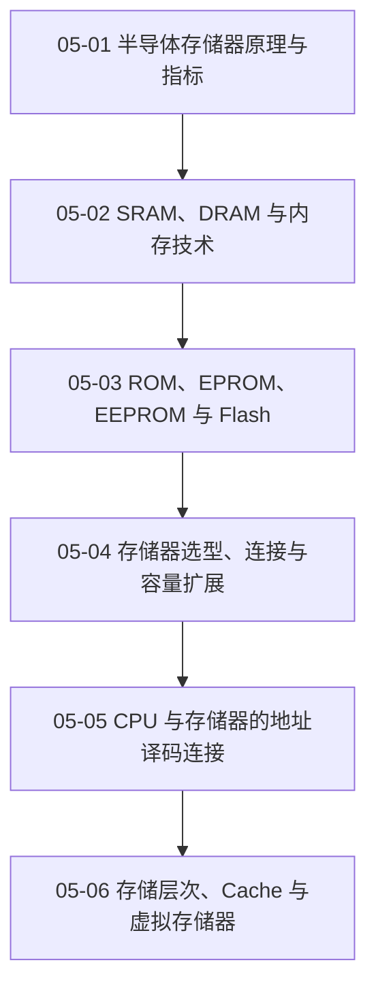

# 05 半导体存储器

从存储芯片内部组织扩展到地址译码、容量扩充、Cache 和虚拟存储器。

> [!question] 本章核心问题
> - 芯片的“字数 × 位数”怎样映射为容量和地址线？
> - 位扩展、字扩展和片选译码分别解决什么问题？
> - 芯片级存储、Cache 与虚拟存储器处于哪些抽象层？

> [!info] 章节导航
> 上一章：[[计算机系统/微机原理与接口技术B/04 汇编语言程序设计/MOC - 04 汇编语言程序设计|04 汇编语言程序设计]] · 课程总览：[[计算机系统/微机原理与接口技术B/MOC - 微机原理与接口技术|微机原理与接口技术]] · 下一章：[[计算机系统/微机原理与接口技术B/06 输入输出与中断/MOC - 06 输入输出与中断|06 输入输出与中断]]

## 知识路径



图中的箭头表示本章建议的概念展开顺序，不代表所有主题之间只有单一依赖关系。

## 本章知识点

- [[05-01 半导体存储器原理与指标]] — 建立存储体、地址译码、控制逻辑和性能指标模型。
- [[05-02 SRAM、DRAM 与内存技术]] — 比较静态、动态存储单元及刷新和同步存储技术。
- [[05-03 ROM、EPROM、EEPROM 与 Flash]] — 比较非易失存储器的写入、擦除和阵列组织。
- [[05-04 存储器选型、连接与容量扩展]] — 解决位扩展、字扩展、电平和时序匹配问题。
- [[05-05 CPU 与存储器的地址译码连接]] — 比较全译码、部分译码和线选法及其地址映射。
- [[05-06 存储层次、Cache 与虚拟存储器]] — 从局部性和地址转换理解多层存储系统。

## 动态状态

```dataview
TABLE sequence AS "顺序", status AS "状态", length(file.inlinks) AS "入链"
FROM "计算机系统/微机原理与接口技术B/05 半导体存储器"
WHERE type = "课程笔记"
SORT sequence ASC
```

