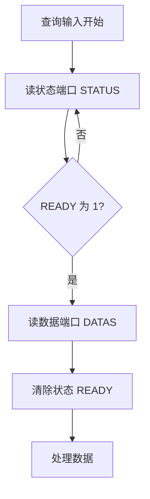
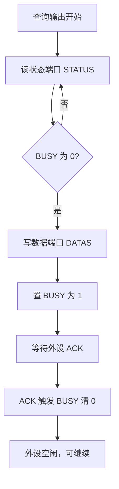
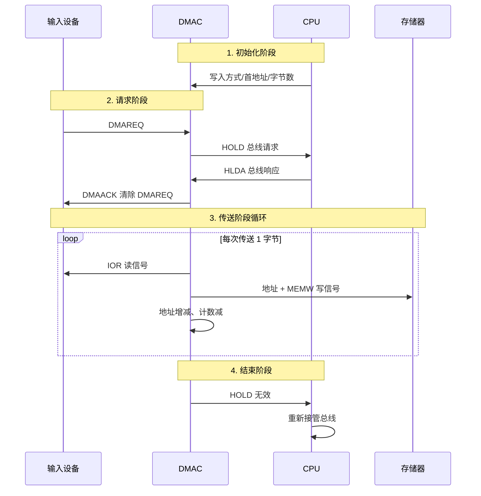

# 06-02 程序查询、中断与 DMA 传送

比较三种 I/O 传送方式的责任分配和适用条件。

> [!info] 导航
> 上一节：[[06-01 I-O 接口结构与端口编址]] · 课程总览：[[计算机系统/微机原理与接口技术B/MOC - 微机原理与接口技术|总 MOC]] · 本章目录：[[计算机系统/微机原理与接口技术B/06 输入输出与中断/MOC - 06 输入输出与中断|第 6 章 MOC]] · 下一节：[[06-03 中断机制与优先级]]
>
> **内容主线**：[[#6.2 输入/输出的传送方式|输入/输出的传送方式]] → [[#6.2.1 程序控制的输入/输出|程序控制的输入/输出]] → [[#1. 无条件传送|无条件传送]] → [[#2. 查询传送|查询传送]]

## 6.2 输入/输出的传送方式

> [!abstract] 三种传送方式总览
> 在微机系统中，CPU 与外设之间信息交换的输入/输出方式一般分为 3 种：
> 1. **程序控制**的输入/输出；
> 2. **中断控制**的输入/输出；
> 3. **直接存储器存取**（DMA，Direct Memory Access）。
>
> 它们各有优缺点，在实际使用时可根据具体情况进行选择。

| 方式 | 数据搬运主体 | CPU 等待方式 | 适合场景 |
| --- | --- | --- | --- |
| 程序查询 | CPU 指令 | 忙等或按周期查询 | 低速、简单、事件少 |
| 中断驱动 | CPU 在 ISR 中搬运 | 设备就绪后通知 | 不规则事件、中小数据量 |
| DMA | DMA 控制器与设备 | CPU 负责配置和完成处理 | 连续或成块的大数据量 |

> [!warning] DMA 不是"完全不经过 CPU"
> CPU 仍需配置源、目的、方向和长度，并处理完成或错误状态；DMA 的核心价值是减少逐字节搬运和中断次数。详见 [[07-05 8237A DMA 控制器]]。

### 6.2.1 程序控制的输入/输出

> [!info] 程序控制传送的定位
> 程序控制的输入/输出方式是指在程序中安排相应的 I/O 指令来控制输入/输出，完成与外设的信息交换。这种方式适用于**预先知道何时需要进行数据传送**的场合，根据需要将有关 I/O 指令插入到程序的相应位置。

根据外设的不同性质，该传送方式又分为**无条件传送**和**查询传送**两种。

#### 1. 无条件传送

> [!abstract] 无条件传送的适用前提
> 有些设备的工作情况简单，状态很少发生变化。比如数码管只要 CPU 将数据的显示代码传送给它，就可立即显示相应数据。这时，CPU 不用查询外设的工作状态，默认外设始终处于准备好或空闲状态——在 CPU 认为需要时，随时与外设交换数据，这种传送方式就是无条件传送方式。

采用无条件传送方式工作的 I/O 接口电路如图 6-7 所示。

![[计算机系统/微机原理与接口技术B/附件/第6章/Pasted image 20260719161540.png]]
*图 6-7 无条件传送方式的 I/O 接口电路（a) 无条件传送的输入方式 b) 无条件传送的输出方式）*

> [!example] 例 6-1
> 采用无条件传送方式的 I/O 接口电路，用发光二极管显示开关的开合状态。设计的接口电路如图 6-8 所示。程序中输入接口和输出接口使用相同地址，程序段如下：

```asm
NEXT:   MOV   DX, PORT_IN
        IN    AL, DX          ; 通过输入接口读入开关状态
        NOT   AL
        OUT   DX, AL          ; 通过输出接口控制发光二极管显示
        CALL  DELAY
        JMP   NEXT
```

![[计算机系统/微机原理与接口技术B/附件/第6章/Pasted image 20260719161548.png]]
*图 6-8 无条件传送举例*

> [!info] 输入与输出时序前提
> - **输入**：认为开关数据已送至三态缓冲器，CPU 执行相应的 IN 指令，地址信号经地址译码器译码后与 $\overline{IOR}$ 信号结合，选通数据输入端口，将开关数据经数据总线送往 CPU。条件是 CPU 在执行 IN 指令时，外设的数据是准备好的。
> - **输出**：认为锁存器是空的，CPU 执行 OUT 指令，地址信号经地址译码器译码后与 $\overline{IOW}$ 信号结合，选通数据锁存器，使数据经数据总线送往锁存器，再由它送至 74LS06 驱动器后加至发光二极管。条件是 CPU 在执行 OUT 指令时，外设是准备好的。

#### 2. 查询传送

> [!abstract] 查询传送的工作模式
> 查询传送适用于 CPU 与外设**异步工作**的情况。在此方式中，CPU 首先查询外设的状态，只有在外设处于**就绪状态**时才与外设进行数据交换，否则一直处于查询等待状态。这时在查询方式的接口电路中，应同时含有**数据**和**状态**两种端口，以使 CPU 在与外设交换数据之前读取外设的状态信息。

##### 1. 查询式输入

一种采用查询式输入的接口电路如图 6-9 所示，地址译码电路输出低电平有效。一个数据输入端口用以读取外设的数据信息，一个状态输入端口用以读取外设的状态信息。设数据端口地址用符号 DATAS 表示，状态端口地址用符号 STATUS 表示。采用查询式输入的工作流程如图 6-10 所示。

![[计算机系统/微机原理与接口技术B/附件/第6章/Pasted image 20260719161600.png]]
*图 6-9 查询式输入的接口电路*

![[计算机系统/微机原理与接口技术B/附件/第6章/Pasted image 20260719161607.png]]
*图 6-10 查询式输入的工作流程*



> [!info] 接口电路工作原理
> 当输入装置将数据准备好后，发出一个选通信号。此信号一边将数据送入数据锁存器，一边使 D 触发器置 "1"（设 "1" 为 "准备就绪" 状态），发出 READY 状态信号。状态信号在这里只占用 1 位数据线，将其接至 $D_7$ 位。CPU 先查询状态端口的 READY 信号（`IN AL, STATUS`），当 READY 有效（$D_7$ 位为 "1"）时，才读取数据端口数据（`IN AL, DATAS`）。同时，通过异步清 "0" 清除状态端口信息，表示数据已被取走，尚无准备好的数据可取。

> [!example] 例 6-2
> 结合图 6-9 的具体输入接口电路，编写如下查询式输入程序：

```asm
IN_TEST: IN    AL, STATUS      ; 读入状态信息
         TEST  AL, 80H         ; 检查 READY 是否为 1
         JZ    IN_TEST         ; 条件不满足，继续查询
         IN    AL, DATAS       ; 条件满足，读入数据
```

> [!tip] 状态端口合并条件
> 当系统中外设的状态信息**不超过 8 位**时，可以合并用同一个状态端口。

##### 2. 查询式输出

查询式输出也是先查询状态端口（`IN AL, STATUS`），了解外设的工作状态，在其 "空闲" 时，再通过数据端口输出数据（`OUT DATAS, AL`），否则继续查询。一种采用查询式输出的接口电路如图 6-11 所示，对应的工作流程如图 6-12 所示。

![[计算机系统/微机原理与接口技术B/附件/第6章/Pasted image 20260719161617.png]]
*图 6-11 查询式输出的接口电路*

![[计算机系统/微机原理与接口技术B/附件/第6章/Pasted image 20260719161626.png]]
*图 6-12 查询式输出的工作流程*



> [!info] BUSY 信号的工作机制
> CPU 先通过状态端口查询 BUSY（设为数据线的 $D_7$ 位）是否空闲（设 "0" 表示空闲），空闲则通过数据端口输出数据，否则就一直查询 BUSY 的状态。CPU 查询 BUSY 为 "0" 后，向输出装置输出数据，同时置 D 触发器输出 BUSY 为 "1"。在输出装置输出数据之前，BUSY 一直为 "1"，以避免 CPU 写入新的数据；当输出装置输出数据后，回送一个 ACK 信号，使 D 触发器清 "0"，表示再次进入空闲状态。

> [!example] 例 6-3
> 结合图 6-11 的具体输出接口电路，编写如下查询式输出程序：

```asm
OUT_TEST: MOV   BX, OFFSET STORE
          IN    AL, STATUS         ; 读入状态信息
          AND   AL, 80H            ; 检查 BUSY 位
          JNZ   OUT_TEST           ; BUSY 则等待
          MOV   AL, [BX]           ; 空闲，则从缓冲区 STORE 中取数据
          OUT   DATAS, AL          ; 输出数据
          INC   BX
```

> [!warning] 查询传送的优缺点
> - **优点**：硬件接口电路不太复杂，软件容易实现。
> - **缺点**：CPU 需要花费大量的时间不断查询外设的工作状态，CPU 使用效率不高。
> - **多设备场景**：若系统中有多个 I/O 设备需要查询，通常用**轮流查询**的方式检测各外设状态，先查询到的将先被处理。
> - **实时性风险**：在实时控制系统中，一个外设的输入/输出操作未处理完毕，就不能处理下一个外设，可能延误其他外设的数据传送；若某外设出现故障而一直无法就绪，可能导致查询无限循环（实际程序常加入超时判断等措施）。

> [!tip] 查询传送的适用条件
> 查询式传送只适合 CPU 负担不重、要求服务的外设对象不多且任务相对简单的场合。为了提高 CPU 的效率并使系统具有更好的实时性能，通常采用中断传送方式。

### 6.2.2 中断控制的输入/输出

> [!abstract] 中断的定义
> 在 CPU 运行程序期间，遇到某些特殊情况（被内部或外部事件所打断），暂时中止原先程序的执行而转去执行一段特定的处理程序，这一过程就称为**中断**（Interrupt）。这段特定的处理程序称为**中断服务程序**。

> [!info] 中断传送方式的特点
> 中断控制的输入/输出方式，也称为中断传送方式，是指在外设就绪时**主动向 CPU 发出中断请求**，从而使 CPU 去执行相应的中断服务程序，完成与外设间的数据传送。
> - **实时性好**：外设未准备就绪时，CPU 还可以处理其他事务；
> - **工作效率较高**；
> - **设计要求高**：由于中断请求的出现时刻具有随机性，何时执行中断服务程序事先无法预知，程序设计应更为完善、周密。

采用中断方式输入数据的一种接口电路如图 6-13 所示。

![[计算机系统/微机原理与接口技术B/附件/第6章/Pasted image 20260719161635.png]]
*图 6-13 中断方式输入数据的一种接口电路*

> [!example] 中断方式输入的工作过程
> 当输入装置输入一个数据时，发出选通信号，该信号将数据存入锁存器，同时使 D 触发器置 "1"，发出中断请求。若中断是开放的，则 CPU 接收中断请求信号并将当前指令执行完后，暂停正在执行的程序，发出中断响应信号 $\overline{INTA}$。这时外设将一个中断类型码放到数据总线，CPU 依据该中断类型码转入相应的中断服务程序。在中断服务程序中通过数据端口读取数据，同时清除中断请求标志。中断处理完毕，CPU 返回被中断的程序继续执行。

> [!tip] 中断传送 vs 查询传送
> 与查询方式数据传送相比，中断传送方式提高了 CPU 的工作效率，系统具有更好的实时性能。详见 [[06-03 中断机制与优先级]]。

### 6.2.3 直接数据通道传送

> [!important] DMA 引入动机
> 中断传送方式虽可提高 CPU 的效率，但仍然是通过 CPU 执行一些指令来实现数据传送，这需要一定的时间。对于**高速 I/O 设备以及成组交换数据**的情况，速度太慢。所以在这种场合希望采用**全硬件控制**的方式，在外设与内存之间直接进行数据交换（Direct Memory Access, DMA），而不通过 CPU 执行指令进行。

> [!abstract] DMA 的核心机制
> DMA 数据传送方式在外设与内存之间建立了直接的数据通道，所有控制由 **DMA 控制器**（DMAC）来完成。通常，系统的数据、地址和控制总线是由 CPU 管理的。在 DMA 方式中，要求 **CPU 让出这些总线**，即要求 CPU 将与其总线相连的引脚输出为高阻状态，而由 DMAC 来接管。

某输入设备使用 DMA 方式向存储器输入数据的示意如图 6-14 所示，数据传送的工作流程如图 6-15 所示。

![[计算机系统/微机原理与接口技术B/附件/第6章/Pasted image 20260719161643.png]]
*图 6-14 DMA 传送示意*

![[计算机系统/微机原理与接口技术B/附件/第6章/Pasted image 20260719161649.png]]
*图 6-15 DMA 工作流程*

> [!info] DMA 传送工作过程
> 1. **CPU 初始化**：CPU 先把 DMAC 的工作方式、要写入的存储单元的首地址以及传送字节数等写到 DMAC 的内部寄存器中。
> 2. **DMA 请求**：一旦输入设备有传送要求，CPU 将向 DMAC 发 "DMA 请求" DMAREQ（该信号应维持到 DMAC 响应为止）。DMAC 收到请求后，向 CPU 发 "总线请求" 信号 HOLD，表示希望占用总线（该信号应在整个传送过程中维持有效）。
> 3. **CPU 让出总线**：CPU 接收 HOLD 请求，向 DMAC 回 "总线响应" 信号 HLDA，表示已放弃总线。此时，DMAC 再向输入设备回送 "DMA 响应" 信号 DMAACK，该信号将清除 DMA 请求触发器，意味着传送开始。
> 4. **数据传送**：DMAC 向输入设备送读控制信号 $\overline{IOR}$，同时向存储器送存储单元地址和写控制信号 $\overline{MEMW}$，于是完成 1 字节的传送。
> 5. **自动循环与结束**：DMAC 自动增减内部地址和计数，并据此判断任务是否完成。如果传送尚未完成，则重复上一步继续进行传送；如果传送完成，则将使发往 CPU 的 "总线请求" 信号 HOLD 无效，从而结束 DMA 传送，CPU 重新接管总线。


