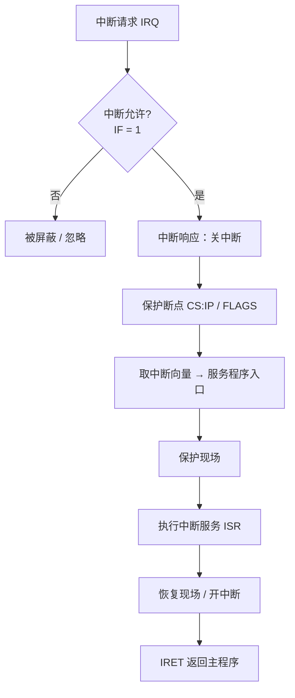
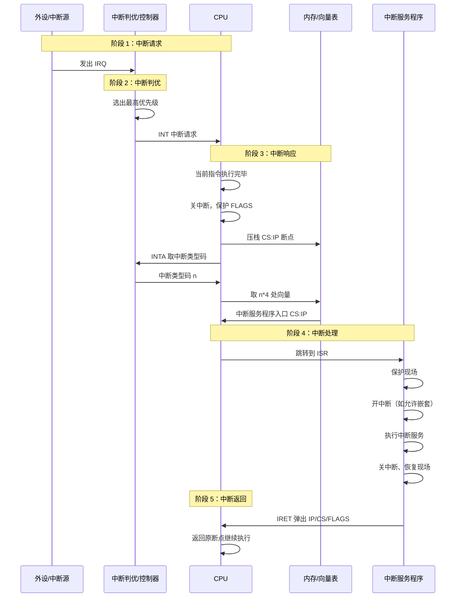
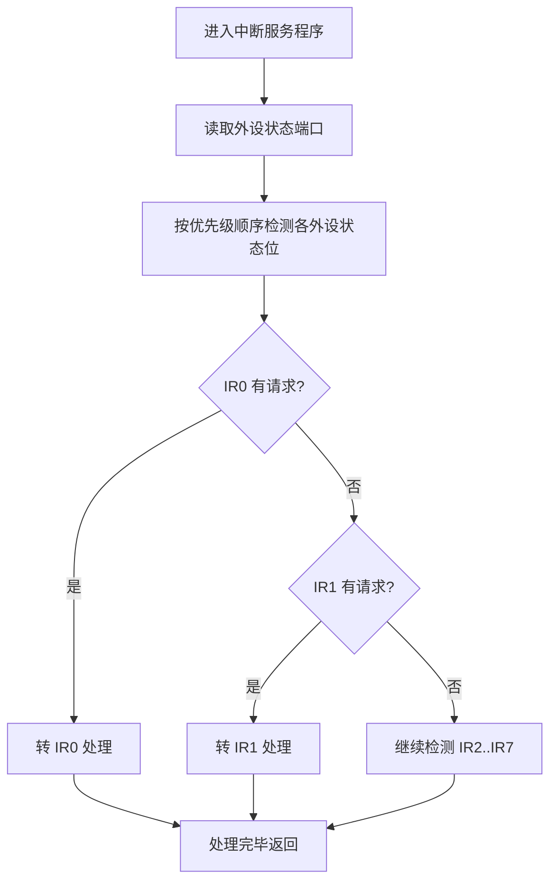

# 06-03 中断机制与优先级

梳理中断源、响应过程、软件排优和硬件排优。

> [!info] 导航
> 上一节：[[06-02 程序查询、中断与 DMA 传送]] · 课程总览：[[计算机系统/微机原理与接口技术B/MOC - 微机原理与接口技术|总 MOC]] · 本章目录：[[计算机系统/微机原理与接口技术B/06 输入输出与中断/MOC - 06 输入输出与中断|第 6 章 MOC]] · 下一节：[[06-04 80x86 中断系统与中断向量]]
>
> **内容主线**：[[#6.3 中断技术|中断技术]] → [[#6.3.1 中断的基本概念|中断的基本概念]] → [[#1. 中断源|中断源]] → [[#2. 中断处理过程|中断处理过程]]

## 6.3 中断技术

> [!abstract] 中断响应与返回
> 中断处理是微处理器应具备的基本功能之一。当 CPU 响应中断，会暂停当前主程序，然后跳转执行中断服务，待中断服务执行完毕，再返回主程序的暂停位置（**断点**）继续执行。中断的程序响应过程如图 6-16 所示。

![[计算机系统/微机原理与接口技术B/附件/第6章/Pasted image 20260719161702.png]]
*图 6-16　中断的程序响应过程*

> [!info] CISC 与 RISC 的中断响应时刻差异
> 不同的微处理器中断响应时刻略有不同：
> - **CISC 微处理器**：在一条指令执行结束后响应中断；
> - **RISC**：可以在一条指令执行的适当地点响应中断，与 CISC 相比，其中断响应更及时。

### 6.3.1 中断的基本概念

#### 1. 中断源

> [!abstract] 中断源
> 系统中引起中断的原因或能发出中断申请的来源，统称为**中断源**。中断源可以来自外部或内部。

##### 1. 外部中断源

| 类别 | 典型示例 |
| :--- | :--- |
| I/O 设备 | 键盘、显示器（CRT）、打印机等 |
| 数据通道 | 磁盘、采样电路及单片机中的串行口请求中断等 |
| 实时钟 | 外部所需的定时电路和单片机中的定时器/计数器等 |
| 故障源 | 掉电、存储器奇偶校验错等 |

##### 2. 内部中断源

| 类别 | 典型示例 |
| :--- | :--- |
| CPU 指令执行产生的异常 | 被 0 除、溢出和单步执行等 |
| 软件中断指令 | 80x86 中的 DOS 功能调用 `INT 21H`、BIOS 中断调用 `INT 10H`、ARM 处理器中的软中断异常指令 `SWI`、MIPS 处理器中的 `SYSCALL` 指令等 |

#### 2. 中断处理过程

> [!important] 中断处理的 5 个基本阶段
> 对于不同的微机系统，中断处理的具体过程不尽相同，即使是同一台微型计算机，由于中断方式的不同，中断处理也会有差别。但一个完整的中断处理的基本过程应包括以下 5 个基本阶段：
> 1. **中断请求**；
> 2. **中断判优**；
> 3. **中断响应**；
> 4. **中断处理**；
> 5. **中断返回**。

下面将以可屏蔽中断为例详细讨论中断的处理过程，如图 6-17 所示。

![[计算机系统/微机原理与接口技术B/附件/第6章/Pasted image 20260719161711.png]]
*图 6-17　中断处理过程示意图*

##### 1. 中断请求

> [!info] 中断请求条件
> 中断源产生中断请求的条件对不同的中断源是不一样的。如：
> - **I/O 设备**申请中断：必须在 CPU 的相应引脚上产生中断申请信号；
> - **除法出错**中断请求：除数为零或商超过结果寄存器数的表示范围。
>
> 中断源发出中断请求信号后，即进入中断判优阶段。

##### 2. 中断判优

> [!important] 中断判优的两个作用
> 由于中断产生的随机性，有可能出现两个或两个以上的中断源同时提出中断请求的情况。这时就要根据中断源的轻重缓急，给每个中断源确定一个**中断级别**（中断优先权）。
>
> **作用 1：当多个中断源同时提出中断请求时**，找出优先级别最高的中断源响应它的请求；处理完毕再响应级别较低的中断源的请求。
>
> **作用 2：决定是否能实现中断嵌套**——如果 CPU 在响应某一中断请求时，出现了更高级别的中断源的请求，则中断判优电路允许新的中断源向 CPU 提出中断请求，从而暂时中止正在服务的当前中断服务程序，转去为高级中断源服务。等高级中断处理完毕，再返回到原中断服务程序断点处继续执行，这个过程称为**中断嵌套**。中断嵌套可以有多级。

![[计算机系统/微机原理与接口技术B/附件/第6章/Pasted image 20260719161720.png]]
*图 6-18 CPU 中断嵌套*

##### 3. 中断响应

> [!info] 中断响应的条件
> 对于可屏蔽中断，仅有中断请求还不一定能实现中断。除了优先权级别高低的条件，一般 CPU 包含中断控制寄存器，只有寄存器中的中断允许标志位允许的情况下，处理器才响应中断：
> - **80x86**：IF 标志位（详见 [[02-02 8086 与 8088 的内部结构#4. 状态标志寄存器 FR|FR 中的 IF]]）
> - **ARM**：中断屏蔽寄存器
> - **MIPS**：SR 寄存器

> [!important] 中断响应时 CPU 自动完成的工作
> 当 CPU 响应中断时，还会自动执行一些处理：
> 1. 保护状态标志；
> 2. 保护断点；
> 3. 跳转到中断服务程序的入口。
>
> 中断服务程序的入口地址通常被称为**中断向量**，这些中断向量统一存放在指定的内存空间中，该空间被称为**中断向量表**。在 80x86 中，中断向量表位于内存中最低的 1 KB 字节存储区域。

##### 4. 中断处理

> [!important] 中断服务程序必须完成的工作
> 中断处理由中断服务程序完成。在中断服务程序中必须做以下工作：
>
> 1. **保护现场**：在执行中断服务程序时，需要先保护中断服务程序中要使用的寄存器内容，以防止影响当前程序的运行，中断返回前再将其恢复。中断服务程序一般使用堆栈操作指令完成现场保护，如 80x86 的 `PUSH` 指令。MIPS 处理器没有专门的堆栈操作指令，通过存储器访问指令 `SW` 和 `LW` 进行堆栈操作，来完成上述功能。
> 2. **开中断**：CPU 响应中断、保护状态标志后会自动关闭中断。若进入中断服务程序后允许中断嵌套，则需用指令开中断，如 80x86 的 `STI` 指令。
> 3. **执行中断服务处理程序**：可根据不同的中断目的编写不同的中断服务处理程序。中断服务处理程序不宜过长或过于复杂，否则运行时既容易出错，也影响其他中断源的及时处理。
> 4. **关中断**：相应的中断服务处理结束后，为确保现场恢复不被打断，需使用指令关中断，如 80x86 的 `CLI` 指令。
> 5. **恢复现场**：把先前保存的相关寄存器按入栈时相反的顺序弹出，使这些寄存器恢复到中断前的状态。

##### 5. 中断返回

> [!info] IRET 的作用
> 中断服务程序的最后是**中断返回指令**（如 80x86 的 `IRET`，详见 [[03-07 控制转移与过程调用指令]]），执行返回指令后，CPU 会自动弹出断点信息，送给指令指针（如 IP 和 CS），并恢复标志寄存器的内容，以便回到断点处继续执行原程序。

### 6.3.2 中断优先权

> [!abstract] 优先权安排的必要性
> 通常，系统中多个中断源的请求都是送到 CPU 的**同一引脚**。因此对所有中断源，必须根据其中断的性质及处理的轻重缓急来安排优先权，一般采用**软件排优**和**硬件排优**两种方法。

#### 1. 软件排优

> [!info] 软件排优原理
> 软件排优是指各中断源的优先权主要由**软件**安排，与硬件电路关系不大。一种配合软件排优使用的电路如图 6-19 所示。若干外设的中断请求信号相 "或" 后，送至 CPU 的中断接收引脚（如 INTR）。这样只要任一个外设有中断请求（"1" 状态），CPU 便可响应中断。
>
> 在中断服务程序的开头可安排一段优先权的查询程序，由 CPU 读取外设中断请求状态端口，然后根据预先确定的优先权级别逐位检测各外设的状态，若有中断请求，就转到相应的处理程序入口，其流程如图 6-20 所示。

![[计算机系统/微机原理与接口技术B/附件/第6章/Pasted image 20260719161729.png]]
*图 6-19 一种软件排优电路*

![[计算机系统/微机原理与接口技术B/附件/第6章/Pasted image 20260719161735.png]]
*图 6-20 软件优先权查询流程*

> [!tip] 软件排优的优缺点
> - **优点**：节省硬件，优先权安排灵活；
> - **缺点**：查询需要耗费时间，可能影响中断的实时性。
> - **优先级规则**：查询的顺序反映了各中断源的优先权的高低，**最先查询的外设其优先级别最高**。

#### 2. 硬件排优

> [!info] 硬件排优
> 硬件排优是指利用**专门的硬件电路**或中断控制器对系统中各中断源的优先权进行安排。

##### 1. 硬件排优电路

链式优先权排队电路是一种简单的中断优先权硬件排优电路，如图 6-21 所示。采用该方法时，每个外设对应的接口上连接一个逻辑电路，这些逻辑电路构成一个链，称为**菊花链**，由该菊花链来控制中断响应信号的通路。

![[计算机系统/微机原理与接口技术B/附件/第6章/Pasted image 20260719161746.png]]
*图 6-21 链式优先权排队电路 （a) 菊花链 b) 菊花链逻辑电路）*

> [!info] 菊花链工作原理
> 当某个外设有中断请求时，CPU 如果允许中断，则发出 $\overline{INTA}$ 信号：
> - 如果链条前端的外设**无**中断请求信号，该级菊花链逻辑电路就会允许 $\overline{INTA}$ 信号自动地往后传递，一直传到发出中断请求的外设（该外设经过菊花链得到的中断应答为 "0"）。
> - 此时，该外设的菊花链逻辑电路对后面的菊花链逻辑电路实现**阻塞**，使 $\overline{INTA}$ 信号不再传到后面的外设（后面的外设得到的中断应答始终为 "1"）。
> - 因而，采用菊花链电路的各外设的中断优先权由其在链中的位置决定，**处于链条前端的比处于链条后端的优先权高**。当某外设收到 $\overline{INTA}$ 后，可向 CPU 送出本身的中断类型码。

> [!tip] 菊花链的中断嵌套
> 若 CPU 正执行某个中断服务程序时，又有级别较高的外设提出中断请求，由于菊花链电路中级别低的外设**不能封锁级别高的外设**得到中断响应信号，故仍可响应该中断请求，从而发生中断嵌套。

##### 2. 可编程中断控制器

> [!info] 可编程中断控制器（PIC）
> 可编程中断控制器是当前微机系统中解决中断优先权管理的常用办法。通常，中断控制器包括：
> - 中断优先权管理电路
> - 中断请求锁存器（IRR）
> - 中断服务寄存器（ISR）
> - 中断屏蔽寄存器（IMR）
>
> 中断控制器也可以认为是一种接口，外设提出的中断请求经该环节处理后，再决定是否向 CPU 传送，CPU 接受中断请求后的中断响应信号也是送给该环节处理的，以便得到相应的中断类型码。有关中断控制器的详细说明，将在 [[06-05 8259A 可编程中断控制器]] 介绍。

#### 3. 软件排优 vs 硬件排优

| 对比项 | 软件排优 | 硬件排优（菊花链） | 中断控制器（如 8259A） |
| :--- | :--- | :--- | :--- |
| 实现方式 | 中断服务程序中查询状态端口 | 菊花链硬件电路传递 $\overline{INTA}$ | 专用芯片 + 命令字编程 |
| 优先级来源 | 查询顺序 | 物理位置（链条前端优先） | 可编程设定 |
| 响应速度 | 慢（逐位查询） | 快 | 快 |
| 灵活性 | 高（修改查询顺序即可） | 低（依赖硬件连接） | 高（通过命令字配置） |
| 硬件开销 | 小 | 中 | 大 |
| 适用场景 | 中断源少、要求灵活 | 简单多中断源系统 | 现代通用微机系统 |
