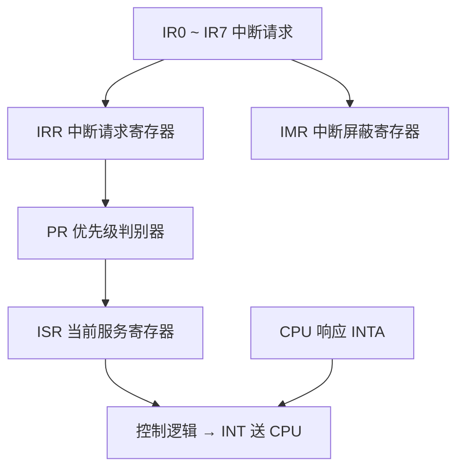
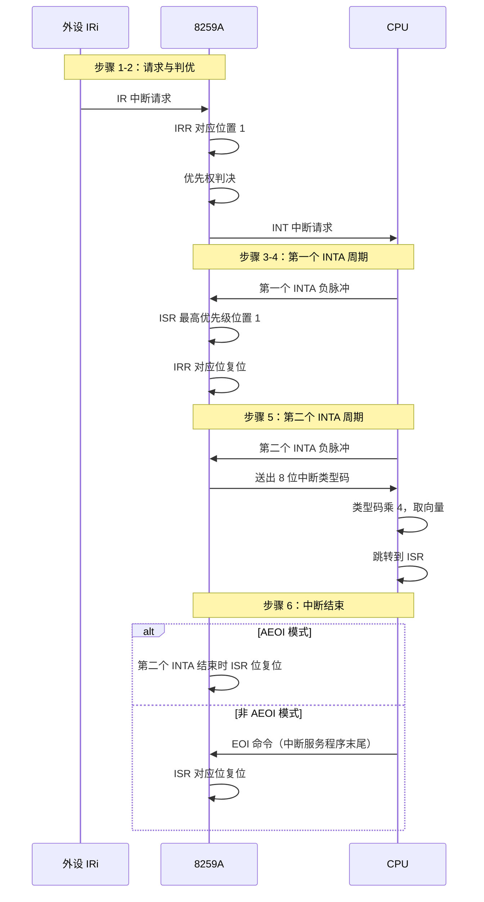

# 06-05 8259A 可编程中断控制器

理解请求、屏蔽、服务状态、级联、命令字和结束中断。

> [!info] 导航
> 上一节：[[06-04 80x86 中断系统与中断向量]] · 课程总览：[[计算机系统/微机原理与接口技术B/MOC - 微机原理与接口技术|总 MOC]] · 本章目录：[[计算机系统/微机原理与接口技术B/06 输入输出与中断/MOC - 06 输入输出与中断|第 6 章 MOC]] · 下一节：[[06-06 中断服务程序设计]]
>
> **内容主线**：[[#6.5 8259A 可编程中断控制器|8259A 可编程中断控制器]] → [[#6.5.1 8259A 芯片的内部结构与引脚|8259A 芯片的内部结构与引脚]] → [[#6.5.2 8259A 芯片的工作过程及工作方式|8259A 芯片的工作过程及工作方式]] → [[#1. 8259A 芯片的工作过程|8259A 芯片的工作过程]]

## 6.5 8259A 可编程中断控制器

> [!abstract] 8259A 的定位
> 中断控制器用在多中断源微机系统中管理中断，实现对各中断源的优先权和中断类型码等进行安排；对外设送来的中断请求进行判优和中断屏蔽；在中断响应周期送出中断类型码等。
>
> 早期的 PC/XT 中使用的可编程中断控制器（PIC，Programmable Interrupt Controller）一般为 Intel 8259 系列产品，这种 PIC 只能支持 8 个中断优先级，但是可以通过级联最多支持 64 个优先级。

> [!info] 8259A 的演进历程
> | 时期 | 系统 | PIC 实现 |
> | :--- | :--- | :--- |
> | PC/XT | 8086/8088 | 单片 8259A，支持 8 级中断 |
> | PC/AT | 80286 | 主从两片 8259A 级联，支持 15 级中断 |
> | 80386 起 | 80386/80486 | 集成在 82380 芯片中，由 3 个增强的 8259A 组成，可提供 15 个外部和 5 个内部中断请求输入 |
> | Pentium 系列 | Pentium 及以后 | PIC 技术被高级可编程中断控制器（APIC，Advanced Programmable Interrupt Controller）取代 |

> [!important] 8259A 的基本能力
> Intel 8259A 是一种可编程中断控制器，它是为 80x86 CPU 管理可屏蔽中断而设计的：
> - **单片** 8259A 可以支持和管理 **8 级**优先级中断；
> - **多片级联**最多可扩展至 **64 级**优先中断控制系统；
> - 有多种工作方式，包括中断请求触发方式、中断屏蔽功能及方式、中断优先级算法及方式、中断结束方式等，都可以通过编程来选择，以适应不同的应用场合。

### 6.5.1 8259A 芯片的内部结构与引脚



8259A 是有 28 个引脚的双列直插式芯片，内部结构与芯片引脚如图 6-27 所示。

> [!info] 8259A 的内部组成
> 8259A 由以下部分构成：
> - 中断请求寄存器 **IRR**（Interrupt Request Register）
> - 优先级分析器（即优先权判决电路）
> - 中断服务寄存器 **ISR**（In-Service Register）
> - 中断屏蔽寄存器 **IMR**（Interrupt Mask Register）
> - 数据总线缓冲器
> - 读/写电路
> - 控制逻辑
> - 级联缓冲/比较器
> - 初始化命令与操作命令寄存器组

![[计算机系统/微机原理与接口技术B/附件/第6章/Pasted image 20260719161838.png]]
*图 6-27 8259A 芯片内部结构与芯片引脚图 (a) 内部结构 (b) 引脚图*

> [!important] 三大寄存器与控制逻辑的作用
> | 寄存器/部件 | 作用 |
> | :--- | :--- |
> | **IRR** | 寄存所有要求服务的中断请求——$\text{IR}_7 \sim \text{IR}_0$ 中有中断请求时相应位置 1 |
> | **优先权判决电路** | 对 IRR 中的各中断请求进行分析，确定当前最高优先级的中断源，并在 CPU 响应中断请求的第一个响应周期将它选通送至 ISR 的相应位 |
> | **ISR** | 寄存器中用 1 表征**正在被服务**的中断源 |
> | **IMR** | 存放是否屏蔽 $\text{IR}_7 \sim \text{IR}_0$ 各中断源的屏蔽码——某位为 1 时屏蔽该级中断，否则开放该级中断 |
> | **控制逻辑** | 根据编程设定的工作方式产生内部控制信号，并在适当时对 CPU 发出中断请求信号 INT 和接收来自 CPU 的中断响应信号 $\overline{INTA}$ |

> [!info] 读/写电路
> 读/写电路接收 CPU 的读/写命令。可以将来自 CPU 的初始化命令字（ICW）和操作命令字（OCW）写入相应的命令寄存器组，以规定 8259A 的工作方式和控制模式；也可通过这些寄存器组内容读出，以了解 8259A 芯片的内部状态信息。与读/写电路有关的引脚功能如表 6-5 所示。

## 表 6-5 与读/写电路有关的引脚功能

| 符号 | 名称 | 功能说明 |
| :--- | :--- | :--- |
| $\overline{\text{CS}}$ | 片选线 | $\overline{\text{CS}}=0$，芯片被选中，允许 CPU 读/写。一般由高位地址译码得到 |
| $\overline{\text{WR}}$ | 写命令信号线 | $\overline{\text{WR}}=0$，允许 CPU 把命令字（ICW 和 OCW）写入相应命令寄存器 |
| $\overline{\text{RD}}$ | 读命令信号线 | $\overline{\text{RD}}=0$，允许 CPU 读取 IRR、ISR、IMR 三个寄存器的内容 |
| $A_0$ | 端口选择线 | 用于片内寄存器选择。一般可直接接至地址总线的 $A_0$ 位或其他位 |

> [!info] 数据总线缓冲器
> 数据总线缓冲器是 **8 位双向三态缓冲器**，用于连接系统数据总线和 8259A 芯片内部总线，以便编程时 CPU 对 8259A 写入控制字或读取状态字。

> [!important] 级联缓冲/比较器
> 级联缓冲/比较器用于多片 8259A 之间的连接，使得中断源可由 8 级扩展至 **64 级**。多片连接时，一个为主片，其余为从片，PC/AT 系统便采用这种级联工作方式。
>
> | 引脚 | 名称 | 功能 |
> | :--- | :--- | :--- |
> | $\overline{\text{SP}} / \overline{\text{EN}}$ | 从片编程/缓冲器允许信号线 | 双功能引脚。**作为输入**：区别 8259A 是主（$\overline{\text{SP}}=1$）还是从（$\overline{\text{SP}}=0$）；**作为输出**：选通 8259A 至 CPU 之间的数据总线缓冲器。只有一片 8259A 的系统中接高电平 |
> | $\text{CAS}_2 \sim \text{CAS}_0$ | 级联信号线 | **主片**：输出线，输出级联选择编码以选出请求中断的从片；**从片**：输入线，接收主片送来的选择编码 |

### 6.5.2 8259A 芯片的工作过程及工作方式

#### 1. 8259A 芯片的工作过程

> [!important] 8259A 处理中断请求的 6 步过程
> 当系统上电后，首先应由 CPU 对 8259A 芯片写入若干命令字对其进行**初始化**，使其处于准备就绪状态。完成初始化后，8259A 就处于就绪状态，随时可接收外设送来的中断请求信号。当外设发出中断请求后，8259A 对外部中断请求的处理过程如下：
>
> 1. 当中断请求输入线 $\text{IR}_7 \sim \text{IR}_0$ 上有一条或若干条中断请求信号有效时，则 **IRR** 的相应位置 1。
> 2. 若中断请求线中至少有一条是中断允许的，则 8259A 由 **INT** 引脚向 CPU 发出中断请求信号。
> 3. 若 CPU 处于开中断状态，则在当前指令执行完成以后，用 $\overline{INTA}$ 信号作为响应。
> 4. 8259A 在接收到 CPU 发出的**第一个 $\overline{INTA}$ 负脉冲**后，使最高优先级的 **ISR** 位置 1，而相应的 **IRR** 位复位。在此中断响应周期中，8259A **并不向系统数据总线传送任何信息**。
> 5. CPU 在输出**第二个 $\overline{INTA}$ 脉冲**后，8259A 向数据总线输送一个 **8 位的中断类型码**。CPU 在此周期中，读取此类型码并乘以 4，就可以从中断向量表中取出中断服务程序的入口地址。据此，CPU 便可转入中断服务程序。
> 6. 若 8259A 工作在**自动结束中断 AEOI**（Automatic End Of Interrupt）模式，在第二个 $\overline{INTA}$ 脉冲结束时，将使中断源在 ISR 中的相应位复位；否则，直到中断服务程序结束，由 CPU 向 8259A 发出 **EOI 命令**，才使 ISR 的相应位复位，表征对应此位的中断源全部服务完毕。



#### 2. 8259A 芯片的工作方式

> [!info] 8259A 五种工作方式
> 8259A 芯片具有非常灵活的中断管理方式，这些方式都可以通过编程来设定。8259A 的工作方式有五种，具体见表 6-6。

##### 1. 中断嵌套方式

> [!info] 两种中断嵌套方式
> 按照优先权设置方法来分，8259A 有**普通全嵌套**和**特殊全嵌套**两种中断嵌套工作方式。

| 嵌套方式 | 优先级顺序 | 同级请求处理 | 适用场景 |
| :--- | :--- | :--- | :--- |
| **普通全嵌套方式** | $\text{IR}_0$ > $\text{IR}_1$ > ... > $\text{IR}_7$（固定） | 屏蔽同级及低级，仅响应高级 | 单片 8259 系统（最常用） |
| **特殊全嵌套方式** | $\text{IR}_0$ > $\text{IR}_1$ > ... > $\text{IR}_7$（固定） | **对同级 IR 请求也响应** | 8259A **级联**系统中的主片 |

> [!info] 特殊全嵌套方式的特点
> 特殊全嵌套方式一般用在 8259A 级联系统中。这时，主片 8259A 编程为特殊全嵌套方式，其余芯片编程为普通全嵌套方式。当来自某一个从片的中断请求正在处理时：
> - 一方面，和普通全嵌套方式一样，对来自优先级较高的主片其他引脚上的中断请求进行开放；
> - 另一方面，对**来自同一从片的较高优先级请求**也会开放。
>
> 这样，在同一从片的 ISR 中就会有不只一位置 1 的情况。

> [!tip] 级联系统结束中断时的检查流程
> 在多片级联系统中来自从片的中断服务结束时，须用软件检查刚刚结束的中断是否是从片的**唯一中断**，否则不能将主片 ISR 中的相应位复位：
> 1. 先向从片发出一个**普通 EOI** 命令；
> 2. 读出 ISR 内容；
> 3. **若为 0**：表示当前只有一个中断被服务，可再向主片发一个 EOI 命令；
> 4. **若不为 0**：说明该从片有两个或以上中断源，不应发给主片 EOI 命令。待该从片中断服务全部结束后，再发送 EOI 命令给主片。

##### 2. 中断优先权循环方式

> [!info] 两种优先权循环方式
> 在实际应用中，中断源的优先权情况比较复杂，不一定有明显的等级，也不可能总是规定 $\text{IR}_0$ 优先权最高，$\text{IR}_7$ 优先权最低，应根据实际情况来具体处理。8259A 芯片设计了自动和特殊两种中断优先权循环方式。

| 循环方式 | 优先级变化规则 | 适用场景 |
| :--- | :--- | :--- |
| **自动循环方式** | 中断源得到服务后自动降为最低，原来比它低一级的为最高 | 系统中多个中断源优先级相同的场合 |
| **特殊循环方式** | 通过编程写 OCW2 的低 3 位指定最低优先级 | 中断优先级需要任意改变的场合 |

> [!example] 自动循环方式示例
> 如初始优先级队列规定为 $\text{IR}_0, \text{IR}_1, \cdots, \text{IR}_7$，此时若 $\text{IR}_4$ 有中断请求则处理 $\text{IR}_4$。$\text{IR}_4$ 得到服务后自动左循环到最低优先级，$\text{IR}_5$ 成为最高优先级，中断源的优先级队列依次变为：
> $$\text{IR}_5, \text{IR}_6, \text{IR}_7, \text{IR}_0, \text{IR}_1, \text{IR}_2, \text{IR}_3, \text{IR}_4$$

> [!example] 特殊循环方式示例
> 如指定 $\text{IR}_5$ 为最低优先级，则当前的优先级顺序为：
> $$\text{IR}_6, \text{IR}_7, \text{IR}_0, \text{IR}_1, \cdots, \text{IR}_5$$

##### 3. 中断结束处理方式

> [!important] 中断结束处理的本质
> 不管用哪种优先权方式工作，当一个中断请求得到响应时，8259A 都会将中断服务寄存器 **ISR** 中相应位置 1。当中断服务程序结束时，必须使该 ISR 位**清 0**。否则，这个未复位的高优先权中断源会影响 8259A 的正常控制功能。
>
> 使 ISR 位复位的动作就是对 8259A 进行中断结束处理。8259A 提供自动和非自动两种中断结束处理方式，其中非自动中断结束方式又包括普通（或称为一般、正常）中断结束方式和特殊中断结束方式。

| 结束方式 | EOI 命令发出 | ISR 复位时机 | 适用场景 |
| :--- | :--- | :--- | :--- |
| **自动中断结束方式（AEOI）** | 不需要 | CPU 第二个中断响应周期 $\overline{INTA}$ 信号的后沿自动复位 | 不要中断嵌套的场合 |
| **普通中断结束方式（EOI）** | 中断服务程序末尾发普通 EOI 命令 | 复位当前优先权最高的 ISR 位 | 普通全嵌套工作方式 |
| **特殊中断结束方式（SEOI）** | CPU 输出 SEOI 命令，指明要清除哪个 ISR 位 | 复位指定 ISR 位 | 非普通全嵌套工作方式（优先级不断改变） |

> [!warning] 级联系统的 EOI 发送规则
> 在多片级联系统**非自动结束方式**下，从片在中断服务程序结束时，必须发**两次** EOI 命令：
> - 一次是对从片发送的；
> - 另一次则是对主片发送的。
>
> 当工作于**特殊全嵌套方式**时，第二个向主片发送的 EOI 命令是否输出，取决于对从片的 ISR 检测是否为 0。

##### 4. 屏蔽中断源方式

> [!info] 屏蔽中断源方式
> 8259A 的 8 个中断请求都可根据需要单独屏蔽，屏蔽就是通过编程使屏蔽寄存器 IMR 中相应位清 0 或置 1，以允许或禁止相应的中断请求。8259A 有普通和特殊两种屏蔽方式。

| 屏蔽方式 | 实现方法 | 适用场景 |
| :--- | :--- | :--- |
| **普通屏蔽方式** | 编程写 OCW1 将 IMR 某位置 1，则屏蔽对应中断源；该位清 0，则允许 | 一般屏蔽需求 |
| **特殊屏蔽方式** | 屏蔽当前中断级 + 设置特殊屏蔽方式 → 中止 ISR 功能 | 执行较高级中断服务时**开放较低级中断** |

> [!important] 特殊屏蔽方式解决的问题
> 有时希望在执行一个较高级的中断服务过程中，开放对较低级中断源的服务。为此，自然会想到使 IMR 的相应位置 1，使本级中断受到屏蔽，为开放较低级中断请求提供可能。但是，在 8259A 这样做有一个问题：**每当一个中断请求得到响应时，就会使 ISR 相应位置 1**，只要没有收到 EOI 命令，8259A 就会据此而禁止所有优先级比它低的中断。
>
> 所以，尽管当前处理的较高级中断请求被屏蔽，但由于 ISR 位未被复位，较低级的中断请求在发出 EOI 命令之前仍不会得到响应。
>
> **特殊屏蔽方式**可以解决这个问题：
> 1. 首先屏蔽当前中断级（IMR 对应位为 1）；
> 2. 然后设置 8259A 为特殊屏蔽方式；
> 3. 则使 ISR 相应的功能中止；
> 4. 直到为较低级中断服务完后，再清除特殊屏蔽方式为止。
>
> 通过设置特殊屏蔽方式，可**动态改变中断系统的优先级结构**。

##### 5. 中断触发方式

| 触发方式 | 触发条件 | 注意事项 |
| :--- | :--- | :--- |
| **电平触发方式** | $\text{IR}_i$ 上出现**高电平** | 响应后应及时去掉高电平，否则可能引起不应该有的第二次中断 |
| **边沿触发方式** | $\text{IR}_i$ 上出现**上升沿跳变** | — |

> [!warning] 中断请求信号 $\text{IR}_n$ 的宽度要求
> 无论是电平触发还是边沿触发，中断请求信号 $\text{IR}_n$ 都应维持足够的宽度。即在**第一个中断响应信号 $\overline{INTA}$ 结束之前**，$\text{IR}_n$ 都必须保持高电平。
>
> 如果 $\text{IR}_n$ 信号提前变为低电平，8259A 就会默认为这个中断请求来自引脚 $\text{IR}_7$——这种办法能够有效地防止由 $\text{IR}_n$ 输入端严重的**噪声尖峰**而产生的中断。

> [!tip] 滤除 $\text{IR}_7$ 噪声中断的两种方法
> 1. 对应 $\text{IR}_7$ 的中断服务程序可只执行一条返回指令，从而滤除这种中断；
> 2. 如果 $\text{IR}_7$ 另有他用，仍可通过读 ISR 状态来识别非正常的 $\text{IR}_7$ 中断——正常的 $\text{IR}_7$ 中断会使相应的 ISR 的 $D_7$ 位置 1。

## 表 6-6 8259A 芯片的五种工作方式

| 功能分类 | 工作方式 | 工作方式描述 |
| :--- | :--- | :--- |
| **中断优先权固定** | **中断嵌套方式** | |
| | 普通全嵌套方式 | 中断优先级由高到低固定为：$\text{IR}_0, \text{IR}_1, \text{IR}_2, \text{IR}_3, \text{IR}_4, \text{IR}_5, \text{IR}_6, \text{IR}_7$。CPU 响应中断时，将申请中断的优先权最高的中断源在 ISR 中的相应位置 1，并服务该中断源。与它同级或低级的中断申请将被屏蔽，可响应优先级比它高的中断源的申请。适用于单片 8259 系统 |
| | 特殊全嵌套方式 | 中断优先级由高到低固定为：$\text{IR}_0, \text{IR}_1, \text{IR}_2, \text{IR}_3, \text{IR}_4, \text{IR}_5, \text{IR}_6, \text{IR}_7$。与普通嵌套方式基本相同，唯一区别是，当处理某级中断时，对同级的 IR 请求也会给予响应。适用于 8259 级联的情况 |
| **中断优先权循环** | **优先权循环方式** | |
| | 自动循环方式 | 一个中断源得到服务后，它的优先级自动降为最低，原来比它低一级的中断源则为最高级，依次排列。适用于系统中多个中断源优先级相同的场合 |
| | 特殊循环方式 | 通过编程写 OCW2 的低 3 位来指定最低优先级。原来比它低一级的中断源则为最高级，依次排列。适用于中断优先级需要任意改变的场合 |
| **中断结束处理** | **中断结束处理方式** | |
| | 自动中断结束方式（AEOI） | 在 CPU 第二个中断响应周期 $\overline{INTA}$ 信号的后沿，8259A 自动将 ISR 中相应位复位。适用于不要中断嵌套的场合 |
| | 普通中断结束方式（EOI） | 当 8259A 工作在该方式下，当前服务过的中断源就是中断优先权最髙的源，用普通的 EOI 命令使它在 ISR 中的相应位复位。这个命令应加在中断服务程序的末尾处，适用于普通全嵌套工作方式 |
| | 特殊中断结束方式（SEOI） | 当 8259A 工作在非普通全嵌套工作方式时，由于中断优先级不断改变，8259A 无法确定断源哪级中断，就需由 CPU 输出 SEOI 命令，指出要清除哪个 ISR 位 |
| **屏蔽中断源** | **屏蔽中断源方式** | |
| | 普通屏蔽方式 | 编程写 OCW1 将 IMR 某位置 1，则屏蔽对应的中断源，该位清 0，则允许该级中断 |
| | 特殊屏蔽方式 | 用于开放较低级中断请求 |
| **中断触发** | **中断触发方式** | |
| | 电平触发方式 | 8259A 的引脚 $\text{IR}_i$（$i=0 \sim 7$）上出现高电平，表示有中断请求。此方式下，应注意响应后及时去掉高电平，否则可能引起不应该有的第二次中断 |
| | 边沿触发方式 | 8259A 的引脚 $\text{IR}_i$（$i=0 \sim 7$）上出现上升沿跳变，表示有中断请求 |

### 6.5.3 8259A 命令字

> [!info] 8259A 编程的两个部分
> 8259A 是可编程中断控制器，对其应用编程包括**初始化编程**和**操作方式编程**两部分：

| 编程类型 | 命令字 | 字节数 | 写入时机 | 修改频率 |
| :--- | :--- | :--- | :--- | :--- |
| **初始化编程** | ICW（Initialization Command Word） | 2～4 字节 | 8259A 工作之前必须写入 | 写入后一般不再改变 |
| **操作方式编程** | OCW（Operation Command Word） | 3 字节 | 8259A 已初始化以后的任何时间 | 可随时写入 |

#### 1. 8259A 的初始化命令字 ICW

> [!important] ICW 写入要点
> 初始化命令字 ICW 最多有 **4 个**，必须在 8259A 开始工作之前写入。
> - 写入 ICW1 的端口地址规定为 **$A_0=0$**（偶地址）；
> - 写入 ICW2、ICW3 和 ICW4 的端口地址均为 **$A_0=1$**（奇地址）；
> - 由于片内采用了 FIFO 缓冲器技术，编程时需**严格按照图 6-28 所示的初始化流程顺序写入**。

![[计算机系统/微机原理与接口技术B/附件/第6章/Pasted image 20260719161850.png]]
*图 6-28 初始化流程*

##### 1. ICW1（初始化字）

> [!important] ICW1 写入识别与内部初始化过程
> 8259A 最初写入的必须是 ICW1。当引脚 $A_0=0$ 且 ICW1 内的 $D_4=1$ 时，表示写入的是 ICW1 命令字。ICW1 写入后，除完成 ICW1 格式规定的功能，8259A 内部状态有如下初始化过程：
> 1. 对中断请求信号边沿检测电路复位，准备按 ICW2、ICW3、ICW4 顺序接收其余的 ICW；
> 2. 清除 ISR 和 IMR；
> 3. 指定优先级由高到低为：$\text{IR}_0, \text{IR}_1, \cdots, \text{IR}_7$；
> 4. 特殊屏蔽方式复位，即设定为普通屏蔽方式；
> 5. 自动中断结束方式复位，即采用非自动中断结束方式；
> 6. 状态读出电路预置为 IRR。

ICW1 的格式如图 6-29 所示。

![[计算机系统/微机原理与接口技术B/附件/第6章/Pasted image 20260719161858.png]]
*图 6-29 ICW1 的格式*

| 位 | 名称 | 含义 |
| :--- | :--- | :--- |
| $D_0$ | IC4 | 表示初始化过程要不要写 ICW4。80x86 系统中 $D_0=1$ |
| $D_1$ | S | 指明系统中是使用单片还是多片 8259A。多片级联需要写入 ICW3 |
| $D_3$ | LTIM | 说明中断请求信号起作用的触发方式 |
| $D_2$ 和 $D_7 \sim D_5$ | — | 只在 8080/8085 CPU 模式下使用，指明 8 个中断向量地址之间的间距和中断向量地址。8086/8088 模式下不用，通常置为 0 |

##### 2. ICW2（中断类型码字）

> [!info] ICW2
> ICW2 是**中断类型码设置寄存器**，写入时应 $A_0=1$，ICW2 的格式如图 6-30 所示。

![[计算机系统/微机原理与接口技术B/附件/第6章/Pasted image 20260719161904.png]]
*图 6-30 ICW2 的格式*

> [!important] ICW2 在 8086/8088 中的使用
> 工作在 8080/8085 系统中时，8 位全部有用。在与 **8086/8088 CPU** 连接使用时：
> - 用 $T_7 \sim T_3$ 作为中断类型码的**高 5 位**；
> - **低 3 位**由 8259A 自动按 $\text{IR}_n$ 输入端确定，如表 6-7 所示。

> [!example] PC/XT 和 AT 的 ICW2 设置
> 在 PC/XT 和 AT 中，$T_7 \sim T_3=00001$，$T_2 \sim T_0=000$，**ICW2=08H**，表明 $\text{IR}_0 \sim \text{IR}_7$ 的中断类型码分别为 **08H～0FH**。在 8259A 收到第二个 $\overline{INTA}$ 时，将中断类型码送到数据总线上。

##### 3. ICW3（级联控制字）

> [!info] ICW3
> ICW3 定义了 8259A 的**级联**。
> - 若系统中只有一片 8259A，则**不用 ICW3**；
> - 若有多片 8259A 级联，则主 8259A 和每一片从 8259A 都必须使用 ICW3。
>
> 主、从片 8259A 的 ICW3 是不同的，写入 ICW3 时应 $A_0=1$，ICW3 的格式如图 6-31 所示。

![[计算机系统/微机原理与接口技术B/附件/第6章/Pasted image 20260719161913.png]]
*图 6-31 ICW3 的格式 (a) 主片命令字 (b) 从片命令字*

| 角色 | 有效位 | 含义 |
| :--- | :--- | :--- |
| **主片 ICW3** | $D_7 \sim D_0$ | 表示相应的 $\text{IR}_7 \sim \text{IR}_0$ 中断请求线上有无从片。某位 $D_i=1$ 表示对应的 $\text{IR}_i$ 线上有从片 |
| **从片 ICW3** | $D_2 \sim D_0$（$\text{ID}_2 \sim \text{ID}_0$） | 从片的识别码，对应于主片 $\text{IR}_7 \sim \text{IR}_0$ 级联的从片编码。$D_7 \sim D_3$ 没有定义，一般取 0 |

##### 4. ICW4（中断结束方式字）

> [!info] ICW4
> ICW4 定义 8259A 工作时所用的 **CPU 类型**，以及中断服务程序是否送出 **EOI 命令**以清除 ISR 中的相应位。写入 ICW4 时应 $A_0=1$，ICW4 格式如图 6-32 所示。

![[计算机系统/微机原理与接口技术B/附件/第6章/Pasted image 20260719161922.png]]
*图 6-32 ICW4 的格式*

| 位 | 名称 | 含义 |
| :--- | :--- | :--- |
| $D_0$ | PM | 定义选用的处理器类型 |
| $D_1$ | AEOI | 是否自动结束中断、使 ISR 复位。0：需要在中断服务程序末尾送出 EOI 命令；1：8259A 能自动使 ISR 复位 |
| $D_2$ | M/S | 本片 8259A 是主片（M/S=1）还是从片（M/S=0） |
| $D_3$ | BUF | 本片 8259A 和系统数据总线间是否有缓冲器。1 表示有，必须产生控制信号以便中断时能打开缓冲器 |
| $D_4$ | SFNM | 是否为多片级联系统中的主片。1：是，采用特殊全嵌套方式；0：否，采用普通全嵌套方式 |
| $D_7 \sim D_5$ | — | 未用，一般取 0 |

> [!important] 写完 ICW 后的默认工作方式
> 在写完初始化命令字 ICW 后，8259A 的中断输入端就可以接收中断请求信号了。若不再写入任何操作命令字 OCW，8259A 便处于**全嵌套中断工作方式**。这时：
> - 中断源的优先级固定为 $\text{IR}_0$ 最高，$\text{IR}_7$ 最低；
> - 当 CPU 为高级中断服务时，将 ISR 对应的位置 1，这时 8259A 不再响应所有同级或低级的中断请求，直到处理完高级中断，再执行一条 EOI 命令为止；
> - 如果 CPU 正在为低级中断源服务，则此时 ISR 相应位置 1，当有较高级别中断请求时，如果 CPU 处于开中断状态（IF=1，详见 [[02-02 8086 与 8088 的内部结构#4. 状态标志寄存器 FR|FR 中的 IF]]），便允许响应此高级中断，产生中断嵌套；
> - 此时 8259A 将对应此高级中断的 ISR 相应位置 1，原来较低级中断的 ISR 相应位并不复位，只是将该低级中断暂时挂起，转向为高级中断服务；
> - 当为高级中断服务完毕，程序中发一条 EOI 命令和中断返回命令 IRET 时，高级中断源对应的 ISR 相应位才复位，程序返回到低级中断服务程序的断点处；
> - 如果没有更高级的中断申请时，则被挂起的低级中断又从断点处开始执行。
>
> 若需改变上述 8259A 的中断控制方式，或为了屏蔽某些中断，以及读出 8259A 的一些状态信息（如 IRR、ISR、IMR 的内容），则必须写入操作命令字 OCW。

#### 2. 8259A 的操作命令字 OCW

> [!info] OCW 写入要点
> 8259A 的操作命令字有 3 个：**OCW1～OCW3**。
> - 在编程写入操作命令字时，**顺序上没有严格的要求**，需要什么字就写入什么字；
> - **OCW1 写入奇地址端口**（$A_0=1$）；
> - **OCW2 和 OCW3 都写入偶地址端口**（$A_0=0$），由字中的特征位 $D_4D_3$ 来区别它们是不同的命令字。

##### 1. OCW1（屏蔽控制字）

> [!info] OCW1
> 设置或清除对中断源的屏蔽，亦称**中断屏蔽命令字**。当写入 OCW1 使 IMR 的某位为 1 时，则相应位的中断源被屏蔽；若为 0，则中断被允许。
>
> 利用 OCW1，可以在程序的任何地方实现对某些中断的屏蔽或开放。

> [!example] OCW1 示例
> 如 OCW1=80H，则表示 $\text{IR}_7$ 中断源被屏蔽——即使 $\text{IR}_7$ 引脚有中断请求，但由于中断屏蔽寄存器 IMR 的 $D_7$ 被置 1，故 8259A 并不发出 INT 信号。

OCW1 的格式如图 6-33 所示。

![[计算机系统/微机原理与接口技术B/附件/第6章/Pasted image 20260719161930.png]]
*图 6-33 OCW1 的格式*

##### 2. OCW2（中断结束和优先级循环控制字）

> [!info] OCW2
> 写入 OCW2 主要是对 8259A 发出**中断结束命令**，包括普通结束 EOI 和特殊结束 SEOI，并控制中断优先权的循环等。OCW2 的特征位 $D_4D_3=00$，其格式如图 6-34 所示。

![[计算机系统/微机原理与接口技术B/附件/第6章/Pasted image 20260719161936.png]]
*图 6-34 OCW2 的格式*

| 位 | 名称 | 含义 |
| :--- | :--- | :--- |
| **EOI** | 中断结束命令 | 该位为 1 时，使 ISR 中当前最高优先级的相应位复位，以便允许系统再为其他级别中断源服务 |
| **R** | 中断优先权循环标志 | R=0：优先级固定不变（$\text{IR}_7$ 最低，$\text{IR}_0$ 最高）；R=1：优先级可以循环 |
| **$\text{L}_2\text{L}_1\text{L}_0$** | 优先级编码 | 作用一：设定系统中最优优先级的编码，改变 8259A 复位时设置的优先级；作用二：在 OCW2 给出 SEOI 时，指明具体要特殊结束哪个中断级 |
| **SL** | $\text{L}_2\text{L}_1\text{L}_0$ 选择有效标志 | SL=1：$\text{L}_2\text{L}_1\text{L}_0$ 选择有效；SL=0：$\text{L}_2\text{L}_1\text{L}_0$ 选择无效 |

> [!important] OCW2 中 R、SL、EOI 组合的含义
> OCW2 中 R、SL、EOI 的不同组合表征了 8259A 的不同工作方式：
> - 凡 $\text{L}_2\text{L}_1\text{L}_0$ 选择有效都称为"**特殊**"；
> - SL=1 且 R=1：优先权左循环至最低优先级对准 $\text{L}_2\text{L}_1\text{L}_0$ 编码 $i$（$0 \leqslant i \leqslant 7$）表示的 $\text{IR}_i$ 这一特殊值为止；
> - SL=0 且 R=1：当前服务的中断请求自动循环到最低优先级。

![[计算机系统/微机原理与接口技术B/附件/第6章/Pasted image 20260719161944.png]]
*图 6-35 OCW2 的格式*

##### 3. OCW3（屏蔽和读状态控制字）

> [!info] OCW3
> OCW3 可设置**特殊屏蔽方式**、**查询方式**，以及读取 IRR、ISR、IMR 的当前状态。OCW3 的特征位 $D_4D_3=01$，格式如图 6-36 所示。

![[计算机系统/微机原理与接口技术B/附件/第6章/Pasted image 20260719161949.png]]
*图 6-36 OCW3 的格式*

###### 1. 设置特殊屏蔽方式

> [!info] ESMM 和 SMM 的作用
> $D_6D_5$（ESMM 和 SMM）两位用于设置特殊屏蔽方式：
> - 如果在执行高级中断服务程序时需要开放低级中断，可先通过 OCW1 将正在被服务的高级中断屏蔽；
> - 再用 $D_6D_5=11$ 的 OCW3 命令设置 8259A，则可使 ISR 相应的功能中止；
> - 直到清除特殊屏蔽方式（$D_6D_5=10$）为止。

###### 2. 查询中断请求

> [!info] 查询工作方式
> 在 CPU 内部禁止中断时，或者在不想用 INT 引脚向 CPU 申请中断时，可以使用 8259A 的查询工作方式。
>
> 写入 P=1 的 OCW3 就发出查询命令。8259A 得到查询命令后，立即组成查询字，等待 CPU 来读取。当 CPU 再对同一地址（$A_0=0$）执行一条输入指令时，便可读到如下查询字：
> $$I \times \times \times \times W_2 W_1 W_0$$
> - 若 I=1：本片 8259A 的 $\text{IR}_0 \sim \text{IR}_7$ 中有中断请求，对应当前优先级最高的外部中断请求的编码由 $W_2W_1W_0$ 给出；
> - 若 I=0：无中断请求。

###### 3. 读取 8259A 的状态

> [!info] 三个寄存器内容的读取方法
> 为了了解 8259A 的工作状态，CPU 可读出 IRR、ISR、IMR 三个寄存器的内容，但读的方法有所不同：

| 寄存器 | 读取方法 |
| :--- | :--- |
| **IRR / ISR** | 先写入读命令字 OCW3 到偶地址（$A_0=0$）端口，再用 IN 指令从偶地址（$A_0=0$）端口读出。读命令字 OCW3 格式为 $0 \ 0 \ 0 \ 0 \ 1 \ 0 \ R_1 \ R_0$ |
| **IMR** | 不需写入 OCW3 命令，只要直接对奇地址（$A_0=1$）端口进行读操作即可 |

> [!important] 8259A 命令字与状态字汇总
> 写入 8259A 的命令字共有 **7 个**，从 8259A 读出的状态字有 **4 个**，它们是由读 RD 和写 WR 信号、地址信号 $A_0$ 以及命令字中的某些特定位所区分的，如表 6-8 所示。

## 表 6-8 8259A 的命令字/状态字读/写条件

| $A_0$ | $\overline{\text{RD}}$ | $\overline{\text{WR}}$ | $\overline{\text{CS}}$ | XT 机地址 | AT 机扩展从片地址 | 功能 |
| :--- | :--- | :--- | :--- | :--- | :--- | :--- |
| 0 | 1 | 0 | 0 | 20H | 0A0H | 写入 ICW1、OCW2、OCW3（注①） |
| 1 | 1 | 0 | 0 | 21H | 0A1H | 写入 ICW2、ICW3、ICW4、OCW1（注②） |
| 0 | 0 | 1 | 0 | 20H | 0A0H | 读出 IRR、ISR 和查询字（注③） |
| 1 | 0 | 1 | 0 | 21H | 0A1H | 读出 IMR |
| $\times$ | 1 | 1 | 0 | | | 数据总线高阻状态 |
| $\times$ | $\times$ | $\times$ | 1 | | | 数据总线高阻状态 |

> [!note] 表 6-8 注释
> - **注①**：由控制字中的 $D_4D_3$ 标志位决定写入的是 OCW2 还是 OCW3。
> - **注②**：写入 ICW1 后，由片内的顺序逻辑确定后续 ICW，否则写入 OCW1。
> - **注③**：由 OCW3 的内容决定读出哪个状态字。

### 6.5.4 8259A 芯片应用举例

#### 1. 8259A 在 PC/XT 机中的应用

> [!info] PC/XT 中的 8259A 配置
> 在 IBM PC/XT 机中，只使用**一片** 8259A 管理可屏蔽中断，如图 6-37 所示。

![[计算机系统/微机原理与接口技术B/附件/第6章/Pasted image 20260719162001.png]]
*图 6-37 PC/XT 8259A 硬件连接*

> [!info] PC/XT 中 8259A 的中断源分配
> | 引脚 | 来源 |
> | :--- | :--- |
> | $\text{IRQ}_0$ | 系统板上定时/计数器 Intel 8253 通道 0 的输出信号 $\text{OUT}_0$，用作微机系统的日时钟中断请求 |
> | $\text{IRQ}_1$ | 键盘输入接口电路送来的中断请求信号，请求 CPU 读取键盘扫描码 |
> | $\text{IRQ}_2$ | 系统保留 |
> | $\text{IRQ}_3 \sim \text{IRQ}_7$ | 来自 I/O 通道扩展板电路：串行通信接口 2、串行通信接口 1、硬盘与软盘适配器、并行打印机 |

> [!important] PC/XT 的 8259A 初始化设置
> - 端口地址范围：**20H～3FH**，通常偶、奇端口地址取 **20H、21H**；
> - 触发方式：边沿触发；
> - 缓冲器方式；
> - 中断结束方式：普通 EOI 命令；
> - 优先权管理：全嵌套方式；
> - 8 级中断源的类型码：**08H～0FH**。

各级中断源规定如表 6-9 所示。

### 表 6-9 IBM PC/XT 中 8259A 的 8 级中断分配表

| 中断向量地址指针 | 引脚 | 中断类型码 | 中断源 | 中断向量地址指针 | 引脚 | 中断类型码 | 中断源 |
| :--- | :--- | :--- | :--- | :--- | :--- | :--- | :--- |
| 0020H | $\text{IRQ}_0$ | 08H | 定时器 | 0030H | $\text{IRQ}_4$ | 0CH | 串行口 1 |
| 0024H | $\text{IRQ}_1$ | 09H | 键盘 | 0034H | $\text{IRQ}_5$ | 0DH | 硬盘 |
| 0028H | $\text{IRQ}_2$ | 0AH | 用户保留 | 0038H | $\text{IRQ}_6$ | 0EH | 软盘 |
| 002CH | $\text{IRQ}_3$ | 0BH | 串行口 2 | 003CH | $\text{IRQ}_7$ | 0FH | 并行打印机 |

#### 1. 8259A 初始化编程

根据系统要求，对 8259A 进行如下初始化编程。完成后，8259A 为全嵌套工作方式，可以响应外部中断请求。

```asm
MOV    AL, 00010011B       ; 设置 ICW1 为边沿触发，单片 8259A，需要 ICW4
OUT    20H, AL
MOV    AL, 00001000B       ; 设置 ICW2 中断类型码基数为 08H，则可响应的 8 个中断类型码为 08H～0FH
OUT    21H, AL
MOV    AL, 00001101B       ; 设置 ICW4 为 8086/8088 模式，普通 EOI，缓冲方式，全嵌套方式
OUT    21H, AL
```

#### 2. 8259A 操作方式编程

> [!example] 用 OCW1 设置 IMR
> 在用户程序中，可以用 OCW1 来设置中断屏蔽寄存器 IMR，以允许或屏蔽各外设的中断申请，但注意不要破坏系统原设定工作方式。如允许日时钟 $\text{IRQ}_0$ 和键盘 $\text{IRQ}_1$ 中断，其他中断状态不变：

```asm
IN     AL, 21H             ; 读出 IMR
AND    AL, 0FCH            ; 只允许 IRQ0 和 IRQ1，其他不变
OUT    21H, AL             ; 写入 OCW1，即设定 IMR
```

> [!example] 发送 EOI 命令
> 由于中断结束采用非自动结束方式，因此在中断服务程序结束返回断点前，必须对 OCW2 写入 00100000B（20H），发出中断结束命令。

```asm
MOV    AL, 20H             ; 设置 OCW2 的值为 20H
OUT    20H, AL             ; 写入 OCW2 的端口地址 20H
...                         ; 恢复现场
IRET                        ; 中断返回
```

> [!example] 读取 IRR 内容
> 在程序中，通过设置 OCW3 可读出 IRR、ISR 的状态。如要读出 IRR 内容以查看申请中断的中断源：

```asm
MOV    AL, 0AH             ; 先写入 OCW3，读 IRR 命令
OUT    20H, AL
NOP                         ; 延时，等待 8259A 操作结束
IN     AL, 20H             ; 读出 IRR
```

> [!example] BIOS 中对 IMR 的检查程序
> IMR 的内容可以随时方便地从 $A_0=1$ 端口读出：

```asm
MOV    AL, 0               ; 设置 OCW1 为 0，送 OCW1 端口地址，表示 IMR 为全 0
OUT    21H, AL
IN     AL, 21H             ; 读 IMR 状态
OR     AL, AL
JNZ    ERR                 ; 若不为 0，则转出错程序 ERR
MOV    AL, 0FFH            ; 设置 OCW1 为 FFH，送 OCW1 端口地址，表示 IMR 为全 1
OUT    21H, AL
IN     AL, 21H             ; 读 IMR 状态
ADD    AL, 1               ; IMR=0FFH?
JNZ    ERR                 ; 若不是 0FFH，则转出错程序 ERR
ERR:  ...
```

#### 2. 8259A 在 PC/AT 机中的应用

> [!info] PC/AT 中的 8259A 配置
> 在 PC/AT 机中，由**两片 8259A**以**主、从级联**方式管理 15 级中断，如图 6-38 所示：
> - 主、从片的 $\text{CAS}_2 \sim \text{CAS}_0$ 互连；
> - 从片的 INT 端输出连至主片的 $\text{IRQ}_2$ 输入；
> - 主片端口地址：**20H、21H**，中断类型码：**08H～0FH**；
> - 从片端口地址：**A0H、A1H**，中断类型码：**70H～77H**；
> - $\text{IRQ}_0$ 仍用于日时钟中断（08H）；
> - $\text{IRQ}_1$ 仍用于键盘中断（09H）；
> - 扩展的 $\text{IRQ}_8$ 用于实时时钟中断；
> - $\text{IRQ}_{13}$ 来自协处理器 80287；
> - 除此之外，所有其他中断请求信号都来自 I/O 通道的扩展板。

![[计算机系统/微机原理与接口技术B/附件/第6章/Pasted image 20260719162010.png]]
*图 6-38 PC/AT 8259A 硬件连接*

##### 1. 主从 8259A 初始化编程

对主片 8259A 的初始化：

```asm
MOV    AL, 11H             ; 写入 ICW1，设定边沿触发、级联方式
OUT    20H, AL
NOP                         ; 延时，等待 8259A 操作结束，下同
MOV    AL, 08H             ; 写入 ICW2，设定 IRQ0 的中断类型码为 08H
OUT    21H, AL
NOP
MOV    AL, 04H             ; 写入 ICW3，设定主片 IRQ2 级联从片
OUT    21H, AL
NOP
MOV    AL, 11H             ; 写入 ICW4，设定特殊全嵌套方式，普通 EOI 方式
OUT    21H, AL
```

对从片 8259A 的初始化：

```asm
MOV    AL, 11H             ; 写入 ICW1，设定边沿触发、级联方式
OUT    0A0H, AL
NOP
MOV    AL, 70H             ; 写入 ICW2，设定从片 IR0，即 IRQ8 的中断类型码为 70H
OUT    0A1H, AL
NOP
MOV    AL, 02H             ; 写入 ICW3，设定从片级联于主片的 IRQ2
OUT    0A1H, AL
NOP
MOV    AL, 01H             ; 写入 ICW4，设定普通全嵌套方式，普通 EOI 方式
OUT    0A1H, AL
```

##### 2. 级联工作编程

> [!important] 级联时的特殊全嵌套工作方式
> 级联时，主片工作在**特殊全嵌套方式**。当来自某个从片的中断请求进入服务时，主片的优先权控制逻辑**不封锁这个从片**，从而使来自该从片的更高优先级的中断请求能被主片所识别，并向 CPU 发出中断请求。

> [!important] 级联系统结束中断的处理流程
> 因此中断服务程序结束时必须用**软件**来检查被服务的中断是否是该从片中唯一的中断请求：
> 1. 先向从片发出一个 **EOI 命令**，清除已完成服务的 ISR 位；
> 2. 再读出 ISR 的内容检查它是否为 0；
> 3. **如果 ISR 的内容为 0**，则向主片发一个 EOI 命令清除与从片相对应的 ISR 位；
> 4. **否则**，不向主片发 EOI 命令，继续进行从片的中断处理，直到 ISR 的内容为 0，再向主片发出 EOI 命令。

读 ISR 的内容：

```asm
MOV    AL, 0BH             ; 写入 OCW3，读 ISR 命令
OUT    0A0H, AL
NOP                         ; 延时，等待 8259A 操作结束
IN     AL, 0A0H            ; 读出 ISR
```

向从片发 EOI 命令：

```asm
MOV    AL, 20H             ; 写从片 EOI 命令
OUT    0A0H, AL
```

向主片发 EOI 命令：

```asm
MOV    AL, 20H             ; 写主片 EOI 命令
OUT    20H, AL
```
