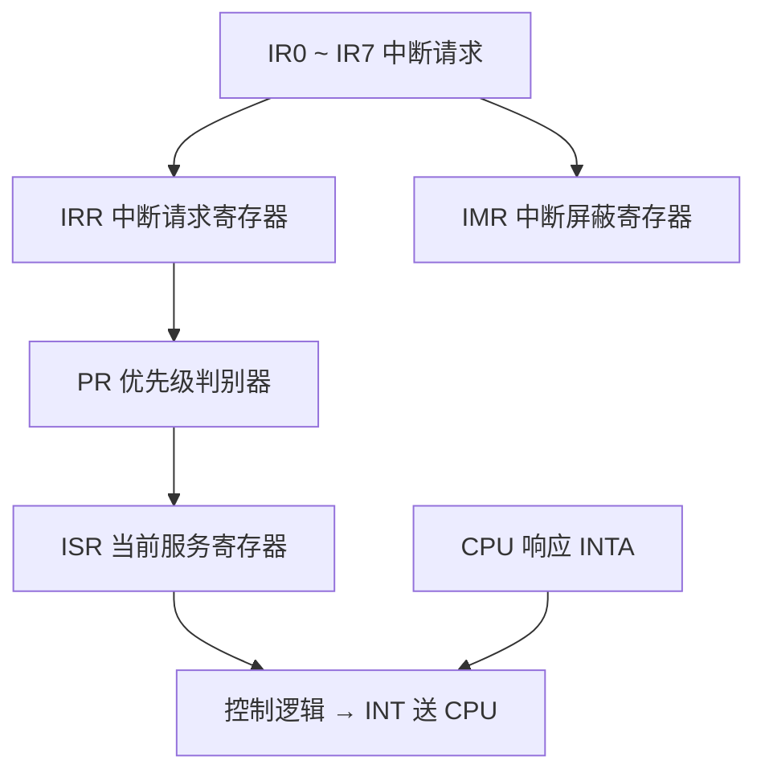

# 06-05 8259A 可编程中断控制器

理解请求、屏蔽、服务状态、级联、命令字和结束中断。

> [!info] 导航
> 上一节：[[06-04 80x86 中断系统与中断向量]] · 课程总览：[[计算机系统/微机原理与接口技术B/MOC - 微机原理与接口技术|总 MOC]] · 本章目录：[[计算机系统/微机原理与接口技术B/06 输入输出与中断/MOC - 06 输入输出与中断|第 6 章 MOC]] · 下一节：[[06-06 中断服务程序设计]]
>
> **内容主线**：[[#6.5 8259A 可编程中断控制器|8259A 可编程中断控制器]] → [[#6.5.1 8259A 芯片的内部结构与引脚|8259A 芯片的内部结构与引脚]] → [[#6.5.2 8259A 芯片的工作过程及工作方式|8259A 芯片的工作过程及工作方式]] → [[#1. 8259A 芯片的工作过程|8259A 芯片的工作过程]]

## 6.5 8259A 可编程中断控制器

中断控制器用在多中断源微机系统中管理中断，实现对各中断源的优先权和中断类型码等进行安排；对外设送来的中断请求进行判优和中断屏蔽；在中断响应周期送出中断类型码等。
早期的 PC/XT 中使用的可编程中断控制器（PIC，Programmable Interrupt Controller）一般为 Intel 8259 系列产品，这种 PIC 只能支持 8 个中断优先级，但是可以通过级联最多支持 64 个优先级。随着 PC 系统集成度的提高，从 80386 微机系统开始，中断控制器被包含在集成控制芯片中，典型的集成控制芯片是 82380。82380 芯片集成了多个不同功能的接口组件，其中 PIC 由三个增强功能的 8259A 中断控制器组成，可提供 15 个外部和 5 个内部中断请求输入，每个外部请求输入可以再级联一个 8259A 从控制器。为了与 8086/8088 兼容，其中断处理过程及编程和 8259A 基本保持一致。发展到 Pentium 系列微机系统，PIC 技术已被高级可编程中断控制器（APIC，Advanced Programmable Interrupt Controller）技术所取代。下面将以 Intel 8259A 为例展开介绍。
Intel 8259A 是一种可编程中断控制器，它是为 80x86 CPU 管理可屏蔽中断而设计的。一片 8259A 可以支持和管理 8 级优先级中断，多片级联最多可扩展至 64 级优先中断控制系统。8259A 有多种工作方式，包括中断请求触发方式、中断屏蔽功能及方式、中断优先级算法及方式、中断结束方式等，都可以通过编程来选择，以适应不同的应用场合。

### 6.5.1 8259A 芯片的内部结构与引脚



8259A 是有 28 个引脚的双列直插式芯片，内部结构与芯片引脚如图 6-27 所示。它由中断请求寄存器 IRR（Interrupt Request Register）、优先级分析器（即优先权判决电路）、中断服务寄存器 ISR（In-Service Register）、中断屏蔽寄存器 IMR（Interrupt Mask Register）、数据总线缓冲器、读/写电路、控制逻辑、级联缓冲/比较器、初始化命令与操作命令寄存器组等构成。

![[计算机系统/微机原理与接口技术B/附件/第6章/Pasted image 20260719161838.png]]
*图 6-27 8259A 芯片内部结构与芯片引脚图 (a) 内部结构 (b) 引脚图*

$\text{IR}_7 \sim \text{IR}_0$ 是 8 条中断请求线输入线，连接 8 个 I/O 设备的中断请求信号。IRR 寄存所有要求服务的中断请求，当 $\text{IR}_7 \sim \text{IR}_0$ 中有中断请求时，IRR 中相应位置 1。
优先权判决电路，它对 IRR 中的各中断请求进行分析，确定当前最高优先级的中断源，并在 CPU 响应中断请求的第一个响应周期将它选通送至 ISR 的相应位。ISR 寄存器中用 1 表征正在被服务的中断源。
IMR 存放是否屏蔽 $\text{IR}_7 \sim \text{IR}_0$ 各中断源的屏蔽码，其每一位对应一个中断级，为 1 时屏蔽该级中断，否则开放该级中断。
控制逻辑根据 CPU 对 8259A 编程设定的工作方式产生内部控制信号，并在适当时侯对 CPU 发出中断请求信号 INT 和接收来自 CPU 的中断响应信号 $\overline{INTA}$，将中断响应脉冲 $\overline{INTA}$ 转换为各种内部控制信号。
读/写电路接收 CPU 的读/写命令。可以将来自 CPU 的初始化命令字（ICW）和操作命令字（OCW）写入相应的命令寄存器组，以规定 8259A 的工作方式和控制模式；也可通过这些寄存器组内容读出，以了解 8259A 芯片的内部状态信息。与读/写电路有关的引脚功能如表 6-5 所示。

## 表 6-5 与读/写电路有关的引脚功能

| 符号 | 名称 | 功能说明 |
| :--- | :--- | :--- |
| $\overline{\text{CS}}$ | 片选线 | $\overline{\text{CS}}=0$，芯片被选中，允许 CPU 读/写。一般由高位地址译码得到 |
| $\overline{\text{WR}}$ | 写命令信号线 | $\overline{\text{WR}}=0$，允许 CPU 把命令字（ICW 和 OCW）写入相应命令寄存器 |
| $\overline{\text{RD}}$ | 读命令信号线 | $\overline{\text{RD}}=0$，允许 CPU 读取 IRR、ISR、IMR 三个寄存器的内容 |
| $A_0$ | 端口选择线 | 用于片内寄存器选择。一般可直接接至地址总线的 $A_0$ 位或其他位 |

数据总线缓冲器是 8 位双向三态缓冲器，用于连接系统数据总线和 8259A 芯片内部总线，以便编程时 CPU 对 8259A 写入控制字或读取状态字。
级联缓冲/比较器用于多片 8259A 之间的连接，使得中断源可由 8 级扩展至 64 级。多片连接时，一个为主片，其余为从片，PC/AT 系统便采用这种级联工作方式。有关引脚说明如下：
$\overline{\text{SP}} / \overline{\text{EN}}$：从片编程/缓冲器允许信号线，是双功能引脚。作为输入信号使用时，用于区别 8259A 是主（$\overline{\text{SP}}=1$）还是从（$\overline{\text{SP}}=0$）。作为输出信号使用时，用于选通 8259A 至 CPU 之间的数据总线缓冲器。在只有一片 8259A 的系统中，$\overline{\text{SP}} / \overline{\text{EN}}$ 接高电平。
$\text{CAS}_2 \sim \text{CAS}_0$：级联信号线。对于主片 8259A，它们是输出线，用于输出级联选择编码以选出请求中断的从片；对于从片 8259A，它们是输入线，接收主片送来的选择编码。

### 6.5.2 8259A 芯片的工作过程及工作方式

#### 1. 8259A 芯片的工作过程

当系统上电后，首先应由 CPU 对 8259A 芯片写入若干命令字对其进行初始化，使其处于准备就绪状态。当完成初始化后，8259A 就处于就绪状态，随时可接收外设送来的中断请求信号。当外设发出中断请求后，8259A 对外部中断请求的处理过程如下：

1. 当中断请求输入线 $\text{IR}_7 \sim \text{IR}_0$ 上有一条或若干条中断请求信号有效时，则 IRR 的相应位置 1。
2. 若中断请求线中至少有一条是中断允许的，则 8259A 由 INT 引脚向 CPU 发出中断请求信号。
3. 若 CPU 处于开中断状态，则在当前指令执行完成以后，用 $\overline{INTA}$ 信号作为响应。
4. 8259A 在接收到 CPU 发出的第一个 $\overline{INTA}$ 负脉冲后，使最高优先级的 ISR 位置 1，而相应的 IRR 位复位。在此中断响应周期中，8259A 并不向系统数据总线传送任何信息。
5. CPU 在输出第二个 $\overline{INTA}$ 脉冲后，8259A 向数据总线输送一个 8 位的中断类型码。CPU 在此周期中，读取此类型码并乘以 4，就可以从中断向量表中取出中断服务程序的入口地址。据此，CPU 便可转入中断服务程序。
6. 若 8259A 工作在自动结束中断 AEOI（Automatic End Of Interrupt）模式，在第二个 $\overline{INTA}$ 脉冲结束时，将使中断源在 ISR 中的相应位复位；否则，直到中断服务程序结束，由 CPU 向 8259A 发出 EOI 命令，才使 ISR 的相应位复位，表征对应此位的中断源全部服务完毕。

#### 2. 8259A 芯片的工作方式

8259A 芯片具有非常灵活的中断管理方式，这些方式都可以通过编程来设定。8259A 的工作方式有五种，具体见表 6-6。

##### 1. 中断嵌套方式
按照优先权设置方法来分，8259A 有普通全嵌套和特殊全嵌套两种中断嵌套工作方式。

1. 普通全嵌套方式。它是 8259A 最常用的工作方式，也称全嵌套方式。当芯片写入初始化命令字 ICW 后，如不再写入操作命令字 OCW，则自动进入并保持在这种方式。
2. 特殊全嵌套方式。特殊全嵌套方式一般用在 8259A 级联系统中。这时，主片 8259A 编程为特殊全嵌套方式，其余芯片编程为普通全嵌套方式。当来自某一个从片的中断请求正在处理时，一方面，和普通全嵌套方式一样，对来自优先级较高的主片其他引脚上的中断请求进行开放；另一方面，对来自同一从片的较高优先级请求也会开放。这样，在同一从片的 ISR 中就会有不正一位置 1 的情况。

因此，在多片级联系统中来自从片的中断服务结束时，须用软件检查刚刚结束的中断是否是从片的唯一中断，否则不能将主片 ISR 中的相应位复位。其方法是：先向从片发出一个普通结束中断命令 EOI，然后读出 ISR 内容。若为 0，表示当前只有一个中断被服务，这时可再向主片发一个 EOI 命令；否则，说明该从片有两个或以上中断源，不应发给主片 EOI 命令。待该从片中断服务全部结束后，再发送 EOI 命令给主片。

##### 2. 中断优先权循环方式
在实际应用中，中断源的优先权情况比较复杂，不一定有明显的等级，也不可能总是规定 $\text{IR}_0$ 优先权最高，$\text{IR}_7$ 优先权最低，应根据实际情况来具体处理。8259A 芯片设计了自动和特殊两种中断优先权循环方式。

1. 自动循环方式。如初始优先级队列规定为 $\text{IR}_0, \text{IR}_1, \cdots, \text{IR}_7$，此时若 $\text{IR}_4$ 有中断请求则处理 $\text{IR}_4$。$\text{IR}_4$ 得到服务后自动左循环到最低优先级，$\text{IR}_5$ 成为最高优先级，中断源的优先级队列依次变为 $\text{IR}_5, \text{IR}_6, \text{IR}_7, \text{IR}_0, \text{IR}_1, \text{IR}_2, \text{IR}_3, \text{IR}_4$。
2. 特殊循环方式。如指定 $\text{IR}_5$ 为最低优先级，则当前的优先级顺序为 $\text{IR}_6, \text{IR}_7, \text{IR}_0, \text{IR}_1, \cdots, \text{IR}_5$。

##### 3. 中断结束处理方式
不管用哪种优先权方式工作，当一个中断请求得到响应时，8259A 都会将中断服务寄存器 ISR 中相应位置 1。当中断服务程序结束时，必须使该 ISR 位清 0。否则，这个未复位的高优先权中断源会影响 8259A 的正常控制功能。
使 ISR 位复位的动作就是对 8259A 进行中断结束处理。8259A 提供自动和非自动两种中断结束处理方式，其中非自动中断结束方式又包括普通（或称为一般、正常）中断结束方式和特殊中断结束方式。
再次强调，在多片级联系统非自动结束方式下，从片在中断服务程序结束时，必须发两次 EOI 命令，一次是对从片发送的，另一次则是对主片发送的。当工作于特殊全嵌套方式时，第二个向主片发送的 EOI 命令是否输出，取决于对从片的 ISR 检测是否为 0。

## 表 6-6 8259A 芯片的五种工作方式

| 功能分类 | 工作方式 | 工作方式描述 |
| :--- | :--- | :--- |
| **中断优先权固定** | **中断嵌套方式** | |
| | 普通全嵌套方式 | 中断优先级由高到低固定为：$\text{IR}_0, \text{IR}_1, \text{IR}_2, \text{IR}_3, \text{IR}_4, \text{IR}_5, \text{IR}_6, \text{IR}_7$。CPU 响应中断时，将申请中断的优先权最高的中断源在 ISR 中的相应位置 1，并服务该中断源。与它同级或低级的中断申请将被屏蔽，可响应优先级比它高的中断源的申请。适用于单片 8259 系统 |
| | 特殊全嵌套方式 | 中断优先级由高到低固定为：$\text{IR}_0, \text{IR}_1, \text{IR}_2, \text{IR}_3, \text{IR}_4, \text{IR}_5, \text{IR}_6, \text{IR}_7$。与普通嵌套方式基本相同，唯一区别是，当处理某级中断时，对同级的 IR 请求也会给予响应。适用于 8259 级联的情况 |
| **中断优先权循环** | **优先权循环方式** | |
| | 自动循环方式 | 一个中断源得到服务后，它的优先级自动降为最低，原来比它低一级的中断源则为最高级，依次排列。适用于系统中多个中断源优先级相同的场合 |
| | 特殊循环方式 | 通过编程写 OCW2 的低 3 位来指定最低优先级。原来比它低一级的中断源则为最高级，依次排列。适用于中断优先级需要任意改变的场合 |
| **中断结束处理** | **中断结束处理方式** | |
| | 自动中断结束方式（AEOI） | 在 CPU 第二个中断响应周期 $\overline{INTA}$ 信号的后沿，8259A 自动将 ISR 中相应位复位。适用于不要中断嵌套的场合 |
| | 普通中断结束方式（EOI） | 当 8259A 工作在该方式下，当前服务过的中断源就是中断优先权最髙的源，用普通的 EOI 命令使它在 ISR 中的相应位复位。这个命令应加在中断服务程序的末尾处，适用于普通全嵌套工作方式 |
| | 特殊中断结束方式（SEOI） | 当 8259A 工作在非普通全嵌套工作方式时，由于中断优先级不断改变，8259A 无法确定断源哪级中断，就需由 CPU 输出 SEOI 命令，指出要清除哪个 ISR 位 |
| **屏蔽中断源** | **屏蔽中断源方式** | |
| | 普通屏蔽方式 | 编程写 OCW1 将 IMR 某位置 1，则屏蔽对应的中断源，该位清 0，则允许该级中断 |
| | 特殊屏蔽方式 | 用于开放较低级中断请求 |
| **中断触发** | **中断触发方式** | |
| | 电平触发方式 | 8259A 的引脚 $\text{IR}_i$（$i=0 \sim 7$）上出现高电平，表示有中断请求。此方式下，应注意响应后及时去掉高电平，否则可能引起不应该有的第二次中断 |
| | 边沿触发方式 | 8259A 的引脚 $\text{IR}_i$（$i=0 \sim 7$）上出现上升沿跳变，表示有中断请求 |

### 4. 屏蔽中断源方式
8259A 的 8 个中断请求都可根据需要单独屏蔽，屏蔽就是通过编程使屏蔽寄存器 IMR 中相应位清 0 或置 1，以允许或禁止相应的中断请求。8259A 有普通和特殊两种屏蔽方式。
有时希望在执行一个较高级的中断服务过程中，开放对较低级中断源的服务。为此，自然会想到使 IMR 的相应位置 1，使本级中断受到屏蔽，为开放较低级中断请求提供可能。但是，在 8259A 这样做有一个问题。因为每当一个中断请求得到响应时，就会使 ISR 相应位置 1，只要没有收到 EOI 命令，8259A 就会据此而禁止所有优先级比它低的中断。所以，尽管当前处理的较高级中断请求被屏蔽，但由于 ISR 位未被复位，较低级的中断请求在发出 EOI 命令之前仍不会得到响应。
8259A 的特殊屏蔽方式可以解决这个问题。首先屏蔽当前中断级（IMR 对应位为 1），然后设置 8259A 为特殊屏蔽方式，则使 ISR 相应的功能中止，直到为较低级中断服务完后，再清除特殊屏蔽方式为止。通过设置特殊屏蔽方式，可动态改变中断系统的优先级结构。

5. 中断触发方式。8259A 的中断触发方式有电平触发和边沿触发两种方式。无论是电平触发还是边沿触发，中断请求信号 $\text{IR}_n$ 都应维持足够的宽度。即在第一个中断响应信号 $\overline{INTA}$ 结束之前，$\text{IR}_n$ 都必须保持高电平。如果 $\text{IR}_n$ 信号提前变为低电平，8259A 就会默认为这个中断请求来自引脚 $\text{IR}_7$，这种办法能够有效地防止由 $\text{IR}_n$ 输入端严重的噪声尖峰而产生的中断。因此，对应 $\text{IR}_7$ 的中断服务程序可只执行一条返回指令，从而滤除这种中断。如果 $\text{IR}_7$ 另有他用，仍可通过读 ISR 状态来识别非正常的 $\text{IR}_7$ 中断，正常的 $\text{IR}_7$ 中断会使相应的 ISR 的 $D_7$ 位置 1。

### 6.5.3 8259A 命令字

8259A 是可编程中断控制器，对其应用编程包括初始化编程和操作方式编程两部分。

1. 初始化编程。由 CPU 向 8259A 发送 2～4 字节的初始化命令字 ICW（Initialization Command Word）。在 8259A 工作之前，必须写入初始化命令字使其处于准备就绪状态，写入后一般不再改变。
2. 操作方式编程。由 CPU 向 8259A 送 3 字节的操作命令字 OCW（Operation Command Word），以规定 8259A 的操作方式。OCW 可在 8259A 已经初始化以后的任何时间内写入。

下面分别介绍 8259A 的初始化命令字及操作命令字的格式与功能。

#### 1. 8259A 的初始化命令字 ICW

初始化命令字 ICW 最多有 4 个，必须在 8259A 开始工作之前写入。
写入 ICW1 的端口地址规定为 $A_0=0$（偶地址）。
写入 ICW2、ICW3 和 ICW4 的端口地址均为 $A_0=1$（奇地址），由于片内采用了 FIFO 缓冲器技术，编程时需严格按照图 6-28 所示的初始化流程顺序写入。

![[计算机系统/微机原理与接口技术B/附件/第6章/Pasted image 20260719161850.png]]
*图 6-28 初始化流程*

##### 1. ICW1（初始化字）
8259A 最初写入的必须是 ICW1。当引脚 $A_0=0$ 和 ICW1 内的 $D_4=1$ 时，表示写入的是 ICW1 命令字。ICW1 写入后，除完成 ICW1 格式规定的功能，8259A 内部状态有如下初始化过程：

1. 对中断请求信号边沿检测电路复位，准备按 ICW2、ICW3、ICW4 顺序接收其余的 ICW。
2. 清除 ISR 和 IMR。
3. 指定优先级由高到低为：$\text{IR}_0, \text{IR}_1, \cdots, \text{IR}_7$。
4. 特殊屏蔽方式复位，即设定为普通屏蔽方式。
5. 自动中断结束方式复位，即采用非自动中断结束方式。
6. 状态读出电路预置为 IRR。

ICW1 的格式如图 6-29 所示。

![[计算机系统/微机原理与接口技术B/附件/第6章/Pasted image 20260719161858.png]]
*图 6-29 ICW1 的格式*

$D_0$（IC4）：表示初始化过程要不要写 ICW4，在 80x86 系统中 $D_0=1$。
$D_1$（S）：指明系统中是使用单片还是多片 8259A，如果是多片级联需要写入 ICW3。
$D_3$（LTIM）：说明中断请求信号起作用的触发方式。
$D_2$ 和 $D_7 \sim D_5$：只在 8080/8085 CPU 模式下使用，指明 8 个中断向量地址之间的间距和中断向量地址。8086/8088 模式下不用，通常将它们置为 0。

##### 2. ICW2（中断类型码字）
ICW2 是中断类型码设置寄存器，写入时应 $A_0=1$，ICW2 的格式如图 6-30 所示。

![[计算机系统/微机原理与接口技术B/附件/第6章/Pasted image 20260719161904.png]]
*图 6-30 ICW2 的格式*

工作在 8080/8085 系统中时，8 位全部有用。在与 8086/8088 CPU 连接使用时，用 $T_7 \sim T_3$ 作为中断类型码的高 5 位，低 3 位由 8259A 自动按 $\text{IR}_n$ 输入端确定，如表 6-7 所示。
如在 PC/XT 和 AT 中，$T_7 \sim T_3=00001$，$T_2 \sim T_0=000$，ICW2=08H，表明 $\text{IR}_0 \sim \text{IR}_7$ 的中断类型码分别为 08H～0FH。在 8259A 收到第二个 $\overline{INTA}$ 时，将中断类型码送到数据总线上。

##### 3. ICW3（级联控制字）
ICW3 定义了 8259A 的级联。若系统中只有一片 8259A，则不用 ICW3；若有多片 8259A 级联，则主 8259A 和每一片从 8259A 都必须使用 ICW3。主、从片 8259A 的 ICW3 是不同的，写入 ICW3 时应 $A_0=1$，ICW3 的格式如图 6-31 所示。

![[计算机系统/微机原理与接口技术B/附件/第6章/Pasted image 20260719161913.png]]
*图 6-31 ICW3 的格式 (a) 主片命令字 (b) 从片命令字*

在主片 ICW3 中的 $D_7 \sim D_0$ 位表示相应的 $\text{IR}_7 \sim \text{IR}_0$ 中断请求线上有无从片，某位 $D_i=1$ 表示对应的 $\text{IR}_i$ 线上有从片。从片的 ICW3 用 $D_2 \sim D_0$（$\text{ID}_2 \sim \text{ID}_0$）位来表示从片的识别码，它对应于主片 $\text{IR}_7 \sim \text{IR}_0$ 级联的从片编码。$D_7 \sim D_3$ 没有定义，一般取 0。

##### 4. ICW4（中断结束方式字）
ICW4 定义 8259A 工作时所用的 CPU 类型，以及中断服务程序是否送出 EOI 命令以清除 ISR 中的相应位。写入 ICW4 时应 $A_0=1$，ICW4 格式如图 6-32 所示。

![[计算机系统/微机原理与接口技术B/附件/第6章/Pasted image 20260719161922.png]]
*图 6-32 ICW4 的格式*

$D_0$（PM）：定义选用的处理器类型。
$D_1$（AEOI）：表示是否有自动结束中断、使 ISR 复位的功能。若是 0，表示没有，需要在中断服务程序的末尾送出 EOI 命令使 ISR 相应位复位；若是 1，表示 8259A 能自动使 ISR 复位。
$D_2$（M/S）：表示本片 8259A 是主片（M/S=1）还是从片（M/S=0）。
$D_3$（BUF）：表示本片 8259A 和系统数据总线间是否有缓冲器，1 表示有。因此必须产生控制信号，以便中断时能打开缓冲器。
$D_4$（SFNM）：表示 8259A 是否为多片级联系统中的主片，1 表示是，其优先级顺序采用特殊全嵌套方式；0 表示否，其优先级顺序采用普通全嵌套方式。
$D_7 \sim D_5$：未用，一般取 0。
在写完初始化命令字 ICW 后，8259A 的中断输入端就可以接收中断请求信号了。若不再写入任何操作命令字 OCW，8259A 便处于全嵌套中断工作方式。这时，中断源的优先级固定为 $\text{IR}_0$ 最高，$\text{IR}_7$ 最低。当 CPU 为高级中断服务时，将 ISR 对应的位置 1，这时，8259A 不再响应所有同级或低级的中断请求，直到处理完高级中断，再执行一条 EOI 命令为止。如果 CPU 正在为低级中断源服务，则此时 ISR 相应位置 1，当有较高级别中断请求时，如果 CPU 处于开中断状态（IF=1），便允许响应此高级中断，产生中断嵌套。此时 8259A 将对应此高级中断的 ISR 相应位置 1，原来较低级中断的 ISR 相应位并不复位，只是将该低级中断暂时挂起，转向为高级中断服务。当为高级中断服务完毕，程序中发一条 EOI 命令和中断返回命令 IRET 时，高级中断源对应的 ISR 相应位才复位，程序返回到低级中断服务程序的断点处。如果没有更高级的中断申请时，则被挂起的低级中断又从断点处开始执行。
若需改变上述 8259A 的中断控制方式，或为了屏蔽某些中断，以及读出 8259A 的一些状态信息，如 IRR、ISR、IMR 的内容，则必须写入操作命令字 OCW。

#### 2. 8259A 的操作命令字 OCW

8259A 的操作命令字有 3 个：OCW1～OCW3。在编程写入操作命令字时，顺序上没有严格的要求，需要什么字就写入什么字。但是，严格规定 OCW1 写入奇地址端口（$A_0=1$）；OCW2 和 OCW3 都写入偶地址端口（$A_0=0$），由字中的特征位 $D_4D_3$ 来区别它们是不同的命令字。

##### 1. OCW1（屏蔽控制字）
设置或清除对中断源的屏蔽，亦称中断屏蔽命令字。当写入 OCW1 使 IMR 的某位为 1 时，则相应位的中断源被屏蔽；若为 0，则中断被允许。如 OCW1=80H，则表示 $\text{IR}_7$ 中断源被屏蔽，即使 $\text{IR}_7$ 引脚有中断请求，但由于中断屏蔽寄存器 IMR 的 $D_7$ 被置 1，故 8259A 并不发出 INT 信号。
OCW1 的格式如图 6-33 所示。利用 OCW1，可以在程序的任何地方实现对某些中断的屏蔽或开放。

![[计算机系统/微机原理与接口技术B/附件/第6章/Pasted image 20260719161930.png]]
*图 6-33 OCW1 的格式*

##### 2. OCW2（中断结束和优先级循环控制字）
写入 OCW2 主要是对 8259A 发出中断结束命令，包括普通结束 EOI 和特殊结束 SEOI，并控制中断优先权的循环等。OCW2 的特征位 $D_4D_3=00$，其格式如图 6-34 所示。

![[计算机系统/微机原理与接口技术B/附件/第6章/Pasted image 20260719161936.png]]
*图 6-34 OCW2 的格式*

EOI：中断结束命令，该位为 1 时，使 ISR 中当前最高优先级的相应位复位，以便允许系统再为其他级别中断源服务。如果 ICW4 的 AEOI=0，则必须在中断服务程序的返回指令 IRET 前，写一条 OCW2 命令字，以给出 EOI 标志。8259A 得到 EOI 命令后，便自动将为此中断服务的 ISR 中的相应位复位。
R：中断优先权是否循环的标志。R=0 时，8 个中断请求的优先级固定不变，如 $\text{IR}_7$ 最低，$\text{IR}_0$ 最高。R=1 时，优先级可以循环。优先级循环是指中断源优先级采用左循环轮转方式，当一个优先级别中断服务完毕后，如 $\text{IR}_4$，它就左循环到最低的优先级，而和它相邻的 $\text{IR}_5$ 变为最高优先级，$\text{IR}_6$ 变成次高级，其他以此类推。
$\text{L}_2\text{L}_1\text{L}_0$：这三位的第一个作用是设定系统中最优优先级的编码，可用来改变 8259A 复位时所设置的 $\text{IR}_7$ 最低、$\text{IR}_0$ 最高的优先级规定。第二个作用是在 OCW2 给出特殊中断结束命令 SEOI 时，指明具体要特殊结束哪个中断级，使 ISR 中的相应位复位。
SL：是选择 $\text{L}_2\text{L}_1\text{L}_0$ 编码是否有效的标志。SL=1，则 $\text{L}_2\text{L}_1\text{L}_0$ 选择有效。此时若 R=1，则优先权左循环至最低优先级对准 $\text{L}_2\text{L}_1\text{L}_0$ 编码 $i(0 \leqslant i \leqslant 7)$ 表示的 $\text{IR}_i$ 这一特殊值为止。SL=0，$\text{L}_2\text{L}_1\text{L}_0$ 选择无效。此时若 R=1，当前服务的中断请求自动循环到最低优先级。
OCW2 中 R、SL、EOI 的不同组合表征了 8259A 的不同工作方式，凡 $\text{L}_2\text{L}_1\text{L}_0$ 选择有效都称为“特殊”，可对照图 6-35 进一步深入理解。

![[计算机系统/微机原理与接口技术B/附件/第6章/Pasted image 20260719161944.png]]
*图 6-35 OCW2 的格式*

##### 3. OCW3（屏蔽和读状态控制字）
OCW3 可设置特殊屏蔽方式、查询方式，以及读取 IRR、ISR、IMR 的当前状态。OCW3 的特征位 $D_4D_3=01$，格式如图 6-36 所示。

![[计算机系统/微机原理与接口技术B/附件/第6章/Pasted image 20260719161949.png]]
*图 6-36 OCW3 的格式*

1. 设置特殊屏蔽方式。$D_6D_5$（ESMM 和 SMM）两位用于设置特殊屏蔽方式。如果在执行高级中断服务程序时需要开放低级中断，可先通过 OCW1 将正在被服务的高级中断屏蔽，再用 $D_6D_5=11$ 的 OCW3 命令设置 8259A，则可使 ISR 相应的功能中止，直到清除特殊屏蔽方式（$D_6D_5=10$）为止。
2. 查询中断请求。在 CPU 内部禁止中断时，或者在不想用 INT 引脚向 CPU 申请中断时，可以使用 8259A 的查询工作方式。

写入 P=1 的 OCW3 就发出查询命令。8259A 得到查询命令后，立即组成查询字，等待 CPU 来读取。所以，当 CPU 再对同一地址（$A_0=0$）执行一条输入指令时，便可读到如下查询字：
$$
I \times \times \times \times W_2 W_1 W_0
$$
若 I=1，则表示本片 8259A 的 $\text{IR}_0 \sim \text{IR}_7$ 中有中断请求，对应当前优先级最高的外部中断请求的编码由 $W_2W_1W_0$ 给出。若 I=0，则表示无中断请求。

3. 读取 8259A 的状态。为了了解 8259A 的工作状态，CPU 可读出 IRR、ISR、IMR 三个寄存器的内容，但读的方法有所不同。

读 IRR、ISR。先写入读命令字 OCW3 到偶地址（$A_0=0$）端口，再用 IN 指令从偶地址（$A_0=0$）端口读出 IRR/ISR。读命令字 OCW3 的格式为 $0 \ 0 \ 0 \ 0 \ 1 \ 0 \ R_1 \ R_0$。
读 IMR。不需写入 OCW3 命令，只要直接对奇地址（$A_0=1$）端口进行读操作即可。
综上所述，写入 8259A 的命令字共有 7 个，从 8259A 读出的状态字有 4 个，它们是由读 RD 和写 WR 信号、地址信号 $A_0$ 以及命令字中的某些特定位所区分的，如表 6-8 所示。

## 表 6-8 8259A 的命令字/状态字读/写条件

| $A_0$ | $\overline{\text{RD}}$ | $\overline{\text{WR}}$ | $\overline{\text{CS}}$ | XT 机地址 | AT 机扩展从片地址 | 功能 |
| :--- | :--- | :--- | :--- | :--- | :--- | :--- |
| 0 | 1 | 0 | 0 | 20H | 0A0H | 写入 ICW1、OCW2、OCW3（注①） |
| 1 | 1 | 0 | 0 | 21H | 0A1H | 写入 ICW2、ICW3、ICW4、OCW1（注②） |
| 0 | 0 | 1 | 0 | 20H | 0A0H | 读出 IRR、ISR 和查询字（注③） |
| 1 | 0 | 1 | 0 | 21H | 0A1H | 读出 IMR |
| $\times$ | 1 | 1 | 0 | | | 数据总线高阻状态 |
| $\times$ | $\times$ | $\times$ | 1 | | | 数据总线高阻状态 |

注：① 由控制字中的 $D_4D_3$ 标志位决定写入的是 OCW2 还是 OCW3。② 写入 ICW1 后，由片内的顺序逻辑确定后续 ICW，否则写入 OCW1。③ 由 OCW3 的内容决定读出哪个状态字。

### 6.5.4 8259A 芯片应用举例

#### 1. 8259A 在 PC/XT 机中的应用

在 IBM PC/XT 机中，只使用一片 8259A 管理可屏蔽中断，如图 6-37 所示。

![[计算机系统/微机原理与接口技术B/附件/第6章/Pasted image 20260719162001.png]]
*图 6-37 PC/XT 8259A 硬件连接*

$\text{IRQ}_0$ 接至系统板上定时/计数器 Intel 8253 通道 0 的输出信号 $\text{OUT}_0$，用作微机系统的日时钟中断请求；$\text{IRQ}_1$ 是键盘输入接口电路送来的中断请求信号，用来请求 CPU 读取键盘扫描码；$\text{IRQ}_2$ 是系统保留的；另外 5 个请求信号 $\text{IRQ}_3 \sim \text{IRQ}_7$ 来自 I/O 通道扩展板电路，分别是串行通信接口 2、串行通信接口 1、硬盘与软盘适配器、并行打印机的中断请求信号。
在 PC/XT 的 I/O 地址空间中，分配给 8259A 的 I/O 端口地址范围为 20 H～3FH，通常偶、奇端口地址取 20H、21H。PC/XT 对 8259A 的初始化设置为：边沿触发中断、缓冲器方式、普通 EOI 命令结束中断、中断优先权管理采用全嵌套方式，8 级中断源的类型码为 08H～0FH。各级中断源规定如表 6-9 所示。

### 表 6-9 IBM PC/XT 中 8259A 的 8 级中断分配表

| 中断向量地址指针 | 引脚 | 中断类型码 | 中断源 | 中断向量地址指针 | 引脚 | 中断类型码 | 中断源 |
| :--- | :--- | :--- | :--- | :--- | :--- | :--- | :--- |
| 0020H | $\text{IRQ}_0$ | 08H | 定时器 | 0030H | $\text{IRQ}_4$ | 0CH | 串行口 1 |
| 0024H | $\text{IRQ}_1$ | 09H | 键盘 | 0034H | $\text{IRQ}_5$ | 0DH | 硬盘 |
| 0028H | $\text{IRQ}_2$ | 0AH | 用户保留 | 0038H | $\text{IRQ}_6$ | 0EH | 软盘 |
| 002CH | $\text{IRQ}_3$ | 0BH | 串行口 2 | 003CH | $\text{IRQ}_7$ | 0FH | 并行打印机 |

#### 1. 8259A 初始化编程
根据系统要求，对 8259A 进行如下初始化编程。完成后，8259A 为全嵌套工作方式，可以响应外部中断请求。
```assembly
MOV    AL, 00010011B       ; 设置 ICW1 为边沿触发，单片 8259A，需要 ICW4
OUT    20H, AL
MOV    AL, 00001000B       ; 设置 ICW2 中断类型码基数为 08H，则可响应的 8 个中断类型码为 08H～0FH
OUT    21H, AL
MOV    AL, 00001101B       ; 设置 ICW4 为 8086/8088 模式，普通 EOI，缓冲方式，全嵌套方式
OUT    21H, AL
```
#### 2. 8259A 操作方式编程
在用户程序中，可以用 OCW1 来设置中断屏蔽寄存器 IMR，以允许或屏蔽各外设的中断申请，但注意不要破坏系统原设定工作方式。如允许日时钟 $\text{IRQ}_0$ 和键盘 $\text{IRQ}_1$ 中断，其他中断状态不变，则可送入以下指令：
```assembly
IN     AL, 21H             ; 读出 IMR
AND    AL, 0FCH            ; 只允许 $\text{IRQ}_0$ 和 $\text{IRQ}_1$，其他不变
OUT    21H, AL             ; 写入 OCW1，即设定 IMR
```
由于中断结束采用非自动结束方式，因此在中断服务程序结束返回断点前，必须对 OCW2 写入 00100000B（20H），发出中断结束命令。
```assembly
MOV    AL, 20H             ; 设置 OCW2 的值为 20H
OUT    20H, AL             ; 写入 OCW2 的端口地址 20H
...                         ; 恢复现场
IRET                        ; 中断返回
```
在程序中，通过设置 OCW3 可读出 IRR、ISR 的状态。如要读出 IRR 内容以查看申请中断的中断源：
```assembly
MOV    AL, 0AH             ; 先写入 OCW3，读 IRR 命令
OUT    20H, AL
NOP                         ; 延时，等待 8259A 操作结束
IN     AL, 20H             ; 读出 IRR
```
IMR 的内容可以随时方便地从 $A_0=1$ 端口读出。如在 BIOS 中，对 IMR 的检查程序如下：
```assembly
MOV    AL, 0               ; 设置 OCW1 为 0，送 OCW1 端口地址，表示 IMR 为全 0
OUT    21H, AL
IN     AL, 21H             ; 读 IMR 状态
OR     AL, AL
JNZ    ERR                 ; 若不为 0，则转出错程序 ERR
MOV    AL, 0FFH            ; 设置 OCW1 为 FFH，送 OCW1 端口地址，表示 IMR 为全 1
OUT    21H, AL
IN     AL, 21H             ; 读 IMR 状态
ADD    AL, 1               ; IMR=0FFH?
JNZ    ERR                 ; 若不是 0FFH，则转出错程序 ERR
ERR:  ...
```

#### 2. 8259A 在 PC/AT 机中的应用

在 PC/AT 机中，由两片 8259A 以主、从级联方式管理 15 级中断，如图 6-38 所示。级联时，主、从片的 $\text{CAS}_2 \sim \text{CAS}_0$ 互连，从片的 INT 端输出连至主片的 $\text{IRQ}_2$ 输入。主片的端口地址为 20H、21H，中断类型码为 08H～0FH；从片的端口地址为 A0H、A1H，中断类型码为 70H～77H。其中，$\text{IRQ}_0$ 仍用于日时钟中断（08H），$\text{IRQ}_1$ 仍用于键盘中断（09H）。扩展的 $\text{IRQ}_8$ 用于实时时钟中断，$\text{IRQ}_{13}$ 来自协处理器 80287。除此之外，所有其他中断请求信号都来自 I/O 通道的扩展板。

![[计算机系统/微机原理与接口技术B/附件/第6章/Pasted image 20260719162010.png]]
*图 6-38 PC/AT 8259A 硬件连接*

##### 1. 主从 8259A 初始化编程
对主片 8259A 的初始化：
```assembly
MOV    AL, 11H             ; 写入 ICW1，设定边沿触发、级联方式
OUT    20H, AL
NOP                         ; 延时，等待 8259A 操作结束，下同
MOV    AL, 08H             ; 写入 ICW2，设定 $\text{IRQ}_0$ 的中断类型码为 08H
OUT    21H, AL
NOP
MOV    AL, 04H             ; 写入 ICW3，设定主片 $\text{IRQ}_2$ 级联从片
OUT    21H, AL
NOP
MOV    AL, 11H             ; 写入 ICW4，设定特殊全嵌套方式，普通 EOI 方式
OUT    21H, AL
```

对从片 8259A 的初始化：
```assembly
MOV    AL, 11H             ; 写入 ICW1，设定边沿触发、级联方式
OUT    0A0H, AL
NOP
MOV    AL, 70H             ; 写入 ICW2，设定从片 $\text{IR}_0$，即 $\text{IRQ}_8$ 的中断类型码为 70H
OUT    0A1H, AL
NOP
MOV    AL, 02H             ; 写入 ICW3，设定从片级联于主片的 $\text{IRQ}_2$
OUT    0A1H, AL
NOP
MOV    AL, 01H             ; 写入 ICW4，设定普通全嵌套方式，普通 EOI 方式
OUT    0A1H, AL
```

##### 2. 级联工作编程
级联时，主片工作在特殊全嵌套方式。当来自某个从片的中断请求进入服务时，主片的优先权控制逻辑不封锁这个从片，从而使来自该从片的更高优先级的中断请求能被主片所识别，并向 CPU 发出中断请求。因此中断服务程序结束时必须用软件来检查被服务的中断是否是该从片中唯一的中断请求，其流程如下：
先向从片发出一个 EOI 命令，清除已完成服务的 ISR 位。再读出 ISR 的内容检查它是否为 0。如果 ISR 的内容为 0，则向主片发一个 EOI 命令清除与从片相对应的 ISR 位；否则，不向主片发 EOI 命令，继续进行从片的中断处理，直到 ISR 的内容为 0，再向主片发出 EOI 命令。

读 ISR 的内容：
```assembly
MOV    AL, 0BH             ; 写入 OCW3，读 ISR 命令
OUT    0A0H, AL
NOP                         ; 延时，等待 8259A 操作结束
IN     AL, 0A0H            ; 读出 ISR
```
向从片发 EOI 命令：
```assembly
MOV    AL, 20H             ; 写从片 EOI 命令
OUT    0A0H, AL
```
向主片发 EOI 命令：
```assembly
MOV    AL, 20H             ; 写主片 EOI 命令
OUT    20H, AL
```

