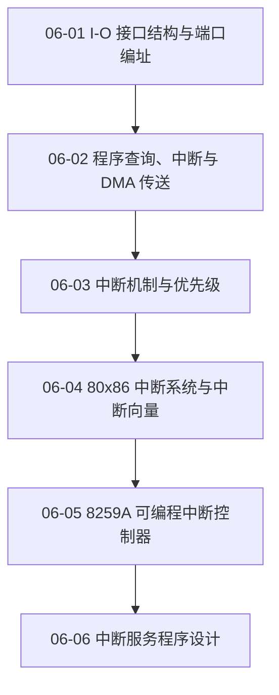

# 06 输入输出与中断

解释 I/O 端口、数据传送方式、中断机制、8259A 与中断服务程序的协作。

> [!question] 本章核心问题
> - 端口编址如何让软件定位接口寄存器？
> - 查询、中断与 DMA 如何分配搬运责任？
> - 中断请求、排优、向量、服务和结束如何构成闭环？

> [!info] 章节导航
> 上一章：[[计算机系统/微机原理与接口技术B/05 半导体存储器/MOC - 05 半导体存储器|05 半导体存储器]] · 课程总览：[[计算机系统/微机原理与接口技术B/MOC - 微机原理与接口技术|微机原理与接口技术]] · 下一章：[[计算机系统/微机原理与接口技术B/07 微型机接口技术/MOC - 07 微型机接口技术|07 微型机接口技术]]

## 知识路径



图中的箭头表示本章建议的概念展开顺序，不代表所有主题之间只有单一依赖关系。

## 本章知识点

- [[06-01 I-O 接口结构与端口编址]] — 说明接口寄存器、端口独立编址、统一编址和简单接口。
- [[06-02 程序查询、中断与 DMA 传送]] — 比较三种 I/O 传送方式的责任分配和适用条件。
- [[06-03 中断机制与优先级]] — 梳理中断源、响应过程、软件排优和硬件排优。
- [[06-04 80x86 中断系统与中断向量]] — 区分内部异常、外部中断、实模式向量和保护模式机制。
- [[06-05 8259A 可编程中断控制器]] — 理解请求、屏蔽、服务状态、级联、命令字和结束中断。
- [[06-06 中断服务程序设计]] — 说明向量安装、控制器初始化、现场保护和中断返回。

## 动态状态

```dataview
TABLE sequence AS "顺序", status AS "状态", length(file.inlinks) AS "入链"
FROM "计算机系统/微机原理与接口技术B/06 输入输出与中断"
WHERE type = "课程笔记"
SORT sequence ASC
```

