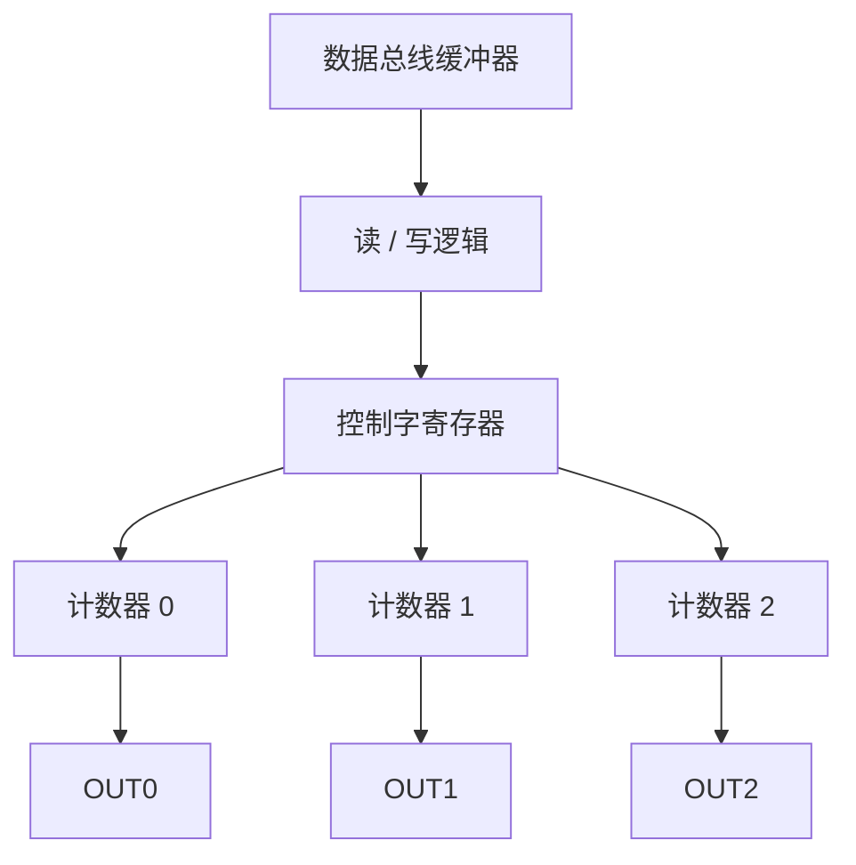

# 07-01 接口技术与 8253-8254 定时计数器

从时钟、门控、计数初值和输出模式理解定时计数。

> [!info] 导航
> 上一节：[[06-06 中断服务程序设计]] · 课程总览：[[计算机系统/微机原理与接口技术B/MOC - 微机原理与接口技术|总 MOC]] · 本章目录：[[计算机系统/微机原理与接口技术B/07 微型机接口技术/MOC - 07 微型机接口技术|第 7 章 MOC]] · 下一节：[[07-02 8255A 并行接口与键盘显示]]
>
> **内容主线**：[[#7.1 接口技术概述|接口技术概述]] → [[#7.2 可编程定时/计数器|可编程定时/计数器]] → [[#1. 软件定时|软件定时]] → [[#2. 不可编程的硬件定时器|不可编程的硬件定时器]]

## 7.1 接口技术概述

输入/输出设备作为计算机系统的重要组成部分，能够实现计算机与外部世界的信息交换和操作控制。这种信息交换和操作控制必须利用输入/输出设备，后者通过 I/O 接口（Interface）电路与系统相连来实现。输入/输出接口是 CPU 连接外部设备的必经通道，因此常常形象地被称为 I/O 端口（Port）。第 6 章介绍了输入/输出的基本原理、简单数字量接口和典型的输入/输出方法、中断输入及可编程中断控制器 8259。随着大规模、超大规模集成电路技术的发展，各种专用或通用接口芯片应运而生，大大降低了接口电路和信息处理的复杂程度，为微机应用的普及和发展提供了硬件基础，因此有必要系统地学习和掌握典型的接口技术。

除了地址译码和 I/O 设备选择、数据的缓冲及锁存、信息的输入与输出基本功能，典型的计算机接口技术需要解决信息的高速、高效处理与转换。

在功能设计上，当 CPU 与 I/O 设备进行数据传送时，由于 I/O 设备种类很多，可能出现 CPU 与 I/O 设备的信息类型（数字量、模拟量等）、电平（TTL 电平、RS-232C 电平等）及码制（二进制、十进制等）和信息格式（并行、串行等）不一致的情况，此时接口必须对信息进行一定的转换以满足相应的要求。

事实上，输入/输出接口除了提供一般的逻辑信号转换，更需要解决复杂的模拟信号、多个数字系统之间各种通信编码信息的协调传送问题，尤其是要求可靠地传送连续数据信息以及长线数字信号时更复杂。图 7-1 是典型的复杂 I/O 接口原理图，其基本功能是在系统总线和 I/O 设备之间进行信号转换，满足两个时序系统之间的时间约束并提供缓冲功能。

![[计算机系统/微机原理与接口技术B/附件/第7章/Pasted image 20260719162059.png]]
*图 7-1 典型的复杂 I/O 接口原理*

有时接口在设计上需要为数据传送过程中的各种工作状态提供信息，如异常或出错等，以便 CPU 进行相应处理，或支持中断、DMA 传输方式，与外部设备进行数据交换时，常常需要配置相应的握手联络（Handshaking）线来控制数据的同步交换过程。为了发挥软件的优势，面向微机应用的接口电路往往可以通过程序指令修改芯片和 I/O 引脚的工作方式，这就是所谓的可编程特性。

本章主要讨论可编程的数字量定时/计数器、并行和串行数据交换、直接存储器访问（DMA）以及实现模/数和数/模转换的模拟量典型接口电路和接口芯片的原理和应用。

## 7.2 可编程定时/计数器

定时/计数技术在计算机应用中具有重要作用，可实现一类时间/事件信息的输入/输出。例如在微机测控系统中，常用计数器对外部事件计数或计时，即记录来自外设的或标准的脉冲个数；需要按一定的采样周期对处理对象进行采样或检测处理，实现定时中断、检测、扫描等定时处理功能。例如，IBM PC 系列微机用一个实时时钟实现基本计时功能，还要按一定时间间隔对动态存储器进行刷新和用可变定时信号来驱动扬声器的发声等。在实时多任务操作系统中，可以利用定时器产生定时中断服务，实现进程、线程或任务调度。

实现定时或延时控制有 3 种基本方法：软件定时、不可编程硬件定时、可编程硬件定时。

### 1. 软件定时
利用 CPU 执行一段专门的延时程序。由于执行每条指令都需要确定的时间（指令周期），执行一个程序段可开销特定的时间，软件定时通过改变执行的指令和循环次数来控制定时时间。这种软件定时方式，简单易用，但计时不够准确，尤其是 CPU 内部有多个单元并行处理时更加复杂，难以计算。另外，软件计时独占了 CPU，降低了 CPU 的利用率。

### 2. 不可编程的硬件定时器
不可编程的硬件定时器分为模拟电路和数字电路两类。

1. 不可编程的模拟电路硬件定时器。可由中小规模器件（如 NE555）外接电阻和电容等模拟定时元器件构成。这种方式电路结构简单，通过改变电阻和电容可使定时在一定范围内改变，由于模拟器件参数粗略，易随温度变化，定时精度一般。
2. 数字电路硬件定时器。利用数字脉冲计数器，如 74LS90 十进制计数器（异步二进制加 5 进位）、92（异步二进制加六进位/十二进制）、93（加八/十六进制）、CD4040（12 级分频）等分频计数定时，这种定时电路在硬件连接好以后，定时值不易用软件来控制和改变。

### 3. 可编程的定时器电路
所谓可编程定时器电路，就是其工作方式、定时值、定时范围和过程可以方便地由软件来确定和改变。一个可编程定时/计数器的典型用途可包括：

1. 以均匀分布的时间间隔请求中断，构成分时操作系统，以便切换任务程序（输出脉冲事件）。
2. 向 I/O 设备输出精确的定时信号，该信号的周期可由程序改变。
3. 用作可编程波特率或速率发生器（可变速串行），产生均匀脉冲信号。
4. 检测外部事件发生的频率或周期。
5. 统计外部变化过程中某一事件发生的次数。
6. 在定时或计数达到编程规定的值以后，产生输出信号，包括向 CPU 申请中断服务。

### 7.2.1 可编程定时/计数器 8253

8253 可编程定时/计数器是专为 Intel CPU 系统设计的接口芯片，内有三个独立的 16 位计数器（通道），工作方式可编程控制，计数脉冲频率 $0 \sim 2.6\text{ MHz}$（8253-5 最大计数频率 $5\text{ MHz}$），可以按二进制或 BCD 码减法计数，使用单一的 $+5\text{V}$ 电源。

#### 1. 8253 芯片的内部结构和功能



8253 芯片的引脚及内部结构如图 7-2 所示，主要由数据总线缓冲器、读/写逻辑、控制寄存器和三个独立的计数器 0、1、2 组成。

1. 数据总线缓冲器。8 位三态、双向缓冲器，用于将 8253 芯片与系统数据总线连接，CPU 写入 8253 控制字、装入计数初值或读出当前计数值。
2. 读/写逻辑。接收来自系统总线的信息，产生控制信号。片选 $\overline{CS}$ 信号可允许或禁止读/写逻辑工作。
3. 控制寄存器。控制每个计数器的工作方式，包括计数方式选择及每个计数器装入初值方式。8253 控制寄存器只能写入，不能读出。
4. 三个独立计数器 0、1、2 的结构相同，各有一个 16 位可预置减法计数器（二进制或 BCD 计数），时钟输入 CLK、门控输入 GATE 和输出 OUT 引脚。输入、选通和输出由方式选择字控制，且各计数器的工作方式和工作过程完全独立。

#### 2. 8253 芯片的引脚功能

除了电源和地线，8253 芯片的主要引脚信号还有：
※ $D_7 \sim D_0$：双向三态数据线。
※ $\text{CLK}_0 \sim \text{CLK}_2$：计数器 $0 \sim 2$ 的计数输入，要求加在 CLK 引脚的时钟周期大于 $380\text{ ns}$。
※ $\text{GATE}_0 \sim \text{GATE}_2$：门控输入，当 GATE 引脚为低电平时，禁止计数器工作；高电平时，允许计数器工作。
※ $\text{OUT}_0 \sim \text{OUT}_2$：计数器输出，其波形取决于工作方式。
※ $A_1$、$A_0$：寻址三个计数器和控制寄存器（三个计数器的控制寄存器共用一个公共端口地址）。
※ $\overline{RD}$、$\overline{WR}$、$\overline{CS}$：分别为读信号、写信号和片选信号，均为低电平有效。

![[计算机系统/微机原理与接口技术B/附件/第7章/Pasted image 20260719162108.png]]
*图 7-2 8253 芯片引脚及内部结构*

(a) 引脚图；(b) 内部结构

$A_0$、$A_1$、$\overline{RD}$、$\overline{WR}$、$\overline{CS}$ 的组合可对 8253 芯片各计数器进行各种读/写操作，如表 7-1 所示。

**表 7-1 8253 芯片的端口选择**

| $\overline{CS}$ | $\overline{RD}$ | $\overline{WR}$ | $A_1$ | $A_0$ | 寄存器选择及其操作 |
| :---: | :---: | :---: | :---: | :---: | :--- |
| 0 | 1 | 0 | 0 | 0 | 对计数器 0 置计数初值 |
| 0 | 1 | 0 | 0 | 1 | 对计数器 1 置计数初值 |
| 0 | 1 | 0 | 1 | 0 | 对计数器 2 置计数初值 |
| 0 | 1 | 0 | 1 | 1 | 对控制寄存器设置命令字或控制字 |
| 0 | 0 | 1 | 0 | 0 | 从计数器 0 读出计数值 |
| 0 | 0 | 1 | 0 | 1 | 从计数器 1 读出计数值 |
| 0 | 0 | 1 | 1 | 0 | 从计数器 2 读出计数值 |
| 0 | 0 | 1 | 1 | 1 | 无操作（$D_7 \sim D_0$ 高阻） |
| 1 | × | × | × | × | 未选中（$D_7 \sim D_0$ 高阻） |
| 0 | 1 | 1 | × | × | 无操作（$D_7 \sim D_0$ 高阻） |

#### 3. 8253 芯片的工作方式

对可编程接口芯片来说，要使其工作，首先要写入控制字或命令字，也称为对其初始化。8253 芯片没有复位引脚，在软件初始化之前，其工作方式、计数值和计数器输出状态都是不确定的。

##### 1. 控制字（Control Word, CW）
8253 芯片的控制字格式如图 7-3 所示，其中 $D_5D_4=00$ 对应的“锁存计数器的数据”操作是为了避免 16 位计数器在高、低 8 位两次读/写中间发生翻转（借位）而提供的锁存功能。CPU 读取某通道当前的 16 位计数值前，先向控制寄存器发出锁存该通道命令，计数值即被送入相应锁存器锁存，而计数器继续工作。

![[计算机系统/微机原理与接口技术B/附件/第7章/Pasted image 20260719162117.png]]
*图 7-3 8253 芯片控制字格式*

（图示中：$D_7 D_6$ 选择计数器，$D_5 D_4$ 读/写格式，$D_3 D_2 D_1$ 工作方式选择，$D_0$ 数制格式）

若选择二进制计数，则其初值范围为 $0000\text{H} \sim \text{FFFFH}$，选 $0000\text{H}$ 时计数值最大，为 $2^{16}=65536$，进行二进制减法计数；若选 BCD 码计数，则初值范围为 $0000 \sim 9999$，其中 $0000$ 为最大值，对应 $10000$，这时按 BCD 码进行减法计数。两种数制的最小值均为 1。

写入控制字后，所有控制逻辑电路复位，输出端 OUT 进入初始状态。
注意，CPU 向 8253 芯片写入的计数初值，要在 CLK 端输入一个正脉冲（一个上升沿然后一个下降沿）后才能被真正装入指定通道（若在此 CLK 下降沿之前读计数器，则其值是不定的）。之后再次输入时钟脉冲（CLK）才开始计数，且每次在脉冲的下降沿减 1 计数，因此实际计数值要比初值多 1。

##### 2. 工作方式
###### 1. 方式 0——计数结束输出信号
当控制字被写入控制寄存器，OUT 输出端立即输出低电平，赋初值后，OUT 保持低电平，计数器计数，当计数减到 0 时，才变为高电平并保持，直至写入新的控制字或初值。计数器到 0 后仍继续计数。

要实现计数，必须使 GATE 信号保持高电平。图 7-4 为方式 0 的典型计数波形，$m$、$n$ 表示写入的计数初值。实际应用时，常将计数结束时 OUT 信号的上跳沿作为中断请求信号。

![[计算机系统/微机原理与接口技术B/附件/第7章/Pasted image 20260719162124.png]]
*图 7-4 8253 芯片方式 0 波形*

（图示：CLK、WRn、OUT 等波形）

方式 0 的工作特点如下：
※ 当计数到 0 后，继续减计数，OUT 输出端保持高电平。
※ 在计数过程中，如果 GATE=0，则暂停计数，直到 GATE 变高后再接着计数，波形见图 7-4。
※ 在计数过程中可改变计数值。若是 8 位计数，在写入新的计数值后，计数器按新值开始计数；若是 16 位计数，在写入第 1 字节后，计数器停止计数，等写入第 2 字节后，按新的初值计数。

###### 2. 方式 1——可重复触发的单稳态触发器
当 CPU 写入控制字后，OUT 输出高电平。继续写完计数值后，计数器并不立即开始计数，直至 GATE 端到来一个上升沿（触发沿）后，在下一个 CLK 脉冲的下降沿才开始计数，OUT 变低并在计数到 0 前一直维持低电平；计数到 0 后，OUT 变高。因此输出一个单稳脉冲，如图 7-5 上半部分所示。若外部再次触发启动，则再次产生一个单稳脉冲（如图 7-5 下半部分）。

方式 1 的主要特点如下：
※ 可重复触发。当计数到 0 后，不需再次送计数初值，只要给它新的触发脉冲，即可产生一个同样宽度的单稳脉冲。
※ 在计数过程中，若装入新的计数初值，则当前输出不受影响。只有再次触发后，计数才始按新值输出脉冲宽度。
※ 在计数过程中，外部的 GATE 触发沿提前到来，则在下一个 CLK 脉冲的下降沿，计数器开始重新计数，这将使输出单稳脉冲比原先设定的计数值加宽，如图 7-5 下半部分所示，相当于可重触发单稳电路。

###### 3. 方式 2——频率发生器（$n$ 分频器）
CPU 写入控制字后，OUT 变高。写入计数初值后，计数器从下一个 CLK 的下降沿开始计数。计数到 1 时，OUT 变低，经过一个 CLK 周期，OUT 恢复为高，且计数器自动重新开始计数，波形如图 7-6 上半部分所示。

![[计算机系统/微机原理与接口技术B/附件/第7章/Pasted image 20260719162142.png]]
*图 7-5　8253 方式 1 的输出波形*

![[计算机系统/微机原理与接口技术B/附件/第7章/Pasted image 20260719162149.png]]
*图 7-6　8253 方式 2 的输出波形*

（图示波形）

方式 2 的主要特点如下：
※ 不用重复置数。计数器能够连续工作，输出 OUT 是输入 CLK 的 $n$（初值）分频。
※ 计数过程可由 GATE 信号控制。GATE 变低将使计数暂停且 OUT 立即为高；在 GATE 变高后的下一个 CLK 下降沿计数器重新从初值开始计数，如图 7-6 所示。这样，通过门控信号可实现计数器的同步，称为硬件同步。
※ 计数器写入控制字和计数初值后，如 GATE 一直处于高电平，那么在下一个脉冲开始时计数器计数。这种通过写入计数初值使计数器同步的方式，称为软件同步。
※ 计数过程中可改变初值。如果 GATE 一直处于高电平，则重装计数初值不影响当前的计数过程；计数完成后的下一个过程，才按新数值，如图 7-6 下半部分所示。

###### 4. 方式 3——方波发生器
方式 3 与方式 2 的工作方式类似，唯一不同的是，当计数到初值的一半时，OUT 输出变为低，直至计数到 0，输出又变高，并重新开始计数，波形如图 7-7 上半部分。

![[计算机系统/微机原理与接口技术B/附件/第7章/Pasted image 20260719162204.png]]
*图 7-7 8253 芯片方式 3 波形*

（图示：$n$ 为偶数/奇数输出波形）

当计数值 $n$ 为偶数时，每个 CLK 脉冲使计数值减 2，当计数到 0 时，一方面使 OUT 输出改变状态，另一方面又重新装入计数值，开始新的计数，如此周而复始地进行重复计数；当 $n$ 为奇数时，则第一个 CLK 脉冲使计数值减 1，之后每个 CLK 脉冲使计数值减 2，当计数到 0 时，一方面使 OUT 输出改变状态，另一方面又重新装入计数值。下一个 CLK 脉冲使计数值减 3，之后每个 CLK 脉冲使计数值减 2，直至减到 0。这时，输出波形不完全对称，其中 $(n+1)/2$ 个 CLK 脉冲周期为高电平，而 $(n-1)/2$ 个脉冲周期为低电平。

###### 5. 方式 4——软件触发的选通信号发生器
当写入控制字后，OUT 输出高电平。写入计数值后立即开始计数（相当于软件启动），当计数到 0 后，输出变低，经过一个 CLK 脉冲后，又变为高电平，计数器停止计数，波形如图 7-8 所示。此方式的特点是只计数一次。

GATE=1 时，允许计数；GATE=0 时，禁止计数（如图 7-8 下半部分所示）。在计数过程中改变计数初值，则按新计数值重新开始计数。如果是 16 位计数，则在写入第 1 字节时停止计数，等写入第 2 字节后，才按照新计数值开始计数。

![[计算机系统/微机原理与接口技术B/附件/第7章/Pasted image 20260719162212.png]]
*图 7-8　8253 方式 4 的输出波形*

![[计算机系统/微机原理与接口技术B/附件/第7章/Pasted image 20260719162216.png]]
*图 7-9　8253 方式 5 的输出波形*

###### 6. 方式 5——硬件触发的选通信号发生器
写入控制字后，OUT 输出高电平。写入计数值后并不立即开始计数，而是由 GATE 信号的脉冲上升沿触发启动。当计数到 0 时，输出一个 CLK 周期宽度的负脉冲，然后输出变高，停止计数。继续开始计数需等到下一次 GATE 脉冲触发，如图 7-9 所示。在计数过程中，外部 GATE 触发沿提前到来，则在下一个 CLK 脉冲下降沿计数器开始重新计数，如图 7-9 下半部分所示。

##### 3. 8253 芯片工作方式小结
8253 芯片支持 6 种工作方式，作为二进制/BCD 码减法计数器，支持不同的触发启动方式和输出特性：方式 0，软件触发，到 0 输出电平，不自动重复；方式 1，硬件（GATE）触发单稳，不自动重复启动；方式 2、3，软硬触发，自动重装（分频/方波）；方式 4，软件触发，输出选通信号（负脉冲）；方式 5，硬件触发，输出选通信号（负脉冲）。

#### 4. 8253 芯片应用举例

##### 1. 初始化编程
初始化编程包括两个步骤：写入控制字和写入计数初值。当 GATE=1 时，如不需要外部触发就可以工作了。例如，对计数器 0 初始化，使其工作于方式 1，16 位二进制计数，计数初值为 $5080\text{H}$，则初始化编程如下：

1. 确定控制字为 $00110010\text{B}=32\text{H}$。
2. 计数值低 8 位为 $80\text{H}$，高 8 位为 $50\text{H}$。

![[计算机系统/微机原理与接口技术B/附件/第7章/Pasted image 20260719162225.png]]
*图 7-10 8253 方式 1 初始化字*

（图示中：$D_7 \sim D_0$ 为 $0\ 0\ 1\ 1\ 0\ 0\ 1\ 0$，控制字含义标注）

设端口地址为 $2A0\text{H} \sim 2A3\text{H}$，初始化程序如下：
```asm
MOV   DX, 2A3H          ; 控制端口地址为 2A3H
MOV   AL, 00110010B     ; 送方式控制字到控制寄存器
OUT   DX, AL
MOV   DX, 2A0H          ; 计数器 0 端口地址为 2A0H
MOV   AL, 80H           ; 先写低 8 位计数值到计数器 0
OUT   DX, AL
MOV   AL, 50H           ; 再写高 8 位计数值到计数器 0
OUT   DX, AL
```

##### 2. 读取 8253 的计数值
计数过程中，可随时读取计数器中的计数值。当选用 16 位计数方式时，CPU 要分两次读入。为了保证读到稳定准确的数据（两次读取期间计数器低位向高位无借位翻转），通常利用写入命令控制字（SC1 SC0 00 00 00 B）将当前计数值锁存至锁存器。锁存操作不影响计数过程。注意，控制字仍写入控制端口。

例如，要读取计数器 0 的 16 位计数值，采用锁存器锁存方式，其程序如下：
```asm
MOV   AL, 00H           ; 锁存命令控制字送控制端口
MOV   DX, 2A3H
OUT   DX, AL
MOV   DX, 2A0H          ; 读取计数器 0 低 8 位
IN    AL, DX
XCHG  AL, AH            ; 暂存 AH
IN    AL, DX            ; 读取计数器 0 高 8 位数据
XCHG  AL, AH            ; AX 中为计数器 0 的 16 位计数值
```

##### 3. 应用举例
> [!example] 例 7-1
> 电机数字控制系统测速子系统实例。
硬件电路如图 7-11 所示。转速传感器输出的转速信号经过分压、滤波和光电耦合处理，再经过整形电路送到 8253 计数器，进行计数测量，获取转速信息。

![[计算机系统/微机原理与接口技术B/附件/第7章/Pasted image 20260719162234.png]]
*图 7-11 转速测量 8253 电路应用举例*

（图示：8086 系统连接 8253，转速传感器输入到 8253）

被测电机转速 $n$ 为 $0 \sim 11156$ 转/分，发动机每转对应转速传感器输出 300 个脉冲。基本测量原理如下：测量 $D$ 个（$D$ 值根据当时实际转速范围选择）传感器输出脉冲 $\text{CLK}_1$ 所占用的时间为多少个（设为 $X$ 个，待测）标准时钟周期 $\text{PCLK}$（设为 $T_r$，单位 $\mu\text{s}$，由系统时钟适当分频而成），从而算出实际转速：
$$
 \frac{D}{\frac{300}{60}n} = X \times T_r \times 10^{-6} \quad \text{即} \quad n = \frac{2 \times D \times 10^5}{X \times T_r} \quad (\text{转/分}) 
$$

8253 芯片的三个计数器分别工作于方式 0、方式 1 和方式 0。图 7-12 为测量过程的时序，工作过程如下：通过 $\text{OUT}_0$ 的启动脉冲下降沿（反相后为上升沿）触发 $\text{GATE}_1$，使计数器 1 开始对被测转速脉冲计数；同时 $\text{OUT}_1$ 经反相后使 $\text{GATE}_2$ 为高电平（在计数期间），允许通道 2 对基准时钟信号 $\text{PCLK}$（周期 $T_r$）计数。在计数器 1 计满 $D$ 个脉冲后，$\text{OUT}_1$ 为单稳翻转，经反相后输出低电平，迫使计数器 2 停止计数，同时通过 8259 芯片的 $\text{IR}_2$ 请求中断服务，CPU 读出计数器 2 中的计数值即可算出被测信号的转速。

![[计算机系统/微机原理与接口技术B/附件/第7章/Pasted image 20260719162242.png]]
*图 7-12 8253 测量应用过程时序*

设 8253 端口地址为 $280\text{H}$、$282\text{H}$、$284\text{H}$、$286\text{H}$（思考：为什么），主要程序段如下：

**主程序中对 8253 初始化**
```asm
INIT_C: MOV  DX, 286H          ; 控制端口地址为 286H
        MOV  AL, 52H           ; 01010010B，计数器 1 初始化：方式 1，读/写低字节
        OUT  DX, AL            ; 送方式控制字到控制寄存器
        MOV  AL, 0B0H          ; 10110000B，计数器 2：方式 0，读/写双字节
        OUT  DX, AL
        MOV  AL, 10H           ; 00010000B，计数器 0：方式 0，读/写低字节
        OUT  DX, AL
INIT_D: MOV  DX, 282H          ; 计数器 1
        MOV  AL, 20            ; 写入计数初值 D=20 到计数器 1
        OUT  DX, AL
        INC  DX
        INC  DX                ; 计数器 2
        MOV  AL, 0             ; 写入低 8 位计数值到计数器 2
        OUT  DX, AL
        OUT  DX, AL            ; 写入高 8 位计数值到计数器 2，初值 0 相当于 10000H
        MOV  DX, 280H          ; 计数器 0
        MOV  AL, 01H           ; 写入计数初值 1 到计数器 0，启动测量过程
        OUT  DX, AL
...
```

**定时中断服务程序中，读取计数器 2 的数据，计算转速部分**
```asm
IN_DATA: MOV  AL, 80H          ; 10000000B
         MOV  DX, 286H
         OUT  DX, AL           ; 锁存计数器 2
         MOV  DX, 284H         ; 读计数器 2 的内容 10000H-X
         IN   AL, DX
         MOV  AH, AL
         IN   AL, DX
         XCHG AL, AH
         NEG  AX               ; AX=X
         ...                   ; 计算转速 n
```

### 7.2.2 可编程定时/计数器 8254

8254 是 8253 的超集（即 8254 向下兼容 8253），包括 8253 的所有功能，引脚排列与 8253 完全相同，还增强了以下功能：① 计数脉冲频率范围扩大，最高可达 $10\text{ MHz}$（8254-2）。

2. 增加了状态“读回（Read-Back）”读命令，允许用户检查计数初值、编程方式、OUT 引脚当前状态以及清除所选计数器的计数标志。

8254 芯片允许一条读回命令（写入控制端口）锁存最多全部三个计数器的当前计数值和状态信息，其命令格式如图 7-13 所示（在 8253 中，这是无效命令）。单个对多个计数器的锁存操作命令等效于一组对单计数器的操作命令。对某个计数器执行读操作后对应计数器自动解除锁存，但其他计数器仍保持锁存直到完成读操作。例如，读命令 $\text{C2H}=11000010\text{B}$ 为读回计数器 0 的计数值和状态，结果是锁存计数器 0 的计数值和状态；而读命令 $\text{E4H}=11100100\text{B}$ 为读回计数器 1 的状态，结果是锁存计数器 1 的状态。

![[计算机系统/微机原理与接口技术B/附件/第7章/Pasted image 20260719162251.png]]
*图 7-13 8254 读回命令格式*

（图示中：$D_5$：COUNT，$D_4$：STATUS，$D_3 D_2 D_1$：选择计数器）

当读回命令把某通道的计数值和状态信息都锁存时，对该端口第一次读操作读取的是状态字节，其位 $D_5 \sim D_0$ 与初始化方式字完全相同，OUTPUT 位 $D_7$ 含 OUT 引脚的当前状态，由此允许用户通过软件方法监测 OUT 引脚的状态，进而有可能简化系统的部分硬件。接下来读取的 1 或 2 字节（取决于该通道工作方式的定义）为锁存的计数值。

应用中对多个计数器的读回命令产生的锁存操作和软件读操作应有一定的顺序要求。

