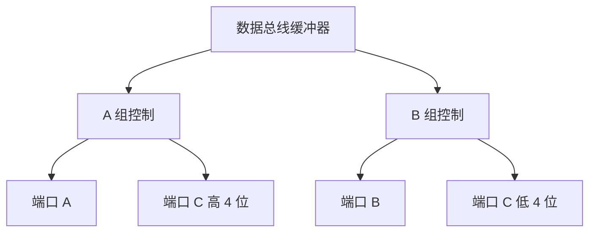
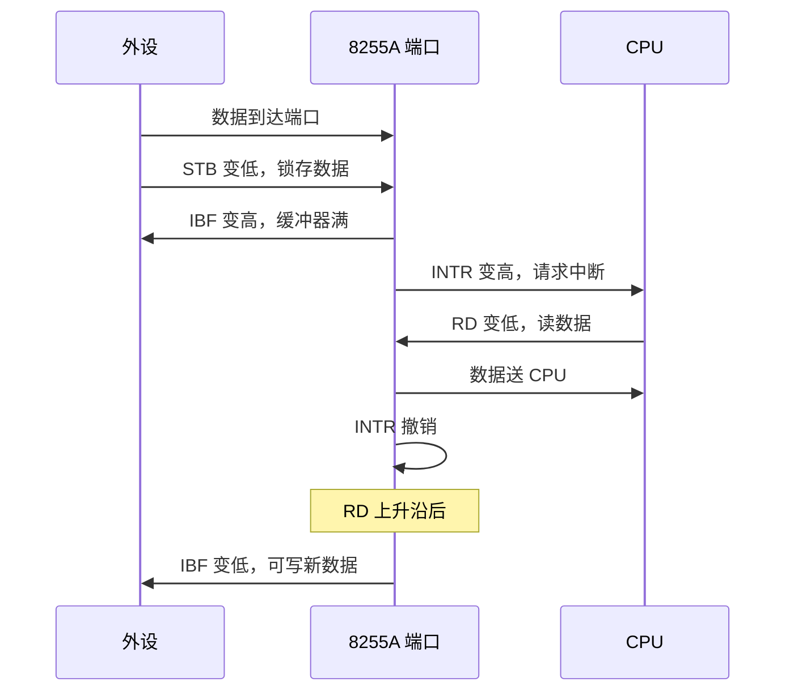
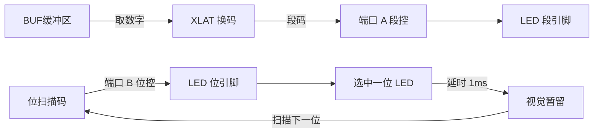

# 07-02 8255A 并行接口与键盘显示

整理并行端口方式、握手、打印机、键盘和 LED 接口。

> [!info] 导航
> 上一节：[[07-01 接口技术与 8253-8254 定时计数器]] · 课程总览：[[计算机系统/微机原理与接口技术B/MOC - 微机原理与接口技术|总 MOC]] · 本章目录：[[计算机系统/微机原理与接口技术B/07 微型机接口技术/MOC - 07 微型机接口技术|第 7 章 MOC]] · 下一节：[[07-03 串行通信基础与 UART]]
>
> **内容主线**：[[#7.3 可编程并行接口|可编程并行接口]] → [[#7.3.1 可编程并行接口芯片 8255A|可编程并行接口芯片 8255A]] → [[#1. 8255A 芯片的内部结构|8255A 芯片的内部结构]] → [[#2. 8255A 芯片引脚功能|8255A 芯片引脚功能]]

## 7.3 可编程并行接口

> [!abstract] 并行通信定义
> 一个字符的 $n$ 个数位用 $n$ 条线同时传输的机制被称为**并行通信**。
>
> - **优点**：传输速度快、效率高
> - **适用场合**：数据传输速度要求高而传输距离较短的场合
> - **典型实现**：前面介绍的三态缓冲器 74LS244、锁存器 74LS273 等都是简单的并行接口芯片

### 7.3.1 可编程并行接口芯片 8255A

> [!info] Intel 8255A 基本特性
> Intel 8255A 是可编程通用并行接口芯片，它有 24 只功能可编程的 I/O 引脚，与 Intel 系列 CPU 完全兼容，能直接按位清 0 或置 1，简化了控制应用接口。

#### 1. 8255A 芯片的内部结构



8255A 芯片内部结构如图 7-14 所示，它由以下 4 部分组成：

![[计算机系统/微机原理与接口技术B/附件/第7章/Pasted image 20260719162259.png]]
*图 7-14 8255A 芯片内部结构*

（图示包含：数据总线缓冲器、读/写控制逻辑、A组控制、B组控制、端口A、端口B、端口C）

> [!info] 8255A 芯片内部 4 部分组成
> **1. 三个 8 位数据端口**：
> - **端口 A**：内有一个 8 位数据输出锁存/缓冲器和一个 8 位数据输入锁存器
> - **端口 B**：内有一个 8 位数据输入/输出、锁存/缓冲器和一个 8 位数据输入缓冲器
> - **端口 C**：内有一个 8 位数据输出锁存/缓冲器和一个 8 位数据输入缓冲器（输入无锁存），可分为两个 4 位端口使用，或用作与 A 口或 B 口配合的控制或状态口，依具体工作方式而定
>
> **2. A 组控制和 B 组控制**：端口 A 和端口 C 的高 4 位构成 A 组，端口 B 和端口 C 的低 4 位构成 B 组，分别由 A 组和 B 组控制电路控制。两组控制电路内各有一个控制寄存器，接收 CPU 写入的控制字，决定各端口的工作方式
>
> **3. 双向 8 位数据总线缓冲器**：承担与 CPU 数据总线接口的功能，传送 I/O 数据、CPU 控制字及状态信息
>
> **4. 读/写控制逻辑**：接收 CPU 发出的地址（一般为 $A_1$、$A_0$）及控制（$\overline{RD}$、$\overline{WR}$、$\overline{RESET}$）和片选（$\overline{CS}$）信号，产生给 A 组、B 组的控制信号，以完成对数据、状态及控制信息的传送

#### 2. 8255A 芯片引脚功能

8255A 芯片引脚定义如图 7-15 所示。除了电源和地线，其他引脚信号可以分为两类。

![[计算机系统/微机原理与接口技术B/附件/第7章/Pasted image 20260719162307.png]]
*图 7-15 8255A 芯片的引脚定义*

（图示展示了 40 脚的芯片示意图，包含 $D_7 \sim D_0$，RESET，$\overline{CS}$，$\overline{RD}$，$\overline{WR}$，$A_1$，$A_0$，$PA_7 \sim PA_0$，$PB_7 \sim PB_0$，$PC_7 \sim PC_0$ 以及 $V_{CC}$ 和 GND 等引脚）

##### 1. 与外设相连的引脚

| 引脚 | 功能 |
| :--- | :--- |
| $PA_7 \sim PA_0$ | 端口 A 数据线 |
| $PB_7 \sim PB_0$ | 端口 B 数据线 |
| $PC_7 \sim PC_0$ | 端口 C 数据线 |

##### 2. 与 CPU 相连的引脚

| 引脚 | 功能 |
| :--- | :--- |
| RESET | 复位信号，高电平有效。复位时所有内部寄存器均被清 0，三个数据端口被设为输入方式 |
| $D_7 \sim D_0$ | 数据总线，双向，三态 |
| $\overline{CS}$ | 片选信号，低电平有效 |
| $\overline{RD}$ | 读信号，低电平有效 |
| $\overline{WR}$ | 写信号，低电平有效 |
| $A_1$、$A_0$ | 端口选择信号，用来寻址三个数据端口及一个控制端口 |

$A_1$、$A_0$、$\overline{RD}$、$\overline{WR}$ 和 $\overline{CS}$ 组合，完成 8255A 芯片的基本操作，如表 7-2 所示。

**表 7-2 8255A 芯片端口选择操作**

| $\overline{CS}$ | $\overline{RD}$ | $\overline{WR}$ | $A_1$ | $A_0$ | 端口选择及其操作 |
| :---: | :---: | :---: | :---: | :---: | :--- |
| 0 | 1 | 0 | 0 | 0 | 数据送端口 A |
| 0 | 1 | 0 | 0 | 1 | 数据送端口 B |
| 0 | 1 | 0 | 1 | 0 | 数据送端口 C |
| 0 | 1 | 0 | 1 | 1 | 控制字送控制寄存器 |
| 0 | 0 | 1 | 0 | 0 | 端口 A 数据送数据总线 |
| 0 | 0 | 1 | 0 | 1 | 端口 B 数据送数据总线 |
| 0 | 0 | 1 | 1 | 0 | 端口 C 数据送数据总线 |
| 0 | 0 | 1 | 1 | 1 | 无操作 ($D_7 \sim D_0$ 三态) |
| 1 | × | × | × | × | 禁止 ($D_7 \sim D_0$ 三态) |
| 0 | 1 | 1 | × | × | 无操作 ($D_7 \sim D_0$ 三态) |

#### 3. 8255A 芯片的控制字和工作方式

> [!info] 8255A 工作方式概述
> 8255A 芯片有**三种基本工作方式**。可通过向控制寄存器写入控制字来选择工作方式。

##### 1. 8255A 的控制字

> [!important] 控制字分类
> 控制字分为两类，共用一个地址，由 $D_7$ 的值来区分：
> - **方式选择控制字**：$D_7=1$ 是其特征标志位。A 组有三种工作方式（方式 0/1/2），B 组只能工作于方式 0 或方式 1
> - **端口 C 置位/复位控制字**：$D_7=0$ 为标志，$D_3 \sim D_1$ 指明对端口 C 的哪一位进行操作，$D_0$ 指明是置 1 还是清 0

![[计算机系统/微机原理与接口技术B/附件/第7章/Pasted image 20260719162318.png]]
*图 7-16 8255A 方式选择控制字*

（图示详细展示了 $D_7 \sim D_0$ 每一位的含义：$D_7$ 为 1，$D_6 D_5$ 用于 A 组方式选择，$D_4$ 用于 A 组口输入/输出选择，$D_3$ 用于 C 口（高 4 位）输入/输出选择，$D_2$ 用于 B 组方式选择，$D_1$ 用于 B 组口输入/输出选择，$D_0$ 用于 C 口（低 4 位）输入/输出选择）

![[计算机系统/微机原理与接口技术B/附件/第7章/Pasted image 20260719162325.png]]
*图 7-17 8255A 端口 C 置位/复位控制字*

（图示详细展示了 $D_7 \sim D_0$ 的含义：$D_7=0$ 为标志，$D_6 D_5 D_4$ 为任意值，$D_3 D_2 D_1$ 用于选择 $PC_0 \sim PC_7$，$D_0$ 用于 1-置位，0-复位）

> [!example] 例 7-2 端口 C 按位控制
> 使端口 C 的 $PC_7=1$，则控制字为 $00001111\text{B}$，即 0FH；然后使 $PC_3=0$，则控制字为 $00000110\text{B}$，即 06H。设 8255A 控制端口地址为 286H，程序段如下：
```asm
MOV   AL, 0FH          ; 置 PC7=1 的控制字
MOV   DX, 286H         ; 控制端口地址
OUT   DX, AL           ; 置 PC7=1
MOV   AL, 06H          ; 置 PC3=0 的控制字
OUT   DX, AL           ; 置 PC3=0
```

##### 2. 8255A 芯片的工作方式

###### 1. 方式 0——基本输入/输出方式

> [!abstract] 方式 0 工作原理
> 在这种方式下，三个数据端口 A、B、C（C 分为两个 4 位），通过方式选择控制字可任意选择为输入口或输出口。

> [!info] 方式 0 主要特点
> - 两个 8 位端口 A、B 和两个 4 位端口（端口 C），任一个端口都可以作为输入或输出端口，各端口之间没有规定必然的关系，有 16 种可能的输入/输出组合
> - 输出锁存，而输入不锁存

方式 0 的输入/输出时序如图 7-18 和 7-19 所示。方式 0 主要用于同步传送数据的场合，这时 CPU 和外设相互了解对方的工作状态，不需要应答信号，三个数据端口可实现三个 8 位通道的数据传送（图 7-18 中表列 $t_{\text{RY}}$ 为两次读操作间隔，图中未画出）。

![[计算机系统/微机原理与接口技术B/附件/第7章/Pasted image 20260719162335.png]]
*图 7-18 8255A 方式 0 输入时序及说明*

（图下方参数表内容为：$t_{\text{RR}}$：读脉冲的宽度，最小 300ns；$t_{\text{AR}}$：地址稳定领先于读信号的时间，最小 0ns；$t_{\text{IR}}$：输入数据领先于 $\overline{RD}$ 的时间，最小 0ns；$t_{\text{HR}}$：读信号过后数据继续保持时间，最小 0ns；$t_{\text{RA}}$：读信号无效后地址保持时间，最小 0ns；$t_{\text{RD}}$：从读信号有效到数据稳定的时间，最大 250ns；$t_{\text{DF}}$：读信号撤除后数据保持时间，最小 10ns，最大 150ns；$t_{\text{RY}}$：两次读操作之间的时间间隔，最小 850ns。）

![[计算机系统/微机原理与接口技术B/附件/第7章/Pasted image 20260719162342.png]]
*图 7-19 8255A 方式 0 输出时序及说明*

（图下方参数表内容为：$t_{\text{AW}}$：地址稳定领先于写信号的时间，最小 0ns；$t_{\text{WW}}$：写脉冲的宽度，最小 400ns；$t_{\text{DW}}$：数据有效时间，最小 100ns；$t_{\text{WD}}$：数据保持时间，最小 30ns；$t_{\text{WA}}$：写信号撤除后的地址保持时间，最小 20ns；$t_{\text{WB}}$：写信号结束到数据有效的时间，最大 50ns。）

> [!tip] 方式 0 的查询传送应用
> 方式 0 也可用于查询式传送场合。这时，一个数据端口作为状态/控制口，另两个数据端口为输入/输出口，利用状态/控制口来配合数据输入/输出口的操作。例如，设端口 A、B 为数据口，端口 C 的高 4 位为控制输出口，低 4 位为状态输入口，则使端口 C 与端口 A、B 配合，即可以实现查询式传送。

###### 2. 方式 1——选通的输入/输出方式

> [!abstract] 方式 1 工作原理
> 在这种方式下，端口 A 和 B 输入/输出数据时，必须利用端口 C 的选通信号和应答信号（握手信号），而端口 C 的这些位有一定的约定。

> [!info] 方式 1 主要特点
> - 两组端口（A 和 B）都可工作于方式 1。每组包含一个 8 位数据端口和一个 4 位控制/数据端口
> - 8 位数据口可以是输入/输出，输入/输出均带锁存
> - 4 位端口用作 8 位端口的控制/状态位。未用于控制/状态的位仍可用作基本 I/O

**方式 1 输入控制信号：**

方式 1 输入时，如图 7-20 所示，其各控制信号的含义如下。

![[计算机系统/微机原理与接口技术B/附件/第7章/Pasted image 20260719162350.png]]
*图 7-20 8255A 方式 1 输入时端口对应的控制信号*

（图示展示了 A 组、B 组以及 A、B 组均工作于方式 1 时的控制字结构，以及相关控制逻辑，标注了 $\overline{STB}_A$、$IBF_A$、$INTR_A$、$INTE_A$ 以及对应的 $PC_3, PC_4, PC_5$ 等引脚）

| 信号 | 名称 | 有效电平 | 说明 |
| :--- | :--- | :--- | :--- |
| $\overline{STB}$ | 选通输入 | 低 | 外设提供，有效时把外设数据送入 8255A 输入锁存器 |
| IBF | 输入缓冲器满 | 高 | 8255A 输出给外设的联络信号，有效时表示数据已写入锁存器，通知外设暂停送数 |
| INTR | 中断请求 | 高 | 8255A 输出信号，向 CPU 提出中断申请，请求 CPU 读取数据。当 $\overline{STB}$、IBF、INTE 都为 1 时被置 1 |
| INTE | 中断允许 | — | 由置位/复位控制字对 $PC_4$（A 口）或 $PC_2$（B 口）置 1/清 0 控制 |

> [!warning] INTE 与 PC 引脚
> INTE 是 8255 内部寄存器位，与 PC 引脚地位相同，但不受 PC 引脚状态影响。

8255A 芯片工作于方式 1 的输入时序如图 7-21 所示。当外设的数据已送到 8255A 的端口（A 或 B），并用选通信号 $\overline{STB}$ 把数据锁存到 8255A 的输入锁存器时，经过 $t_{\text{STB}}$ 时间后，IBF 信号有效。它既可通知外设，暂不输入新的数据，又可供 CPU 查询。在选通信号结束 $t_{\text{SIT}}$ 时间后，8255A 可向 CPU 发出 INTR 中断请求。如果中断允许的话，CPU 响应中断，把数据读入 CPU。在 $\overline{RD}$ 信号有效 $t_{\text{RIT}}$ 时间后撤消中断请求。 $\overline{RD}$ 信号结束 $t_{\text{RIB}}$ 时间后，IBF 变低，表示写入缓冲器已空，通知外设可写入新的数据。

![[计算机系统/微机原理与接口技术B/附件/第7章/Pasted image 20260719162358.png]]
*图 7-21 8255A 方式 1 的输入时序*

（图下方参数表内容为：$t_{\text{ST}}$：选通脉冲的宽度，最小 500ns；$t_{\text{SIB}}$：选通脉冲有效到 IBF 有效之间的时间，最小 300ns；$t_{\text{SIT}}$：$\overline{STB}=1$ 到中断请求 INTR 有效之间的时间，最小 300ns；$t_{\text{PS}}$：数据保持时间，最小 180ns；$t_{\text{PH}}$：数据有效到 $\overline{STB}$ 无效之间的时间，最小 0ns；$t_{\text{RIT}}$：$\overline{RD}$ 有效到中断请求信号撤除之间的时间，最小 400ns；$t_{\text{RIB}}$：$\overline{RD}$ 为 1 到 IBF 为 0 之间的时间，最小 300ns。）



**方式 1 输出控制信号：**

方式 1 输出时的控制信号如图 7-22 所示，其各控制信号的含义如下。

![[计算机系统/微机原理与接口技术B/附件/第7章/Pasted image 20260719162407.png]]
*图 7-22 8255A 方式 1 输出时端口对应的控制信号*

（图示展示了 A 组和 B 组工作于方式 1 输出时的控制字，$\overline{OBF}$、$\overline{ACK}$、INTR、INTE 以及 PC 相关引脚标注）

| 信号 | 名称 | 有效电平 | 说明 |
| :--- | :--- | :--- | :--- |
| $\overline{OBF}$ | 输出缓冲器满 | 低 | 由 8255A 输出给外设，有效时表示外设可从指定端口读取 CPU 写入的数据 |
| $\overline{ACK}$ | 外设应答 | 低 | 有效时表示外设已从 8255A 输出端口读取了数据 |
| INTR | 中断请求 | 高 | 输出缓冲区空，请求 CPU 向 8255A 指定端口写入数据。有效条件：$\overline{ACK}=1$，$\overline{OBF}=1$ 及 $INTE=1$ |
| INTE | 中断允许 | — | 由 $PC_6$（端口 A）或 $PC_2$（端口 B）的置位/复位控制 |

8255A 工作于方式 1 输出的时序如图 7-23 所示。

![[计算机系统/微机原理与接口技术B/附件/第7章/Pasted image 20260719162416.png]]
*图 7-23 8255A 方式 1 输出的时序及说明*

（图下方参数表内容为：$t_{\text{WIT}}$：从写信号有效到中断请求无效的时间，最小 850ns；$t_{\text{WOB}}$：从写信号无效到输出缓冲器清空的时间，最小 650ns；$t_{\text{AOB}}$：$\overline{ACK}$ 有效到 $\overline{OBF}$ 无效的时间，最小 350ns；$t_{\text{AK}}$：$\overline{ACK}$ 脉冲的宽度，最小 300ns；$t_{\text{AIT}}$：$\overline{ACK}$ 为 1 到发新的中断请求的时间，最小 350ns；$t_{\text{WD}}$：写信号撤除到数据有效的时间，最小 350ns。）

> [!info] 中断控制方式下的输出过程
> 采用中断控制方式工作时，8255A 的输出过程在中断服务程序中完成：
> 1. CPU 通过 OUT 指令输出数据和（I/O）写信号
> 2. $\overline{WR}$ 信号一方面清除 INTR，另一方面使 $\overline{OBF}$ 有效，通知外设接收数据（实际上 $\overline{OBF}$ 信号可以是给外设的一个选通信号）
> 3. 当外设接收数据后，发出 $\overline{ACK}$ 信号，使 $\overline{OBF}$ 失效（表示数据已取走，当前输出锁存器空）
> 4. $\overline{ACK}$ 上升沿使 INTR 有效，即发出新的中断请求，形成一个新的输出过程

方式 1 的状态信号可通过读取端口 C 得到，其格式如图 7-24 所示。

![[计算机系统/微机原理与接口技术B/附件/第7章/Pasted image 20260719162423.png]]
*图 7-24 8255A 方式 1 的状态信号格式*

（图示展示了输入方式下，端口 C 中对应 A、B 组的各个状态位分布）

> [!tip] 方式 1 适用场景
> 因此，采用方式 1 异步传送数据，CPU 既可工作于**中断方式**，也可工作于**查询方式**。

###### 3. 方式 2——双向传输方式

> [!abstract] 方式 2 工作原理
> 此方式只适合端口 A，这时在 $PA_7 \sim PA_0$ 的 8 位数据线上，外设既可从 8255A 芯片获取数据，也可向 8255A 芯片发送数据，并支持查询和中断方式。

> [!info] 方式 2 主要特点
> - 一个双向 8 位总线端口（A）和一个 5 位控制/状态端口（C）
> - 输入/输出均带锁存

方式 2 的控制和状态信息如图 7-25 所示，示例时序如图 7-26 所示。

![[计算机系统/微机原理与接口技术B/附件/第7章/Pasted image 20260719162432.png]]
*图 7-25 8255A 方式 2 的控制和状态信号*

（图示展示了方式 2 的控制字格式，以及内部逻辑结构，标注了 INTR、$\overline{OBF}$、$\overline{ACK}$、$\overline{STB}$、IBF 和相关 PC 引脚对应关系）

![[计算机系统/微机原理与接口技术B/附件/第7章/Pasted image 20260719162439.png]]
*图 7-26 8255A 方式 2 示例时序*

> [!important] 方式 2 中断请求逻辑
> 8255A 方式 2 的控制信号功能类似方式 1。其中 INTE1 和 INTE2 分别对应于方式 2 的输出中断允许 INTE_A（$PC_6$）和输入中断允许 INTE_B（$PC_4$）。$\text{INTR}_A$（$PC_3$）为输入和输出的中断请求信号，高电平有效。其有效条件为
> $$
> \text{INTR}=\text{IBF} \cdot \text{INTE}_2 \cdot \overline{STB} \cdot \overline{RD} + \overline{OBF} \cdot \text{INTE}_1 \cdot \overline{ACK} \cdot \overline{WR}
> $$

> [!info] 方式 2 时序说明
> 方式 2 的时序实质上是方式 1 的输入和输出方式的组合，故各个时间参数的意义、数值也相同。需要说明的是，图 7-26 时序是示例，输入、输出顺序是任意的。

方式 2 的状态字格式如图 7-27 所示，可通过读端口 C 得到。各端口各种允许的工作方式和输入/输出方式可任意组合。端口 C 未用作控制/状态的位，可根据输入/输出定义，用端口 C 读和复位/置位控制字实现输入/输出操作。

![[计算机系统/微机原理与接口技术B/附件/第7章/Pasted image 20260719162447.png]]
*图 7-27 8255A 方式 2 时端口 C 的各种组态*

> [!important] 8255A 三种工作方式对比

**表 7-3 8255A 三种工作方式对比**

| 方式 | 名称 | 适用端口 | 主要特点 | 锁存 | 握手信号 |
| :---: | :--- | :--- | :--- | :---: | :---: |
| 0 | 基本输入/输出 | A、B、C | 简单 I/O，无握手，端口 C 可拆分为两个 4 位 | 输出锁存，输入不锁存 | 无 |
| 1 | 选通输入/输出 | A、B | 利用端口 C 的选通/应答/中断信号 | 输入/输出均锁存 | $\overline{STB}$、IBF、$\overline{OBF}$、$\overline{ACK}$、INTR |
| 2 | 双向传输 | 仅 A | 双向数据传输，端口 C 提供 5 位控制/状态 | 输入/输出均锁存 | $\overline{STB}$、IBF、$\overline{OBF}$、$\overline{ACK}$、INTR |

#### 4. 8255A 芯片初始化与 I/O 应用举例

> [!example] 例 7-3 方式 0 初始化
> 设 8255A 工作于方式 0，端口 A 为输入，端口 B 为输出，端口 C 为输出，试对其进行初始化。
>
> 首先确定方式控制字为 $10010000\text{B}$，设 8255A 端口地址为 $80\text{H} \sim 83\text{H}$。初始化程序如下：
```asm
MOV   AL, 90H          ; 方式选择控制字 10010000B
OUT   83H, AL          ; 方式选择控制字送 8255A 控制端口
```

写完控制字后，CPU 可通过 IN/OUT 指令来与 8255A 芯片传送数据。例如：
```asm
IN    AL, 80H          ; 读端口 A 的数据
...
OUT   81H, AL          ; AL 中数据写入端口 B
...
OUT   82H, AL          ; AL 内容写入端口 C
```

### 7.3.2 并行打印机接口应用

#### 1. 打印机的主要接口信号与时序

以点阵式微型打印机 TPμP-40P 为例，打印机接收标准 ASCII 字符和控制码，并转换成字模点阵打印输出。

| 信号 | 功能 |
| :--- | :--- |
| $D_7 \sim D_0$ | 数据总线，双向、三态 |
| $\overline{STB}$ | 数据选通触发脉冲，打印机在其上升沿读入数据 |
| $\overline{ACK}$ | 应答脉冲，"低"表示数据已被打印机接收且打印机准备好接收下一数据，常用于打印机的中断申请信号 |
| BUSY | "高"表示打印机正"忙"，不能接收数据，通常用作状态信号输入供 CPU 查询 |

其他还有在线、出错、缺纸等状态信号。并行打印机的基本时序如图 7-28 所示。

![[计算机系统/微机原理与接口技术B/附件/第7章/Pasted image 20260719162455.png]]
*图 7-28　并行打印机基本时序*

![[计算机系统/微机原理与接口技术B/附件/第7章/Pasted image 20260719162459.png]]
*图 7-29　8255A 与并行打印机接口原理图*

#### 2. 查询方式打印字符串

> [!info] 查询方式硬件连接
> CPU 通过 8255A 芯片与打印机的接口如图 7-29 所示。8255A 的端口 A 作为数据通道，工作于方式 0、输出方式；由 $PC_7$ 读入 BUSY 状态，$PC_0$ 输出 $\overline{STB}$ 脉冲，故 C 端口也工作在方式 0，上半部输入、下半部输出；B 端口未用。

设 8255 端口地址为 $280\text{H} \sim 283\text{H}$。打印子程序（过程）如下：
```asm
BUF     DB  'HELLO!'
        DB  0DH           ; 回车符 ASCII 值
        DB  0AH           ; 换行符
NUM     EQU $-BUF         ; 打印字符串长度
...
PRINT   PROC FAR
        MOV  DX, 283H
        ;8255 初始化：均为方式 0，
        MOV  AL, 10001000B ; A 口输出、C 口上半部输入、下半部输出
        OUT  DX, AL
        MOV  AL, 00000001B ; 控制口，初始 STB PC0=1
        OUT  DX, AL
        MOV  SI, OFFSET BUF
        MOV  CX, NUM
NEXT:   MOV  DX, 282H
        IN   AL, DX        ; BUSY=1（忙）?
        TEST AL, 80H
        JNZ  NEXT          ; PC7=0，不忙
        MOV  AL, [SI]
        INC  SI
        MOV  DX, 280H
        OUT  DX, AL        ; 送出数据
        MOV  DX, 283H
        MOV  AL, 00000000B ; STB PC0=0（低电平宽度 ≥ 0.5μs）
        OUT  DX, AL
        NOP
        MOV  AL, 00000001B ; 恢复 STB 高电平 PC0=1
        OUT  DX, AL
        LOOP NEXT
        RET
PRINT   ENDP
```

#### 3. 中断方式打印字符串

![[计算机系统/微机原理与接口技术B/附件/第7章/Pasted image 20260719162507.png]]
*图 7-30 8255A 中断作为打印机接口原理*

> [!info] 中断方式硬件连接
> 采用中断方式打印时，8255A 芯片与打印机的基本接口如图 7-30 所示。8255A 的端口 A 作为数据通道，工作在方式 1、输出方式。
> - $PC_6$ 作为 $\overline{ACK}$ 信号输入端
> - $PC_3$ 作为 INTR 信号输出端，连接至 PC 机 8259 的中断请求信号输入端 $\text{IRQ}_2$（中断类型码 0AH，对应的中断向量放在 $0000:0028\text{H} \sim 0000:002B\text{H}$ 单元中）
> - 打印机需要的数据选通（$\overline{STB}$）信号由 CPU 控制 $PC_0$ 来产生
> - 这时 $PC_7$（$\overline{OBF}$）引脚未用，故将其悬空

> [!info] 打印过程
> 1. 设数据放在输出缓冲区，输出字符时，CPU 通过对 $PC_0$ 置 1/清 0 命令产生输出数据选通脉冲，把端口 A 的数据送到打印机
> 2. 当打印机接收并打印字符后，发出 $\overline{ACK}$ 应答信号，由此信号清除 8255A 的 $\overline{OBF}$ 信号（内部与 INTR 相联），并使 8255A 产生新的中断请求
> 3. 如果 CPU 允许中断，则响应中断，进入中断服务子程序，输出新的字符
>
> 在需要打印时，首先调用打印初始化子程序，对 8255A、中断向量表等进行初始化，并允许响应中断。之后 CPU 每次响应打印机中断申请，则在中断服务程序中输出一个字符到打印机。设 8255A 端口地址仍然为 $280\text{H} \sim 283\text{H}$。

```asm
IRQ     EQU  0AH         ; IRQ2 中断类型码
IMR1    EQU  0FBH        ; 11111011B
IMR2    EQU  04H         ; 00000100B
BUF     DB  'HELLO!'
        DB  0DH, 0AH     ; 回车、换行符
NUM     EQU $-BUF
BUFPT   DW  ?            ; 保存打印缓冲区当前指针
BUF_N   DB  NUM          ; 打印字符计数器
...
PRT_INI PROC FAR         ; 初始化子程序
        CLI
        MOV  DX, 283H
        MOV  AL, 10100000B ; 8255 初始化：A 口方式 1、输出，B 口方式 0、C 口下半部输出
        OUT  DX, AL
        PUSH DS
        MOV  AX, CS
        MOV  DS, AX
        MOV  DX, AX
        LEA  DX, PRT_INTR
        MOV  AH, 25H
        MOV  AL, IRQ
        INT  21H
        IN   AL, 21H
        AND  AL, IMR1     ; 设置 8259 的中断屏蔽寄存器（IRQ2 开中断）
        OUT  21H, AL
        POP  DS
        STI
        MOV  DX, 283H
        MOV  AL, 00000001B ; 初始 STB=1
        OUT  DX, AL
        MOV  SI, OFFSET BUF
        MOV  AL, [SI]
        INC  SI
        MOV  BUFPT, SI
        MOV  BUF_N, NUM-1
        MOV  DX, 280H
        OUT  DX, AL       ; 送出第一个数据
        MOV  DX, 283H
        MOV  AL, 00000000B ; STB=0
        OUT  DX, AL
        NOP
        MOV  AL, 00000001B ; STB=1
        OUT  DX, AL
        RET
PRT_INI ENDP

...
PRT_INTR PROC FAR        ; 中断服务子程序，未考虑数据段变化
        PUSH AX
        PUSH DX
        PUSH SI
        MOV  SI, BUFPT
        MOV  AL, [SI]     ; 送一个数据
        INC  BUFPT
        MOV  DX, 280H
        OUT  DX, AL
        MOV  DX, 283H
        MOV  AL, 00000000B ; STB=0
        OUT  DX, AL
        NOP
        MOV  AL, 00000001B ; STB=1
        OUT  DX, AL
        DEC  BUF_N        ; 字符串打印完毕？
        JNZ  NEXT
        IN   AL, 21H
        OR   AL, IMR2     ; 打印完毕，中断屏蔽寄存器：IRQ2 关中断
        OUT  21H, AL
NEXT:   POP  SI
        POP  DX
        MOV  AL, 20H      ; 通知 8259：中断服务结束
        OUT  20H, AL
        POP  AX
        IRET
PRT_INTR ENDP
```

### 7.3.3 键盘和显示器接口

在计算机系统中，键盘和显示器是必不可少的 I/O 外设，连接控制方法很多，传统上多通过并行接口连接。这里只举例介绍其中最基本的非编码键盘和 LED 数码显示器的应用。

#### 1. 非编码键盘

> [!info] 键盘工作方式
> 键盘的工作方式一般有定时扫描和中断扫描两种：
> - **中断扫描方式**：在有键按下（按键开关闭合）时产生中断请求，CPU 在中断服务程序中进行键盘扫描及分析处理，一般通过专用芯片（如可编程键盘/显示器控制器 8279）实现
> - **定时扫描方式**：一般利用定时器产生定时（如每隔 20 ms）中断、CPU 响应中断后对键盘进行扫描，或软件扫描，有键按下时转入分析处理程序

为了减少引线，键盘一般为矩阵式。图 7-31 中系统采用的是 一个 $4 \times 4$ 键盘。键盘扫描电路可用专用或通用并行接口芯片实现，采用 8255 芯片更为方便。

![[计算机系统/微机原理与接口技术B/附件/第7章/Pasted image 20260719162516.png]]
*图 7-31 8255 用作键盘及 LED 显示器接口*

（图示包含 8255 芯片，其 PA、PB 口作为段码和位码输出，PC 口作为行列线扫描输入，驱动 7407、75451 连接 4×4 键盘和数码管）

> [!important] 按键识别的两种方法
> 按键的识别通常有两种方法：**行反转法**和**行扫描法**。

> [!info] 1. 行反转法
> 程序先令行线接口工作在输出方式而列线接口工作在输入方式，并使行线输出全 0，然后读入列线值，如果此时有某键按下，则使对应列值为 0；然后程序再令列线接口工作在输出方式而行线接口工作在输入方式，并使列线输出全 0，然后读入行线值，则闭合键对应的行值为 0。
>
> 因此，当一个键被按下时，可以读到相应的一对唯一的行值和列值。由于反转法是通过行线颠倒两次扫描来识别闭合键的，因此需要两个可编程双向 I/O 端口（见图 7-31），用 8255 端口 C 的上、下半部分别用作键盘的行线和列线。

> [!info] 2. 行扫描法
> 程序使某行为低电平、其余行为高电平，然后读入并查询列值。如果列值中某位为低电平，则说明行列交叉点处的键被按下；否则扫描下一行，直到扫描完全部行线。
>
> 在实际应用时，一般先快速检查键盘中是否有键按下，再具体确定按下的是哪个键。为此，先使所有行输出都为 0，再检查列线输入是否有 0。如果有，此时由于不能确定闭合键所在的行，于是用行扫描法来具体定位。如果读到的数据全部为 1，则说明无键闭合。硬件上可将 8255 端口 C 的上（输出方式）、下半部（输入方式）分别用作键盘的行线和列线，如图 7-31 所示（图中行线的上拉电阻可去掉）。

图 7-31 所示系统中完整的键盘管理程序包括键扫描、消除抖动、键译码等内容。用行扫描法实现键盘管理的子程序（现场保护略）举例如下：

```asm
KEY_V   DB  ?           ; 键值暂存单元
...
KEY     PROC FAR
START:  MOV  DX, CTRL_PORT ; 8255A 方式控制字送控制端口 CTRL_PORT
        MOV  AL, 10000001B
        OUT  DX, AL
        CALL KEYSCAN     ; 键扫描。有键按下时：BL=键值（0~15）；无键按下时：BL=0FFH
        CMP  BL, 0FFH
        JNZ  WAIT
        RET              ; 无键按下，返回
WAIT:   MOV  KEY_V, BL
        CALL DELAY       ; 延时约 2ms，消除抖动
        CALL KEYSCAN
        CMP  BL, KEY_V
        JZ   RELEASE     ; 两次键值相同，确认该键按下，等待释放，否则认为是干扰
        RET
RELEASE:MOV  AL, 0FH     ; 往所有行线 PC7 ~ PC4 上输出 0
        MOV  DX, PORTC   ; PORTC 为 8255A 端口 C
        OUT  DX, AL
        IN   AL, DX      ; 读所有列线 PC3 ~ PC0 的电平状态
        AND  AL, 0FH     ; 比较，是否有列线处于高电平（键释放）
        CMP  AL, 0FH
        JNZ  RELEASE
        MOV  AL, KEY_V   ; 取键值
        MOV  AH, 0
        ADD  AL, AL
        MOV  BX, OFFSET PROCE ; 散转（键译码）
        ADD  BX, AX
        MOV  AX, CS:[BX]
        JMP  AX          ; 或 CALL AX，如果处理分支为过程
PROCE   DW   KEY0
        DW   KEY1
        ...
        DW   KEY15       ; 键 15 处理程序
KEY0:   ...              ; 各键功能处理，KEY0~KEY15
        RET
KEY1:   ...
        RET
KEY15:  ...
        RET
KEY     ENDP

; 键盘扫描子程序（过程）
KEYSCAN PROC
        MOV  AL, 0FH     ; 往所有行线 PC7 ~ PC4 上输出 0
        MOV  DX, PORTC   ; PORTC 为 8255A 端口 C
        OUT  DX, AL
        IN   AL, DX      ; 读所有列线 PC3 ~ PC0 的电平状态
        AND  AL, 0FH     ; 比较，是否有列线处于低电平
        CMP  AL, 0FH
        JNZ  DONE
        MOV  BL, 0FFH    ; 无键按下，返回，BL=0FFH
        RET
DONE:   MOV  BL, 0       ; 键号初值为 0
        MOV  CL, 0EFH    ; 送扫描初值 11101111B（D3~D0 无效）
        MOV  CH, 4       ; 计数值为行数
FROW:   MOV  AL, CL      ; 扫描一行
        MOV  DX, PORTC
        OUT  DX, AL
        RCL  AL, 1       ; 修改行扫描值
        MOV  CL, AL
        IN   AL, DX      ; 读列线 D7 ~ D4 无效，判别是否有列线为低电平
        AND  AL, 0FH
        CMP  AL, 0FH
        JNZ  FCOL        ; 有列线 D3 ~ D0 为低电平，则转 FCOL
        ADD  BL, 4       ; 没有，则使键号寄存器 BL 的值=BL+列数(4)
        DEC  CH          ; 行扫描未完，则转 FROW
        JNZ  FROW
        RET              ; 已扫描完，返回
FCOL:   RCR  AL, 1       ; 此列为低电平，已找到，返回（BL=键号）
        JNC  FCOL1
        INC  BL          ; 未找到低电平的列线，则使键号 BL=BL+1，并继续寻找
        JMP  FCOL
FCOL1:  RET
KEYSCAN ENDP
```

> [!note] 程序说明
> 在此程序中，没有考虑重键（即多个键同时按下）等问题。

#### 2. LED 数码显示

> [!abstract] LED 数码显示器
> LED 数码显示器是一种常用的显示器，由 8 段发光管组成，如图 7-32(a)所示，它们分别称为 a、b、c、d、e、f、g、dp 段。通过 8 段的亮灭组合，可以显示 0~9 和 A~F 等字符及小数点。LED 有**共阳极**和**共阴极**两种结构，分别如图 7-32(b)和(c)所示。

![[计算机系统/微机原理与接口技术B/附件/第7章/Pasted image 20260719162529.png]]
*图 7-32 8 段 LED 数码显示器*

(a) 典型 8 段 LED 器件；(b) 共阳极 LED；(c) 共阴极 LED

> [!info] 共阴极与共阳极的有效电平
> - **共阴极结构**：阴极控制端为低电平，数码显示端输入**高电平**（通常加限流电阻）时发亮。例如，要显示数字 1，则使 b、c 段为高电平，其他段为低电平
> - **共阳极结构**：阳极控制端为高电平，数码显示端输入**低电平**时发亮
>
> 8 段发光管按表 7-3 所示与数据端口连接时，数字 0~9 等的编码顺序排列，定义为一个数据表，称为"段选码表"（共阴极 1、共阳极 0 对应段亮）：

```asm
TAB     DB   3FH, 06H, 5BH, 4FH, 66H, 6DH, 7DH, 07H, 7FH, 6FH, 77H, 7CH
        DB   39H, 5EH, 79H, 71H      ; 共阴极 LED，同相输出，显示字符 0~F
```

或
```asm
TAB     DB   0C0H, 0F9H, 0A4H, 0B0H, 99H, 92H, 82H, 0F8H, 80H, 90H, 88H
        DB   83H, 0C6H, 0A1H, 86H, 8EH    ; 共阳极 LED，同相输出，显示字符 0~F
```

**表 7-3 8 段发光管各段对应的数据位**

| $D_7$ | $D_6$ | $D_5$ | $D_4$ | $D_3$ | $D_2$ | $D_1$ | $D_0$ |
| :---: | :---: | :---: | :---: | :---: | :---: | :---: | :---: |
| dp | g | f | e | d | c | b | a |

> [!info] 多 LED 显示电路结构
> 在多个 LED 显示电路中，通常把阴（阳）极控制端连接到一个输出端口，即**位控端口**；而把数码显示段连接到另一个输出端口，也称为**段控端口**。
>
> 由于点亮 LED 需要一定的电流（每段为 5~20 mA），因此在接口中需要增加驱动电路和限流电阻，图 7-31 中使用了同相驱动器 7407（加上拉电阻，如 510 Ω）和 75451。

> [!important] 动态刷新显示原理
> 在图 7-31 中，8255A 的端口 A 用来输出显示字符。设 TAB 为 LED 段选码表的首地址，那么要显示的数字的地址正好为"起始地址+数字值"，其地址中存放着对应于该数字值的显示码。例如显示 7，则它在对应的显示码 TAB+7 这个单元中，利用 80x86 换码指令 XLAT，可方便地实现数字到显示码的转换。
>
> 8255A 的端口 B 用来控制 LED 的显示位，即位控端口。在软件设计上通过扫描法逐个接通 8 位 LED，把端口 A 输出的显示码送到相应的 LED 位上显示，以减少硬件开支。这时，8255A 端口 A 送出的段选码显示码尽管输出到了各 LED，但由于端口 B 只有一位输出低电平，所以只有一个 LED 的相应段能够导通而显示数字，其他 LED 并不亮。
>
> 这样，端口 A 依次输出段选码，端口 B 依次选中一位 LED，就可以在各位上显示不同的数据。利用眼睛的视觉暂留特性，当采用一定的频率循环地往 8 位 LED 输送显示码和扫描码时，就可看到稳定的数字显示。这种 LED 显示方式称为**动态刷新**。



8 位 LED 显示刷新一遍的子程序（过程）如下（其中子程序保护部分略去）：

```asm
TAB     DB   3FH, 06H, ..., 71H       ; 0~F 的段选码表，共阴极 LED
BUF     DB   8 DUP(?)                ; 显示缓冲区
...
DISPLAY PROC FAR
        MOV  SI, OFFSET BUF          ; 指向缓冲区首地址
        MOV  CL, 7FH                 ; 使最左边 LED 亮
DISI:   MOV  AL, [SI]                ; AL 中为要显示的字符
        MOV  BX, OFFSET TAB          ; 段选码表首址送 BX
        XLAT                         ; 段码送 AL
        MOV  DX, PORTA               ; 段码送段控端口 A: PORTA
        OUT  DX, AL
        MOV  AL, CL                  ; 位扫描码送位控端口 B: PORTB
        MOV  DX, PORTB
        OUT  DX, AL
        CALL DELAY                   ; 延时 1ms
        CMP  CL, 0FEH                ; 扫描到最右边 LED?
        JZ   QUIT                    ; 是，则已显示一遍，退出
        INC  SI                      ; 否，则指向下一位 LED
        ROR  CL, 1                   ; 位码指向下一位
        JMP  DISI                    ; 显示下一位 LED
QUIT:   RET
DISPLAY ENDP
```

> [!tip] 消影技巧
> 轮换显示过程中，考虑到显示效果，显示下一数码应该在改变位码前先清除段码（如送 FFH 至 PORTA，即各段全暗），避免出现前一数字的"影子"。

> [!note] 其他实现方案
> 键盘和显示器接口还可以有其他多种实现方案，如利用不可编程的并行接口芯片或专用的可编程键盘/显示控制芯片 8279 等。
