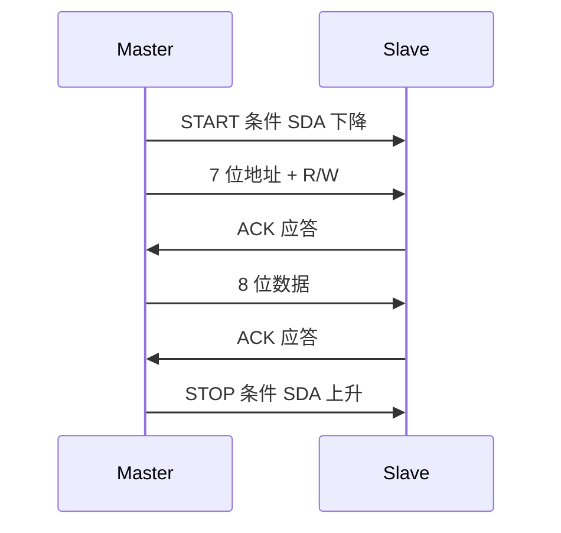
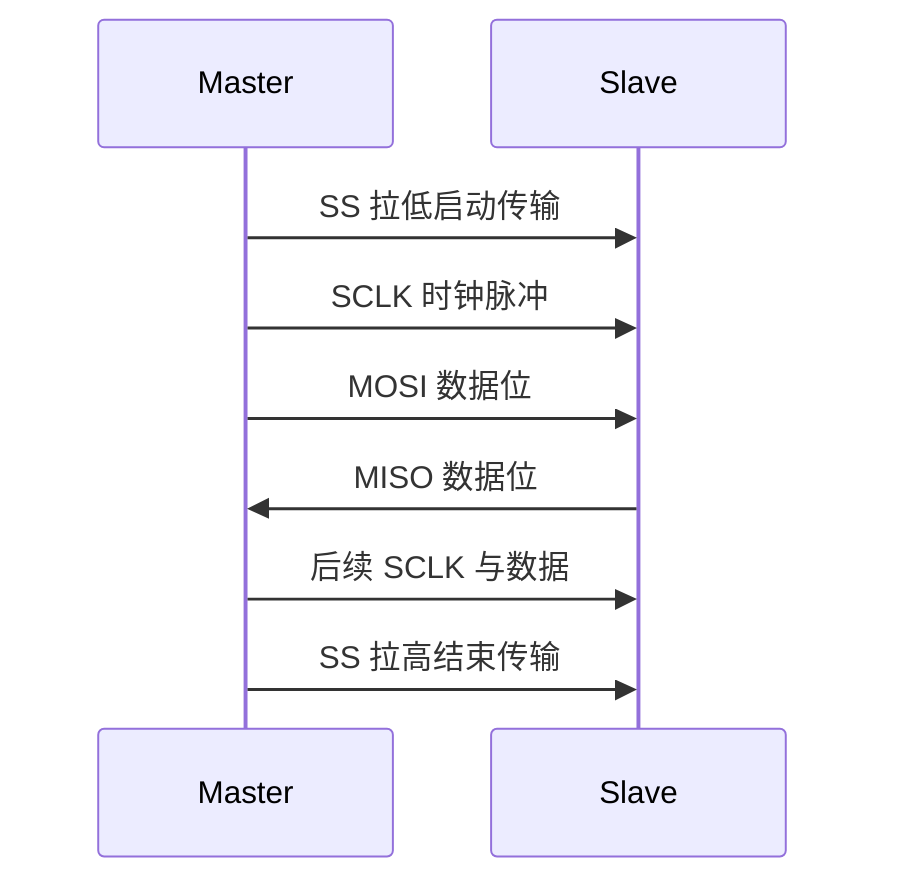

# 07-04 USB、I²C 与 SPI 总线

比较主机式外部总线和常用板级同步串行总线。

> [!info] 导航
> 上一节：[[07-03 串行通信基础与 UART]] · 课程总览：[[计算机系统/微机原理与接口技术B/MOC - 微机原理与接口技术|总 MOC]] · 本章目录：[[计算机系统/微机原理与接口技术B/07 微型机接口技术/MOC - 07 微型机接口技术|第 7 章 MOC]] · 下一节：[[07-05 8237A DMA 控制器]]
>
> **内容主线**：[[#7.4.4 通用串行总线 USB|通用串行总线 USB]] → [[#1. 主要特点|主要特点]] → [[#2. USB 系统的结构框架|USB 系统的结构框架]] → [[#3. USB 物理接口|USB 物理接口]] → [[#7.4.5 I²C 与 SPI 串行总线|I²C 与 SPI 串行总线]]

**表 7-4 USB、I²C、SPI 三种总线对比**

| 比较项 | USB | I²C | SPI |
| :--- | :--- | :--- | :--- |
| 应用场景 | 主机—外设外部总线 | 板级芯片间通信 | 板级芯片间通信 |
| 调度模型 | 主机调度 | 多主/主从 | 主从 |
| 信号线数 | 2（D+/D-，差分） | 2（SDA/SCL） | 4（MISO/MOSI/SCLK/SS） |
| 速率（典型） | 1.5/12/480 Mb/s（USB 2.0） | 100 kbit/s（标准）/400 kbit/s（快速） | 数十 Mb/s 级 |
| 距离 | 节点间 5 m | 受总线电容限制 | 较短，板内为主 |
| 设备数 | 最多 127 | 受电容与地址限制 | 通过多个 SS 选择 |
| 同步方式 | 时钟随数据编码（NRZI） | 共用 SCL 时钟 | 共用 SCLK 时钟 |
| 即插即用 | 支持 | 不支持 | 不支持 |
| 典型应用 | 键盘、鼠标、U 盘、摄像头 | 传感器、EEPROM、RTC | Flash、ADC/DAC、LCD |

## 7.4.4 通用串行总线 USB

> [!abstract] USB 定义
> 通用串行总线 USB（Universal Serial Bus）是主机调度的串行外设总线。USB 2.0 的高速模式标称信令速率为 480 Mb/s；后续 SuperSpeed 代际进一步提升速率。

> [!warning] OTG 不是取消主从模型
> USB OTG 允许具备双角色能力的设备协商谁承担主机角色，但通信开始后仍保持主机—设备关系，并不是取消了 USB 的主从控制模型。

## 1. 主要特点

> [!abstract] USB 主要特点
> - **即插即用**（Plug and Play，PnP）：用户可在不关机情况下进行外设的更换，主机可按外设的增减情况自动配置系统资源
> - **树形连接**：通过 Hub 进行树形连接，连接的装置之间不是平等关系，上、下游关系明确
> - **低成本**：开放的、没有专利版权限制的工业标准；从 1996 年 4 月起并入 Intel 芯片组
> - **多速率档位**：USB 2.0 定义低速 1.5 Mb/s、全速 12 Mb/s 和高速 480 Mb/s
> - **四类传输**：控制、中断、批量、等时
> - **总线供电**：装置和 Hub 可从总线直接获得电源
> - **应用广泛**：可作为 PC 标准接口，通过专用芯片实现各种串/并行连接适配功能

> [!info] USB 2.0 速率档位
> USB 2.0 定义的低速、全速、高速是**信令速率**，不等于应用层持续吞吐量。

**表 7-5 USB 2.0 速率档位**

| 速率档位 | 信令速率 | 典型应用 |
| :---: | :---: | :--- |
| 低速 | 1.5 Mb/s | 键盘、鼠标 |
| 全速 | 12 Mb/s | 音频、打印机 |
| 高速 | 480 Mb/s | U 盘、摄像头、外置硬盘 |

> [!note] 物理层编码注意
> 低速、全速和高速链路使用相应的线路编码、同步字段与位填充规则恢复时钟。协议版本与速率代际不同，不能把所有 USB 物理层都概括为同一种 NRZI 编码。

## 2. USB 系统的结构框架

> [!info] USB 系统的 4 个组成部分
> 一个经典 USB 系统可分为 4 部分：USB 主机、USB 设备、USB Hub 和 USB 互连。USB 系统中的设备与主机的连接方式采用星形连接，其拓扑结构如图 7-52 所示。

![[计算机系统/微机原理与接口技术B/附件/第7章/Pasted image 20260719162842.png]]
*图 7-52 USB 系统的拓扑结构*

> [!info] Hub 与根集线器
> - **Hub**：配线连接器，连接点被称为端口，每个 Hub 把单个连接点转换成多个连接点
> - **上下游端口**：Hub 只有一个上游端口，其余为下游端口，通过上游端口连到主机
> - **设备数量**：每个下游端口允许连接一个 Hub 或功能设备，直到所有外设加起来达到 127 个为止
> - **复合设备**：多个不同功能的应用设备可作为复合设备放在一起，主机视为一个带若干设备的单独 Hub
> - **根 Hub**（Root Hub）：主机上的总控制端口，既可以直接连接外设，也可通过 Hub 扩展控制更多的外设

## 3. USB 物理接口

> [!info] A 类与 B 类连接器
> 标准 USB 连接器分为两类：A 类和 B 类。
> - **A 类连接器**：适合不经常插拔的设备，如键盘、鼠标、Hub 等
> - **B 类连接器**：适合经常需要插拔的设备，如打印机、扫描仪、调制解调器等
> - A 类和 B 类连接器不能互换
> - 所有设备都有一个上行（Up-stream）连接点，Hub 则具有上行和下行（Down-stream）连接点，上游连接器和下游连接器在机械上不可互换，因此消除了 Hub 的非法环路连接

![[计算机系统/微机原理与接口技术B/附件/第7章/Pasted image 20260719162850.png]]
*图 7-53 USB 总线 A/B 类连接器*

(a) 插头；(b) 插座；(c) 插头；(d) 插座

> [!info] USB 总线电缆结构
> USB 总线电缆有 4 条线：一对标准尺寸的双绞信号线和一对标准尺寸的电源线。
> - **D+ 和 D-**：差分信号线，时钟随同差分数据一起编码、传送，时钟编码方案采用具有位填充的 NRZI 编码方式，每个通信包前面的同步字段允许接收器同步它们的位恢复时钟，总线特性阻抗是 90 欧姆
> - **Vbus 和 GND**：用来给设备提供电源，Vbus 在源端一般为 +5 V
> - 每个引脚的最大电流不超过 1 A

**表 7-5 标准 USB 总线连接器引脚编号**

| 连接引脚 | 信号名称 | 注 释 |
| :---: | :--- | :--- |
| 1 | Vbus | 电源 |
| 2 | D- | 信号线- |
| 3 | D+ | 信号线+ |
| 4 | GND | 地 |

> [!tip] USB Type-C 特性
> USB Type-C 规范简称 USB-C，支持 USB 接口双面插入：
> - 更纤薄：$8.3\text{ mm} \times 2.5\text{ mm}$
> - 更快的传输速度：最高 10 Gbps
> - 更强悍的电力传输：最高 100 W
> - 包括 4 对电源/地，2 对高速 USB 数据，4 对屏蔽增强型超高速数据对，2 组边带应用 SBU（Sideband Use）引脚和 2 组配置通道 CC（Configuration Channel）引脚

![[计算机系统/微机原理与接口技术B/附件/第7章/Pasted image 20260719162858.png]]
*图 7-54 USB 总线 C 类连接器*

**表 7-6 USB A/B/C 类连接器对比**

| 类型 | 适用设备 | 主要特点 |
| :---: | :--- | :--- |
| A 类 | 键盘、鼠标、Hub（不常插拔） | 长方形，标准主机端 |
| B 类 | 打印机、扫描仪、调制解调器（常插拔） | 方形，标准设备端 |
| Type-C | 新型手机、笔记本、外设 | 双面可插、纤薄、高速、高电力 |

## 4. USB 通信流与传输方式

> [!info] USB 通信流概念
> USB 在客户软件及其 USB 设备之间提供通信服务，根据客户与 USB 设备之间不同的操作情况，USB 设备可以有不同的通信流要求。通过向一个 USB 设备分配不同的通信流，USB 可以充分利用总线。每个通信流使用总线访问来完成客户与 USB 设备之间的通信。

> [!abstract] USB 四种传输方式
> USB 标准规定了 4 种传输方式：**控制传输、等时传输（Isochronous Transfer）、中断传输和数据块（Bulk）传输**。每种传输类型确定通信流的多种特性，包括 USB 所用的数据格式、通信流的方向、包规限制、总线访问限制、延迟时间限制、请求的数据序列、错误处理等，以满足不同类型的传输需要。

**表 7-7 USB 四种传输类型对比**

| 传输类型 | 主要作用 | 方向 | 延迟保证 | 可靠性 | 典型应用 |
| :---: | :--- | :--- | :---: | :---: | :--- |
| 控制传输 | 枚举与配置 | 双向 | 是 | 重传保证 | 设备枚举、配置 |
| 中断传输 | 低延迟、小数据量事件 | 输入为主 | 是 | 重传保证 | 键盘、鼠标 |
| 批量传输 | 可靠吞吐 | 双向 | 否 | 重传保证 | U 盘、打印机 |
| 等时传输 | 实时数据 | 双向 | 是 | 不提供重传 | 音视频流 |

> [!note] USB 是协议总线
> USB 属于协议总线，通过软件实现各种功能，更多内容可参考 USB 规范（www.usb.org）。

## 5. USB 接口与设备开发

> [!info] USB 控制器集成情况
> USB 控制器通常需要专门的接口芯片，各类新型微处理器都集成了相应的模块。Intel CPU 系列从 PII 开始即将 USB 控制器集成到芯片组中，可直接驱动应用，并成为 PC 的标准串行接口总线。

> [!info] CPU 与 USB 控制器通信
> 与一般串行接口类似，CPU 与 USB 控制器进行通信时，可使用输入/输出寄存器。如控制器作为总线设备挂在 I/O 总线（如 PCI）上，还需编程配置相应的寄存器，即 USB 主控制器模块包含两组软件可以访问的寄存器组：
> - **输入/输出寄存器组**
> - **PCI（总线）配置寄存器**（可选用）

> [!important] 主要的输入/输出寄存器
> - **USB 命令寄存器**：16 位，给出 USB 主控制器要执行的命令，对该寄存器进行一次写入操作将使 USB 主控制器执行一次写入命令
> - **USB 状态寄存器**：16 位，反映 USB 主控制器在被读取时未处理的中断和所处的状态
> - **中断请求寄存器**（USB INTR）
> - **当前帧编号配置寄存器**（FRNUM）
> - **帧列表基地址配置寄存器**（FLBASEADD）
> - **启动起始帧（SOF）修正的配置寄存器**
> - **端口状态与控制寄存器**（PORTSC）：反映端口状态（挂起、线路状态、连接状态等）和进行端口控制（如端口复位、传输速率选择、恢复检测等）

## 6. USB OTG 接口

> [!abstract] OTG 技术作用
> OTG（On-The-Go）技术 2001 年公布，用于在没有 Host 的情况下，实现不同设备或移动设备间的连接和数据交换，进而使 USB 应用从 PC 外设跨越到了消费电子产品和通信电子产品的领域。

> [!info] OTG 三类接口
> 根据 USB 接口所属协议，OTG 可分为 3 类：
> - **USB2.0 OTG**：Micro 5PIN OTG（常见安卓手机 OTG 接口）或 Mini 5PIN OTG（常见安卓手机和平板 OTG 接口）
> - **Micro USB3.0 OTG**：部分 2016 年以前的安卓手机 OTG 接口
> - **Type C OTG**：部分在 2016 年以后的安卓手机 OTG 接口

> [!important] USB OTG 协议支持
> USB OTG 在完全兼容 USB 2.0 的基础上增加了电源管理（节省功耗）功能，允许设备既可作为主机，也可作为外设操作（两用 OTG）。
> - **OTG 两用设备**：完全符合 USB 2.0 标准，并提供一定的主机检测能力
> - **HNP**（Host Negotiation Protocol，主机通令协议）
> - **SRP**（Session Request Protocol，对话请求协议）
> - 在 OTG 中，初始主机设备称为 **A 设备**，外设称为 **B 设备**。可用电缆的连接方式来决定初始角色

## 7.4.5 I²C 与 SPI 串行总线

> [!info] 嵌入式处理器中的串行总线
> 近年来，多种嵌入式处理器/微控制器（单片机）集成了 SPI 或 I²C 接口，使之成为重要的串行总线，并有专门的转换芯片实现到 UART 或 USB 的转换。

### 1. I²C 总线

> [!abstract] I²C 总线定义
> I²C（Inter-Integrated Circuit）是由 Philips（后来的 NXP）提出的板级两线串行总线，常用于连接微控制器、传感器、存储器、时钟和电源管理器件。
> - 使用串行数据线 SDA 与串行时钟线 SCL
> - 两条信号线通常采用开漏/开集电极输出并连接上拉电阻，因此可由多个节点共享

> [!info] I²C 速率与电气条件
> - 标准模式速率为 100 kbit/s
> - 快速模式为 400 kbit/s
> - 还定义了更高速模式
>
> I²C 并没有脱离电气条件的固定"最大距离"或"最大器件数"：可用速率和规模受总线电容、上拉电阻、布线和器件能力共同限制。

> [!info] I²C 传输过程
> 控制器通过 START 条件发起传输并发送目标地址，被控器在地址匹配后应答。节点在一次传输中分别承担发送器或接收器角色；多控制器系统还要处理仲裁与时钟同步。

**表 7-8 I²C 三种信号**

| 信号 | SCL 状态 | SDA 跳变 | 含义 |
| :---: | :---: | :--- | :--- |
| 开始信号（START） | 高电平 | 高 → 低 | 开始传送数据 |
| 结束信号（STOP） | 高电平 | 低 → 高 | 结束传输 |
| 应答信号（ACK） | — | 接收方发出低电平脉冲 | 已收到 8 位数据 |

> [!note] I²C 数据帧规则
> - 送到 SDA 线上的字节必须为 **8 位**长度
> - 每次传送的字节数不受限制
> - 每字节后必须跟一个应答位
> - 数据传送时，**先传送最高位**
> - 如果接收设备不能接收下一字节（如处理外部中断），可以把 SCL 线拉成低电平，迫使主机处于等待状态
> - 从机准备好接收下一字节时再释放时钟线 SCL，使数据传送继续进行

### 2. SPI 总线

> [!abstract] SPI 总线定义
> 串行外围设备接口 SPI（Serial Peripheral Interface）总线是 Motorola 公司推出的一种同步串行接口。许多微控制器（如 MC68xx）、DSP 及 DSP 控制器（如 TI 公司的 TMS 系列）、ARM 架构处理器等也都配有 SPI 硬件接口，可以方便地实现一个主器件与一个或多个从器件相连。

> [!info] SPI 4 条信号线
> SPI 使用两根数据线，一根串行时钟线和一片选信号线：

**表 7-9 SPI 4 条信号线**

| 信号 | 全称 | 方向 | 别名 |
| :---: | :--- | :--- | :--- |
| MISO | 主入从出（Master In Slave Out） | 从 → 主 | DIN |
| MOSI | 主出从入（Master Out Slave In） | 主 → 从 | DOUT |
| SCLK | 串行时钟 | 主 → 从 | SCK、SCL |
| $\overline{SS}$ | 从器件使能 | 主 → 从 | SS#、NSS |

> [!important] SPI 主从协议
> SPI 协议是一种主-从设置：
> 1. SPI 主控把 $\overline{SS}$ 拉低以开始传输
> 2. 然后驱动串行时钟 SCLK 把数据同步输入/输出到从设备
> 3. SPI 主控通过把 $\overline{SS}$ 拉回到高电平，以终止传输

> [!info] SPI 两种工作模式
> SPI 有两种工作模式：**主模式**和**从模式**。
> - 无论哪种模式，都支持 **3 Mb/s** 的传输速率
> - 提供为传输完成标志和写冲突保护标志置位的功能
> - 在从模式下，可使用简化的**三线 SPI**：由 $\overline{SS}$、SCLK、DATA 构成，与 I²C 类似，但多了 $\overline{SS}$

> [!important] SPI 四种时钟模式
> SPI 接口有 4 种时钟模式，反映了 2 个信号 CPOL（时钟极性）和 CPHA（时钟相位）的 2 个状态，以 CPOL、CPHA 的形式表示。

**表 7-10 SPI 四种时钟模式**

| 模式 | CPOL | CPHA | 时钟空闲电平 | 采样沿 |
| :---: | :---: | :---: | :---: | :--- |
| 0 | 0 | 0 | 低 | 上升沿采样、下降沿改变 |
| 1 | 0 | 1 | 低 | 下降沿采样、上升沿改变 |
| 2 | 1 | 0 | 高 | 下降沿采样、上升沿改变 |
| 3 | 1 | 1 | 高 | 上升沿采样、下降沿改变 |

> [!tip] SPI vs I²C 选择
> - **SPI 优势**：高速、全双工、无固定帧格式开销
> - **I²C 优势**：引脚少（2 线）、支持多主、地址寻址
> - 需要根据应用场景的速率、引脚数量、是否需要多主仲裁来选择

> [!example] 应用关联
> 部分采用串行接口的存储器和转换芯片使用 SPI 总线：
> - Microchip 公司的 25Cxx E²PROM
> - Maxim 公司的 DAC MAX538
> - Maxim 公司的 ADC MAX187
>
> 具体应用参见 [[07-06 DAC 与 ADC 接口]]。
