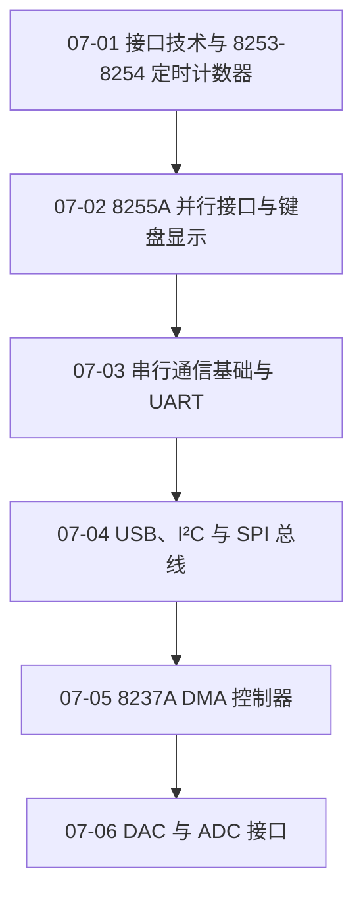

# 07 微型机接口技术

把定时、并行、串行、DMA 和模数转换接口放入统一的外设接入框架。

> [!question] 本章核心问题
> - 控制字怎样把通用接口配置成具体工作方式？
> - UART、USB、I²C 与 SPI 的协议和电气边界有何差异？
> - 数字系统怎样通过 ADC/DAC 连接连续模拟量？

> [!info] 章节导航
> 上一章：[[计算机系统/微机原理与接口技术B/06 输入输出与中断/MOC - 06 输入输出与中断|06 输入输出与中断]] · 课程总览：[[计算机系统/微机原理与接口技术B/MOC - 微机原理与接口技术|微机原理与接口技术]] · 下一章：[[计算机系统/微机原理与接口技术B/08 系统发展与扩展/MOC - 08 系统发展与扩展|08 系统发展与扩展]]

## 知识路径



图中的箭头表示本章建议的概念展开顺序，不代表所有主题之间只有单一依赖关系。

## 本章知识点

- [[07-01 接口技术与 8253-8254 定时计数器]] — 从时钟、门控、计数初值和输出模式理解定时计数。
- [[07-02 8255A 并行接口与键盘显示]] — 整理并行端口方式、握手、打印机、键盘和 LED 接口。
- [[07-03 串行通信基础与 UART]] — 区分通信方向、同步方式、电气接口及 8251A/INS8250。
- [[07-04 USB、I²C 与 SPI 总线]] — 比较主机式外部总线和常用板级同步串行总线。
- [[07-05 8237A DMA 控制器]] — 说明 DMA 通道、寄存器、总线请求和初始化流程。
- [[07-06 DAC 与 ADC 接口]] — 理解数模与模数转换原理、分辨率、误差和典型器件。

## 动态状态

```dataview
TABLE sequence AS "顺序", status AS "状态", length(file.inlinks) AS "入链"
FROM "计算机系统/微机原理与接口技术B/07 微型机接口技术"
WHERE type = "课程笔记"
SORT sequence ASC
```

