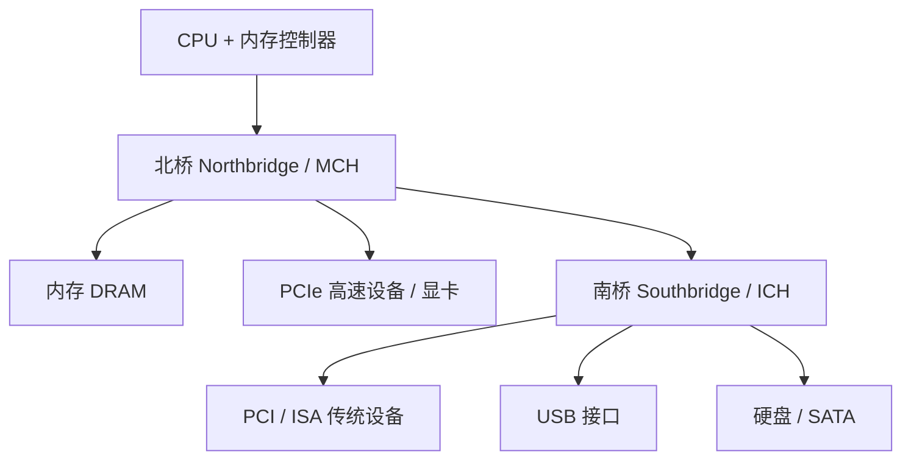
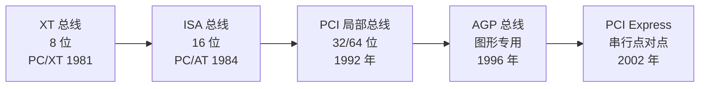

# 08-01 PC 体系结构与 ISA-PCIe 总线演进

以历史视角梳理 PC 芯片组和系统外部总线演进，重点理解地址空间、芯片组分工和外部总线如何演进，而不是把具体产品型号当作当代配置建议。

> [!info] 导航
> 上一节：[[07-06 DAC 与 ADC 接口]] · 课程总览：[[计算机系统/微机原理与接口技术B/MOC - 微机原理与接口技术|总 MOC]] · 本章目录：[[计算机系统/微机原理与接口技术B/08 系统发展与扩展/MOC - 08 系统发展与扩展|第 8 章 MOC]] · 下一节：[[08-02 工作站与服务器]]
>
> **内容主线**：[[#8.1 微型计算机体系结构及系统总线|微型计算机体系结构及系统总线]] → [[#8.1.1 微型计算机体系结构|微型计算机体系结构]] → [[#1. IBM PC/AT 微机系统|IBM PC/AT 微机系统]] → [[#8.1.2 系统外部总线|系统外部总线]]

## 8.1 微型计算机体系结构及系统总线

> [!abstract] 北桥/南桥芯片组分工
> 在 Pentium 平台之前的 PC 体系中，CPU 通过前端总线连接**北桥**（Northbridge，又称 MCH/GMCH），北桥再连接内存、高速图形通路与**南桥**（Southbridge，又称 ICH）；南桥控制低速外设、PCI/ISA、USB、磁盘、BIOS 固件等。Core 时代之后，内存控制器与部分 PCIe 集成进 CPU，北桥消失，仅由 PCH 承担南桥职责。

### 8.1.1 微型计算机体系结构

#### 1. IBM PC/AT 微机系统

> [!info] PC/AT 微处理器子系统组成
> - **CPU**：80286（兼容 8086/8088 指令系统，支持虚拟存储与多任务）
> - **协处理器**：80287 数值运算
> - **时钟发生器**：80284
> - **总线控制器**：82288 管理控制总线
> - **DMA 控制器**：8237 ×2（PC/XT 仅 1 片，扩展为 2 片）
> - **中断控制器**：8259A ×2（扩展为 2 片）
> - **地址/数据总线**：24 位地址总线、16 位数据总线
> - **系统总线**：ISA 总线
> - **工作模式**：实地址模式 + 保护虚地址模式（参见 [[02-08 x86 处理器工作模式]]）

![[计算机系统/微机原理与接口技术B/附件/第8章/Pasted image 20260719164323.png]]
*图 8-1 PC/AT 机组成结构*

（图示内容包含：80287 协处理器、80286 微处理器、82284 时钟发生器、地址锁存器、数据收发器、82288 总线控制器、只读存储器 ROM、随机存储器 RAM、8259A×2 中断控制器、8237A×2 DMA 控制器、8254 定时控制器、扬声器接口、8242 键盘接口、M146818 CMOS-RAM、电池、并行接口、I/O 通道、地址总线、数据总线、控制总线。）

> [!info] PC/AT 内存空间布局（1 MB 常规内存）
> | 地址范围 | 大小 | 用途 |
> | :--- | :--- | :--- |
> | `000000H ~ 09FFFFH` | 640 KB | 基本 RAM 区 |
> | `0A0000H ~ 0BFFFFH` | 128 KB | 显示缓冲（由显示卡提供） |
> | `0C0000H ~ 0DFFFFH` | 128 KB | I/O 通道插卡使用 |
> | `0E0000H ~ 0EFFFFH` | 64 KB | ROM BIOS 占用 |
> | `0F0000H ~ 0FFFFFH` | 64 KB | 系统保留 |
> | `100000H ~ FFFFFFH` | 15 MB | PC/AT 新增的**扩展内存** |

> [!note] PC/AT 兼容机的 CHIPS 门阵列电路
> PC/AT 兼容机中有一部分采用了 CHIPS AND TECHNOLOGIES 公司推出的 CHIPS 门阵列电路，主要包括：
> - 82C201 系统控制芯片
> - 82C202 地址译码芯片
> - 82C203 总线形成芯片
> - 82A204 地址总线形成和刷新地址计数器芯片
> - 82A205 数据总线形成和奇偶校验芯片
>
> 这些芯片同样实现了 I/O 接口电路和 CPU 的其他支持芯片的功能，使系统主板结构更加简洁、可靠。

#### 2. 80386、80486 微机系统

> [!info] 80386 微机系统组成
> 80386 微机硬件基本组成与 PC/XT 及 PC/AT 类似，最核心的芯片——80386 微处理器和 80387 数学协处理器是一致的，外围芯片各不相同。以 80386 为基础的微机系统由以下部分组成：
> - **CPU**：80386
> - **数学协处理器**：80387
> - **外部设备控制器**：82380（整个系统的核心）
> - **Cache 控制器**：82385
> - **高速缓冲存储器**：Cache 存储体

![[计算机系统/微机原理与接口技术B/附件/第8章/Pasted image 20260719164330.png]]
*图 8-2 80386 微机系统组成结构*

（图示内容包含：80387 数学协处理器、80386 微处理器、Cache 存储体、82385 Cache 控制器、82380 DMA 控制器、控制、数据、地址、总线监视、总线控制、总线系统。）

> [!info] 82380 集成组件
> 82380 是整个微机系统的核心，集成了多个不同功能的接口组件：
> - **32 位 8 通道 DMA 控制器**：减少对微处理器的中断次数，加快多页传送速度
> - **20 级可编程中断控制器**（82380 PIC）：由 3 个增强功能的 8259A 组成，提供 15 个外部和 5 个内部中断请求输入，每个外部请求输入可再级联一个 8259A 从控制器
> - **4 个 16 位可编程区间计时器**：与 8253 功能相同，共享一个时钟输入，每个计时器能在 6 种方式的任一种下操作，时钟输入可不受系统时钟约束
> - **系统复位逻辑**：通过软件复位和 82384 硬件复位信号启动
> - **可编程等待状态控制器**
> - **DRAM 刷新控制器**
> - **内部总线仲裁控制器**

> [!note] 80486 与 80386 对比
> 80486 微机硬件结构与 80386 大体相同，系统配置规模更大：
> - 内存容量通常为 4~8 MB
> - 硬盘容量可达 160~500 MB

#### 3. Pentium 微机系统

> [!abstract] Pentium 相对 80486 的关键改进
> Pentium CPU 相比 80486 增加了：改进的 Cache、更宽的数据总线、双整数流水线和分支预测等机制。从 Pentium 平台开始，芯片组在协调 CPU、内存和外设方面承担更明确的角色。详见 [[02-04 Pentium 系列处理器结构]]。

![[计算机系统/微机原理与接口技术B/附件/第8章/Pasted image 20260719164338.png]]
*图 8-3 Pentium 系列微机系统组成结构*

（图示内容包含：Pentium 处理器、系统总线 host bus、L2 Cache、北桥芯片 MCH、主存储器、AGP 显示器、显示存储器、IDE 驱动器 硬盘/光驱、声卡 AC'97、南桥芯片 ICH、USB 端口、PCI 插槽、超 I/O、LAN 连接、ISA 总线、软盘口、并行口、串行口、ISA 槽、固件中心 FWH BIOS。）

> [!info] 北桥芯片（MCH/GMCH）
> 北桥芯片直接与 Pentium 处理器总线（系统总线）相连，又称为：
> - **存储器控制中心**（MCH，Memory Controller Hub）
> - **图形存储器控制中心**（GMCH，Graphics and Memory Controller Hub）
>
> 主要职责：
> - 控制主存、显存和 AGP/PCI 显示器
> - 提供电源管理和 ECC 数据纠错
> - 若处理器未含 L2 Cache，则提供对 L2 Cache 的控制
>
> 北桥起主导作用（**主桥**），主要决定主板的规格、对硬件的支持以及系统性能。

> [!info] 南桥芯片（ICH）
> 南桥芯片不与 CPU 总线直接相连，通过以下总线与北桥相连：
> - 166 MHz 的 PCI 总线
> - 266 MHz 以上的专用新型高速总线
>
> 南桥又称 **I/O 控制中心**（ICH，I/O Controller Hub），控制：
> - USB 接口和 PCI 插槽
> - 快速 IDE 接口（硬盘、光盘驱动器）
> - 超级 I/O 接口（键盘、鼠标、打印机、软驱）
> - 声卡、LAN、BIOS 固件
> - 部分芯片组支持形成 ISA 扩展总线（如图 8-3 下侧虚线所示）

> [!warning] Pentium 4 平台已淘汰 ISA
> Pentium 4 微机一般不再提供 ISA 总线扩展槽，ISA 仅作为兼容性历史标准存在。

> [!note] 芯片组厂商
> Pentium 平台时期主要芯片组厂商包括 **Intel、AMD、VIA、SiS 和 ALI** 等。芯片组与处理器之间必须满足总线、内存和固件等平台规范；是否兼容应依据具体处理器代际、插槽和芯片组型号判断。

#### 4. Core 微机系统

> [!abstract] Core 平台的结构性转变
> Intel 在 Pentium 之后推出 Core 2 及早期 Core i3/i5/i7 产品。教材所示的早期 Core i5/P55 平台把**内存控制器**和**部分 PCI Express 功能集成进处理器**，PCH 承接传统南桥的外围 I/O 职责。具体核心数、缓存和线程能力由处理器型号决定，不能由"Core i5"品牌统一推断。

![[计算机系统/微机原理与接口技术B/附件/第8章/Pasted image 20260719164346.png]]
*图 8-4 Core i5 微机系统组成结构*

（图示内容包含：PCIE、PCIE、PCIE 显卡、Core i5 处理器、DDR3、DDR3、DMI、PCIE、USB、LAN、PCI、Matrix Storage、SATA、HD Audio、SPI、BIOS。）

> [!info] 从 MCH+ICH 到 PCH
> - **早期 Intel 主板芯片组**：MCH（北桥）+ ICH（南桥）
>   - 北桥：CPU、内存、图形/高速扩展通路
>   - 南桥：磁盘及低速外围设备
> - **5 系列平台之后**：内存控制器和部分高速 I/O 集成进 CPU，转向 **PCH**（Platform Controller Hub）单芯片结构
> - **P55 平台**：通过 **DMI**（Direct Media Interface）与处理器连接，内存控制由处理器负责

### 8.1.2 系统外部总线

> [!abstract] 总线及其标准
> 总线是微机中各模块之间传送信息的通道，各模块**分时共享**总线。为方便微机系统的扩展及各厂商产品的互换和互连，国际上根据微机的发展制定了许多总线标准，如 PC 总线标准、ISA 总线标准和 PCI 总线标准等。

**表 8-A　PC 主要系统总线演进对比**

| 总线 | 年代 | 位宽 | 工作频率 | 峰值带宽 | 典型用途 |
| :--- | :--- | :--- | :--- | :--- | :--- |
| XT 总线 | 1981 年 | 8 位 | 4.77 MHz | 约 2 MB/s | PC/XT 8 位扩展 |
| ISA 总线 | 1984 年 | 16 位 | 8.33 MHz | 8 MB/s | PC/AT 16 位扩展 |
| PCI 总线 | 1992 年 | 32/64 位 | 33 MHz | 133 MB/s（32 位）/ 264 MB/s（64 位） | 局部总线通用扩展 |
| AGP 总线 | 1996 年 | 32 位 | 66 MHz 基频（1X/2X/4X/8X） | 266 MB/s ~ 2.1 GB/s | 图形显示专用 |
| PCI Express | 2002 年 | 串行 ×1/×4/×8/×16 | 2.5 GHz 起每通道 | 单通道双向约 500 MB/s 起步 | 通用高速串行点对点 |

#### 1. ISA 总线

> [!info] ISA 总线规格
> - **起源**：IBM PC/AT 微机开始采用（也称 AT 总线），用于 16 位数据传输；XT 总线即"8 位 ISA 总线"
> - **数据传输速率**：最高 8 MB/s
> - **地址总线宽度**：24 位
> - **可支持内存**：16 MB
> - **兼容性**：在 XT 总线基础上延伸出一小段插槽（图 8-5），扩展地址线、高 8 位数据线和增加的中断申请线

![[计算机系统/微机原理与接口技术B/附件/第8章/Pasted image 20260719164354.png]]
*图 8-5 XT 总线和 ISA 总线插槽*

（图示内容包含：XT 总线 62 线 I/O 槽、C 面、D 面、36 线扩展槽、A 面、B 面、机箱后挡板。）

> [!warning] ISA 相对 XT 的两处引脚改动
> 早期 XT 总线扩展卡插入 ISA 插槽时只使用右侧较长的插槽，该部分与 XT 基本一致，仅两处改动：
> 1. **原 B19 引脚** `DACK0`：因 AT 机的 DRAM 刷新不再通过 DMA 伪传输完成，改为由系统板刷新电路直接产生 `REFRESH` 信号（输出）
> 2. **原 B8 引脚** `CARD SLCTD`：改为引入 `OWS`（零等待状态）信号，表示接口卡上的设备不需插入任何附加等待状态即可完成当前总线周期

**表 8-1 ISA 总线引脚功能**

| 引脚 | 名称 | 功能 |
| :--- | :--- | :--- |
| $D_7 \sim D_0$ | 数据总线低 8 位引脚 | 8 位数据线，双向，三态；对于 16 位 ISA 总线，是数据线的低 8 位 |
| $A_{19} \sim A_0$ | 地址总线引脚 | 输出 20 位地址信号 |
| $SMEMR, SMEMW$ | 存储器读、写命令引脚 | 输出存储器读、写命令信号，低电平有效 |
| $IOR, IOW$ | I/O 读、写命令引脚 | I/O 读、写命令，输出，低电平有效 |
| $AEN$ | 地址允许信号引脚 | 输出地址允许信号，高电平有效。该信号由 DMAC 发出，为高表示 DMAC 正在控制系统总线进行 DMA 传送，所以可用于指示 DMA 总线周期 |
| $BALE$ | 总线地址锁存允许信号引脚 | 输出总线地址锁存允许信号，该信号在 CPU 总线周期的 TI 期间有效，可作为 CPU 总线周期的指示 |
| $I/O CHRDY$ | I/O 通道是否准备好引脚 | 输入 I/O 通道是否准备好信号，高电平有效。该信号与 8086 的 READY 功能相同，用于插入等待时钟周期 |
| $IRQ_3 \sim IRQ_7$ | 中断请求信号引脚 | 6 个中断请求信号，输入，这些信号由低到高的跳变表示中断请求，但应一直保持高电平，直到 CPU 响应中断为止 |
| $DRQ_1 \sim DRQ_3$ | DMA 请求信号引脚 | 3 个 DMA 请求信号，输入，高电平有效，分别接到 DMA 控制器 |
| $DACK_1 \sim DACK_3$ | DMA 响应信号引脚 | 3 个 DMA 响应信号，输出，低电平有效 |
| $T/C$ | 计数结束信号引脚 | 计数结束信号，输出，高电平有效。它由 DMAC 发出，用于表示进行 DMA 传送的通道编程时规定传送字节数已经传送完 |
| $OSC$ | 输出脉冲引脚 | 输出振荡器的脉冲 |
| $CLK$ | 系统时钟信号引脚 | 系统时钟信号，输出 |
| $RESET$ | 系统复位信号引脚 | 系统复位信号，输出，高电平有效；该信号有效时表示系统正处于复位状态，可利用该信号复位总线板上的有关电路 |
| $NOWS$ | 零等待状态信号引脚 | 输入零等待状态信号，低电平有效，用于缩短按照缺省设置应等待的时钟数；当它有效时，不再插入等待时钟 |
| $REFRESH$ | 刷新信号引脚 | 刷新信号，双向，低电平有效，由总线主控器的刷新逻辑产生。该信号有效表示存储器正处于刷新周期 |
| $SD_{15} \sim SD_8$ | 数据总线高 8 位引脚 | 数据总线的高 8 位，双向，三态 |
| $SBHE$ | 总线高字节传送允许信号引脚 | 高字节允许信号，低电平时表示数据总线正在传送高字节（$SD_{15} \sim SD_8$），16 位设备可以利用 SBHE 控制 $SD_{15} \sim SD_8$ 连接到数据总线缓冲器上 |
| $LA_{23} \sim LA_{17}$ | 非锁存的地址总线引脚 | 非锁存的地址线，在 BALE 为高电平时有效。将它们锁存起来，并和已锁存的低地址线 $A_{19} \sim A_0$ 组合在一起，可形成 24 位地址线，因而使系统的寻址能力扩大到 16 MB |
| $MEMR, MEMW$ | 存储器读、写信号引脚 | 存储器读、写信号，低电平有效。这两个信号在所有存储器的读或写周期有效。SMEMR 和 SMEMW 仅当访问存储器的低 1 MB 时才有效 |
| $MEMCS16$ | 存储器片选 16 引脚 | 如果总线上某一存储器卡要传送 16 位数据，则必须产生一个有效的（低电平）MEMCS16 信号，该信号加到系统板上，通知主板实现 16 位数据传送。该信号需利用三态门或集电极开路门驱动 |
| $IOCS16$ | I/O 片选 16 引脚 | 与 MEMCS16 类似，如果某一 I/O 接口卡要传送 16 位数据，则必须产生一个有效的（低电平）IOCS16 信号，该信号加到系统板上，通知主板实现 16 位数据的传送。该信号也需利用三态门或集电极开路门驱动 |
| $MASTER$ | 总线主控信号引脚 | 该信号与 DRQ 线一起用于获取对系统总线的控制权，使 I/O 通道上的处理器暂时控制系统总线并访问存储器和外设 |
| $IRQ_{12} \sim IRQ_{15}$ | 中断请求信号引脚 | 可屏蔽中断请求信号 |
| $DRQ_7 \sim DRQ_5, DRQ_0$ | DMA 请求信号引脚 | 通道 7~5、通道 0 的 DMA 请求信号 |
| $DACK_7 \sim DACK_5, DACK_0$ | DMA 响应信号引脚 | 通道 7~5、通道 0 的 DMA 响应信号 |

#### 2. PCI 局部总线

> [!abstract] PCI 总线
> PCI（Peripheral Component Interconnect，外围部件互连）总线是 1992 年以 Intel 公司为首的集团厂家设计的一种先进的高性能局部总线。它支持突发读/写和并发工作方式，并支持多个主控设备。PCI 独立于处理器的结构形成一种独特的中间缓冲器设计，将中央处理器子系统与外围设备分开，用户可随意增设多种外围设备。

> [!info] PCI 总线关键参数
> - **数据线宽度**：32 位（可扩充到 64 位）
> - **最高数据传输速率**：133 MB/s（32 位）/ 264 MB/s（64 位）
> - **总线工作频率**：固定 33 MHz，与 CPU 工作频率无关（异步工作）
> - **电压**：支持 3.3 V 操作
> - **适用范围**：台式机、便携机、服务器、工作站
> - **特性**：即插即用（Plug-and-Play）、支持多主控设备和并发工作、支持无限读/写突发方式
> - **信号总数**：共 188 根

> [!info] PCI 信号分类
> PCI 总线信号分为以下几类：
> - 地址线、数据线
> - 接口控制线
> - 仲裁线
> - 系统线
> - 中断请求线
> - 高速缓存支持信号线
> - 出错报告信号线

> [!note] PCI 系统信号
> - **$CLK$**：PCI 总线上所有设备的输入信号，为所有设备的 I/O 操作提供同步定时
> - **$RST$**：使各信号线的初始状态处于系统规定的初始状态或高阻态

> [!note] PCI 地址/数据与命令信号
> - **$AD_{31} \sim AD_0$**：地址/数据分时复用信号线
> - **$C/\overline{BE}_3 \sim C/\overline{BE}_0$**：命令/字节使能复用信号
>   - 数据阶段：指明所传数据的各字节通路
>   - 地址阶段：决定总线操作类型（I/O 读、I/O 写、存储器读、存储器写、存储器多重写、中断响应、配置读、配置写、双地址周期等）
> - **$PAR$**：对 $AD_{31} \sim AD_0$ 和 $C/\overline{BE}_3 \sim C/\overline{BE}_0$ 的偶校验信号
>
> PCI 部件内部置有配置寄存器，配置读和配置写命令用于系统初始化时对这些寄存器进行读/写操作，以实现即插即用。

> [!note] PCI 接口控制与仲裁信号
> **接口控制信号**：
> - 帧信号 $FRAME$
> - 目标设备就绪信号 $TRDY$
> - 始发设备就绪信号 $IRDY$
> - 停止传输信号 $STOP$
> - 初始化设备选择信号 $IDSEL$
> - 资源封锁信号 $LOCK$
> - 设备选择信号 $DEVSEL$
>
> **总线仲裁**：PCI 总线采用**独立请求仲裁方式**，每个 PCI 始发设备都有一对总线仲裁线 $REQ^\#$ 和 $GNT$ 直接连到 PCI 总线仲裁器，各始发设备独立地向仲裁器发出总线请求信号 $REQ$，由仲裁器根据系统规定的判决规则决定把总线使用权赋给某设备。

#### 3. PCI Express 总线

> [!abstract] PCI Express 总线
> 2001 年春季，Intel 公司提出用新技术取代 PCI 总线和多种芯片的内部连接，称为第三代 I/O 总线技术。2002 年由 Intel、AMD、DELL、IBM 等 20 多家公司完成规范起草，正式命名为 **PCI Express**。它采用**点对点串行连接**，相比 PCI 的共享并行架构，每个设备都有自己的专用连接，可显著提高数据传输速率。

> [!info] PCIe 接口规格
> - **接口标准**：×1、×4、×8 和 ×16 共 4 种位宽
> - **支持热拔插**
> - **支持的电压**：+3.3 V、3.3 Vaux 和 +12 V
> - **通道数**：从 1 条到 32 条，可伸缩以满足不同设备对带宽的需求
> - **传输基础**：建立在双向序列的点对点连接之上，称为"传输通道"
> - **协议分层**：物理层、数据链路层、交换层

**表 8-B　PCIe 三层协议结构**

| 层 | 关键机制 | 功能 |
| :--- | :--- | :--- |
| 物理层 | 串行 LVDS、8B/10B 编码、数据条纹 | 每组点对点通道使用两个单向低电压差分信号 LVDS 传输；多通道数据交叉存取；时钟信息嵌入信号中；8B/10B 保证连续 1 和 0 字符串长度符合标准 |
| 数据链路层 | TLP、32 位 CRC、Ack/Nak 检错重传 | 按序交换层数据包 TLP 进行 32 位 CRC 校验；无应答或超时数据包重传；DLLP 传送流控制信息和电源管理 |
| 交换层 | 分离交换、可信性流控制 | 数据提交与应答在时间上分离；发送端统计可信信号量直至接收端初始最高值；接收端处理完后回送更大可信信号量通知发送端 |

> [!tip] PCIe 与 PCI 的核心区别
> - **PCI**：共享并行架构，总线工作频率固定 33 MHz，多设备分时共享
> - **PCIe**：点对点串行连接，每个设备独占通道，可大幅扩展带宽
> - 从 PCI 到 PCIe 不是简单速度差异，而是**架构范式**转变——从"共享并行"到"专用串行"
