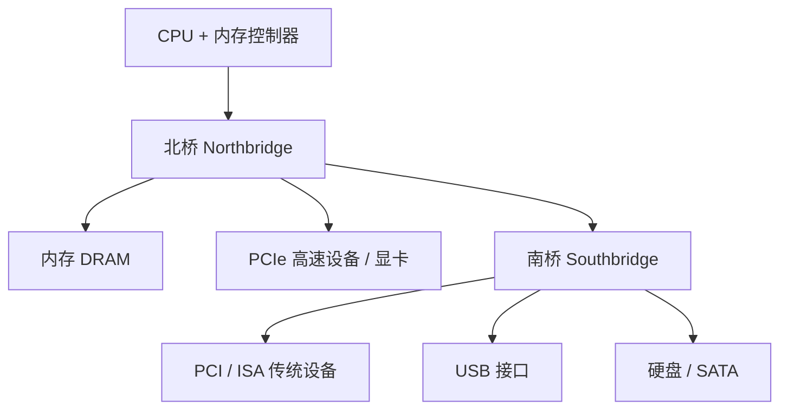

# 08-01 PC 体系结构与 ISA-PCIe 总线演进

以历史视角梳理 PC 芯片组和系统外部总线演进。

> [!info] 导航
> 上一节：[[07-06 DAC 与 ADC 接口]] · 课程总览：[[计算机系统/微机原理与接口技术B/MOC - 微机原理与接口技术|总 MOC]] · 本章目录：[[计算机系统/微机原理与接口技术B/08 系统发展与扩展/MOC - 08 系统发展与扩展|第 8 章 MOC]] · 下一节：[[08-02 工作站与服务器]]
>
> **内容主线**：[[#8.1 微型计算机体系结构及系统总线|微型计算机体系结构及系统总线]] → [[#8.1.1 微型计算机体系结构|微型计算机体系结构]] → [[#1. IBM PC/AT 微机系统|IBM PC/AT 微机系统]] → [[#2. 80386、80486 微机系统|80386、80486 微机系统]]

## 8.1 微型计算机体系结构及系统总线

### 8.1.1 微型计算机体系结构

本节以 IBM PC 兼容机为历史主线，依次观察 PC/AT、80386、80486、Pentium 和早期 Core 平台的系统结构变化。重点是理解地址空间、芯片组分工和外部总线如何演进，而不是把具体产品型号当作当代配置建议。

#### 1. IBM PC/AT 微机系统

IBM PC/AT 机采用 80286 CPU，它兼容 8086/8088 指令系统，支持虚拟存储和多任务操作，对存储器的访问有两种方式：实地址和保护虚地址模式。

PC/AT 机的微处理器子系统由 80286 微处理器、80287 数值运算协处理器、80284 时钟发生器及其他支持芯片组成，仍用通用的地址锁存器和双向数据收发器形成 24 位地址总线和 16 位数据总线，控制总线由专用的 82288 总线控制器管理，DMA 控制器 8237 和中断控制器 8259A 与 PC/XT 机相比均扩展为 2 片。PC/AT 微机使用 ISA 系统总线，该系统的组成结构如图 8-1 所示。

![[计算机系统/微机原理与接口技术B/附件/第8章/Pasted image 20260719164323.png]]
*图 8-1 PC/AT 机组成结构*

（图示内容包含：80287 协处理器、80286 微处理器、82284 时钟发生器、地址锁存器、数据收发器、82288 总线控制器、只读存储器 ROM、随机存储器 RAM、8259A×2 中断控制器、8237A×2 DMA 控制器、8254 定时控制器、扬声器接口、8242 键盘接口、M146818 CMOS-RAM、电池、并行接口、I/O 通道、地址总线、数据总线、控制总线。）

在 PC/AT 机中，内存最低端的 640 KB（000000H～09FFFFH）属于基本 RAM 区；接下来的 128 KB（0A0000H～0BFFFFH）由显示卡提供，用于显示缓冲；接下来的 256 KB（0C0000H～0FFFFFH）为 ROM 区，其低端的 128 KB 分配给 I/O 通道插卡使用，接下来的 64 KB 由 ROM BIOS 占用，最后 64 KB 由系统保留。以上 1 MB 被称为常规内存，其空间分配与 PC/XT 基本相同。由 100000H 向上的 15 MB 是 PC/AT 新增的内存空间，被称为扩展内存。

PC/AT 兼容机中有一部分已经采用了 CHIPS AND TECHNOLOGIES 公司推出的 CHIPS 门阵列电路。PC/AT 兼容机采用的门阵列电路主要有 82C201 系统控制芯片、82C202 地址译码芯片、82C203 总线形成芯片、82A204 地址总线形成和刷新地址计数器芯片以及 82A205 数据总线形成和奇偶校验芯片等。这些芯片同样也实现了 I/O 接口电路和 CPU 的其他支持芯片的功能，并且使系统主板结构更加简洁、可靠。

#### 2. 80386、80486 微机系统

就硬件的基本组成来说，80386、80486 微机系统仍然与 PC/XT 及 PC/AT 微机系统类似。自 80386 CPU 问世以来，很多厂商纷纷推出各种牌号的 80386 微机，这些微机最核心的芯片——80386 微处理器和 80387 数学协处理器是一致的，外围芯片则各不相同。以 80386 为基础的微机系统由 80386 CPU、数学协处理器 80387、外部设备控制器 82380 和高速缓冲存储器 Cache 控制器 82385 组成。典型 80386 微机系统组成结构如图 8-2 所示。

![[计算机系统/微机原理与接口技术B/附件/第8章/Pasted image 20260719164330.png]]
*图 8-2 80386 微机系统组成结构*

（图示内容包含：80387 数学协处理器、80386 微处理器、Cache 存储体、82385 Cache 控制器、82380 DMA 控制器、控制、数据、地址、总线监视、总线控制、总线系统。）

外部设备控制器 82380 是整个微机系统的核心，集成了多个不同功能的接口组件，包括 32 位 8 通道 DMA 控制器、20 级可编程中断控制器、4 个 16 位可编程区间计时器、系统复位逻辑、可编程等待状态控制器、DRAM 刷新控制器以及内部总线仲裁控制器等。

其中，DMA 控制器可以减少对微处理器的中断次数，加快多页传送的速度，为需要分页的环境提供极佳的性能；可编程中断控制器（简称 82380 PIC）由三个增强功能的 8259A 中断控制器组成，这 3 个中断控制器提供 15 个外部和 5 个内部中断请求输入，每个外部请求输入可以再级联一个 8259A 从控制器；4 个 16 位可编程区间计时器与 8253 可编程计时器功能相同，尽管这 4 个计时器共享一个时钟输入，但每个计时器都能在 6 种方式的任一种方式下操作，而且这个时钟输入可以不受系统时钟的约束；82380 还有一个专门的系统复位逻辑，通过软件复位和时钟发生器 82384 的硬件复位信号就能启动复位功能。

80486 微机和 80386 微机的硬件结构大体相同，在系统配置上，80486 的规模更大一些，如内存容量通常为 4～8 MB，硬盘容量可达 160～500 MB。

#### 3. Pentium 微机系统

Pentium CPU 相比 80486 增加了改进的 Cache、更宽的数据总线、双整数流水线和分支预测等机制。从 Pentium 平台开始，芯片组在协调 CPU、内存和外设方面承担更明确的角色。早期芯片组可由多片组成，后来逐步收敛为北桥与南桥的两芯片结构；图 8-3 展示的是这一时期的典型组织。

![[计算机系统/微机原理与接口技术B/附件/第8章/Pasted image 20260719164338.png]]
*图 8-3 Pentium 系列微机系统组成结构*

（图示内容包含：Pentium 处理器、系统总线(host bus)、L2 Cache、北桥芯片(MCH)、主存储器、AGP显示器、显示存储器、IDE驱动器(硬盘/光驱)、声卡AC'97、南桥芯片(ICH)、USB端口、PCI插槽、PCI插槽、超I/O、LAN连接、ISA总线、软盘口、并行口、串行口、ISA槽、固件中心FWH(BIOS)。）

北桥芯片直接与 Pentium 处理器总线（系统总线）相连，主要控制主存、显存和 AGP/PCI 显示器，所以又称为存储器控制中心（MCH）或图形存储器控制中心（GMCH）。当然，它除了提供对存储器和图形显示的控制外，还提供电源管理和 ECC 数据纠错等功能。若处理器内未含 L2 Cache，它还会提供对 L2 Cache 的控制。相对于南桥芯片，北桥芯片起着主导作用，所以被称为主桥。它主要决定主板的规格、对硬件的支持以及系统的性能。

南桥芯片不与 CPU 总线直接相连，而通过带宽为 166MHz 的 PCI 总线或带宽为 266MHz 以上的专用新型高速总线与北桥芯片相连。南桥芯片控制若干 USB 接口和 PCI 插槽，并通过快速 IDE 接口控制硬盘和光盘驱动器，通过超级 I/O 接口控制键盘、鼠标、打印机和软驱等外设，同时控制声卡、LAN 和 BIOS 固件等。有的芯片组的南桥芯片还支持形成 ISA 扩展总线，如图 8-4 中下侧虚线所示。这样，微机系统可以外接一些 ISA 总线设备（注：现在的 Pentium 4 微机一般不提供 ISA 总线扩展槽）。可见，南桥芯片主要控制主板上的各种接口、PCI 总线、IDE 以及主板上的其他芯片等，所以又称它为 I/O 控制中心（ICH）。

Pentium 平台时期的芯片组厂商包括 Intel、AMD、VIA、SiS 和 ALI 等。芯片组与处理器之间必须满足总线、内存和固件等平台规范；是否兼容应依据具体处理器代际、插槽和芯片组型号判断。

#### 4. Core 微机系统

Intel 在 Pentium 之后推出 Core 2 及早期 Core i3/i5/i7 产品。教材所示的早期 Core i5/P55 平台把内存控制器和部分 PCI Express 功能集成进处理器，PCH 则承接传统南桥的外围 I/O 职责；图 8-4 用于说明这种系统分工变化。具体核心数、缓存和线程能力由处理器型号决定，不能由“Core i5”品牌统一推断。

![[计算机系统/微机原理与接口技术B/附件/第8章/Pasted image 20260719164346.png]]
*图 8-4 Core i5 微机系统组成结构*

（图示内容包含：PCIE、PCIE、PCIE显卡、Core i5 处理器、DDR3、DDR3、DMI、PCIE、USB、LAN、PCI、Matrix Storag、SATA、HD Audio、SPI、BIOS。）

早期 Intel 主板芯片组常采用 MCH（北桥）加 ICH（南桥）的组合：北桥主要负责 CPU、内存与图形/高速扩展通路，南桥主要管理磁盘及低速外围设备。随着内存控制器和部分高速 I/O 功能集成进 CPU，5 系列平台转向以 PCH 承担传统南桥功能的结构。P55 通过 DMI（Direct Media Interface）与处理器连接，内存控制则由处理器负责。

### 8.1.2 系统外部总线

前面已了解到，总线是微机中各模块之间传送信息的通道，各模块分时共享总线。为了方便微机系统的扩展及各厂商产品的互换和互连，国际上根据微机的发展制定了许多总线标准，如 PC 总线标准、ISA 总线标准和 PCI 总线标准等。

#### 1. ISA 总线

XT 总线仅适合 8 位数据传输，所以从 IBM PC/AT 微机开始采用 ISA 总线（也称为 AT 总线），以便进行 16 位数据传输。XT 总线也被称为 8 位 ISA 总线，ISA 总线为 16 位 ISA 总线。ISA 总线的数据传输速率最高为 8 MB/s，地址总线宽度为 24 位，可支持 16 MB 内存。为了与 XT 总线兼容，在 XT 总线的基础上，ISA 总线延伸出一小段插槽，如图 8-5 所示。这小段插槽上的引线主要是扩展的地址线和高 8 位数据线及增加的中断申请线等。

![[计算机系统/微机原理与接口技术B/附件/第8章/Pasted image 20260719164354.png]]
*图 8-5 XT 总线和 ISA 总线插槽*

（图示内容包含：XT总线62线I/O槽、C面、D面、36线扩展槽、A面、B面、机箱后挡板。）

早期的 XT 总线扩展卡，若插入 ISA 总线插槽，只使用右边较长的插槽，这部分和原 XT 总线基本一样，仅两处做了改动：① 原 B19 为 `DACK0`，现因 AT 机的 DRAM 刷新不再通过 DMA 伪传输完成，故直接由系统板上刷新电路产生 `REFRESH` 信号代替（输出）；② 原 B8 为 `CARD SLCTD`，现引入 `OWS`（零等待状态）信号，表示接口卡上的设备不需插入任何附加等待状态即可完成当前总线周期。ISA 总线的引脚名称及功能如表 8-1 所示。

**表 8-1 ISA 总线引脚功能**

| 引脚 | 名称 | 功能 |
| :--- | :--- | :--- |
| $D_7 \sim D_0$ | 数据总线低 8 位引脚 | 8 位数据线，双向，三态；对于 16 位 ISA 总线，是数据线的低 8 位 |
| $A_{19} \sim A_0$ | 地址总线引脚 | 输出 20 位地址信号 |
| $SMEMR, SMEMW$ | 存储器读、写命令引脚 | 输出存储器读、写命令信号，低电平有效 |
| $IOR, IOW$ | I/O 读、写命令引脚 | I/O 读、写命令，输出，低电平有效 |
| $AEN$ | 地址允许信号引脚 | 输出地址允许信号，高电平有效。该信号由 DMAC 发出，为高表示 DMAC 正在控制系统总线进行 DMA 传送，所以可用于指示 DMA 总线周期 |
| $BALE$ | 总线地址锁存允许信号引脚 | 输出总线地址锁存允许信号，该信号在 CPU 总线周期的 TI 期间有效，可作为 CPU 总线周期的指示 |
| $I/O CHRDY$ | I/O 通道是否准备好引脚 | 输入 I/O 通道是否准备好信号，高电平有效。该信号与 8086 的 READY 功能相同，用于插入等待时钟周期 |
| $IRQ_3 \sim IRQ_7$ | 中断请求信号引脚 | 6 个中断请求信号，输入，这些信号由低到高的跳变表示中断请求，但应一直保持高电平，直到 CPU 响应中断为止 |
| $DRQ_1 \sim DRQ_3$ | DMA 请求信号引脚 | 3 个 DMA 请求信号，输入，高电平有效，分别接到 DMA 控制器 |
| $DACK_1 \sim DACK_3$ | DMA 响应信号引脚 | 3 个 DMA 响应信号，输出，低电平有效 |
| $T/C$ | 计数结束信号引脚 | 计数结束信号，输出，高电平有效。它由 DMAC 发出，用于表示进行 DMA 传送的通道编程时规定传送字节数已经传送完 |
| $OSC$ | 输出脉冲引脚 | 输出振荡器的脉冲 |
| $CLK$ | 系统时钟信号引脚 | 系统时钟信号，输出 |
| $RESET$ | 系统复位信号引脚 | 系统复位信号，输出，高电平有效；该信号有效时表示系统正处于复位状态，可利用该信号复位总线板上的有关电路 |
| $NOWS$ | 零等待状态信号引脚 | 输入零等待状态信号，低电平有效，用于缩短按照缺省设置应等待的时钟数；当它有效时，不再插入等待时钟 |
| $REFRESH$ | 刷新信号引脚 | 刷新信号，双向，低电平有效，由总线主控器的刷新逻辑产生。该信号有效表示存储器正处于刷新周期 |
| $SD_{15} \sim SD_8$ | 数据总线高 8 位引脚 | 数据总线的高 8 位，双向，三态 |
| $SBHE$ | 总线高字节传送允许信号引脚 | 高字节允许信号，低电平时表示数据总线正在传送高字节（$SD_{15} \sim SD_8$），16 位设备可以利用 SBHE 控制 $SD_{15} \sim SD_8$ 连接到数据总线缓冲器上 |
| $LA_{23} \sim LA_{17}$ | 非锁存的地址总线引脚 | 非锁存的地址线，在 BALE 为高电平时有效。将它们锁存起来，并和已锁存的低地址线 $A_{19} \sim A_0$ 组合在一起，可形成 24 位地址线，因而使系统的寻址能力扩大到 16 MB |
| $MEMR, MEMW$ | 存储器读、写信号引脚 | 存储器读、写信号，低电平有效。这两个信号在所有存储器的读或写周期有效。SMEMR 和 SMEMW 仅当访问存储器的低 1 MB 时才有效 |
| $MEMCS16$ | 存储器片选 16 引脚 | 如果总线上某一存储器卡要传送 16 位数据，则必须产生一个有效的（低电平）MEMCS16 信号，该信号加到系统板上，通知主板实现 16 位数据传送。该信号需利用三态门或集电极开路门驱动 |
| $IOCS16$ | I/O 片选 16 引脚 | 与 MEMCS16 类似，如果某一 I/O 接口卡要传送 16 位数据，则必须产生一个有效的（低电平）IOCS16 信号，该信号加到系统板上，通知主板实现 16 位数据的传送。该信号也需利用三态门或集电极开路门驱动 |
| $MASTER$ | 总线主控信号引脚 | 该信号与 DRQ 线一起用于获取对系统总线的控制权，使 I/O 通道上的处理器暂时控制系统总线并访问存储器和外设 |
| $IRQ_{12} \sim IRQ_{15}$ | 中断请求信号引脚 | 可屏蔽中断请求信号 |
| $DRQ_7 \sim DRQ_5, DRQ_0$ | DMA 请求信号引脚 | 通道 7～5、通道 0 的 DMA 请求信号 |
| $DACK_7 \sim DACK_5, DACK_0$ | DMA 响应信号引脚 | 通道 7～5、通道 0 的 DMA 响应信号 |

#### 2. PCI 局部总线

PCI（Peripheral Component Interconnect，外围部件互连）总线是 1992 年以 Intel 公司为首的集团厂家设计的一种先进的高性能局部总线。它支持突发读/写和并发工作方式，并支持多个主控设备；支持的数据线为 32 位（此时最高数据传输速率为 133 MB/s），可扩充到 64 位（此时最高数据传输速率为 264 MB/s）；与 CPU 异步工作，总线工作频率固定为 33 MHz，与 CPU 的工作频率无关，可适合各种不同类型和频率的 CPU，再加上 PCI 支持 3.3 V 电压操作，不但可用于台式机，而且可用于便携机、服务器和一些工作站中；支持多主控设备和并发工作，还支持无限读/写突发方式；具有即插即用（Plug-and-Play）功能；PCI 独立于处理器的结构形成一种独特的中间缓冲器设计，将中央处理器子系统与外围设备分开。用户可随意增设多种外围设备。

PCI 总线信号分为地址线、数据线、接口控制线、仲裁线、系统线、中断请求线、高速缓存支持和出错报告信号线等，共 188 根。

系统信号线有时钟信号线 $CLK$ 和复位信号线 $RST$。$CLK$ 信号是 PCI 总线上所有设备的一个输入信号，为 PCI 总线上所有设备的 I/O 操作提供同步定时。$RST$ 使各信号线的初始状态处于系统规定的初始状态或高阻态。

地址/数据总线 $AD_{31} \sim AD_0$ 是分时复用的信号线。

$C/\overline{BE}_3 \sim C/\overline{BE}_0$ 称为“命令/字节使能”信号，也是复用线。在传输数据阶段，它们指明所传数据的各字节通路；在传送地址阶段，这 4 条线决定了总线操作的类型，包括 I/O 读、I/O 写、存储器读、存储器写、存储器多重写、中断响应、配置读、配置写和双地址周期等。为了实现即插即用功能，PCI 部件内部都置有配置寄存器，配置读和配置写命令就是用于系统初始化时，对这些寄存器进行读/写操作。

$PAR$ 信号为校验信号，用于对 $AD_{31} \sim AD_0$ 和 $C/\overline{BE}_3 \sim C/\overline{BE}_0$ 的偶校验。

接口控制信号有帧信号 $FRAME$、目标设备就绪信号 $TRDY$、始发设备就绪信号 $IRDY$、停止传输信号 $STOP$、初始化设备选择信号 $IDSEL$、资源封锁信号 $LOCK$ 和设备选择信号 $DEVSEL$。PCI 总线采用独立请求仲裁方式，每个 PCI 始发设备都有一对总线仲裁线 $REQ^\#$ 和 $GNT$ 直接连到 PCI 总线仲裁器，各始发设备使用总线时，分别独立地向 PCI 总线仲裁器发出总线请求信号 $REQ$，由总线仲裁器根据系统规定的判决规则决定把总线使用权赋给某设备。除此以外，还有中断申请、电源、地及一些其他信号线。

#### 3. PCI Express 总线

2001 年春季，Intel 公司提出了用新技术取代 PCI 总线和多种芯片的内部连接，并称为第三代 I/O 总线技术。2001 年年底，包括 Intel、AMD、DELL 和 IBM 在内的 20 多家公司开始起草新技术规范，并在 2002 年完成，将其正式命名为 PCI Express。PCI Express 采用目前业界内流行的点对点串行连接，比起 PCI 以及早期的计算机总线的共享并行架构，每个设备都有自己的专用连接，而且可以显著提高数据传输速率。

PCI Express 接口标准根据总线位宽不同而有所差异，包括 X1、X4、X8 和 X16 共 4 种。它支持热拔插，支持的 3 种电压分别为 +3.3 V、3.3 Vaux 和 +12 V。PCI Express 可以从 1 条通道连接到 32 条通道，有非常强的伸缩性，可满足不同系统设备对数据传输带宽的需求。

PCI Express 的连接建立在一个双向序列的点对点连接基础之上，称为“传输通道”。PCI Express 总线的传输依赖于多层协议，由物理层、数据链路层和交换层构成。

1. 物理层：PCI Express 采用串行方式传输数据，每组点对点数据传输通道使用两个单向的低电压差分信号（LVDS）进行传输。多传输通道上的数据传输采取交叉存取，这意味着，连续字节交叉存取在不同的通道上，这一特性被称为“数据条纹”，需要复杂的硬件支持连续数据的同步存取，也对链接的数据吞吐量要求极高。与其他高速数据传输协议一样，时钟信息必须嵌入信号中。在物理层，PCI Express 采用常见的 8B/10B 代码方式来确保连续的 1 和 0 字符串长度符合标准，保证接收端不会误读。

2. 数据链路层：数据链路层采用按序的交换层数据包（Transaction Layer Packet, TLP），按 32 位循环冗余校验码进行数据保护，采用检错重传机制（Ack and Nak signaling）保证传输的正确性，无应答或等待超时的数据包会被重新传输。这些内容存储在数据链路层的缓存内，以确保数据包的传输不受噪声干扰。Ack 和 Nak 应答信号由数据链路层传送，这些包被称为数据链路层信息包（Data Link Layer Packet, DLLP）。DLLP 也传送两个互连设备的交换层之间的流控制信息并实现电源管理功能。

3. 交换层：PCI Express 采用分离交换（数据提交和应答在时间上分离），以保证传输通道在目标端设备等待发送回应信息时传送其他数据信息。为保证传输质量，交换层使用可信性流控制传输模式。发送端会在发送数据时统计每一次发送数据包所占用的可信信号量，直至达到接收端初始可信信号量的最高值。接收端在处理完毕缓存中的数据包后，会回送给发送端一个比初始值更大的可信信号量，通知对方数据已正确传输。

