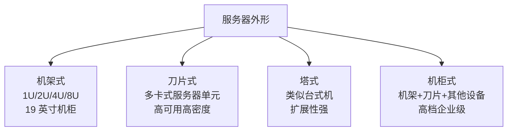

# 08-02 工作站与服务器

比较工作站、服务器与个人计算机的目标和硬件组织，理解各自在 CPU、内存、I/O、可靠性与应用场景上的差异。

> [!info] 导航
> 上一节：[[08-01 PC 体系结构与 ISA-PCIe 总线演进]] · 课程总览：[[计算机系统/微机原理与接口技术B/MOC - 微机原理与接口技术|总 MOC]] · 本章目录：[[计算机系统/微机原理与接口技术B/08 系统发展与扩展/MOC - 08 系统发展与扩展|第 8 章 MOC]] · 下一节：[[08-03 SoC 与嵌入式系统]]
>
> **内容主线**：[[#8.2 工作站|工作站]] → [[#8.2.1 配置和功能|配置和功能]] → [[#8.2.3 工作站的特点|工作站的特点]] → [[#8.3 服务器|服务器]]

## 8.2 工作站

### 8.2.1 配置和功能

> [!abstract] 工作站定义
> 工作站是由计算机、相应的外部设备以及成套的应用软件包所组成的信息处理系统，能够完成用户交给的特定任务，在编程、计算、文件书写、存档以及通信等方面给专业工作者以综合的帮助。
>
> 常见的工作站有：
> - **计算机辅助设计**（CAD）工作站（或工程工作站）
> - **办公自动化**（OA）工作站
> - **图形工作站**

### 8.2.2 分类

> [!info] 按操作系统分类
> | 类别 | 处理器 | 操作系统 | 图形系统 | 特点 |
> | :--- | :--- | :--- | :--- | :--- |
> | 基于 UNIX 的工作站 | 多采用 RISC 处理器，针对特定场景优化 | UNIX 或类 UNIX（含 Linux） | — | 彼此互不兼容；Linux 工作站能最大程度降低拥有成本 |
> | 基于 Windows 的工作站 | 英特尔至强处理器 | Windows 7 32/64 位 | OpenGL 4.4 和 DirectX 12 | 配合高性能存储、I/O、网络子系统满足专业软件要求 |

> [!info] 按体积与便携性分类
> - **台式工作站**：类似普通台式计算机，体积较大，没有便携性，但性能强劲，适合专业用户
> - **移动工作站**：性能相当于高性能笔记本电脑，但在系统稳定性和专业计算能力方面比普通笔记本电脑有较大提升

**表 8-2 工作站软、硬件配置及功能**

| 工作站 | 硬件配置 | 软件配置 | 功能 |
| :--- | :--- | :--- | :--- |
| CAD 工作站 | 计算机、带有功能键的 CRT 终端、光笔、平面绘图仪、数字化仪、打印机 | 操作系统、编译程序、数据库和数据库管理系统、2D/3D 绘图软件、计算/分析软件包 | 完成各种机械/电气设计任务 |
| OA 工作站 | 计算机、办公用终端设备（如电传打字机、交互式终端、传真机、激光打印机、智能复印机）、通信设施（如局部区域网、程控交换机、公用数据网、综合业务数字网） | 操作系统、编译程序、服务程序、数据库和数据库管理系统、文字/表格处理软件、编辑软件、专门业务活动的软件包（如人事管理、财务管理、行政事务管理等） | 完成各种办公信息处理 |
| 图形工作站 | 顶级计算机、超强性能的显卡、图像数字化设备（包括电子/光学/机电扫描设备/数字化仪）、图像输出设备、交互式图像终端 | 操作系统、编译程序、图像处理软件包 | 完成各种图像处理任务 |

### 8.2.3 工作站的特点

#### 1. CPU

> [!info] 工作站 CPU 历史演变
> - **早期**：传统工作站 CPU 并非 Intel 和 AMD 公司 CPU，而是使用 RISC 架构处理器（PowerPC、SPARC、Alpha 等），相应的操作系统一般为 UNIX 或其他专门的操作系统
> - **20 世纪 80 年代早期**：RISC 架构处理器在单位成本上提供比 CISC 处理器高几个数量级的性能
> - **20 世纪 80 年代**：CISC 处理器一族（Intel 的 x86 系列）渐渐侵占市场份额
> - **20 世纪 90 年代中期**：Intel 的 CPU 终于拥有了同 RISC 相提并论的性能，并将后者赶进了一个狭窄的市场
>
> 参见 [[01-01 计算机体系结构与系统组成]] 中关于 CISC/RISC 的对比。

> [!important] 工作站与服务器处理器选择原则
> 工作站与服务器处理器通常更强调：
> - 多核扩展能力
> - 内存容量与带宽
> - ECC 支持
> - I/O 通道
> - 可靠性和可管理性
>
> 处理器选择应由工作负载、软件授权、能耗、可用性与总体成本共同决定，不能只按品牌、核心数或制程判断。

#### 2. 显卡

> [!info] 3D 专业显卡
> 作为图形工作站的主要组成部分，性能强劲的 3D 专业显卡的重要性从某种意义上来说甚至超过了处理器。与针对游戏、娱乐市场为主的消费类显卡相比，3D 专业显卡主要面对的专业 OpenGL 应用市场包括：
> - 三维动画（3ds MAX、Maya、Softimage3D）
> - 渲染（LightScape、3ds VIZ）
> - CAD（AutoCAD、Pro/Engineer、Unigraphics、SolidWorks）
> - 模型设计（Rhino）
> - 部分科学应用
>
> 图形工作站的硬件无论是速度、稳定性还是软件的兼容性都很重要。当前主流显卡有 NVIDIA 的 GeForce 系列、Quadro 系列、TITAN 系列以及 AMD 的 Radeon 系列。

> [!note] 专业级与娱乐级显卡的融合趋势
> 整个 3D 专业显卡市场已经成了 NVIDIA 和 AMD 收购的 ATI 的天下。由于工作需求不同，工作站的显卡与消费类显卡差别比较大。目前 NVIDIA 和 ATI 的趋势是将娱乐级产品和专业级产品统一到几乎完全相同的硬件架构下，甚至是完全相同的芯片。

#### 3. 内存

> [!info] ECC 与 Registered DIMM
> - **ECC**（Error-Correcting Code）内存：通过额外校验信息检测并纠正特定位错误
> - **Registered DIMM**（注册式内存）：在控制信号路径上增加寄存器，以改善高容量、多插槽系统中的电气负载和稳定性
>
> Registered DIMM 的主要目标不是"显著加快访问"，而是**提升可扩展性与可靠性**。

#### 4. 硬盘

> [!info] 工作站硬盘分类
> - **按存储介质**：固态硬盘、机械硬盘、混合硬盘
> - **按接口种类**：SAS 硬盘、SATA（Serial ATA）硬盘、SCSI 硬盘
>
> 工作站对硬盘的要求介于普通台式机和服务器之间：
> - 低端工作站：一般使用与台式机一样的 SATA 或 SAS 硬盘
> - 中高端工作站：使用 SAS 或固态硬盘

> [!abstract] RAID（独立磁盘冗余阵列）
> RAID（Redundant Array of Independent Disks）通过条带、镜像和校验组合多个设备。

**表 8-A　常见 RAID 级别对比**

| RAID 级别 | 最少盘数 | 是否提供冗余 | 特点 |
| :--- | :--- | :--- | :--- |
| RAID 0 | 2 块 | 否 | 条带，性能最高，无容错 |
| RAID 1 | 2 块 | 是 | 镜像，容量利用率 50% |
| RAID 5 | 3 块 | 是 | 分布式校验，读写性能与容错平衡 |
| RAID 6 | 4 块 | 是 | 双校验，可容忍 2 盘故障 |
| RAID 10 | 4 块 | 是 | 镜像+条带，性能与冗余兼顾 |

> [!warning] RAID 不是备份
> RAID 可以提高可用性或性能，但**不能防止**误删除、恶意软件、文件系统损坏和整机灾害。重要数据仍需独立、可验证的备份。

#### 5. 高性能的 3D 图形配置

> [!info] 3D 图形配置要求
> 工作站很大程度上与图形软件结合。当前的图形软件上已经发展至 OpenGL 4.4 和 DirectX 12，只支持之前版本的专业图形卡以及非专业的游戏显卡已经逐渐无法满足。
>
> 传统的 CRT 和普通液晶已经越来越不能满足专业图形处理和模拟仿真等在色彩和屏分的需求，**高端专业的显示器已经成为主流**。

## 8.3 服务器

> [!abstract] 服务器
> 服务器也称为伺服器，可提供计算服务给各终端。由于服务器需要响应终端的服务请求，因此服务器应具备**承担服务并且保障服务**的能力。

### 8.3.1 分类

> [!info] 按体系架构分类
> | 类别 | 处理器类型 | 操作系统 | 特点 | 应用场景 |
> | :--- | :--- | :--- | :--- | :--- |
> | 非 x86 服务器 | RISC 或 EPIC（并行指令代码）处理器，如 IBM Power/PowerPC、SUN 与富士通 SPARC、Intel 安腾 | UNIX 和其他专用操作系统 | 价格昂贵、体系封闭，但稳定性好、性能强 | 金融、电信等大型企业的核心系统 |
> | x86 服务器 | 兼容 x86-64 指令集的处理器 | Linux、Windows Server、BSD 等 | 可靠性、安全性和适用业务取决于整机冗余、固件、操作系统、运维与应用架构，不能由指令集直接推断 | 通用服务器场景 |

> [!note] EPIC 与 VLIW
> 超长指令字应写作 VLIW（Very Long Instruction Word）；Intel IA-64 使用 EPIC 设计思想，与传统 x86-64 不是同一 ISA。

服务器按应用层次可分为：**入门级服务器、工作组级服务器、部门级服务器和企业级服务器**。随着应用层次的提高，各级服务器的特性依次提高，具体如表 8-3 所示。

**表 8-3 各级服务器特性**

| 服务器 | 特 性 |
| :--- | :--- |
| 入门级服务器 | 有些基本硬件的冗余，如硬盘、电源、风扇等，但不是必须 通常采用 SCSI 接口硬盘，也有采用 SATA 串行接口 部分部件支持热插拔，如硬盘和内存等，但不是必须 通常只有一个 CPU，但不是绝对 主要采用 Windows 或者 NetWare 网络操作系统 所连终端比较有限，通常为 20 台左右 可以充分满足办公型中小型网络用户的文件共享、数据处理、Internet 接入及简单数据库应用的需求；在稳定性、可扩展性以及容错冗余等方面性能较差，仅适合无大型数据库数据交换，日常工作网络流量不大，不需长期不间断开机的小型企业。 |
| 工作组服务器 | 通常仅支持单或双 CPU 结构（但不是绝对的，特别是 SUN 的工作组服务器就有能支持多达 4 个处理器的工作组服务器） 支持大容量的 ECC 内存和增强服务器管理功能的 SM 总线 采用 Intel 服务器 CPU 和 Windows/NetWare 网络操作系统，有的采用 UNIX 操作系统 只能连接一个工作组，50 台左右终端 较入门级服务器的性能有所提高，但容错和冗余性能仍不完备，不能满足大型数据库系统的应用 |
| 部门级服务器 | 一般支持双 CPU 以上的对称处理器结构，具备比较完全的硬件配置，如磁盘阵列、存储托架等 集成了大量的监测及管理电路，具有全面的服务器管理能力，可监测如温度、电压、风扇、机箱等状态参数 具有优良的系统扩展性，能够满足用户在业务量迅速增大时及时在线升级系统 CPU 一般采用 IBM、SUN 和 HP 各自开发的 RISC 结构芯片，一般采用 UNIX 或 Linux 操作系统 可连接 100 个左右终端，其硬件配置相对较高 需要安装比较多的部件，所以机箱通常较大，采用机柜式 |
| 企业级服务器 | 最起码采用 4 个以上 CPU 的对称处理器结构，有的高达几十个 具有独立的双 PCI 通道和内存扩展板设计，具有高内存带宽，超强的数据处理能力和群集性能等 硬盘、电源、RAM、PCI 和 CPU 等具有热插拔性能 具有高度的容错能力、故障预警功能、在线诊断 机箱更大，一般为机柜式的，有的还由几个机柜来组成 配置固态硬盘，让高速存储更接近处理器，并将共享存储网络这个潜在的瓶颈剔除掉 适合运行在处理需要大量数据、高处理速度和对可靠性要求极高的金融、证券、交通、邮电、通信或大型企业 |

### 8.3.2 硬件特点

#### 1. 结构

> [!info] 服务器硬件组成
> 服务器系统的硬件构成与 PC 有众多相似之处，主要硬件构成包含：
> - 中央处理器
> - 内存
> - 芯片组
> - I/O 总线
> - I/O 设备
> - 电源和机箱等
>
> 但服务器具备比 PC 更高的硬件性能；同时，对数据相当敏感的应用还要求服务器提供数据备份功能。

#### 2. CPU

> [!info] 服务器 CPU 指令集
> 服务器处理器可采用 **x86-64、Arm、Power** 等不同指令集。
> - **CISC 处理器**：指英特尔生产的 x86 系列 CPU 及其兼容 CPU（其他厂商如 AMD、VIA 等生产的 CPU），基于 PC 体系结构，一般都是 32 位结构，也被称为 **IA-32 CPU**（IA，Intel Architecture，Intel 架构）
> - Intel IA-64 使用 **EPIC** 设计思想，与传统 x86-64 不是同一 ISA

> [!important] RISC/CISC 与微体系结构技术的区别
> - **RISC/CISC**：描述指令集设计取向
> - **超标量、深流水线和乱序执行**：属于微体系结构技术，两类处理器都可采用
>
> 比较服务器性能必须结合具体处理器、内存与 I/O 子系统以及工作负载，**不能只比较时钟频率或 ISA 标签**。

### 8.3.3 外形

#### 1. 机架式

> [!info] 机架式服务器
> 信息服务企业通常使用大型专用机房统一部署和管理大量服务器资源，机房设有严密的保安措施、良好的冷却系统、多重备份的供电系统，造价相当昂贵。如何在有限的空间内部署更多的服务器直接关系到企业的服务成本。
>
> 通常选用机械尺寸符合 **19 英寸工业标准**的机架式服务器，外形类似交换机，规格有：
> - **1U**（1U = 1.75 英寸 ≈ 4.445 cm）
> - **2U**
> - **4U**
> - **8U**
>
> 可安装在标准的 19 英寸机柜里面。

> [!tip] 机架式规格选择
> - **1U 机架式**：最节省空间，但性能和可扩展性较差，适合业务相对固定的使用领域
> - **4U 以上**：性能较高，可扩展性好，一般支持 4 个以上的高性能处理器和大量的标准热插拔部件，管理十分方便，适合大访问量的关键应用，但体积较大

#### 2. 刀片式

> [!abstract] 刀片式服务器
> 刀片式服务器是指在标准高度的机架式机箱内可插装多个卡式的服务器单元，实现**高可用和高密度**。
>
> - 每块"刀片"实际上是一块系统主板
> - 可以通过"板载"硬盘启动自己的操作系统（Windows Server 2016、Linux 等），类似一个个独立的服务器
> - 每块主板运行自己的系统，服务于指定的不同用户群，相互之间没有关联
> - 单片主板的性能较低，但管理员可以使用系统软件将这些主板集合成一个服务器集群
> - 在集群模式下，所有主板可以连接起来提供高速的网络环境，并同时共享资源
> - 每块"刀片"都是**热插拔**的，可以轻松替换，将维护时间减到最小

#### 3. 塔式

> [!info] 塔式服务器
> 塔式服务器的外形以及结构都与平时使用的台式计算机差不多，但服务器的主板扩展性较强、插槽也多，所以个头比普通主板大一些。
>
> - 主机机箱比标准的 ATX 机箱要大，一般会预留足够的内部空间，以便日后进行硬盘和电源的冗余扩展
> - 机箱比较大，相应配置也很高，冗余扩展更齐备，应用范围非常广
> - 是使用率最高的一种服务器，平时常说的**通用服务器**一般是指塔式服务器

#### 4. 机柜式

> [!note] 机柜式服务器
> 在一些高档企业服务器中，由于内部结构复杂，内部设备较多，有时会将许多不同的设备单元或几个服务器都放在一个机柜中，这种服务器就是机柜式服务器。
>
> 机柜式通常由**机架式服务器、刀片式服务器再加上其他设备组合**而成。

### 8.3.4 计算机、工作站和服务器

**表 8-B　计算机、工作站、服务器对比**

| 比较维度 | 个人计算机（PC） | 工作站 | 服务器 |
| :--- | :--- | :--- | :--- |
| 服务对象 | 单个用户，代表个人需求（基础） | 专业工作者，代表专业需求（图像） | 多终端/客户端，代表大众需求（后台） |
| 使用方式 | 一个时刻通常只为一个用户服务 | 高效完成专业工作 | 同时为多个终端服务，通过网络给客户端用户使用 |
| CPU | Intel/AMD x86 系列 | 早期 RISC（PowerPC、SPARC、Alpha），现多用至强 | x86-64、Arm、Power、EPIC 等多种指令集 |
| 显卡 | 消费级显卡 | 3D 专业显卡（Quadro、FirePro 等） | 集成或服务器专用显卡，注重功耗与稳定性 |
| 内存 | 普通 DIMM | ECC 内存 | ECC、Registered DIMM，大容量、高带宽 |
| 硬盘 | SATA 单盘 | SAS/SATA/SSD，可组 RAID | SAS/SSD，多种 RAID，热插拔 |
| 可靠性 | 一般 | 较高 | 24×7 连续工作，冗余电源、热插拔、故障预警 |
| 操作系统 | Windows XP/7/10 等 | UNIX/Linux/Windows 7 32/64 位 | Windows Server 2008/2012/2016、Linux、UNIX |
| 典型应用 | 办公、娱乐、个人计算 | CAD、图形图像处理、科学计算 | Web 服务、数据库、文件共享、虚拟化 |

#### 1. 服务器和计算机

> [!info] 服务器 vs 计算机
> | 维度 | 计算机 | 服务器 |
> | :--- | :--- | :--- |
> | 服务方式 | 一个时刻通常只为一个用户服务 | 可同时为多个终端服务 |
> | 用户接入 | 通过终端给用户使用 | 通过网络给客户端用户使用 |
> | 运行时间 | 按需开关机 | 连续工作在 24 小时环境 |
> | 硬件配置 | 标准配置 | 配置更高，需要更可靠的硬件支持 |
> | 操作系统 | Windows XP/7/10 等 | Windows Server 2008/2012/2016 和 Linux、UNIX 等 |
>
> 从硬件层次上来说，服务器与一般计算机一样均由 CPU、内存、主板、显卡、硬盘等组成，但由于服务器需要具备更强的处理数据能力，因此主板上通常会安装多个处理器、内存、硬盘。

#### 2. 服务器和工作站

> [!abstract] 服务器 vs 工作站
> 虽然工作站与服务器一样，都是一台高性能的计算机，但二者侧重不同：
> - **服务器**：强调**稳定性**
> - **工作站**：侧重工作时的高效性，具有极强的信息、图形和图像处理能力
>
> 此外，连接到服务器的终端机通常为工作站。

> [!tip] 三者关系的简洁概括
> 计算机、工作站和服务器分别代表的是：
> - **个人需求**（基础）
> - **专业需求**（图像）
> - **大众需求**（后台）
>
> 三者互相联系，互相区别。
