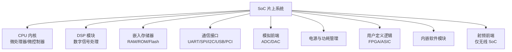
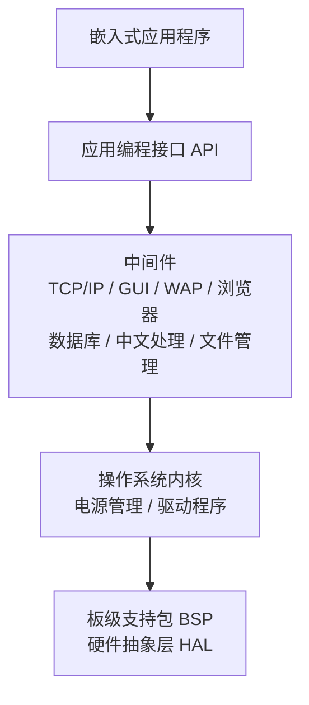

# 08-03 SoC 与嵌入式系统

说明 IP 复用、软硬件协同设计和嵌入式系统组成，理解 SoC 的模块化架构与嵌入式系统的层次结构。

> [!info] 导航
> 上一节：[[08-02 工作站与服务器]] · 课程总览：[[计算机系统/微机原理与接口技术B/MOC - 微机原理与接口技术|总 MOC]] · 本章目录：[[计算机系统/微机原理与接口技术B/08 系统发展与扩展/MOC - 08 系统发展与扩展|第 8 章 MOC]] · 下一节：[[08-04 多核处理器]]
>
> **内容主线**：[[#8.4 SoC 与嵌入式系统|SoC 与嵌入式系统]] → [[#8.4.1 SoC|SoC]] → [[#1. IP 核复用技术|IP 核复用技术]] → [[#2. 软硬件协同设计|软硬件协同设计]]

## 8.4 SoC 与嵌入式系统

### 8.4.1 SoC

> [!abstract] SoC 定义
> - **狭义**：片上系统（System on Chip，SoC）是信息系统核心的芯片集成，将系统关键部件集成在一块芯片上
> - **广义**：一个微小型系统，在单片上集成系统级、多元化的大规模功能模块，构成能够处理各种信息的集成系统
>
> SoC 通常是**客户定制的**，或是面向特定用途的标准产品。

**表 8-A　SoC 主要组成模块**

| 模块类别 | 功能说明 |
| :--- | :--- |
| 系统级芯片控制逻辑模块 | 协调片内各模块工作 |
| 微处理器/微控制器 CPU 内核模块 | 执行指令、控制流程 |
| 数字信号处理器 DSP 模块 | 信号处理加速 |
| 嵌入的存储器模块 | 片上 RAM/ROM/Flash |
| 与外部通信的接口模块 | UART、SPI、I2C、USB、PCI 等 |
| 含 ADC/DAC 的模拟前端模块 | 模拟/数字信号转换 |
| 电源提供和功耗管理模块 | 电压转换、功耗控制 |
| 用户定义逻辑 | 可由 FPGA 或 ASIC 实现 |
| 微电子机械模块 | MEMS 传感/执行 |
| 射频前端模块 | 仅无线 SoC 包含 |
| 基本软件模块/可载入用户软件 | 片内固件或可加载软件 |

SoC 设计中有如下几个关键技术。

#### 1. IP 核复用技术

> [!abstract] IP 核
> IP 核（知识产权核或知识产权模块）实际是指将一些在数字电路中常用但比较复杂的功能块（如 FIR 滤波器、SDRAM 控制器、PCI 接口等）设计成可修改参数的模块，用于 SoC 或复杂的 ASIC 设计中。
>
> 随着 CPLD/FPGA 规模越来越大、设计越来越复杂，IP 核复用技术能避免重复劳动、大大减轻工程师负担，**缩短产品上市时间**，已成为发展趋势。

IP 核主要分为**软核、固核和硬核**三种，依据产品交付方式区分。

**表 8-4 IP 核分类及特点**

| IP 核 | 提交形式 | 用户设计开发成本 | 灵活性 | 可靠性 | 价 格 |
| :--- | :--- | :--- | :--- | :--- | :--- |
| 软核 | RTL 级代码 | 高，设计周期长 | 较大，易于移植 | 较差，用户可以修改配置 | 便宜 |
| 固核 | 门级网表 | 中 | 中 | 中 | 中 |
| 硬核 | 物理版图文件 | 低，设计周期短 | 较差，不易移植 | 较强，易于保护 | 高 |

#### 2. 软硬件协同设计

> [!info] 传统设计方法的局限
> 受电子技术特别是可编程技术的限制，传统设计方法将硬件和软件分为两个独立的部分进行设计：
> - 在整个设计过程中采用**硬件优先**原则
> - 一般先进行硬件设计，再在硬件设计平台上进行软件设计
>
> 随着各种大规模可编程集成电路的广泛应用，传统方法的局限性已成为限制可编程芯片充分发挥性能的障碍。

> [!abstract] 软硬件协同设计
> 软硬件协同设计依据系统设计为目标，通过综合分析系统软硬件功能及现有资源，对系统中的软件和硬件部分**使用统一的描述和工具进行集成开发**，可完成全系统的设计验证并跨越软硬件界面进行系统优化。
>
> 核心思想：使软件设计和硬件设计作为**一个有机的整体**进行并行设计，实现软件与硬件的最佳结合，使系统获得高效工作能力。

![[计算机系统/微机原理与接口技术B/附件/第8章/Pasted image 20260719164423.png]]
*图 8-6 软硬件协同设计流程*

（流程图结构：系统描述 → 硬件/软件任务划分 → 硬件设计 / 硬件/软件接口 / 软件设计 → 仿真验证 → 综合实现）

> [!important] 软硬件协同设计的核心优点
> 软硬件协同设计最主要的优点是在设计过程中，硬件和软件设计是**相互作用**的，这种相互性体现在设计过程的各阶段和各层次，充分实现了软硬件的协同性：
> - 在软硬件任务划分时就考虑了现有软件和硬件的资源
> - 在软硬件功能设计和仿真评价过程中，软件和硬件是互相支持的
> - 软硬件功能模块能够在设计开发的早期互相结合，**及早发现和解决系统设计的问题**
> - 避免了在设计开发后期反复修改所带来的一系列问题
> - 有利于充分挖掘系统潜能、缩小体积、降低成本、提高整体效能

#### 3. SOPC

> [!abstract] SoPC
> Altera 公司在 2000 年提出的 **SoPC**（System on a Programmable Chip）是 SoC 技术与可编程逻辑技术结合的产物，即**基于大规模 FPGA 的单芯片系统**。
>
> Altera 公司同时推出了相应的开发软件 **SOPC Builder** 和可供使用的 IP 核，还有很多公司开发的 IP 核可供选择。Altera 公司提供了 SoPC 开发的整体方案，所以开发效率高、成本低，且不存在兼容性的问题。

> [!info] SoPC 嵌入式微处理器 IP 核
> 在 Altera 公司所提供的 SoPC 系统中，嵌入式微处理器的 IP 核分软核和硬核两种：
> - **硬核**：可以是 ARM 或其他的微处理器 IP 核
> - **软核**：
>   - Altera 公司的 **Nios** 系列软核（最具代表性）
>   - Xilinx 公司的 **MicroBlaze** 核

### 8.4.2 嵌入式系统

> [!abstract] 嵌入式系统
> 嵌入式系统是 SoC 的基本结构。在使用 SoC 技术设计的应用电子系统中，可以十分方便地实现嵌入式结构——只要根据系统需要选择相应的内核，再根据设计要求选择与之相配合的 IP 模块，就可以完成整个系统硬件结构。
>
> SoC 的这种嵌入式结构可以大大缩短应用系统设计开发周期。

> [!info] 嵌入式系统定义
> - **广义**：以应用为中心，以计算机技术为基础，软硬件可裁剪，适应应用系统对功能、可靠性、成本、体积、功耗等严格要求的**专用计算机系统**
> - **狭义**：嵌入到对象体中的专用计算机系统
>
> 嵌入式系统在应用数量上远远超过了各种通用计算机——一台通用计算机的外部设备中就包含了若干嵌入式处理器，键盘、鼠标、显卡、显示器、网卡、声卡和打印机等均是由嵌入式处理器控制的。

> [!tip] 嵌入式系统 vs 通用计算机
> 嵌入式系统是 SoC 的基本结构，强调"专用"与"嵌入"；通用计算机强调"通用"与"独立"。SoC 通过嵌入预选内核与配合 IP 模块即可形成嵌入式应用结构。

#### 1. 嵌入式系统硬件及软件组成

> [!info] 嵌入式系统硬件组成
> 嵌入式系统的硬件主要包括：
> - 嵌入式处理器
> - 嵌入式系统存储器
> - I/O 接口及常用的 I/O 设备
> - 典型 ARM 处理芯片
> - 嵌入式互连通信接口

> [!info] 嵌入式系统软件组成
> 嵌入式系统软件组成如图 8-7 所示。对于简单的应用，如不使用操作系统或仅使用小型操作系统的嵌入式系统，软件组成也不尽相同。
>
> **板级支持包**（Board Support Package，BSP）和**硬件抽象层**（Hardware Abstract Layer，HAL）与 PC 的**基本输入/输出系统**（Basic Input Output System，BIOS）相似。
>
> 不同的嵌入式微处理器、不同的硬件平台或不同的操作系统，BSP/HAL 也不同。

![[计算机系统/微机原理与接口技术B/附件/第8章/Pasted image 20260719164431.png]]
*图 8-7 嵌入式系统软件组成*

（图内容：嵌入式应用程序 → 应用编程接口 API → 包含 TCP/IP 协议、GUI、WAP、浏览器、数据库、中文处理、文件管理系统、操作系统内核、电源管理、驱动程序 → 板级支持包 BSP / 硬件抽象层 HAL）

#### 2. 嵌入式处理器

> [!abstract] 嵌入式处理器
> 嵌入式系统硬件部分的核心是嵌入式处理器。按集成方式和主要用途，常见实现可概括为四类：
> - **微控制器**（MCU，Microcontroller Unit）
> - **微处理器**（MPU，Microprocessor Unit）
> - **数字信号处理器**（DSP，Digital Signal Processor）
> - **片上系统**（SoC，System on Chip）
>
> 这些类别并非严格互斥，例如 SoC 中可以同时集成 CPU、DSP、存储控制器和专用加速器。

**表 8-B　嵌入式处理器四类对比**

| 类别 | 典型代表 | 特点 |
| :--- | :--- | :--- |
| 嵌入式微控制器 MCU | 单片机：8051、P51XA、MCS-251、MCS-96/196/296、MC68HC05/11/12/16、68300 | 将整个计算机系统集成到一块芯片中；以某种微处理器内核为核心，集成 ROM/EPROM、RAM、总线、定时/计数器、看门狗、I/O、串行口、A/D 及 D/A 等必要功能部件和外设；片上外设资源丰富，适合工业控制场合 |
| 嵌入式微处理器 MPU | PowerPC、MIPS、ARM 系列 | 由通用计算机中的 CPU 演变而来；装配在专门设计的电路板上，只保留和嵌入式应用有关的功能，可大幅减小系统体积和功耗；具有体积小、重量轻、成本低和可靠性高等优点 |
| 嵌入式数字信号处理器 DSP | TI TMS320C2000/C5000、Infineon Tricore | 两个发展来源：① DSP 经单片化、电磁兼容性改造，增加片上外设成为嵌入式 DSP；② 在通用单片机或 SoC 中增加 DSP 协处理器 |
| 嵌入式片上系统 SoC | Infineon Tricore、STMicroelectronics STM32 系列、Philips Smart XA | 分通用和专用两类。专用 SoC 一般专用于某个或某类系统中，如 Philips Smart XA 将 XA 单片机内核和支持超过 2048 位复杂 RSA 算法的 CPU 单元制作在一块硅片上，形成可加载 JAVA 和 C 语言的专用 SoC，可用于公众互联网的安全方面 |

#### 3. 嵌入式操作系统

> [!abstract] 嵌入式操作系统
> 嵌入式操作系统是一种用途广泛的系统软件，通常包括：
> - 与硬件相关的底层驱动软件
> - 系统内核
> - 设备驱动接口
> - 通信协议
> - 图形界面
> - 标准化浏览器等
>
> 嵌入式操作系统负责嵌入式系统的全部软硬件资源的分配、任务调度、控制、协调并发活动。嵌入式操作系统可充分体现其所在系统的特征，并通过装卸某些模块来达到系统所要求的功能。

> [!info] 嵌入式操作系统主要特点
> - 实时性
> - 可移植性
> - 内核小型化
> - 可裁剪
>
> 目前，在嵌入式领域广泛使用的操作系统有 $\mu$C/OS、嵌入式 Linux、Windows CE、Android 和 VxWorks 等。

**表 8-C　主流嵌入式操作系统对比**

| 操作系统 | 来源/厂商 | 主要特点 |
| :--- | :--- | :--- |
| $\mu$C/OS | 源码公开的实时嵌入式操作系统 | 提供嵌入式系统的基本功能，核心代码短小精悍；对大型商用嵌入式系统而言稍显简单；已被移植到 ARM 系列、Intel 8051、80x86、Motorola PowerPC 等系列 |
| Linux | 开源免费，类 UNIX | 适用于多用户嵌入式系统；存在不同版本但都使用 Linux 内核；可安装在手机、平板电脑、路由器、视频游戏控制台等设备 |
| Windows CE | 微软公司，1996 年发布 | 简洁、高效的多平台操作系统；为有限资源的平台设计的多线程、完全优先级、多任务的操作系统；用于 PDA、Pocket PC、Smart Phone、工业控制、医疗设备；微软还推出针对移动设备的 Windows Mobile |
| Android | Google 公司，以 Linux Kernel 为核心 | 开源代码，用户可裁剪或扩展；全球最受欢迎的智能手机操作系统；平板电脑市场占有率逐年上升；主要采用厂商为国内众多手机厂商和嵌入式教学实验平台 |
| VxWorks | 美国 Wind River System 公司，1983 年 | 实时操作系统；既是操作系统，也是可运行的最小基本程序；有 BSP 可减小驱动程序的编写过程；具有强大的调试能力，可在没有仿真器的情况下通过串口调试；具有丰富的函数库 |
