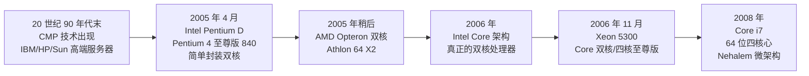
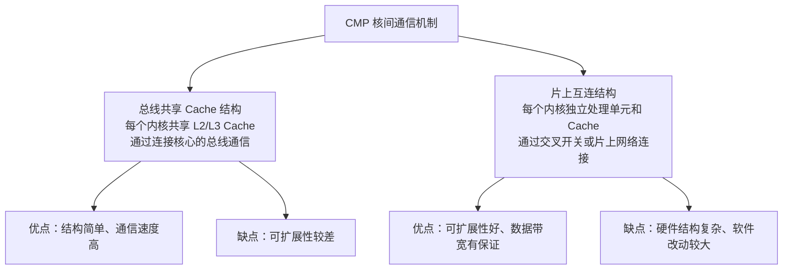

# 08-04 多核处理器

理解多核并行的动机、组织方式和软件挑战，区分 CMP 与 SMT、原生多核与封装多核，掌握核间通信机制与 Cache 一致性问题。

> [!info] 导航
> 上一节：[[08-03 SoC 与嵌入式系统]] · 课程总览：[[计算机系统/微机原理与接口技术B/MOC - 微机原理与接口技术|总 MOC]] · 本章目录：[[计算机系统/微机原理与接口技术B/08 系统发展与扩展/MOC - 08 系统发展与扩展|第 8 章 MOC]] · 下一节：[[08-05 并行、分布式、集群与云计算]]
>
> **内容主线**：[[#8.5 多核处理器|多核处理器]] → [[#8.5.1 发展历程|发展历程]] → [[#8.5.2 多核技术|多核技术]] → [[#8.5.3 多核处理器开发应用|多核处理器开发应用]]

## 8.5 多核处理器

> [!abstract] 多核处理器
> 多核处理器是指在一枚处理器中集成两个或多个完整的计算引擎（内核），此时处理器能支持系统总线上的多个处理器，由总线控制器提供所有总线控制信号和命令信号。
>
> 多核处理器通过片上互连（环形总线、Mesh 等）通信，配合多线程与并行编译提升系统吞吐。

> [!info] 原生多核 vs 封装多核
> 多核处理器主要分**原生多核**和**封装多核**两类：
>
> | 类型 | 提出 | 结构 | 性能 | 成本 | 工艺要求 |
> | :--- | :--- | :--- | :--- | :--- | :--- |
> | 原生多核 | 最早由 AMD 提出 | 每个内核完全独立，拥有自己的前端总线 | 抗压能力强，高负载下性能稳定 | 较低 | 需先进工艺，每扩展一个内核需要大量研发时间 |
> | 封装多核 | Intel 早期 PD 双核系列 | 把多个内核直接封装在一起，两个内核共同拥有一条前端总线 | 满载时争抢前端总线，性能大幅下降 | 较高 | 发展速度快于原生多核 |

### 8.5.1 发展历程

> [!important] 多核技术出现的必然性
> 推动微处理器性能不断提高的因素主要有两个，二者相互影响、相互促进：
> - **半导体工艺技术**的飞速进步
> - **体系结构**的不断发展
>
> 三类技术对性能提升的贡献量级：
> | 技术因素 | 性能提升倍数 |
> | :--- | :--- |
> | 工艺技术发展 | 约 20 倍 |
> | 体系结构发展 | 约 4 倍 |
> | 编译技术发展 | 约 1.4 倍 |

> [!warning] 单纯提升主频的极限
> 自第一款通用型微处理器 4004 诞生以来，处理器芯片一直遵循**摩尔定律**发展。但到 2005 年这种规律难以维持：
> - 当处理器主频接近 **4 GHz** 时，Intel 和 AMD 发现速度遇到极限
> - 单纯主频提升已无法明显提升系统整体性能
> - 随着功率增大，**散热问题**成为无法逾越的障碍
> - 晶体管数量增加导致功耗增长超过性能增长速度后，处理器可靠性会受到致命性影响
>
> 于是多核处理器解决方案应运而生。

> [!info] 多核处理器发展关键节点
> - **20 世纪 90 年代末**：CMP（单芯片多处理器）技术已出现，用来替代复杂性较高的单线程 CPU。IBM、HP、Sun 等高端服务器厂商相继推出多核服务器 CPU
> - **2005 年 4 月**：Intel 仓促推出简单封装双核的 **Pentium D** 和 **Pentium 4 至尊版 840**
> - **2005 年稍后**：AMD 发布双核**皓龙（Opteron）**和**速龙（Athlon）64 位 X2** 处理器
> - **2006 年**：真正的"双核处理器"被认为是 Intel 基于酷睿（Core）架构的处理器
> - **2006 年 11 月**：Intel 推出面向服务器、工作站和高端个人计算机的**至强（Xeon）5300**、酷睿双核和四核至尊版系列处理器
>   - 与上一代台式机处理器相比，酷睿双核处理器性能提高 **40%**，功耗反而降低 **40%**
>   - Intel 发布功耗仅为 **50 W** 的低电压版四核至强处理器
>   - AMD 的"Barcelona"四核处理器功耗不超过 **95 W**
> - **2008 年**：Intel 推出 **Core i7** 处理器，64 位四核心 CPU，沿用 x86-64 指令集，以 Intel Nehalem 微架构为基础，取代 Intel Core 2 系列

> [!important] 多核的"分治法"战略
> Intel 的多核芯片采用"**横向扩展**"（而非"纵向扩充"）方法提高性能，实现了"分治法"战略：
> - 通过划分任务，线程应用能够充分利用多个执行内核
> - 可在特定的时间内执行更多任务
> - 操作系统会利用所有相关的资源，将每个执行内核作为分立的逻辑处理器
> - 通过在两个执行内核之间划分任务，多核处理器可在特定的时钟周期内执行更多任务

> [!tip] 软件兼容性
> 随着向多核处理器的移植，**现有软件不需被修改**就可支持多核平台。为了充分利用多核技术，应用开发人员需要在程序设计中融入更多思路，但设计流程与对称多处理系统的设计流程相同，并且现有的单线程应用也将继续运行。

### 8.5.2 多核技术

#### 1. 技术种类

> [!abstract] CMP 与 SMT
> 多核处理器体系结构可分为：
> - **单芯片多处理器**（CMP，Chip MultiProcessor）
> - **同时多线程处理器**（SMT，Simultaneous Multithreading）
>
> 这两种体系结构可以充分利用一些应用的指令级并行性和线程级并行性，从而显著提高应用性能。
>
> - **CMP**：在一个芯片上集成多个微处理器内核，每个内核实质上都是一个单线程或比较简单的多线程微处理器，多个内核可以并行地执行程序代码，具有较高的线程级并行性
> - CMP 还能充分利用不同的应用指令级并行和线程级并行

**表 8-A　CMP vs SMT 对比**

| 比较维度 | CMP（单芯片多处理器） | SMT（同时多线程） |
| :--- | :--- | :--- |
| 处理器资源利用率 | 较低 | 较高 |
| 克服线延迟影响 | 较弱 | 较具优势 |
| 模块化设计 | 简洁，复制简单设计非常容易 | 较复杂 |
| 指令调度 | 更加简单 | 较复杂 |
| 共享资源争用 | 较少 | 多个线程对共享资源的争用会影响性能 |
| 线程级并行性较高时性能 | 优于 SMT | 较差 |
| 芯片连线 | 更短，更易提高运行频率 | 长导线集中式设计，提高频率较难 |
| 适用场景 | 线程级并行性较高的应用 | 充分利用处理器闲置资源 |

> [!important] CMP 与 SMT 的核心权衡
> - 从体系结构角度看，**SMT 比 CMP 对处理器资源利用率要高**，在克服线延迟影响方面更具优势
> - CMP 相对 SMT 的最大优势在于其**模块化设计的简洁性**，复制简单设计非常容易，指令调度更加简单
> - SMT 中多个线程对共享资源的争用会影响其性能，而 CMP 对共享资源的争用要少得多
> - 当应用的线程级并行性较高时，CMP 性能一般要优于 SMT
> - 在设计上，更短的芯片连线使 CMP 比长导线集中式设计的 SMT 更容易提高芯片的运行频率

#### 2. 技术原理

> [!info] 1. 核结构研究
> 多核处理器的结构分**同构**和**异构**两类：
> - **同构**：内部核的结构相同
> - **异构**：内部核的结构不同
>
> 核所用的指令系统对多核处理器性能很重要——多核之间采用相同的指令系统还是不同的指令系统、能否运行操作系统等，也是研究内容之一。

> [!info] 2. 多级 Cache 设计与一致性问题
> 处理器与主存间的速度差距对 CMP 来说是个突出的矛盾，因此必须使用多级 Cache 来缓解。目前有：
> - 共享一级 Cache
> - 共享二级 Cache
> - 共享主存的 CMP
>
> Cache 自身的体系结构设计直接关系到系统整体性能。在 CMP 结构中共享 Cache 或独有 Cache、在一块芯片上建立几级 Cache 等，对整个芯片的尺寸、功耗、布局、性能以及运行效率都有很大影响。

> [!important] Cache 一致性问题
> 多级 Cache 引发了一致性问题。在处理器系统结构中广泛采用的 **Cache 一致性模型**有：
> - 顺序一致性模型
> - 弱一致性模型
> - 释放一致性模型
>
> 相关的 **Cache 一致性机制**主要有：
> - **基于总线的侦听协议**（CMP 系统大多采用）
> - **基于目录的目录协议**

> [!info] 3. 核间通信技术
> CMP 处理器的各内核执行的程序之间有时需要进行数据共享与同步，因此其硬件结构必须支持核间通信。目前比较主流的片上高效通信机制有两种：

> [!tip] 未来发展方向
> 上述两种通信机制的竞争结果可能是**互相合作**：如在全局范围采用片上网络而局部采用总线方式，以达到性能与复杂性的平衡。

> [!info] 4. 总线设计
> 传统微处理器中，Cache 不命中或访存事件都会对 CPU 的执行效率产生负面影响，而 **BIU**（总线接口单元）的工作效率会决定此影响的程度。
>
> CMP 处理器研究的重要内容之一：
> - 当多个 CPU 核心同时要求访问内存或多个 CPU 核心内私有 Cache 同时出现 Cache 不命中事件时
> - **BIU 对多个访问请求的仲裁机制**以及对外存储访问的转换机制的效率决定了 CMP 系统的整体性能
>
> 研究方向包括：
> - 寻找高效的多端口 BIU 结构
> - 将多内核对主存的单字访问转为更为高效的**猝发（burst）访问**
> - 寻找对 CMP 处理器整体效率最佳的一次 Burst 访问字的数量模型
> - 高效多端口 BIU 访问的仲裁机制

### 8.5.3 多核处理器开发应用

> [!warning] 多核带来的并行编程挑战
> 多核处理器的出现增加了并行的层次性，使得**并行程序的开发比以往更难**。无论是编程模型、开发语言还是开发工具，并无有效的并行计算解决方案。
>
> 主要挑战：
> - 并不是所有的操作系统和应用软件都做好了迎接多核平台的准备，尤其是在数十年来均为单一线程开发应用的 x86 服务器领域
> - x86 系统上软件的性能随着 Intel 和 AMD 处理器速度提升而不断提高，开发者只需对现有软件作轻微改动就可让性能随之提升
> - 多核设计概念的出现迫使软件设计人员不得不解决**并行性**问题——将单个任务拆分成多个小块分别处理之后再重新组合
> - 多核处理器和多路系统在服务器市场已经存在多年（在传统 UNIX 领域），一些运行在 RISC 架构多核多路系统上的应用程序已经被设计成多线程
> - 但在 x86 领域，应用程序开发者多年来仍一直停留在单线程设计上
> - **自动的并行化解决方案基本没有**，传统的手工式并行程序开发方式又难以为普通程序员所掌握

> [!info] 超线程与逻辑多核
> Intel 很早就通过**超线程技术**实现了逻辑上的双核处理器系统，可以并行计算。但：
> - 这不过是对处理器闲置资源的一种充分利用
> - 这种利用只有在特定的条件下，尤其是针对流水线比较长且两种运算并不交叉的时候才会有较高的效率
> - IBM 的 Power5 架构也需要与最新的操作系统进行融合，加上运行在其上的软件，才有可能利用并发多线程

> [!note] 相关链接
> 多核与同时多线程相关内容可参见 [[02-04 Pentium 系列处理器结构]]、[[08-05 并行、分布式、集群与云计算]] 中的并行计算部分。
