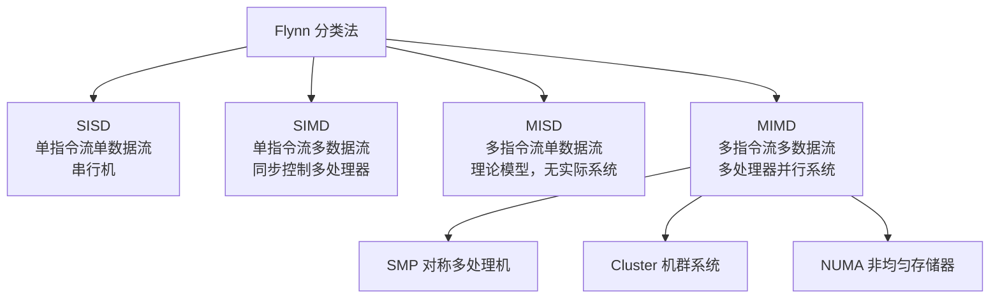

# 08-05 并行、分布式、集群与云计算

区分并行、分布式、集群、网格和云计算的系统边界，理解 Flynn 分类法、分布式系统组成与云计算特征。

> [!info] 导航
> 上一节：[[08-04 多核处理器]] · 课程总览：[[计算机系统/微机原理与接口技术B/MOC - 微机原理与接口技术|总 MOC]] · 本章目录：[[计算机系统/微机原理与接口技术B/08 系统发展与扩展/MOC - 08 系统发展与扩展|第 8 章 MOC]]
>
> **内容主线**：[[#8.6 并行计算与分布式计算|并行计算与分布式计算]] → [[#8.6.1 并行计算|并行计算]] → [[#1. 并行计算机系统分类|并行计算机系统分类]] → [[#8.6.3 云计算、集群计算及网格计算|云计算、集群计算及网格计算]]

## 8.6 并行计算与分布式计算

### 8.6.1 并行计算

> [!abstract] 并行计算
> 并行计算（Parallel Computing）是相对于串行计算来说的，是指**同时使用多种计算资源解决计算问题**的过程，是提高计算机系统计算速度和处理能力的一种有效手段。
>
> 基本思想：用多个处理器来协同求解同一问题，即将被求解的问题分解成若干部分，各部分均由一个独立的处理机来并行计算。
>
> 并行计算系统既可以是专门设计的、含有多个处理器的超级计算机，也可以是以某种方式互连的若干独立计算机构成的集群。

> [!info] 并行计算的两种形式
> | 形式 | 含义 | 典型实现 |
> | :--- | :--- | :--- |
> | 时间上的并行 | 流水线技术 | 指令流水线（参见 [[02-02 8086 与 8088 的内部结构]]） |
> | 空间上的并行 | 多个处理器并发执行计算 | 通过网络连接多个处理机，同时计算同一任务的不同部分 |

#### 1. 并行计算机系统分类

> [!abstract] Flynn 分类法
> 并行计算科学主要研究空间上的并行问题。根据计算机系统中**数据流和指令流的多倍性**，可以分为 4 类：

**表 8-A　Flynn 四类系统对比**

| 类型 | 全称 | 含义 | 实际系统 |
| :--- | :--- | :--- | :--- |
| SISD | Single Instruction Single Data | 单处理器执行单一指令流，对保存在单一可访问存储器内的数据操作 | 单处理器系统，无并行处理 |
| SIMD | Single Instruction Multiple Data | 单一指令同步控制多个处理器，每个处理器有相关的数据存储器，一条指令可在不同数据组上完成相同操作 | 向量计算机、GPU |
| MISD | Multiple Instruction Single Data | 对顺序数据进行多个处理器的操作，每个处理器执行不同的指令序列 | 实际系统中还没有完全的 MISD 计算机出现 |
| MIMD | Multiple Instruction Multiple Data | 多个处理器并行处理不同的指令序列，对不同数据进行加工操作 | 多处理器并行系统，是实际的并行系统主流 |

> [!info] MIMD 的三种组织方式
> MIMD 系统按各处理器通信方式进一步划分，目前普遍采用的并行多处理器组织方式有三种：
>
> | 类型 | 全称 | 特点 |
> | :--- | :--- | :--- |
> | SMP | 对称多处理机（Symmetric Multiprocessing） | 多个相同或相似的处理器共享一个存储器，每个处理器存取共享存储器中的程序和数据，并经由该存储器相互通信；是通常意义上的多处理器计算机 |
> | Cluster | 机群系统 | 由一组完整的计算机互连形成，作为统一的计算资源一起进行数据处理，整个机群外部可以看成一台机群进行处理 |
> | NUMA | 非均匀存储器访问（Non-Uniform Memory Access） | 通过共享存储器的方式实现多处理机并行工作；系统内某处理器对其内部存储器实现不同速度的读/写，对存储字存取时间随存储器字位置而变化 |

> [!important] SMP 的存储一致性问题
> 在 SMP 存储系统中，最重要的问题是**存储一致性**：每个处理器均具有独立的 Cache，当某一行数据出现在不同处理器的 Cache 中时，如果对一个 Cache 内容进行修改，那么其他 Cache 以及主存中内容也应得到更新。

#### 2. 并行计算机的发展

> [!info] 两个计算时代
> 20 世纪 40 年代开始的现代计算机发展历程可以分为两个明显的发展时代：
> - **串行计算时代**
> - **并行计算时代**
>
> 每个计算时代都从体系结构发展开始，接着是系统软件（特别是编译器与操作系统）、应用软件，最后随着问题求解环境的发展而达到顶峰。创建和使用并行计算机主要是因为并行计算机是解决单处理器速度瓶颈的最好方法之一。

> [!info] 并行计算机发展关键节点
> | 时期 | 事件 | 关键技术/产品 |
> | :--- | :--- | :--- |
> | 20 世纪 60 年代初 | 共享存储多处理器系统（大型主机 Mainframe） | IBM 360 |
> | 20 世纪 60 年代末 | 同一处理器设置多个功能相同的功能单元，流水线技术出现 | 流水线技术 |
> | 1975 年 | 16 个 CPU 系统面世 | 存储系统概念革新：虚拟存储和缓存；半导体存储器代替磁芯存储器 |
> | 1976 年 | CRAY-1 问世 | 向量计算机，采用精简指令集和向量寄存器，控制高性能计算机市场 15 年 |
> | 20 世纪 80 年代初 | 卡内基·梅隆大学 C.mmp | 16 个 PDP11/40 处理机通过交叉开关与 16 个共享存储器模块连接 |
> | 20 世纪 80 年代 | 总线协议扩展 | 伯克利加州大学提出 Cache 一致性问题的处理方案 |
> | 20 世纪 80 年代中期 | 加州理工 64 个 i8086/i8087 处理器 | 超立方体互连结构，基于消息传递机制 |
> | 20 世纪 80 年代末~90 年代初 | IBM 大量早期 RISC 微处理器互连 | 蝶形互连网络；分布式共享存储器的缓存一致性研究 |
> | 20 世纪 90 年代初 | 斯坦福大学 DASH 计划 | 通过维护保存每个缓存块位置信息的目录结构实现分布式共享存储器的缓存一致性；IEEE 在此基础上提出缓存一致性协议标准 |
> | 20 世纪 90 年代以来 | 体系结构走向融合 | MPI/PVM 等并行编程标准出现，机群架构的并行计算机出现 |
> | 20 世纪 90 年代 | IBM SP2 系列机群系统 | 各节点采用标准计算机，通过高速网络连接；这种分布存储的并行计算机系统称为机群 |

### 8.6.2 分布式计算

#### 1. 分布式计算定义

> [!abstract] 分布式计算
> - **广义**：分布式计算是一门计算机科学，研究如何把一个需要非常巨大的计算能力才能解决的问题分成许多小的部分，然后把这些部分分配给许多计算机进行处理，最后把这些计算结果综合起来得到最终的结果
> - **狭义**：一种新的计算方式，在两个或多个软件互相共享信息，这些软件既可以在同一台计算机上运行，也可以在通过网络连接的多台计算机上运行

> [!info] 网格计算
> 网格计算是分布式计算的一种，是由一群**松散耦合的计算机**组成的一个超级虚拟计算机，常用来执行一些大型任务。
>
> 网格计算的实质就是**组合与共享资源并确保系统安全**。

> [!example] 分布式计算项目示例
> 目前常见的分布式计算项目通常使用世界各地成千上万志愿者计算机的闲置计算能力，通过互联网进行数据传输。
>
> 如分析计算蛋白质的内部结构和相关药物的 **Folding@home** 项目需要惊人的计算量，由一台计算机来完成是不可能的，这时就需要分布式计算。

> [!info] BOINC 平台
> 全球的各种分布式计算已有约百种，大多互无联系、独立管理、独立使用自己的一套软件。为改变这种割据局面，加州大学伯克利分校提出了建立 **伯克利开放式网络计算平台**（Berkeley Open Infrastructure for Network Computing，BOINC）的想法：
> - 把许多不同的分布式计算项目联系起来统一管理
> - 对计算机资源进行统一分配
> - 对统计评分系统进行统一管理（无论为哪个项目工作，只要奉献 CPU 时间长，就积分高）
>
> 目前，多个项目已经成功运行于 BOINC 平台之上。

> [!important] 分布式计算的优点
> - 稀有资源可以共享
> - 通过分布式计算可以在多台计算机上平衡计算负载
> - 可以把程序放在最适合运行它的计算机上
>
> 其中，**共享稀有资源**和**平衡负载**是分布式计算的核心思想之一。

#### 2. 分布式计算机系统

> [!abstract] 分布式计算机系统
> 分布式计算机系统是指由多台分散的计算机，经互连网络的连接完成分布式计算，系统的处理和控制功能分布在各计算机上。
>
> 主要特点：**无主从区分**，计算机之间交换信息，资源共享，相互协作完成一个共同任务。

**表 8-B　分布式计算机系统的三个层次**

| 层次 | 名称 | 功能 |
| :--- | :--- | :--- |
| 1. 通信结构 | 通信结构 | 支持各计算机联网，以提供分布式应用的软件；尽管每台计算机都有自己独立的操作系统，并且这些计算机和操作系统的种类可以不同，但都应支持同样的通信结构 |
| 2. 网络操作系统 | 网络操作系统 | 提供网络服务功能；分布式系统的硬件环境是计算机网络，系统中的个人计算机可以是单用户工作站或服务器，需要由网络操作系统进行管理并提供网络服务功能 |
| 3. 分布式操作系统 | 分布式操作系统（透明性） | 公共的分布式操作系统，各计算机共享；由内核及提供各种系统功能的模块和进程组成；每台计算机必须保存分布式操作系统的内核，以实现对计算机系统的基本控制 |

> [!info] 分布式操作系统的五大功能
> 分布式操作系统除了包括单机操作系统的主要功能外，还应包括：
>
> | 功能 | 说明 |
> | :--- | :--- |
> | 分布式进程通信 | 由分布式操作系统提供的通信原语实现；由于分布式系统中没有共享内存，这些原语需按照通信协议的约定和规则实现 |
> | 分布式文件系统 | 允许通过网络互连，使不同机器上的用户共享文件的系统；能让运行它的所有主机共享，并可以管理操作系统内核和文件系统之间的通信 |
> | 分布式进程迁移 | 由进程原来运行的机器（原机器）向目标机器（准备迁往的机器）传送足够数量的有关进程状态的信息，使进程能在另一机器上运行 |
> | 分布式进程同步 | 各处理机没有共享内存和统一的时钟，必须对不同处理机中所发生的事件进行排序，配有性能较好的分布式同步算法，保证进程同步开销较小 |
> | 分布式进程死锁 | 也可能因进程竞争资源引起死锁，对单处理机系统中的死锁对策稍加修改即可用于多处理机系统 |

#### 3. 分布式计算与并行计算的区别及联系

> [!important] 并行与分布式的边界
> - **并行计算**：强调把一个计算问题分解为可同时执行的部分，以缩短求解时间或扩大可处理规模
> - **分布式计算**：强调多个自治计算节点通过消息协作，共同提供计算或服务
>
> 两者可以重叠：分布式系统可以执行并行算法，并行计算也可以运行在分布式内存集群上。**"是否共享内存"只是区分体系结构的一项线索，而不是唯一标准。**

> [!warning] 容错性不能一概而论
> 任务依赖、实时性和容错要求由具体应用决定。科学计算中的分布式任务可能具有紧密依赖，Web 服务中的并行请求则可能彼此独立；**任何一种系统都不能笼统地"允许计算错误"**。
>
> 工程设计通常要在通信开销、同步粒度、数据一致性、故障恢复和可扩展性之间权衡。

**表 8-5 并行计算与分布式计算对比**

| 比较维度 | 并行计算 | 分布式计算 |
| :--- | :--- | :--- |
| 主要目标 | 加速单个计算任务、提高吞吐量 | 让自治节点协同提供计算、数据或服务 |
| 典型耦合 | 可紧耦合，也可处理相对独立的子任务 | 常通过网络消息协作，耦合程度取决于应用 |
| 存储模型 | 可使用共享内存或分布式内存 | 节点通常拥有独立内存与局部状态 |
| 通信与同步 | 线程同步、共享内存或消息传递 | 远程调用、消息队列、事件流或共识协议等 |
| 故障模型 | 常把节点或线程失效视为作业失败，也可设计容错 | 必须显式考虑网络分区、节点失效、重试和一致性 |
| 扩展限制 | 受可并行比例、通信与同步开销限制 | 受网络、数据分片、协调成本和一致性要求限制 |
| 典型应用 | 数值模拟、矩阵运算、图形和机器学习训练 | Web 服务、分布式存储、数据处理平台与微服务 |

### 8.6.3 云计算、集群计算及网格计算

#### 1. 云计算

> [!abstract] 云计算
> 云计算（Cloud Computing）是继 20 世纪 80 年代大型计算机到 C/S 模式的大转变之后的又一巨变，是分布式计算、并行计算、效用计算（Utility Computing）、网络存储、虚拟化、负载均衡、热备份冗余等传统计算机和网络技术发展融合的产物。

> [!info] NIST 云计算定义
> 美国国家标准与技术研究院（NIST）对云计算的定义：
>
> 云计算是一种**按使用量付费**的模式，提供可用的、便捷的、按需的网络访问，进入可配置的计算资源共享池（资源包括网络、服务器、存储、应用软件、服务），这些资源能够被快速提供，只需投入很少的管理工作，或与服务供应商进行很少的交互。
>
> 云计算意味着计算能力也可以作为一种商品进行流通，就像水电一样，取用方便，费用低廉，只不过它是通过互联网进行传输的。

**表 8-C　云计算的八大特点**

| 序号 | 特点 | 说明 |
| :--- | :--- | :--- |
| 1 | 资源池化 | 计算、存储和网络资源由平台统一管理，以逻辑资源池的形式分配给不同租户 |
| 2 | 虚拟化 | 用户在任意位置、使用各种终端获取应用服务；所请求的资源来自"云"，而不是固定的有形的实体 |
| 3 | 可设计的可靠性 | 云平台提供多副本、跨可用区、自动恢复和监控等能力，但最终可靠性仍取决于系统架构、配置、服务等级目标和故障预案 |
| 4 | 通用性 | 不针对特定应用，在"云"的支撑下可以构造出千变万化的应用，同一个"云"可以同时支撑不同的应用运行 |
| 5 | 可扩展性 | "云"的规模可以动态伸缩，满足应用和用户规模增长的需要 |
| 6 | 按需服务 | "云"是一个庞大的资源池，按需购买，像水电那样计费 |
| 7 | 成本模型灵活 | 按量计费和弹性伸缩可降低前期投入；但长期稳定负载、数据传输、托管服务和冗余部署也可能产生较高成本，需要结合总拥有成本评估 |
| 8 | 安全与治理风险 | 需处理身份与权限、数据加密、密钥管理、合规、供应商锁定、共享责任边界和数据驻留等问题；云服务商提供的安全能力不能替代使用方的正确配置和治理 |

#### 2. 集群计算

> [!abstract] 集群计算
> 在计算机中，集群是使用多个计算机（如典型的个人计算机或 UNIX 工作站）、多个存储设备和记忆冗余的互连线路来组成一个对用户来说**单一的、高可用的系统**。
>
> 计算机集群将一群松散集成的计算机软件或硬件连接起来高度紧密地协作完成计算工作，在某种意义上可以被看成是一台计算机。集群系统中的单个计算机通常称为**节点**，通常通过局域网连接。
>
> 一般情况下集群计算机比单个计算机（如工作站或超级计算机）**性价比要高得多**。

> [!info] 集群分类
> 根据节点体系结构是否一致，集群可分为**同构集群**与**异构集群**。按主要目标，常见类型包括：

**表 8-D　集群计算的三种主要类型**

| 集群类型 | 全称 | 主要目标 | 特点 |
| :--- | :--- | :--- | :--- |
| 高可用性集群 | High-Availability Cluster | 当某节点失效时，其上的任务自动转移到其他正常节点；可对节点进行离线维护再上线，不影响整个集群运行 | 提升系统可用性 |
| 负载均衡集群 | Load-Balancing Cluster | 通过一个或多个前端负载均衡器，将工作负载分发到后端的一组服务器上 | 达到整个系统的高性能和高可用性；有时也被称为**服务器群**（Server Farm）；一般与高可用性集群使用类似技术，或同时具有两者特点 |
| 高性能计算集群 | High-Performance Computing Cluster | 将计算任务分配到集群的不同计算节点中提高计算能力 | 主要应用在科学计算领域；流行的 HPC 采用 Linux 和免费软件完成并行运算，这一集群配置通常被称为 **Beowulf 集群**；特别适合各计算节点之间发生大量数据通信的计算作业 |

> [!note] 集群负载均衡应用场景
> 集群计算一个常用用途就是在一个高流量的网站中实现负载均衡：一个网页请求被送到"管理者"服务器，然后此服务器决定此请求由几个相同 Web 服务器中的哪一个进行处理，可提升通信量和处理速度。

> [!warning] 网格计算不是集群类型
> 网格计算可以整合多个组织或地域的异构资源，**不宜简单视为一种集群类型**。

#### 3. 集群计算与网格计算

**表 8-E　集群计算 vs 网格计算**

| 比较维度 | 集群计算 | 网格计算 |
| :--- | :--- | :--- |
| 节点信任关系 | 一组相关的计算机 | 一组**并不信任**的计算机，更像计算公共设施 |
| 节点异构性 | 同构或异构 | 通常支持更多不同类型的计算机集合 |
| 资源动态性 | 处理器和资源数量通常静态 | 资源可动态出现，可按需添加或删除 |
| 地理分布 | 物理上包含在同一位置，通常只是局域网互连 | 在本地网、城域网或广域网上分布 |
| 网络延时 | 集群互连技术可产生非常低的网络延时 | 受地理分布影响，延时较高 |
| 地域分布能力 | 受物理临近和网络延时限制 | 由于动态特性，可提供很好的高可扩展性 |
| 扩展限制 | 受并行比例、互连带宽、同步和共享资源限制 | 还要承担跨域调度、异构环境、网络延迟和安全策略等额外开销 |

> [!tip] 集群与网格互补关系
> 集群计算和网格计算是**相互补充**的：
> - 很多网格计算都在自己管理的资源中采用了集群计算
> - 实际上，网格用户可能并不清楚他的工作负载是在一个远程的集群上执行的
>
> 集群计算在网格计算中总有一席之地。随着网络功能和带宽的发展，以前采用集群计算很难解决的问题现在可以使用网格计算技术解决。理解网格计算固有的**可扩展性**和集群计算提供的**紧耦合互连机制**所带来的性能优势之间的平衡非常重要。

#### 4. 云计算与并行计算

> [!important] 云计算与并行计算处于不同抽象层次
> - **云计算**：一种**资源交付和运营模式**
> - **并行计算**：一类**计算组织方法**
>
> 云资源可以运行并行程序，并行程序也可以部署在本地集群或专用超级计算机上。

**表 8-F　云计算 vs 并行计算**

| 比较维度 | 并行计算 | 云计算 |
| :--- | :--- | :--- |
| 抽象层次 | 计算组织方法 | 资源交付和运营模式 |
| 使用对象 | 常服务于计算密集型任务，但并不限于科学计算 | 同时面向个人、企业和科研用户，通过 API、控制台或托管服务按需交付资源 |
| 优化目标 | 关注延迟、吞吐量、加速比与效率 | 关注弹性、资源利用率、可运维性和成本 |
| 硬件资源 | 通用处理器 | 通用服务器，也可能部署 GPU、TPU、FPGA 等专用加速资源 |
| 用户参与度 | 由单个用户完成 | 没有用户参与，而是交给网络另一端的服务器完成 |

> [!info] 三种计算方式的用户参与度
> - **并行计算**：由**单个用户**完成
> - **分布式计算**：由**多个用户合作**完成
> - **云计算**：**没有用户参与**，而是交给网络另一端的服务器完成

#### 5. 云计算与集群计算

> [!important] 云计算与集群计算的核心区别
> | 维度 | 集群计算 | 云计算 |
> | :--- | :--- | :--- |
> | 任务执行方式 | 把多台机器连接起来，但某项具体任务执行时还是会转发到**某台服务器**上 | 任务可以被**分割成多个进程**在多台服务器上并行计算，然后得到结果 |
> | 大数据量操作性能 | 一般 | 非常好 |
> | 服务器成本 | 一般 | 可以使用**廉价的服务器** |
> | 关键技术 | 互连与高可用 | 能够对云内的基础设施进行**动态按需分配与管理** |
