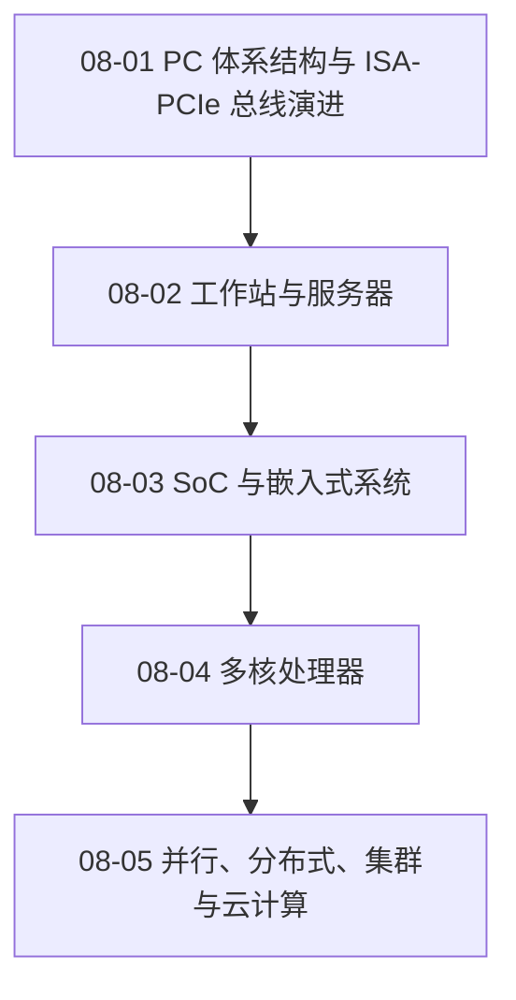

# 08 系统发展与扩展

从 PC 总线和系统形态延伸到 SoC、多核、并行与分布式计算。

> [!question] 本章核心问题
> - PC 芯片组和外部总线为何从共享并行转向点对点互连？
> - 工作站、服务器与嵌入式系统分别优化什么目标？
> - 多核、并行、分布式、集群和云计算的边界在哪里？

> [!info] 章节导航
> 上一章：[[计算机系统/微机原理与接口技术B/07 微型机接口技术/MOC - 07 微型机接口技术|07 微型机接口技术]] · 课程总览：[[计算机系统/微机原理与接口技术B/MOC - 微机原理与接口技术|微机原理与接口技术]]

## 知识路径



图中的箭头表示本章建议的概念展开顺序，不代表所有主题之间只有单一依赖关系。

## 本章知识点

- [[08-01 PC 体系结构与 ISA-PCIe 总线演进]] — 以历史视角梳理 PC 芯片组和系统外部总线演进。
- [[08-02 工作站与服务器]] — 比较工作站、服务器与个人计算机的目标和硬件组织。
- [[08-03 SoC 与嵌入式系统]] — 说明 IP 复用、软硬件协同设计和嵌入式系统组成。
- [[08-04 多核处理器]] — 理解多核并行的动机、组织方式和软件挑战。
- [[08-05 并行、分布式、集群与云计算]] — 区分并行、分布式、集群、网格和云计算的系统边界。

## 动态状态

```dataview
TABLE sequence AS "顺序", status AS "状态", length(file.inlinks) AS "入链"
FROM "计算机系统/微机原理与接口技术B/08 系统发展与扩展"
WHERE type = "课程笔记"
SORT sequence ASC
```

