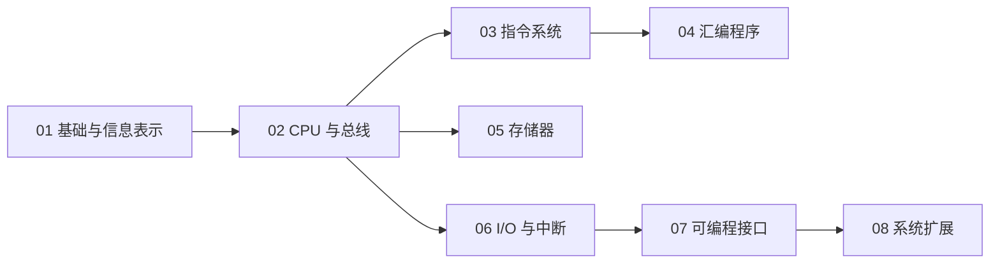

# 微机原理与接口技术

本课程沿着“信息表示 → CPU 与指令 → 存储器 → I/O 控制 → 具体接口 → 系统扩展”的主线，解释软件操作如何最终转化为总线时序和外设行为。正文已拆分为 58 个顺序知识点，文件名前缀同时表示章节与节内次序。

> [!info] 阅读约定
> 可以从下方章节 MOC 进入单章，也可以按知识点编号连续阅读。每篇笔记顶部均提供课程、章节和前后知识点导航；第 4 章的示例采用经典 MASM/DOS 教学环境。

> [!warning] 技术年代与适用范围
> 8086、80386、Pentium、8255A、8259A、8237A 及 DOS/MASM 示例用于建立处理器、总线和接口的基础模型。涉及现代字符编码、存储器、串行总线和系统软件时，应区分历史教学结构与当代实现；具体器件参数以对应数据手册为准。



## 顺序目录

### [[计算机系统/微机原理与接口技术B/01 计算机基础/MOC - 01 计算机基础|01 计算机基础]]

- [[01-01 计算机体系结构与系统组成]] — 比较冯·诺依曼与哈佛结构，并建立计算机系统的整体边界。
- [[01-02 微型计算机硬件系统]] — 说明 CPU、存储器、总线、接口和外设如何组成可工作的微机。
- [[01-03 软件系统与指令执行过程]] — 连接软件层次、指令周期与流水线执行的基本过程。
- [[01-04 微型计算机性能指标]] — 区分字长、执行时间、存储层次和总线速率等性能维度。
- [[01-05 机器数、原码、反码与补码]] — 建立真值与机器数的区别，理解有符号整数编码及补码运算。
- [[01-06 定点数与浮点数表示]] — 说明定点与浮点表示的范围、精度和运算边界。
- [[01-07 BCD 编码与十进制调整]] — 解释压缩 BCD、非压缩 BCD 及十进制调整的用途。
- [[01-08 字符与汉字编码]] — 梳理西文字符、汉字输入码、内码与字形码的层次。

### [[计算机系统/微机原理与接口技术B/02 微处理器/MOC - 02 微处理器|02 微处理器]]

- [[02-01 微处理器的演进与分类]] — 从位宽、集成度和处理器用途理解微处理器演进。
- [[02-02 8086 与 8088 的内部结构]] — 理解执行单元、总线接口单元、寄存器和分段地址形成。
- [[02-03 80386 与 80x87 处理器结构]] — 说明 32 位处理器结构和经典浮点协处理器模型。
- [[02-04 Pentium 系列处理器结构]] — 梳理双流水线、Cache、分支预测及后续系列的结构变化。
- [[02-05 微处理器引脚与总线信号]] — 按地址、数据、控制和仲裁功能理解处理器引脚。
- [[02-06 系统总线操作与典型时序]] — 解释总线周期、等待状态、复用信号与读写时序。
- [[02-07 8086 最小模式与最大模式系统]] — 比较单处理器和多处理器配置中的支持芯片与控制信号。
- [[02-08 x86 处理器工作模式]] — 区分实模式、保护模式、虚拟 8086 模式和系统管理模式。

### [[计算机系统/微机原理与接口技术B/03 指令系统/MOC - 03 指令系统|03 指令系统]]

- [[03-01 80x86 指令格式]] — 拆解操作码、寻址字段、位移量和立即数在指令编码中的作用。
- [[03-02 80x86 寻址方式与有效地址]] — 掌握立即、寄存器、存储器寻址以及段默认约定。
- [[03-03 数据传送类指令]] — 整理通用传送、交换、地址传送、标志和 I/O 指令。
- [[03-04 算术运算类指令]] — 说明加减乘除、BCD 调整及其对标志位的影响。
- [[03-05 逻辑、移位与循环移位指令]] — 理解位运算、测试、移位和循环移位的语义。
- [[03-06 串操作指令]] — 掌握串传送、比较、扫描与重复前缀的组合。
- [[03-07 控制转移与过程调用指令]] — 统一理解条件转移、循环、调用、返回和中断控制流。
- [[03-08 处理器控制指令]] — 说明标志、同步、停机及其他处理器状态控制。
- [[03-09 80286 至 Pentium 扩展指令]] — 按处理器代际整理保护、位操作、原子操作和多媒体扩展。
- [[03-10 80x87 浮点数据与指令]] — 说明浮点数据格式、寄存器栈和浮点指令类别。

### [[计算机系统/微机原理与接口技术B/04 汇编语言程序设计/MOC - 04 汇编语言程序设计|04 汇编语言程序设计]]

- [[04-01 汇编源程序结构与语句]] — 建立 MASM 源程序、语句和操作数表达式的基本模型。
- [[04-02 MASM 基本伪指令]] — 整理符号、数据、分段、过程、宏、模块和条件汇编伪指令。
- [[04-03 MASM 扩展伪指令与内存模型]] — 说明处理器选择、存储模式和简化段定义。
- [[04-04 顺序与分支程序设计]] — 把算法流程转换为顺序结构、条件判断和跳转表。
- [[04-05 循环程序设计]] — 整理计数循环、条件循环和多重循环的控制方法。
- [[04-06 子程序、参数与系统功能调用]] — 说明调用返回、现场保护、参数传递与 BIOS/DOS 调用。
- [[04-07 汇编程序的模块化设计]] — 理解全局符号、模块通信、组合形式和接口规范。
- [[04-08 汇编综合应用程序]] — 汇总实模式、保护模式、多媒体和浮点程序案例。
- [[04-09 汇编与 C-C++ 混合编程]] — 明确内嵌汇编、多模块链接、寄存器约定和参数传递。

### [[计算机系统/微机原理与接口技术B/05 半导体存储器/MOC - 05 半导体存储器|05 半导体存储器]]

- [[05-01 半导体存储器原理与指标]] — 建立存储体、地址译码、控制逻辑和性能指标模型。
- [[05-02 SRAM、DRAM 与内存技术]] — 比较静态、动态存储单元及刷新和同步存储技术。
- [[05-03 ROM、EPROM、EEPROM 与 Flash]] — 比较非易失存储器的写入、擦除和阵列组织。
- [[05-04 存储器选型、连接与容量扩展]] — 解决位扩展、字扩展、电平和时序匹配问题。
- [[05-05 CPU 与存储器的地址译码连接]] — 比较全译码、部分译码和线选法及其地址映射。
- [[05-06 存储层次、Cache 与虚拟存储器]] — 从局部性和地址转换理解多层存储系统。

### [[计算机系统/微机原理与接口技术B/06 输入输出与中断/MOC - 06 输入输出与中断|06 输入输出与中断]]

- [[06-01 I-O 接口结构与端口编址]] — 说明接口寄存器、端口独立编址、统一编址和简单接口。
- [[06-02 程序查询、中断与 DMA 传送]] — 比较三种 I/O 传送方式的责任分配和适用条件。
- [[06-03 中断机制与优先级]] — 梳理中断源、响应过程、软件排优和硬件排优。
- [[06-04 80x86 中断系统与中断向量]] — 区分内部异常、外部中断、实模式向量和保护模式机制。
- [[06-05 8259A 可编程中断控制器]] — 理解请求、屏蔽、服务状态、级联、命令字和结束中断。
- [[06-06 中断服务程序设计]] — 说明向量安装、控制器初始化、现场保护和中断返回。

### [[计算机系统/微机原理与接口技术B/07 微型机接口技术/MOC - 07 微型机接口技术|07 微型机接口技术]]

- [[07-01 接口技术与 8253-8254 定时计数器]] — 从时钟、门控、计数初值和输出模式理解定时计数。
- [[07-02 8255A 并行接口与键盘显示]] — 整理并行端口方式、握手、打印机、键盘和 LED 接口。
- [[07-03 串行通信基础与 UART]] — 区分通信方向、同步方式、电气接口及 8251A/INS8250。
- [[07-04 USB、I²C 与 SPI 总线]] — 比较主机式外部总线和常用板级同步串行总线。
- [[07-05 8237A DMA 控制器]] — 说明 DMA 通道、寄存器、总线请求和初始化流程。
- [[07-06 DAC 与 ADC 接口]] — 理解数模与模数转换原理、分辨率、误差和典型器件。

### [[计算机系统/微机原理与接口技术B/08 系统发展与扩展/MOC - 08 系统发展与扩展|08 系统发展与扩展]]

- [[08-01 PC 体系结构与 ISA-PCIe 总线演进]] — 以历史视角梳理 PC 芯片组和系统外部总线演进。
- [[08-02 工作站与服务器]] — 比较工作站、服务器与个人计算机的目标和硬件组织。
- [[08-03 SoC 与嵌入式系统]] — 说明 IP 复用、软硬件协同设计和嵌入式系统组成。
- [[08-04 多核处理器]] — 理解多核并行的动机、组织方式和软件挑战。
- [[08-05 并行、分布式、集群与云计算]] — 区分并行、分布式、集群、网格和云计算的系统边界。

## 动态状态视图

```dataview
TABLE status AS "状态", aliases[0] AS "主题", length(file.inlinks) AS "入链"
FROM "计算机系统/微机原理与接口技术B"
WHERE course = "微机原理与接口技术B" AND type = "课程笔记"
SORT file.name ASC
```

## 附件

- 课程图片统一保存在 `计算机系统/微机原理与接口技术B/附件/`，并按章分目录管理。
