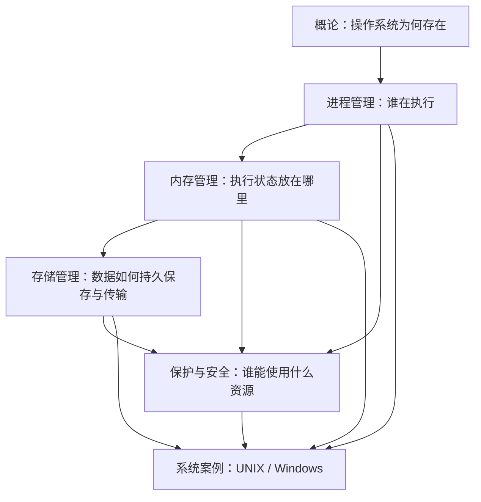
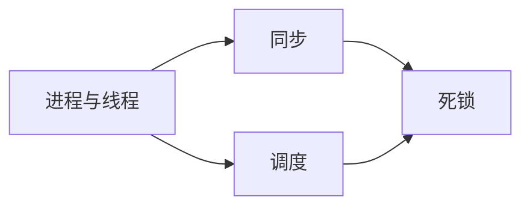

# MOC - 操作系统

操作系统是连接应用程序、硬件与用户的资源管理和抽象层：它创建执行环境、隔离并协调并发活动、管理内存与持久化数据、驱动 I/O，并通过保护和安全机制限制风险。本入口按课程结构组织概念路径，同时突出各部分之间的依赖关系。

> [!abstract] 使用方式
> 从“概论 → 进程 → 内存 → 存储 → 保护与安全”建立主干；随后以 UNIX 和 Windows 案例把各章节重新串成完整系统。遇到具体问题时，可从下方的典型问题入口反向进入相关章节。

> [!info] 与计算机科学引论的关系
> [[MOC - 计算机科学引论]]负责建立“硬件—系统软件—应用—网络—安全”的全局图景，本课程则把其中的操作系统层展开为资源抽象、并发控制、虚拟内存、持久化 I/O 与保护机制。可从 [[04-系统软件]] 进入总体职责，从 [[05-系统单元]]、[[07-二级存储]]理解硬件基础，再由 [[09-隐私、安全与伦理]]连接保护、安全与责任边界。

## 全书结构



图中的箭头表示主要先修和应用关系，而不是严格的唯一学习顺序。例如，文件访问控制既依赖文件系统，也依赖保护模型。

## 主干路径

### 第 1 部分：概论

- [[第一章 导论]]：操作系统的目标、服务、类型与运行环境。
- [[第二章 操作系统结构]]：系统调用、用户态/内核态、模块化结构和虚拟化。

> [!tip] 先抓住的两个边界
> 用户态与内核态决定谁可执行特权操作；机制与策略决定系统“如何实现”与“采用何种规则”应如何分离。

### 第 2 部分：进程管理

- [[第三章 进程]]：进程状态、进程控制块、创建与终止。
- [[第四章 多线程编程]]：线程模型、多核并行与线程库。
- [[第五章 进程调度]]：CPU 调度目标、算法与实时调度。
- [[第六章 同步]]：临界区、锁、信号量、条件同步与竞态。
- [[第七章 死锁]]：必要条件、预防、避免、检测与恢复。



### 第 3 部分：内存管理

- [[第八章 内存管理策略]]：地址转换、连续分配、分段、分页与页表。
- [[第九章 虚拟内存管理]]：请求调页、置换、工作集、抖动与内存映射文件。

核心问题是把每个进程的虚拟地址空间安全、高效地映射到有限物理内存与后备存储；页表、TLB、缺页处理和置换策略共同决定这一过程。

### 第 4 部分：存储管理

- [[第十章 文件系统]]：文件、目录、挂载、共享、一致性与保护。
- [[第十一章 文件系统实现]]：VFS、目录实现、块分配、空闲空间、恢复与 NFS。
- [[第十二章 大容量存储设备]]：磁盘/SSD、调度、交换空间、RAID 与稳定存储。
- [[第十三章 IO系统]]：控制器、驱动、中断、DMA、缓冲、缓存与 I/O 性能。


### 第 5 部分：保护与安全

- [[第十四章 系统保护]]：保护域、访问矩阵、ACL、能力、RBAC 与语言级保护。
- [[第十五章 系统安全]]：威胁、密码术、认证、防御、审计、防火墙与安全等级。

> [!warning] 不要混淆
> **保护**主要约束系统内部对象访问；**安全**还涉及认证、网络威胁、密码与防御。同步解决并发正确性，权限解决授权，缓存解决性能——三者不能互相替代。

### 第 6 部分：整机案例

- [[例子 - UNIX 操作系统]]：以 Shell、进程、VFS、I/O 与受控提权串联全书。
- [[例子 - Windows 操作系统]]：以令牌、对象、线程、虚拟内存、I/O 管理器与文件系统串联全书。

两个案例用于回顾同一组操作系统概念在不同系统设计中的落点；它们是教材视角的架构案例，不是特定版本的配置手册。

## 示例代码入口

- [[MOC - 操作系统示例代码]]：按第 3、4、5、9 章组织 POSIX、Windows 与 Java 示例，包含运行顺序、平台要求和原始代码修正说明。

> [!tip] 阅读顺序
> 先从章节理解机制，再进入代码索引观察系统调用；代码索引返回章节的标题链接可用于对照概念、实现与错误边界。

## 典型问题入口

| 想解决的问题 | 建议入口 |
| --- | --- |
| 一个程序如何从命令启动到运行？ | [[第二章 操作系统结构]] → [[第三章 进程]] → [[第五章 进程调度]] |
| 多线程为何会产生竞态或死锁？ | [[第四章 多线程编程]] → [[第六章 同步]] → [[第七章 死锁]] |
| 虚拟地址为何可大于物理内存？ | [[第八章 内存管理策略]] → [[第九章 虚拟内存管理]] |
| 文件如何从路径名变为磁盘 I/O？ | [[第十章 文件系统]] → [[第十一章 文件系统实现]] → [[第十三章 IO系统]] |
| 磁盘、SSD、RAID 与交换空间如何取舍？ | [[第十二章 大容量存储设备]] |
| 为什么“能访问”与“并发安全”是不同问题？ | [[第六章 同步]] → [[10.6 保护]] → [[第十四章 系统保护]] |
| 如何从整机角度复盘？ | [[例子 - UNIX 操作系统]] 或 [[例子 - Windows 操作系统]] |

## 动态课程索引

```dataview
TABLE file.link AS "笔记", type AS "类型", status AS "状态", node_size AS "节点权重"
FROM "计算机系统/操作系统/知识点"
WHERE course = "操作系统"
SORT file.path ASC
```

> [!note] 维护约定
> 新增操作系统课程笔记时，填写 Properties 中的 course: 操作系统，即会自动出现在上方索引中；无需手工维护长列表。

## 关联

- 先修的系统结构和体系结构背景可从 [[计算机系统/计算机科学引论/第2部分 计算机软件/04-系统软件|系统软件]] 延伸。
- [[13-编程与语言]]中的程序、运行时和并发最终依赖进程、线程、系统调用与地址空间；[[14-计算机科学理论基础]]中的抽象、状态机和算法分析则为调度、同步、死锁与页面置换提供分析工具。
- 该 MOC 的主要导航目标均位于“计算机系统/操作系统/知识点”；章节笔记中的精确链接用于进入具体主题。
