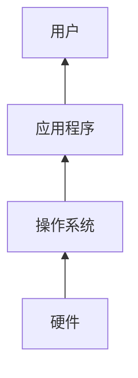

# 1.1 操作系统的功能

本节聚焦于**操作系统的功能**，是[[第一章 导论]]中的独立知识节点。

> [!summary] 一句话定义
> 操作系统是管理硬件资源、控制程序执行并向应用程序提供服务的系统软件；在狭义语境中，**内核（kernel）**是始终运行的核心部分。

## 1.1.1 OS 在计算机系统中的位置

计算机系统可抽象为四个部分：**硬件、操作系统、应用程序和用户**。

| 层次 | 主要职责 |
| --- | --- |
| 硬件（hardware） | 提供 CPU、内存、存储设备和 I/O 设备等基础计算资源。 |
| 操作系统 | 协调、分配和保护资源，向上提供抽象接口。 |
| 应用程序（application program） | 借助 OS 提供的服务解决用户问题。 |
| 用户 | 使用应用程序完成实际任务。 |

## 1.1.2 两个理解视角

| 视角 | 关心的问题 | OS 的角色 |
| --- | --- | --- |
| 用户视角 | 是否易用、交互是否及时、任务能否完成 | 提供方便的执行环境与交互方式。 |
| 系统视角 | 资源如何高效、公平且安全地使用 | 资源分配器（resource allocator）和控制程序（control program）。 |

不同设备的侧重点不同：个人计算机通常重视易用性；多用户服务器重视资源利用率与隔离；嵌入式系统常围绕特定功能运行，用户界面可能很少甚至不存在。

## 1.1.3 操作系统的边界

> [!warning] 易混点：操作系统不总是只等于内核
> 广义的“操作系统”有时包含系统程序、图形环境和中间件；本章采用的狭义定义强调**内核**。讨论某项功能是否属于 OS 时，需先明确所使用的定义和语境。

- **内核**：始终运行，处理最核心的资源管理、保护和硬件控制任务。
- **系统程序**：为用户与应用程序提供常用环境和工具。
- **应用程序**：面向具体问题运行，不应直接任意控制硬件。

> [!question]- 复习自测
> 为什么说 OS 像“政府”而不是直接完成所有有用工作？
>
> 因为 OS 的价值主要在于制定和执行资源使用规则、提供运行环境；真正面向用户任务的功能通常由应用程序完成。

> [!info] 章节导航
> 上一节：无　｜　章节：[[第一章 导论]]　｜　下一节：[[1.2 计算机系统的组成]]
