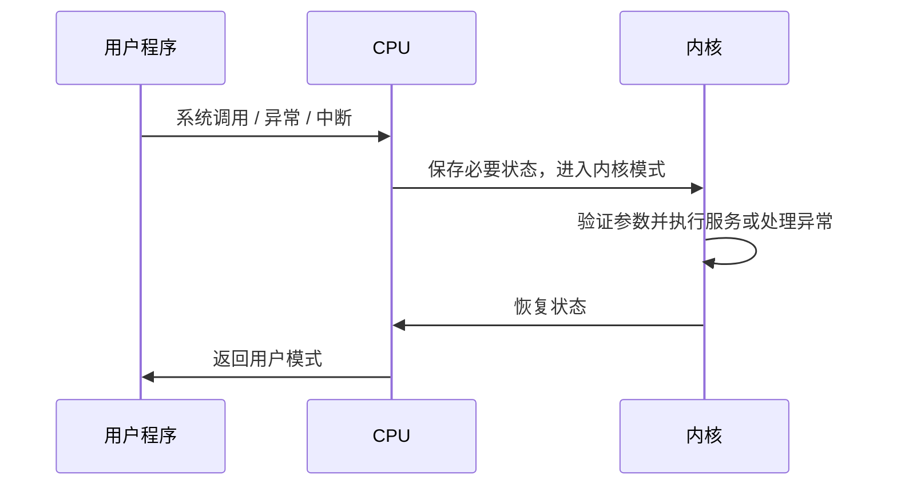

# 1.5 操作系统的执行

本节聚焦于**操作系统的执行**，是[[第一章 导论]]中的独立知识节点。

> [!important] 核心目标：OS 必须能够重新获得控制权
> 多道程序环境中，错误程序、死循环或非法访问不能无限占用 CPU 或破坏其他程序。中断、模式位、特权指令与定时器共同构成这一控制与保护基础。

## 1.5.1 双重模式与系统调用

| 模式 | 可执行的代码 | 权限 |
| --- | --- | --- |
| 用户模式（user mode） | 普通应用程序 | 不可直接执行特权操作。 |
| 内核模式（kernel mode） | OS 核心代码 | 可执行 I/O 控制、定时器和中断管理等特权指令。 |

- **系统调用**是受控的内核服务入口，而不是用户程序绕开 OS 直接操作硬件。
- 用户模式执行特权指令时，硬件应阻止其执行并将控制权交回 OS。
- 为支持虚拟化，某些体系结构还提供比传统双模式更丰富的特权层级；具体实现依赖硬件平台。

## 1.5.2 定时器

定时器以固定速率递减或计时，到期时产生中断。OS 在将 CPU 交给用户程序前设置定时器；由于设置定时器属于特权操作，用户程序不能自行关闭它。

> [!question]- 复习自测：为什么定时器是保护机制？
> 即使用户程序陷入死循环，定时器中断仍会迫使控制权回到 OS，避免单个程序无限占用 CPU。

> [!info] 章节导航
> 上一节：[[1.4 操作系统的结构]]　｜　章节：[[第一章 导论]]　｜　下一节：[[1.6 进程管理]]
