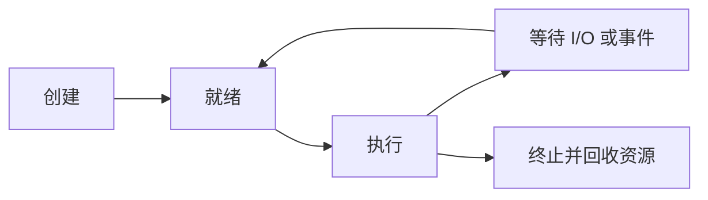

# 1.6 进程管理

本节聚焦于**进程管理**，是[[第一章 导论]]中的独立知识节点。

> [!summary] 程序 ≠ 进程
> 程序是静态的代码与数据文件；进程是正在执行的动态实体，是 OS 调度和资源管理的重要对象。

进程需要 CPU 时间、内存、文件与 I/O 等资源。多线程进程包含多个执行流；在单 CPU 系统中，OS 通过时间片复用使多个进程表现为并发执行。

**进程管理的职责：**

1. 调度 CPU 给进程或线程；
2. 创建、终止、挂起和恢复进程；
3. 为并发访问提供同步机制；
4. 为进程间交换数据提供通信机制（IPC）。

> [!info] 章节导航
> 上一节：[[1.5 操作系统的执行]]　｜　章节：[[第一章 导论]]　｜　下一节：[[1.7 内存管理]]
