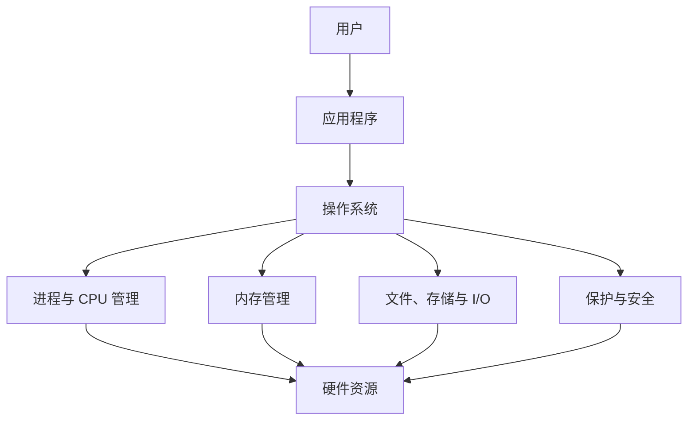

# 第一章 导论

> [!abstract] 本章解决什么问题？
> 操作系统（Operating System, **OS**）如何在硬件之上，为应用程序提供统一、可用且受保护的运行环境。本章建立后续进程、内存、文件系统、I/O 与安全机制所需的整体框架。

> [!note] 版本边界
> 本章以《Operating System Concepts》第 10 版的概念框架为主；涉及硬件容量、性能与具体实现的数据，应结合其年代和平台理解。

> [!abstract] 章节定位
> 本章已按稳定知识对象拆分为 10 篇主题笔记。先沿下表建立机制主线，再进入具体主题查看定义、状态、算法、实现边界与例子。

## 章节结构

| 顺序 | 主题笔记 | 核心对象 |
| ---: | --- | --- |
| 1 | [[1.1 操作系统的功能]] | 操作系统的功能 |
| 2 | [[1.2 计算机系统的组成]] | 计算机系统的组成 |
| 3 | [[1.3 计算机系统的体系结构]] | 计算机系统的体系结构 |
| 4 | [[1.4 操作系统的结构]] | 操作系统的结构 |
| 5 | [[1.5 操作系统的执行]] | 操作系统的执行 |
| 6 | [[1.6 进程管理]] | 进程管理 |
| 7 | [[1.7 内存管理]] | 内存管理 |
| 8 | [[1.8 存储管理]] | 存储管理 |
| 9 | [[1.9 保护与安全]] | 保护与安全 |
| 10 | [[1.10 内核数据结构]] | 内核数据结构 |

## 学习目标

- [ ] 能从用户视角和系统视角解释操作系统的作用。
- [ ] 能画出“引导—内核—中断/系统调用—返回”的基本控制流。
- [ ] 能区分中断、异常（陷阱）与系统调用，以及用户模式与内核模式。
- [ ] 能比较 DMA 与中断驱动 I/O、SMP 与 ASMP、UMA 与 NUMA。
- [ ] 能概述进程、内存、存储与 I/O 管理的核心职责。



---

## 与计算机科学引论的联系

> [!info] 从引论到专业课程
> [[04-系统软件]]、[[05-系统单元]]提供相关的系统、硬件、编程或安全背景；本章进一步进入操作系统的机制、策略、状态和失败边界。

## 动态索引

```dataview
TABLE file.link AS "主题", section AS "节", status AS "状态"
FROM "计算机系统/操作系统/知识点"
WHERE course = "操作系统" AND chapter = 1 AND type != "MOC"
SORT order ASC
```

> [!info] 章节导航
> 上一章：无　｜　下一章：[[第二章 操作系统结构]]

> [!note] 原始记录
> 拆分前的完整章笔记保存在 `计算机系统/操作系统/原始章笔记/第一章 导论.md.original`，用于回溯，不参与 Obsidian 普通知识索引。
