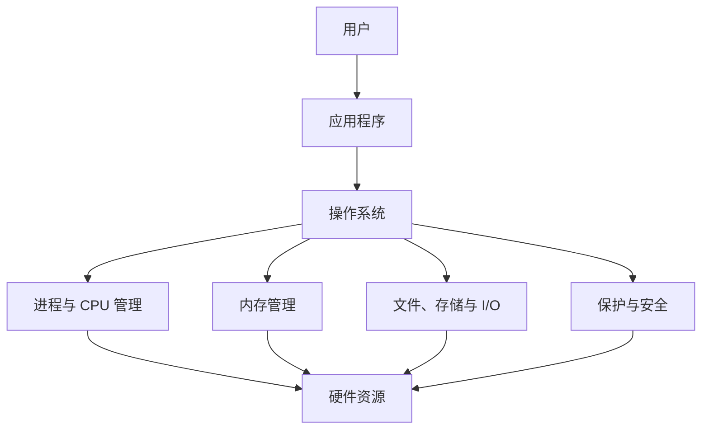
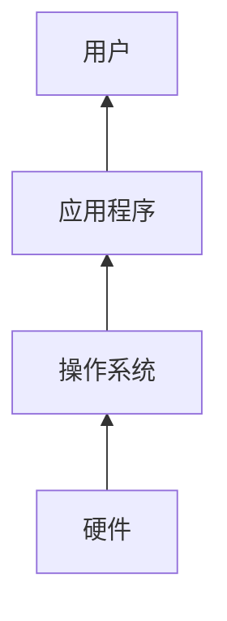
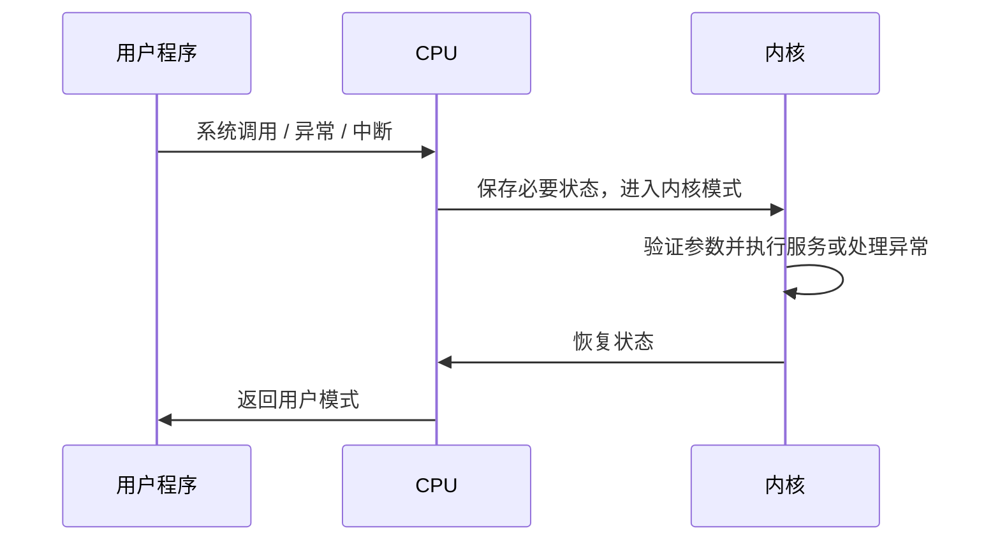
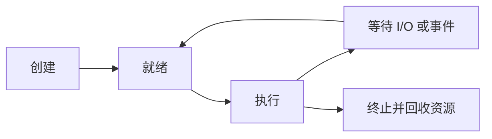

# 第一章 导论

> [!abstract] 本章解决什么问题？
> 操作系统（Operating System, **OS**）如何在硬件之上，为应用程序提供统一、可用且受保护的运行环境。本章建立后续进程、内存、文件系统、I/O 与安全机制所需的整体框架。

> [!note] 版本边界
> 本章以《Operating System Concepts》第 10 版的概念框架为主；涉及硬件容量、性能与具体实现的数据，应结合其年代和平台理解。

## 本章导航

- [[#1.1 操作系统的功能|操作系统的功能]]：OS 的定位、用户视角与系统视角。
- [[#1.2 计算机系统的组成|计算机系统的组成]]：启动、中断、存储与 I/O。
- [[#1.3 计算机系统的体系结构|计算机系统的体系结构]]：单处理器、多处理器与集群。
- [[#1.4 操作系统的结构|操作系统的结构]]：多道程序与分时系统。
- [[#1.5 操作系统的执行|操作系统的执行]]：模式切换、系统调用与定时器。
- [[#1.6 进程管理|进程管理]]、[[#1.7 内存管理|内存管理]]、[[#1.8 存储管理|存储管理]]：OS 的主要管理职责。
- [[#1.9 保护与安全|保护与安全]]、[[#1.10 内核数据结构|内核数据结构]]：可靠运行的基础。

## 学习目标

- [ ] 能从用户视角和系统视角解释操作系统的作用。
- [ ] 能画出“引导—内核—中断/系统调用—返回”的基本控制流。
- [ ] 能区分中断、异常（陷阱）与系统调用，以及用户模式与内核模式。
- [ ] 能比较 DMA 与中断驱动 I/O、SMP 与 ASMP、UMA 与 NUMA。
- [ ] 能概述进程、内存、存储与 I/O 管理的核心职责。

---

## 1.1 操作系统的功能

> [!summary] 一句话定义
> 操作系统是管理硬件资源、控制程序执行并向应用程序提供服务的系统软件；在狭义语境中，**内核（kernel）**是始终运行的核心部分。

### 1.1.1 OS 在计算机系统中的位置

计算机系统可抽象为四个部分：**硬件、操作系统、应用程序和用户**。

| 层次 | 主要职责 |
| --- | --- |
| 硬件（hardware） | 提供 CPU、内存、存储设备和 I/O 设备等基础计算资源。 |
| 操作系统 | 协调、分配和保护资源，向上提供抽象接口。 |
| 应用程序（application program） | 借助 OS 提供的服务解决用户问题。 |
| 用户 | 使用应用程序完成实际任务。 |

### 1.1.2 两个理解视角

| 视角 | 关心的问题 | OS 的角色 |
| --- | --- | --- |
| 用户视角 | 是否易用、交互是否及时、任务能否完成 | 提供方便的执行环境与交互方式。 |
| 系统视角 | 资源如何高效、公平且安全地使用 | 资源分配器（resource allocator）和控制程序（control program）。 |

不同设备的侧重点不同：个人计算机通常重视易用性；多用户服务器重视资源利用率与隔离；嵌入式系统常围绕特定功能运行，用户界面可能很少甚至不存在。

### 1.1.3 操作系统的边界

> [!warning] 易混点：操作系统不总是只等于内核
> 广义的“操作系统”有时包含系统程序、图形环境和中间件；本章采用的狭义定义强调**内核**。讨论某项功能是否属于 OS 时，需先明确所使用的定义和语境。

- **内核**：始终运行，处理最核心的资源管理、保护和硬件控制任务。
- **系统程序**：为用户与应用程序提供常用环境和工具。
- **应用程序**：面向具体问题运行，不应直接任意控制硬件。

> [!question]- 复习自测
> 为什么说 OS 像“政府”而不是直接完成所有有用工作？
>
> 因为 OS 的价值主要在于制定和执行资源使用规则、提供运行环境；真正面向用户任务的功能通常由应用程序完成。

---

## 1.2 计算机系统的组成

> [!info] 本节主线
> 先理解系统如何从引导进入内核运行，再理解事件如何通过中断交给 OS 处理；随后从存储层次与 I/O 路径认识资源的组织方式。

### 1.2.1 启动、事件与中断

#### 启动流程

- **引导程序（bootstrap）**：位于非易失性存储中，负责最初的硬件初始化和内核装入。
- **后台程序（daemon）**：内核启动后运行的系统服务。不同系统的具体启动进程和机制会有所不同。

#### 中断机制

事件发生后，CPU 需要暂时转去执行相应的处理程序；这一控制转移通常通过中断机制完成。

| 事件来源 | 含义 | 示例 |
| --- | --- | --- |
| 硬件中断 | 外设或硬件事件通知 CPU | I/O 完成、定时器到期。 |
| 异常 / 陷阱（trap） | 执行指令时产生的同步事件 | 除零、非法地址访问。 |
| 系统调用（system call） | 用户程序主动请求内核服务 | 创建进程、读写文件。 |

典型处理过程是：**保存必要的处理器状态 → 根据中断向量定位处理程序 → 执行服务 → 恢复状态并返回**。具体保存哪些状态、向量表位置和指令细节依赖体系结构。

### 1.2.2 存储结构

#### 主存与二级存储

- **主存（main memory）**通常使用 DRAM，属于易失性存储；CPU 执行的指令和直接访问的数据必须位于可访问的内存中。
- **ROM / EEPROM** 等非易失性存储适合保存引导代码或固件。
- **二级存储（secondary storage）**提供大容量、非易失的长期保存空间；程序通常先存于外存，执行时再被装入内存。

#### 存储层次

> [!tip] 复习重点不是具体数值，而是相对关系
> 从寄存器、缓存、内存到 SSD、硬盘和归档介质，通常越靠近 CPU 则越快、容量越小、单位容量成本越高；越远离 CPU 则容量越大、速度越慢且更适合非易失保存。

| 层次 | 典型特点 | 主要管理者 |
| --- | --- | --- |
| 寄存器、CPU 缓存 | 极快、容量小 | 硬件和编译器为主。 |
| 主存 | 程序执行的直接工作区 | OS 负责分配与回收。 |
| SSD / 硬盘 | 大容量、非易失的在线存储 | OS 负责文件、空间和调度管理。 |
| 光盘 / 磁带等 | 适合归档或备份 | OS 或应用程序负责介质与数据管理。 |

### 1.2.3 I/O 结构

OS 通过**设备驱动程序（device driver）**屏蔽不同控制器的细节，并为上层提供相对统一的设备访问接口。

| 方式 | 工作方式 | 适用情形 |
| --- | --- | --- |
| 中断驱动 I/O | CPU 发起操作；控制器完成后用中断通知 CPU。 | 少量数据或需要 CPU 参与处理的场景。 |
| 直接内存访问（DMA） | CPU 预先设置缓冲区、地址和计数；控制器直接在设备缓冲区与主存之间传输数据。 | 大块数据传输，例如磁盘 I/O。 |

> [!important] DMA 的关键价值
> DMA 不是让 CPU “完全消失”，而是把逐字节（或逐小块）搬运的工作交给控制器。CPU 仍需建立传输并在完成时处理通知，因此可将时间用于其他任务。

---

## 1.3 计算机系统的体系结构

### 1.3.1 单处理器系统

单处理器系统指只有一个能执行用户进程的**通用主 CPU**。其中仍可能有磁盘控制器、图形控制器等专用处理器；它们使用有限指令集处理特定任务，但不因此把系统变成多处理器系统。

### 1.3.2 多处理器与多核系统

多处理器系统由两个或多个紧密协作的通用处理器组成，可共享内存、总线和 I/O 设备。

| 优点 | 含义 |
| --- | --- |
| 增加吞吐量 | 多个处理器可并行执行工作，但加速比受协调和共享资源开销限制。 |
| 规模经济 | 多个处理器共享设备、电源等资源。 |
| 增加可靠性 | 局部故障时系统可能降级运行，而非完全停止。 |

| 架构 | 特征 |
| --- | --- |
| 非对称多处理（ASMP） | 主处理器负责调度或控制，从处理器执行指定任务。 |
| 对称多处理（SMP） | 处理器地位对等，共享内存并共同参与 OS 工作。 |
| 多核（multicore） | 多个计算核心集成于同一芯片；通常可被 OS 视作多个处理器。 |

> [!warning] 易混点：SMP 与 UMA / NUMA 是不同维度
> SMP / ASMP 描述处理器的组织与职责；**UMA**（均匀内存访问）/ **NUMA**（非均匀内存访问）描述处理器访问不同内存位置的延迟特性。一个系统可能同时用 SMP 与 NUMA 描述。

### 1.3.3 集群系统

集群由多台独立机器通过网络协作，以提高可用性、可扩展性或计算能力。

- **高可用集群**：某个节点故障时，其他节点可接管服务；可分为主备或多个节点共同承载服务的形态。
- **高性能计算（HPC）集群**：将问题划分为可并行的子任务，分配给不同节点后汇总结果。
- **共享数据场景**：多节点并发访问数据时需要协调机制，例如锁服务；共享存储网络也需要配合正确的故障切换策略。

> [!question]- 复习自测
> “有多个控制器”为什么不等于“多处理器系统”？
>
> 分类关键在于是否有多个可执行用户进程的通用处理器；专用控制器只承担特定设备任务。

---

## 1.4 操作系统的结构

> [!abstract] 结构演进链条
> 单个程序等待 I/O 会使 CPU 闲置；**多道程序设计**让 CPU 转而执行其他就绪作业；**分时系统**在此基础上改善交互性与响应时间。

| 机制 | 主要目标 | 核心做法 |
| --- | --- | --- |
| 多道程序设计（multiprogramming） | 提高 CPU 利用率 | 内存中保留多个作业；当前作业等待 I/O 时切换到另一作业。 |
| 分时系统（time-sharing） | 提供多人交互与较快响应 | 通过频繁调度与时间片，让用户获得近似独占的体验。 |

### 1.4.1 支撑机制

- **作业调度**：决定哪些作业从作业池进入内存。
- **CPU 调度**：在多个就绪进程之间选择下一个运行者。
- **交换（swapping）**：在内存与外存之间移动暂不运行的进程，以腾出内存空间。
- **虚拟内存（virtual memory）**：将逻辑地址空间与物理内存分离，使程序可使用大于物理内存的地址空间。
- **文件系统、保护、同步通信与死锁处理**：使并发程序能够安全、可管理地共享资源。

> [!note] 术语区分
> **作业（job）**偏向“等待或提交给系统处理的工作”；**进程（process）**是已装入内存并正在执行或可被调度执行的动态实体。

---

## 1.5 操作系统的执行

> [!important] 核心目标：OS 必须能够重新获得控制权
> 多道程序环境中，错误程序、死循环或非法访问不能无限占用 CPU 或破坏其他程序。中断、模式位、特权指令与定时器共同构成这一控制与保护基础。

### 1.5.1 双重模式与系统调用

| 模式 | 可执行的代码 | 权限 |
| --- | --- | --- |
| 用户模式（user mode） | 普通应用程序 | 不可直接执行特权操作。 |
| 内核模式（kernel mode） | OS 核心代码 | 可执行 I/O 控制、定时器和中断管理等特权指令。 |

- **系统调用**是受控的内核服务入口，而不是用户程序绕开 OS 直接操作硬件。
- 用户模式执行特权指令时，硬件应阻止其执行并将控制权交回 OS。
- 为支持虚拟化，某些体系结构还提供比传统双模式更丰富的特权层级；具体实现依赖硬件平台。

### 1.5.2 定时器

定时器以固定速率递减或计时，到期时产生中断。OS 在将 CPU 交给用户程序前设置定时器；由于设置定时器属于特权操作，用户程序不能自行关闭它。

> [!question]- 复习自测：为什么定时器是保护机制？
> 即使用户程序陷入死循环，定时器中断仍会迫使控制权回到 OS，避免单个程序无限占用 CPU。

---

## 1.6 进程管理

> [!summary] 程序 ≠ 进程
> 程序是静态的代码与数据文件；进程是正在执行的动态实体，是 OS 调度和资源管理的重要对象。

进程需要 CPU 时间、内存、文件与 I/O 等资源。多线程进程包含多个执行流；在单 CPU 系统中，OS 通过时间片复用使多个进程表现为并发执行。

**进程管理的职责：**

1. 调度 CPU 给进程或线程；
2. 创建、终止、挂起和恢复进程；
3. 为并发访问提供同步机制；
4. 为进程间交换数据提供通信机制（IPC）。

---

## 1.7 内存管理

> [!summary] 三个核心问题
> **谁在使用内存？哪些进程应在内存中？何时分配和回收空间？**

- 内存是 CPU 取指和读写数据的直接工作区，也是 CPU 与 I/O 设备共享的快速数据区域。
- 多道程序系统需要让多个进程同时驻留内存，因此必须记录占用情况并进行分配、回收和换入换出决策。
- 内存管理的实现与硬件密切相关，例如 MMU、分页和分段等机制会影响可用方案。

> [!tip] 与后续章节的关系
> 本章只建立内存管理的职责框架；地址转换、虚拟内存、页面置换和内存保护属于后续需要深入学习的主题。

---

## 1.8 存储管理

> [!abstract] OS 提供统一的逻辑视图
> 不同物理存储介质被抽象为**文件（file）**和目录。OS 负责将文件的逻辑表示映射到实际设备，同时处理空间、访问和可靠性问题。

### 1.8.1 文件系统管理

文件是相关信息的集合，可以包含程序或数据。文件系统的主要职责包括：

- 创建、删除、打开、读取、写入与关闭文件；
- 创建、删除和组织目录；
- 将文件逻辑地址映射到物理存储位置；
- 在多用户环境中实施访问控制；
- 对重要数据进行备份或支持备份策略。

### 1.8.2 大容量与三级存储管理

| 类别 | 典型角色 | OS 的关注点 |
| --- | --- | --- |
| 二级存储 | 在线保存程序与大量数据 | 空闲空间管理、空间分配、设备调度。 |
| 三级存储 | 长期归档、备份或低频访问 | 介质装卸、互斥分配、数据迁移。 |

### 1.8.3 高速缓存与一致性

高速缓存（cache）利用**局部性原理**，将可能再次访问的数据保留在更快的层级。其收益来自减少慢速访问；其代价是同一数据可能出现多个副本。

> [!warning] 一致性问题
> 在多处理器或分布式环境中，一个副本被修改后，其他副本可能过期。缓存一致性（cache coherence）关注如何让读取者得到符合规则的数据版本；硬件、OS 与应用层可能分别承担不同部分的责任。

### 1.8.4 I/O 系统

I/O 子系统的目标是隐藏具体设备差异。常见组成包括：

- **缓冲（buffering）**：协调生产者与消费者的速度差；
- **缓存（caching）**：保留已访问或可能再次访问的数据；
- **假脱机（spooling）**：将对独占设备的请求排队处理；
- **通用 I/O 接口与设备驱动程序**：为上层提供统一接口，并由驱动处理具体硬件细节。

---

## 1.9 保护与安全

> [!warning] 易混点：保护与安全不是同义词
> **保护（protection）**处理系统内部主体对资源的受控访问；**安全（security）**处理系统面对外部或恶意威胁时的防御。二者相互依赖。

| 维度 | 保护（Protection） | 安全（Security） |
| --- | --- | --- |
| 主要范围 | 内部资源隔离与授权 | 外部攻击与身份风险防御 |
| 典型问题 | 越界访问、非法设备使用、进程相互破坏 | 病毒、蠕虫、拒绝服务、凭据窃取 |
| 典型基础 | 模式位、内存保护、定时器、访问控制 | 认证、授权、防护与审计机制 |

### 1.9.1 身份与权限

- 系统可使用用户标识（如 UNIX UID、Windows SID）识别主体，并将身份与进程、线程和资源权限关联。
- 组标识（GID）等机制便于把权限赋予一组用户。
- 权限提升机制必须受到严格控制。例如 UNIX 的 `setuid` 程序可在特定条件下以文件所有者的有效身份运行，因此需要谨慎配置。

> [!important] 最小权限原则
> 程序和用户只应获得完成任务所必需的最小权限。该原则能降低错误或凭据泄露造成的影响范围。

---

## 1.10 内核数据结构

> [!info] 为什么内核需要数据结构？
> 内核需要高效地组织任务、索引对象和记录资源状态。选择数据结构时通常在访问时间、更新成本、空间开销与并发控制之间权衡。

### 1.10.1 列表、栈和队列

![[assets/image-20260707013625730.png]]

| 结构        | 访问规则       | 常见用途示意         |
| --------- | ---------- | -------------- |
| 列表        | 按链接关系遍历    | 组织一组可动态增删的对象。  |
| 栈（stack）  | 后进先出（LIFO） | 保存调用或中断处理的上下文。 |
| 队列（queue） | 先进先出（FIFO） | 维护等待服务的任务或请求。  |

### 1.10.2 树

- **树**表示层次关系；一般树的一个节点可有多个子节点。
- **二叉树**的每个节点最多有两个子节点。
- **二叉查找树（BST）**按键值组织，查找性能取决于树高；退化时最坏可达 $O(n)$。
- 平衡树通过约束高度，使查找、插入和删除通常保持在 $O(\log n)$ 量级。具体重复键策略由实现定义。

### 1.10.3 哈希函数与哈希表

哈希函数将键映射为索引。理想情况下，哈希表查找的平均时间可接近 $O(1)$；不同键可能映射到同一位置，称为**哈希碰撞**。

- 常见解决思路包括链地址法和开放定址法。
- 碰撞增多或装载因子过高会降低查找效率，因此需要合适的哈希函数与容量策略。

### 1.10.4 位图

位图（bitmap）使用一串二进制位记录资源状态：第 $i$ 位对应第 $i$ 个资源。例如可用 `0` 表示空闲、`1` 表示已占用，但具体约定取决于实现。

> [!tip] 位图适用场景
> 位图以每个资源仅占一位的方式记录大量布尔状态，常用于磁盘块、页框等资源的空闲/占用追踪；其优点是空间效率高，代价是寻找连续空闲位可能需要扫描或额外索引。

---

## 本章复习清单

> [!success] 复习时应能回答
> 1. OS 为什么既是资源分配器又是控制程序？
> 2. 引导程序、内核、系统调用和中断分别处于什么位置？
> 3. DMA 为什么能降低 CPU 参与数据搬运的开销？
> 4. 多道程序设计与分时系统分别解决什么问题？
> 5. 模式位、特权指令和定时器如何共同保护系统？
> 6. 进程、内存、文件、I/O 分别由 OS 管理什么？
> 7. 保护与安全的边界和联系是什么？

> [!question]- 章节自测：请用一段话串起本章
> 可按以下链条复述：硬件提供资源 → OS 通过抽象与管理服务应用 → 多道与分时提高利用率和交互性 → 中断、模式位和定时器保证可控执行 → 进程、内存、存储与 I/O 构成主要管理对象 → 保护与安全使共享系统能够可靠运行。
