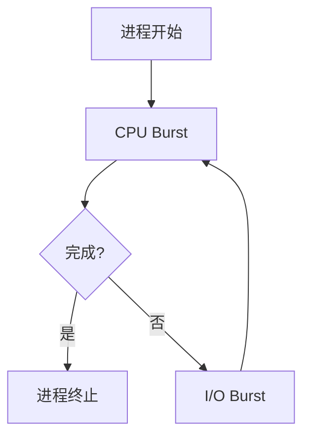

# 5.1 基本概念

本节聚焦于**基本概念**，是[[第五章 进程调度]]中的独立知识节点。

在多道程序系统中，进程并不总是占用 CPU。当进程发起 **I/O 请求**（如读取文件、等待用户输入）时，如果让 CPU 干等会产生巨大资源浪费。多道程序设计的核心目标就是**提高 CPU 利用率**。

进程的运行状态遵循 **"计算 → 等待I/O → 计算 → 等待I/O"** 的循环模式。当一个进程进入 **I/O执行区间**（等待I/O完成）时，操作系统会立即**保存当前进程的状态**，并将 **CPU 控制权移交给另一个就绪的进程**。一旦 I/O 完成，该进程会重新进入就绪队列，等待下一次被 CPU 调度。

## 5.1.1 CPU-I/O执行周期

进程的生命周期是**"CPU 计算 → I/O 等待 → CPU 计算 → I/O 等待……"**的不断交替过程，直至进程完全终止（以最后一次 CPU 执行为结束）。

- **CPU 执行（CPU Burst）**：进程占用 CPU 进行计算的时间段。
- **I/O 执行（I/O Burst）**：进程等待 I/O 完成的时间段。

CPU 执行时间的频率分布呈现典型的**"长尾"效应（指数或超指数分布）**：绝大多数进程拥有**大量短 CPU 执行**，只有极少数进程拥有**少量长 CPU 执行**。

基于此分布特征，进程可分为两类：

| 类型 | 特征 | 典型场景 |
|------|------|----------|
| **I/O 密集型（I/O-bound）** | 频繁但极短的 CPU 执行区间 | 打字、网页浏览 |
| **CPU 密集型（CPU-bound）** | 少量但很长的 CPU 执行区间 | 视频渲染、科学计算 |

## 5.1.2 CPU调度程序

当 **CPU 空闲**时，由**短期调度程序（CPU 调度程序）**从就绪队列中挑选一个进程，并为其分配 CPU 执行权。

就绪队列在逻辑上是"等待 CPU 的队列"，但底层实现非常灵活，不必是简单的 FIFO 队列：
- **FIFO 队列**：最简单的实现
- **优先队列**：用于优先级调度
- **红黑树**：高效的有序检索
- **无序链表**：适合小规模场景

队列中存放的是进程的 **[[3.1 进程概念#3.1.3 进程控制块|PCB（进程控制块）]]**，调度程序通过读取 PCB 中的信息（如进程优先级、状态等）来决定下一个该由谁运行。

## 5.1.3 抢占调度

触发调度的四类情况：**运行→等待**（如 I/O）、**运行→就绪**（如中断）、**等待→就绪**（如 I/O 完成）、以及**进程终止**。

> [!important] 抢占与非抢占的关键区分
> 只有在 **"运行→就绪"** 和 **"等待→就绪"** 这两种情况下发生调度，才属于**抢占调度（Preemptive）**。前两者和最后一种属于**非抢占调度（Nonpreemptive / 协作调度）**。

非抢占的特点是进程一旦拿到 CPU，必须主动交出（直到终止或等待 I/O），系统无法强制剥夺。

> [!warning] 抢占的核心隐患：数据竞争
> - **用户态数据**：进程 A 修改共享数据时被抢占，进程 B 读取到损坏或不一致的数据（后续章节将专门讨论此问题）。
> - **内核态数据**：进程在内核态执行系统调用时被抢占，可能导致内核数据结构混乱。

操作系统应对内核抢占问题的方案：
- **方案一（放弃抢占权）**：上下文切换前强制等待系统调用完成或 I/O 阻塞（如传统 UNIX）。保证数据一致性，但牺牲实时性。
- **方案二（禁用/启用中断）**：进入临界区前禁用中断，执行完毕后启用中断。禁用时间极短，不影响系统响应。

## 5.1.4 调度程序（Dispatcher）

**调度程序（Dispatcher）**是负责**执行** CPU 调度决策的底层模块，接收短期调度程序选定的进程，并真正将 CPU 控制权移交给它。

调度程序执行的三个核心动作：
1. **切换上下文**：保存当前进程的 CPU 状态（寄存器、程序计数器等），加载新进程的上下文。
2. **切换到用户模式**：确保 CPU 从内核态切换回用户态。
3. **跳转到合适位置**：将指令指针指向新进程上次暂停的位置。

**调度延迟（Dispatch Latency）**是调度程序**停止当前进程**并**启动新进程**所需的时间。这是纯粹的**系统开销**，必须尽可能缩短。

> [!info] 章节导航
> 上一节：无　｜　章节：[[第五章 进程调度]]　｜　下一节：[[5.2 调度准则]]
