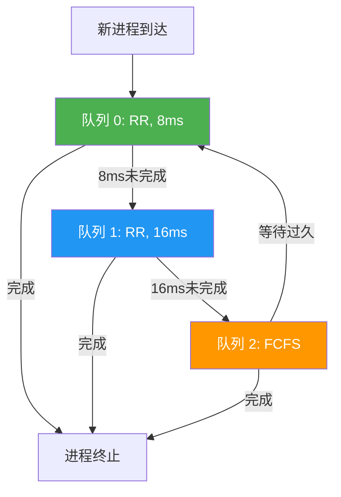

# 5.3 调度算法

本节聚焦于**调度算法**，是[[第五章 进程调度]]中的独立知识节点。

## 5.3.1 先到先服务调度（FCFS）

FCFS 使用简单的 **FIFO 队列**：进程 PCB 入队尾，CPU 空闲时从队头取出。它是**非抢占性**的，进程一旦获得 CPU，运行直到主动释放（终止或 I/O 请求）。

> [!warning] 核心缺陷：平均等待时间波动极大
> 平均等待时间严重依赖进程到达顺序。短作业后接长作业时平均等待时间仅 **3ms**，而长作业先执行时高达 **17ms**。

```mermaid
gantt
    title FCFS 调度示例
    dateFormat  X
    axisFormat %sms
    
    section P1(24ms)
    P1 :0, 24
    
    section P2(3ms)
    P2 :24, 27
    
    section P3(3ms)
    P3 :27, 30
```

> [!danger] 护航效应（Convoy Effect）
> 当 **1 个 CPU 密集型进程**和 **多个 I/O 密集型进程**共存时，所有 I/O 密集型进程必须排队等待长进程用完 CPU，导致 **I/O 设备空闲**，系统整体利用率严重下降。

FCFS **完全不适用于分时（交互式）操作系统**，但可用于批处理系统。

## 5.3.2 最短作业优先调度（SJF）

SJF 每次选择就绪队列中**"下次 CPU 执行时间最短"**的进程执行；时间相同时采用 FCFS。在非抢占式且所有进程同时到达的情况下，SJF 是**平均等待时间最短**的最优算法。

### 预测 CPU 执行时间

系统采用**指数平均（Exponential Average）**法基于历史数据预测：

$$
\tau_{n+1} = \alpha t_n + (1 - \alpha)\tau_n
$$

- $t_n$：最近一次实际 CPU 执行时间
- $\tau_n$：过去的预测值
- $\alpha \in [0,1]$：权重参数（越大越依赖最近执行时间）

通过递归展开公式可以发现，越早的历史 CPU 执行时间，其权重会随着指数衰减 $((1-\alpha)^j)$。

### 抢占式 SJF（最短剩余时间优先）

新进程到达时，若其预估执行时间 < 当前进程剩余执行时间，则**抢占**当前进程。

## 5.3.3 优先级调度

系统为每个进程分配优先级，调度器始终选择就绪队列中优先级最高的进程执行；优先级相同时采用 FCFS。SJF 是优先级调度的特例，进程优先级与 CPU 执行时间成反比。

优先级的定义来源：
- **内部定义**：基于内存需求、打开文件数、I/O/CPU 执行时长比率等。
- **外部定义**：基于进程重要性、用户付费额度、所属部门等。

> [!warning] 核心缺陷：饥饿（Starvation）
> 高负载下，低优先级进程可能**永远得不到 CPU 执行机会**。

> [!tip] 解决方案：老化（Aging）机制
> 系统定期**逐渐提升等待时间过长的进程的优先级**，确保低优先级进程最终能获得执行机会。

## 5.3.4 轮转调度（RR）

RR 专为**分时（交互式）系统**设计，CPU 时间划分为固定大小的**时间片（Time Quantum）**，通常为 $10 \sim 100ms$。维护 **FIFO 循环队列**，时间片耗尽后进程被抢占并放回队尾。

对于 $n$ 个进程，时间片为 $q$，进程等待时间界限为 $(n-1)q$，保证每个进程在一定周期内获得 CPU。

> [!important] 时间片大小的核心权衡
> - **过大**：退化为 FCFS，无法保证响应时间。
> - **过小**：频繁上下文切换，系统开销激增。
> - **设计准则**：时间片应远大于上下文切换时间，且 **80% 的 CPU Burst 应小于时间片**。

## 5.3.5 多级队列调度

不同类型进程（前台交互 vs 后台批处理）对响应时间要求不同，统一调度策略难以满足所有需求。多级队列调度将就绪队列**划分为多个独立子队列**，进程根据类型/优先级**永久分配**到特定队列。

- **前台队列**：使用 RR 调度（快速响应）
- **后台队列**：使用 FCFS 或 SJF 调度（吞吐量优先）

队列间调度策略：
- **策略一：固定优先级抢占**：高优先级队列绝对优先，低优先级队列可能饥饿。
- **策略二：按比例分配 CPU 时间**：每个队列分配固定比例的 CPU 时间，解决饥饿问题。

## 5.3.6 多级反馈队列调度（MLFQ）

多级队列调度中进程一旦分配就不会改变队列，不够灵活。MLFQ 允许进程根据其 CPU 执行行为在队列之间**动态迁移**：短作业获得高优先级，长作业被降级。

> [!example] MLFQ 实例机制
> - **队列 0（最高优先级）**：RR，时间片 8ms。新进程入队 0，未完成则降级到队列 1。
> - **队列 1（中等优先级）**：RR，时间片 16ms。未完成则降级到队列 2。
> - **队列 2（最低优先级）**：FCFS。仅在队列 0、1 为空时运行。
> - **抢占规则**：高优先级队列进程可随时抢占低优先级进程。
> - **老化机制**：队列 2 中等待过久的进程升级到更高优先级队列。

MLFQ 的五大核心参数：队列数量、每个队列的调度算法、升级策略、降级策略、初始队列分配策略。

> [!info] 章节导航
> 上一节：[[5.2 调度准则]]　｜　章节：[[第五章 进程调度]]　｜　下一节：[[5.4 线程调度]]
