# 5.6 实时CPU调度

本节聚焦于**实时CPU调度**，是[[第五章 进程调度]]中的独立知识节点。

> [!important] 软实时 vs 硬实时
> - **软实时系统**：不保证截止期限，仅保证实时进程优先于非关键进程。
> - **硬实时系统**：任务必须在截止期限前完成；超时与未完成等价。

## 5.6.1 最小化延迟

- **事件延迟**：从事件发生到事件得到服务的时间。
- **中断延迟**：从 CPU 收到中断信号到开始执行中断服务程序（ISR）的时间。
- **调度延迟**：调度程序从停止当前进程到启动新进程的时间。

对于硬实时系统，中断延迟不仅要"尽可能小"，更必须**"有界"**（即最坏情况下的延迟也有明确的上限）。造成该延迟的一个重要因素是**操作系统禁用中断**的时间。

调度延迟的关键在于"冲突阶段"：
1. **抢占**：强行剥夺在内核模式下运行的任何进程的 CPU 使用权。
2. **资源释放**：低优先级进程释放占有的资源，以便高优先级实时进程能够立即获得资源并执行。

## 5.6.2 优先权调度

实时操作系统必须采用**抢占式的基于优先级的调度**，高优先级进程可随时抢占低优先级进程。许多现代操作系统（如 Windows、Linux、Solaris）都支持将最高的调度优先级专门分配给实时进程。

硬实时系统中，需要调度的进程通常具有**周期性（Periodic）**的特征。每个周期任务可以用三个核心参数描述：
- **处理时间（t）**：每次执行所需的 CPU 时间
- **截止期限（d）**：必须完成的时间点
- **周期（p）**：任务再次启动的时间间隔
- **约束**：$0 \le t \le d \le p$，速率 = $1/p$

> [!mechanism] 准入控制（Admission Control）
> 进程启动前必须向调度器公布截止期限要求，调度器根据系统负载决定是否接纳：
> - **接纳**：保证任务能在截止期限前完成。
> - **拒绝**：无法满足实时性要求时拒绝请求。

## 5.6.3 单调速率调度（RMS）

RMS 采用**抢占式、静态优先级**，优先级与任务周期**成反比**——周期越短（频率越高），优先级越高。RMS 是**最优的静态优先级调度算法**，若任务集无法被 RMS 调度，则无法被任何其他静态优先级算法调度。

```mermaid
gantt
    title RMS 调度示例（P1: 25/50, P2: 35/80）
    dateFormat  X
    axisFormat %sms
    
    section P1(短周期高优先级)
    P1_1 :0, 25
    P1_2 :50, 75
    P1_3 :100, 125
    
    section P2(长周期低优先级)
    P2_1 :25, 60
    P2_2 :80, 115
```

调度 $N$ 个周期性任务，RM 算法能保证截止期限的**最坏情况 CPU 利用率上限**为：

$$
N(2^{1/N} - 1)
$$

- $N=1$ 时，上限为 **100%**
- $N=2$ 时，上限为 **83%**
- $N \to \infty$ 时，上限趋近于 **69%**（$\ln 2 \approx 0.693$）

## 5.6.4 最早截止期限优先调度（EDF）

EDF 采用**动态优先级**，调度完全取决于截止期限：**截止期限越近，优先级越高**。进程就绪时向系统公布截止期限，系统实时调整调度优先级。

```mermaid
gantt
    title EDF 调度示例（P1: 25/50, P2: 35/80）
    dateFormat  X
    axisFormat %sms
    
    section P1(截止期限100)
    P1_1 :0, 25
    P1_2 :80, 105
    
    section P2(截止期限80)
    P2_1 :25, 60
    P2_2 :60, 80
```

EDF 是**理论上最优**的实时调度算法，可实现 **100%** 的 CPU 利用率（只要总利用率不超过 100%）。它不要求进程必须是周期性的，也不要求 CPU 执行时间固定。

> [!warning] 实际限制
> 由于上下文切换、内核调度开销和中断处理消耗 CPU，**实际无法达到 100% 利用率**。

## 5.6.5 比例分享调度

系统将处理器时间抽象为"总股数"（$T$），每个进程根据重要性获得一定"股数"（$N$），进程精确获得总处理时间的 $N/T$。

新进程请求进入时，调度器检查剩余可用股数：请求股数 ≤ 可用股数则允许进入，否则拒绝进入。

## 5.6.6 POSIX实时调度

> [!summary] POSIX 实时策略
> POSIX 常见策略包括 `SCHED_FIFO`（同优先级先到先服务，不设时间片）、`SCHED_RR`（同优先级时间片轮转）和普通分时策略 `SCHED_OTHER`。系统总是先选择最高静态优先级的可运行实时线程；设置策略可使用 `sched_setscheduler()` 或线程属性接口，但通常需要相应权限，并应通过 `sched_get_priority_min()` / `sched_get_priority_max()` 查询实现支持的范围。

> [!example] 对照代码
> [[MOC - 操作系统示例代码#第五章：线程与实时调度|查看带权限检查的 SCHED_FIFO 示例]]。

> [!info] 章节导航
> 上一节：[[5.5 多处理器调度]]　｜　章节：[[第五章 进程调度]]　｜　下一节：[[5.7 操作系统例子]]
