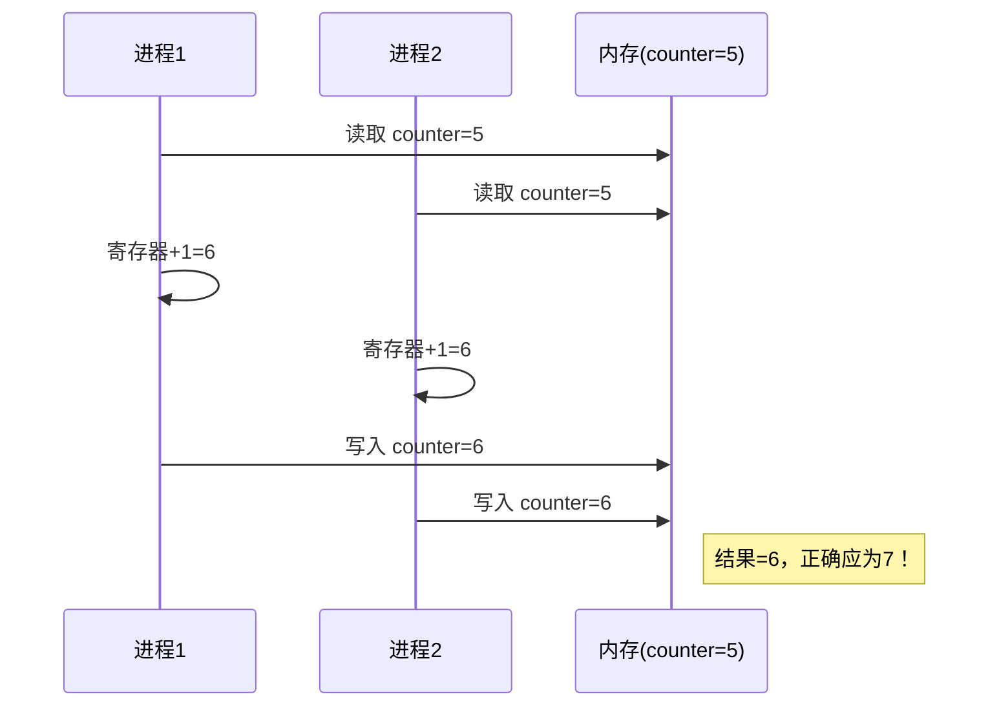

# 6.1 背景

本节聚焦于**背景**，是[[第六章 同步]]中的独立知识节点。

## 并发与并行带来的问题

- **单核系统**：并发通过进程的快速切换实现（进程随时可能被中断）。
- **多核系统**：多个进程可以真正地在不同的处理核上**并行执行**。
- **共享数据风险**：当这些进程或线程**共享数据**时，其执行顺序变得不可预测，进而导致数据被破坏。

## 竞争条件（Race Condition）的成因

根源在于机器指令的**非原子性**。像 `counter++` 这样看似一条的高级语言语句，在 CPU 机器指令级别上被拆分成 **3 个步骤**：

1. 将 `counter` 读入寄存器。
2. 在寄存器中进行加 1 操作。
3. 将寄存器的结果写回 `counter`。

**竞争条件定义**：当**多个进程并发访问和操作同一数据**，并且最终的**执行结果取决于特定的访问顺序**时，就产生了**竞争条件**。

## 为什么必须解决这个问题？

- **破坏数据一致性**：竞争条件会导致系统中共享资源的状态错误（如缓冲区项目数量与实际不符）。
- **多核时代更加严重**：随着多核处理器的普及，多个线程真正并行的场景急剧增加，竞争条件发生的概率和风险随之放大。
- **本章主旨**：引入**进程同步（Process Synchronization）**和**协调机制**，确保在同一时刻，只有一个进程可以操作共享变量（即**互斥访问**）。

> [!info] 章节导航
> 上一节：无　｜　章节：[[第六章 同步]]　｜　下一节：[[6.2 临界区问题]]
