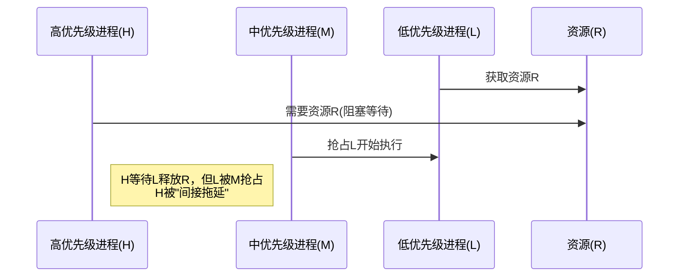

# 6.6 信号量

本节聚焦于**信号量**，是[[第六章 同步]]中的独立知识节点。

信号量本质上是一个**整型变量 S**（通常是非负整数），提供两个标准的原子操作：`wait(S)` 和 `signal(S)`。

## 互斥锁与信号量的核心区别

| 类型 | 值范围 | 主要用途 |
|------|--------|----------|
| **互斥锁** | 0 或 1（二值信号量） | 保护单一共享资源的互斥访问 |
| **信号量** | 非负整数（计数信号量） | 资源计数（如连接池、打印机数量） |

## 6.6.1 信号量的使用

### 二进制信号量（Binary Semaphore）

取值范围仅为 0 或 1，功能上**等同于互斥锁**，专门用于保护单一临界资源的**互斥访问**。

### 计数信号量（Counting Semaphore）

取值范围不受限制，用于管理**数量大于 1 的相同资源池**。

**工作机制**：信号量值初始化为“可用资源总数”。
- `wait()`：请求资源，计数减 1。若减到 0 还继续请求，则进程阻塞。
- `signal()`：释放资源，计数加 1。若有进程在等待该资源，则唤醒一个进程。

### 经典的顺序执行同步

**场景**：强制规定两个并发进程的执行顺序（必须 P1 执行完某段代码，P2 才能执行后续代码）。

```c
semaphore synch = 0;  // 初始值为 0

// 进程 P1
S1();
signal(synch);

// 进程 P2
wait(synch);
S2();
```

## 6.6.2 信号量的实现

### 无忙等待的原理

当 `wait()` 发现信号量不满足条件时，进程不会在 `while` 循环中“空转”，而是调用 `block()`，**将自己阻塞并移出 CPU**，放入该信号量的等待队列中。当其他进程调用 `signal()` 后，会从队列中唤醒一个阻塞进程（调用 `wakeup()`），将其状态改为就绪。

### 核心数据结构

信号量结构体包含一个整数 `value` 和一个进程链表 `list`。

**负值的含义**：如果信号量 `S->value < 0`，其绝对值（`-value`）代表当前**有多少个进程正在等待**这个信号量。

### 临界区的缩小

虽然消除了整个 `wait()` 循环期间的忙等待，但**修改信号量自身的 `value` 和 `list`** 依然是临界区。在单核系统上用**禁止中断**实现；在 SMP 多核系统上，依赖硬件原子指令来保护这些“微型临界区”。

忙等待的弊端被**从“长时间等待”缩小到了“极短时间的锁保护”**。

## 6.6.3 死锁与饥饿

### 死锁的定义与发生机制

**核心定义**：一组进程中的每一个进程都在等待一个事件，而该事件只能由该组内的另一个进程触发，导致所有进程无限期地互相等待。

**示例**：进程 P0 拥有信号量 S 并等待 Q，进程 P1 拥有信号量 Q 并等待 S，双方互不相让，形成死循环。

> [!note] 死锁的后续扩展
> 死锁不仅发生在信号量的 `wait` 和 `signal` 上，其他类型的资源事件也能引发死锁。[[第七章 死锁]] 将会专门讨论如何预防、避免、检测和解除死锁。

### 饥饿（无限阻塞）

进程无限等待信号量，永远得不到执行机会。潜在原因：如果信号量的等待队列采用 **LIFO（后进先出）** 或**不公平**的策略来增加和唤醒等待进程，可能导致某些先进来等待的进程始终不被唤醒。

## 6.6.4 优先级的反转

### 什么是“优先级反转”？

高优先级进程因为等待一个被低优先级进程占用的资源，而被中等优先级进程“间接拖延”的现象。



### 解决方案：优先级继承协议

**核心原理**：当一个低优先级进程（L）访问了一个高优先级进程（H）正在等待的资源时，低优先级进程 L 会**临时继承**高优先级进程 H 的优先级，直到它用完该资源。

**最终效果**：L 临时获得了与 H 一样高的优先级，M 无法抢占 L，L 得以快速执行完并释放资源 R，H 就能立即获得调度执行。

> [!info] 章节导航
> 上一节：[[6.5 互斥锁]]　｜　章节：[[第六章 同步]]　｜　下一节：[[6.7 经典同步问题]]
