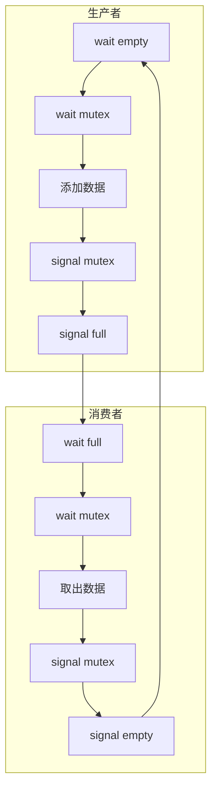
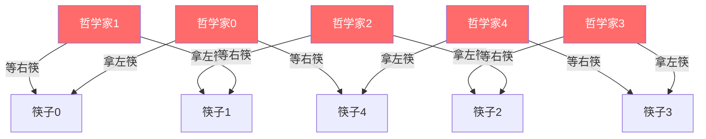

# 6.7 经典同步问题

本节聚焦于**经典同步问题**，是[[第六章 同步]]中的独立知识节点。

## 6.7.1 有界缓冲问题

### 三种信号量的协同作用

| 信号量 | 类型 | 初始值 | 作用 |
|--------|------|--------|------|
| `mutex` | 互斥信号量 | 1 | 保护临界区（缓冲池） |
| `empty` | 计数信号量 | n | 代表缓冲池中**空闲槽位**的数量 |
| `full` | 计数信号量 | 0 | 代表缓冲池中**已填满数据**的数量 |

### 生产者的执行流程

```c
// 生产者进程
do {
    wait(empty);     // 确保有空位
    wait(mutex);     // 获取操作权限
    
    // 临界区：向缓冲区添加新数据
    add_item(item);
    
    signal(mutex);   // 释放互斥锁
    signal(full);    // 通知消费者有新数据
} while (true);
```

### 消费者的执行流程

```c
// 消费者进程
do {
    wait(full);      // 确保有数据
    wait(mutex);     // 获取操作权限
    
    // 临界区：从缓冲区取出数据
    remove_item(&item);
    
    signal(mutex);   // 释放互斥锁
    signal(empty);   // 通知生产者有空位
} while (true);
```



## 6.7.2 读者-作者问题

### 问题的核心冲突

- **读者**：只读数据，彼此之间**不冲突**，可以并发读取。
- **作者**：修改数据，与任何其他人（包括读者和其他作者）**都冲突**，需要独占访问权。

### 第一读者-作者问题（读者优先）的实现

```c
semaphore mutex = 1;      // 保护 read_count
semaphore rw_mutex = 1;   // 作者与首位读者之间的互斥锁
int read_count = 0;       // 当前正在读取的进程数

// 读者进程
void reader() {
    wait(mutex);
    read_count++;
    if (read_count == 1) {
        wait(rw_mutex);   // 第一个读者，阻止作者进入
    }
    signal(mutex);
    
    // 临界区：读取数据
    read_data();
    
    wait(mutex);
    read_count--;
    if (read_count == 0) {
        signal(rw_mutex); // 最后一个读者，释放锁
    }
    signal(mutex);
}

// 作者进程
void writer() {
    wait(rw_mutex);
    
    // 临界区：写入数据
    write_data();
    
    signal(rw_mutex);
}
```

> [!warning] 作者饥饿风险
> 这种“读者优先”的实现可能导致**作者饥饿**（如果读者源源不断，作者永远拿不到锁）。更完善的变种（如“写者优先”或“公平读写锁”）在商业系统中会得到进一步优化。

## 6.7.3 哲学家就餐问题

### 问题背景

5 个哲学家、5 根筷子围成一圈。哲学家吃饭必须同时持有左右两根筷子，思考时则放下筷子。

### 简单的信号量解法及其致命缺陷

```c
semaphore chopstick[5];  // 5 根筷子，初始值均为 1

// 哲学家 i 的代码
do {
    wait(chopstick[i]);
    wait(chopstick[(i+1) % 5]);
    
    // 进餐
    
    signal(chopstick[i]);
    signal(chopstick[(i+1) % 5]);
    
    // 思考
} while (true);
```

**死锁场景**：如果 5 个哲学家**同时**拿起了自己左边的筷子，所有筷子都被占用，每个人都在等待右边的筷子，系统陷入**循环等待**（死锁）。



### 避免死锁的三种经典策略

1. **资源限额**：限制同一时刻最多 4 个人坐在桌前。
2. **原子获取**：要求哲学家必须在一个临界区内，同时检查并拿起左右两根筷子。
3. **非对称解法**：规定**奇数号**哲学家先拿左再拿右，**偶数号**哲学家先拿右再拿左。

> [!info] 章节导航
> 上一节：[[6.6 信号量]]　｜　章节：[[第六章 同步]]　｜　下一节：[[6.8 管程]]
