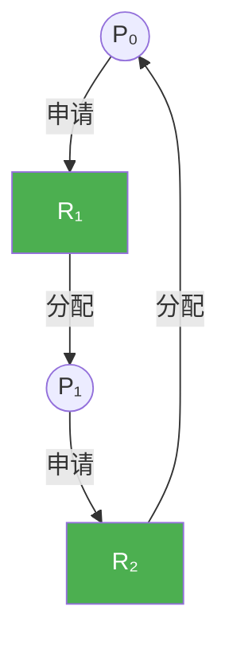
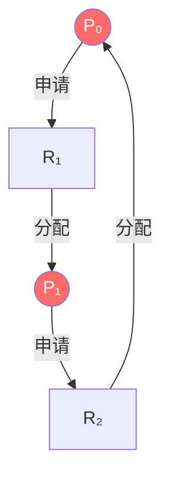

# 7.2 死锁特征

本节聚焦于**死锁特征**，是[[第七章 死锁]]中的独立知识节点。

## 7.2.1 必要条件

### 死锁的四个必要条件

| 条件 | 描述 |
|------|------|
| **互斥（Mutual Exclusion）** | 资源不能同时被多个进程共享使用。 |
| **占有并等待（Hold and Wait）** | 进程必须持有一个资源的同时，再去请求另一个已被其他进程占有的资源。 |
| **非抢占（No Preemption）** | 资源一旦被进程占有，就不能被系统强行剥夺，必须由进程主动释放。 |
| **循环等待（Circular Wait）** | 进程之间形成了一条环形的等待链（P₀ 等 P₁，P₁ 等 P₂，...，Pₙ 等 P₀）。 |

### 关键认知：缺一不可

这四个条件是**死锁发生的必要条件**，但不是充分条件。只有**四个条件同时满足**时，系统才会陷入死锁。因此，只要**打破任何一个条件**，死锁就不可能发生。

## 7.2.2 资源分配图

### 图的构成与语义

- **两种节点**：圆代表**进程（P）**，矩形代表**资源类型（R）**，矩形内部的黑点代表该资源实例的数量。
- **两种边**：
  - **申请边（Pᵢ → Rⱼ）**：进程 Pᵢ 正在申请资源类型 Rⱼ 的一个实例。
  - **分配边（Rⱼ → Pᵢ）**：资源类型 Rⱼ 的一个实例已经被分配给了进程 Pᵢ。

### 死锁判定的核心定理

| 情况 | 判定结果 |
|------|----------|
| 资源分配图中**没有环** | 系统**绝对没有**处于死锁状态。 |
| 资源分配图中**有环** | 系统**不一定**死锁，需根据资源实例数量判断。 |

### 实例数量对死锁判定的影响

- **单实例资源类型**：如果图中涉及的每种资源都**只有一个实例**，那么只要图中**存在环**，就**必定存在死锁**。
- **多实例资源类型**：如果资源有**多个实例**，图中**存在环**只是死锁的**必要条件，而非充分条件**。可能存在打破死锁的中间人进程。

> [!danger] 死锁！循环等待链 P₀→R₂→P₁→R₁→P₀

> [!info] 章节导航
> 上一节：[[7.1 系统模型]]　｜　章节：[[第七章 死锁]]　｜　下一节：[[7.3 死锁的处理方法]]
