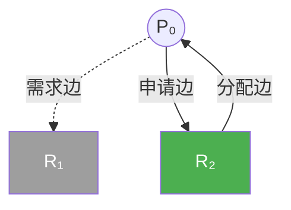

# 7.5 死锁避免

本节聚焦于**死锁避免**，是[[第七章 死锁]]中的独立知识节点。

## 死锁预防的致命缺陷

通过破坏四个必要条件来预防死锁（如强制一次性申请所有资源），虽能保证系统不发生死锁，但代价极其高昂，会导致**设备资源利用率极低**和**系统吞吐量大幅下降**。

## 死锁避免的核心思想

系统要求**提前获得每个进程在未来对各类资源需求的额外信息**。在每次进程发起资源申请时，系统会进行**动态风险评估**：结合当前的可用资源、已分配资源以及进程的最大需求，计算出若满足此次申请是否会将系统带入"可能发生死锁"的危险状态。

## 7.5.1 安全状态

### 安全状态与安全序列的定义

- **安全状态**：如果系统存在一个**安全序列**，使得所有进程都能按该顺序顺利执行完毕，则系统处于安全状态。
- **安全序列**：对于序列中的每一个进程 Pᵢ，它所需的资源必须满足：**它当前仍需的资源数 ≤ 当前可用资源 + 序列中前面所有进程已占有的资源**。

### 安全状态、非安全状态与死锁的关系

> [!important] 核心判定模型
> - **安全状态 ⇒ 绝对不可能发生死锁**
> - **死锁 ⇒ 必然处于非安全状态**
> - **非安全状态 ≠ 必然发生死锁**（只是可能发生）

> [!example] 动态示例分析（12 台磁带驱动器）
> 
> | 进程 | Max | Allocation | Need |
> |------|-----|------------|------|
> | P₀ | 10 | 5 | 5 |
> | P₁ | 4 | 2 | 2 |
> | P₂ | 9 | 2 | 7 |
> 
> **初始状态（安全）**：可用资源 = 3，安全序列 ⟨P₁, P₀, P₂⟩。
> 
> **非安全状态**：如果将 1 台空闲驱动器分配给 P₂，可用资源减少到 2，系统再也找不出任何安全序列。正确的做法是：拒绝 P₂ 的这次申请。

## 7.5.2 资源分配图算法

### 适用前提

该算法**仅适用于"每种资源类型只有一个实例"**的系统。

### 引入需求边（Claim Edge）

为了在分配前知道未来的潜在请求，图引入了**用虚线表示的需求边**（Pᵢ → Rⱼ），表明进程 Pᵢ 在将来的某刻**"可能会"**申请资源 Rⱼ。



> [!note] 图例：虚线 = 需求边（可能申请），实线 = 申请边/分配边

### 边的动态转换过程

1. **申请时**：虚线（需求边）转换为实线（申请边）。
2. **获取时**：实线（申请边）转换为反向实线（分配边）。
3. **释放时**：反向实线（分配边）转换回虚线（需求边）。

> [!tip] 死锁避免的判定准则
> 
> 每次资源分配前，系统必须先预判："如果我把这条申请边变成分配边，图中**会不会形成一个环**？"
> 
> - **安全状态**：如果转换后**没有形成环**，说明分配资源是安全的。
> - **非安全状态**：如果转换后**形成了环**，即使资源当前是空闲可用的，也必须拒绝该请求。
> 
> 算法复杂度为 **O(n²)**（n 为进程数量）。

## 7.5.3 银行家算法

### 适用场景与核心理念

**适用前提**：针对系统中**每种资源类型可以有多个实例**的情况。此算法借鉴了银行的贷款模型——银行不可能把所有现金都借光，导致无法满足所有客户的提款需求。

> [!info] 四个核心数据结构
> 
> | 数据结构 | 类型 | 描述 |
> |----------|------|------|
> | `Available` | 向量（长度 m） | 当前系统每种资源的空闲实例数量。 |
> | `Max` | 矩阵（n×m） | 每个进程声明的对每种资源的最大需求量。 |
> | `Allocation` | 矩阵（n×m） | 当前时刻每个进程实际已占有的每种资源数量。 |
> | `Need` | 矩阵（n×m） | 每个进程为了完成任务还需要的资源数量。 |
> 
> **核心公式**：`Need[i][] = Max[i][] - Allocation[i][]`

> [!note] 资源分配决策规则
> 
> 当进程提出一组资源申请时，操作系统会执行以下安全性检查：
> 
> 1. 假设将资源分配给该进程，更新系统的可用资源状态。
> 2. 检查更新后的状态是否依然处于**安全状态**（即是否存在安全序列）。
> 3. **决定**：如果更新后仍处于安全状态，则真正分配资源；否则，回滚假设分配状态，**拒绝该申请**。

### 7.5.3.1 安全算法

```pseudo
// 输入: Available, Max, Allocation, Need
// 输出: true (安全) 或 false (非安全)

1. 初始化:
   Work = Available
   Finish[i] = false, for all i

2. 循环查找:
   while 存在 i 使得 Finish[i] == false 且 Need[i] <= Work:
       Work = Work + Allocation[i]
       Finish[i] = true

3. 结果判定:
   return (所有 Finish[i] == true)
```

**时间复杂度**：O(m × n²)，其中 m 为资源类型数，n 为进程数。

### 7.5.3.2 资源请求算法

```pseudo
// 输入: Request_i, Available, Max, Allocation, Need
// 输出: 允许分配或拒绝

1. 请求合法性检查:
   if Request_i > Need[i]:
       返回错误（进程超过最大需求）

2. 资源可用性检查:
   if Request_i > Available:
       进程等待（资源不够）

3. 试探性预分配:
   Available = Available - Request_i
   Allocation[i] = Allocation[i] + Request_i
   Need[i] = Need[i] - Request_i

4. 安全性验证:
   if 安全算法(Available, Max, Allocation, Need) == true:
       正式执行分配
   else:
       回滚到步骤3之前的状态
       进程等待
```

> [!example] 银行家算法说明示例
> 
> **初始状态**：
> 
> | 进程 | Max | Allocation | Need |
> |------|-----|------------|------|
> | P₀ | 7,5,3 | 0,1,0 | 7,4,3 |
> | P₁ | 3,2,2 | 2,0,0 | 1,2,2 |
> | P₂ | 9,0,2 | 3,0,2 | 6,0,0 |
> | P₃ | 2,2,2 | 2,1,1 | 0,1,1 |
> | P₄ | 4,3,3 | 0,0,2 | 4,3,1 |
> 
> `Available = (3, 3, 2)`
> 
> **安全序列**：⟨P₁, P₃, P₄, P₀, P₂⟩
> 
> **处理进程 P₁ 的资源请求**：`Request₁ = (1, 0, 2)`
> 
> 1. 合法性检验：`Request₁ ≤ Need₁` 和 `Request₁ ≤ Available`，满足。
> 2. 试探性分配后，再次运行安全算法，发现依然存在安全序列，因此真正分配资源。
> 
> **拒绝请求的原则**：
> 
> - **拒绝 P₄ 的请求 (3, 3, 0)**：请求向量中的 A 超过了可用量（3 > 2），资源不够。
> - **拒绝 P₀ 的请求 (0, 2, 0)**：虽然资源够，但满足请求后系统找不到任何安全序列，强行分配会将系统带入非安全状态。

> [!info] 章节导航
> 上一节：[[7.4 死锁预防]]　｜　章节：[[第七章 死锁]]　｜　下一节：[[7.6 死锁检测]]
