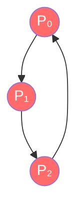

# 7.6 死锁检测

本节聚焦于**死锁检测**，是[[第七章 死锁]]中的独立知识节点。

## 7.6.1 每种资源类型只有单个实例

### 等待图（Wait-for Graph）的构建

**转换规则**：从资源分配图中**删除所有资源节点**。若存在进程 Pᵢ 申请资源 R_q，且该资源 R_q 已被进程 Pⱼ 占有，则**在等待图中直接添加一条有向边 Pᵢ → Pⱼ**。



> [!danger] 死锁！存在环 P₀→P₁→P₂→P₀

### 死锁的判定标准

**充分必要条件**：在等待图中**如果存在"环"**，则**必定存在死锁**。

**时间复杂度**：O(n²)，其中 n 为进程数量。

## 7.6.2 每种资源类型可有多个实例

### 死锁检测算法逻辑

```pseudo
// 输入: Available, Allocation, Request
// 输出: 死锁进程列表

1. 初始化:
   Work = Available
   Finish[i] = (Allocation[i] == 0), for all i

2. 循环搜索与资源回收:
   while 存在 i 使得 Finish[i] == false 且 Request[i] <= Work:
       Work = Work + Allocation[i]
       Finish[i] = true

3. 最终判定:
   死锁进程 = { i | Finish[i] == false }
```

**时间复杂度**：O(m × n²)

### 案例演示推导

**初始安全场景**：

| 进程 | Allocation | Request |
|------|------------|---------|
| P₀ | 0,1,0 | 0,0,0 |
| P₁ | 2,0,0 | 2,0,2 |
| P₂ | 3,0,3 | 0,0,1 |
| P₃ | 2,1,1 | 1,0,0 |
| P₄ | 0,0,2 | 0,0,2 |

`Available = (0, 0, 0)`

**检测过程**：
- P₀ 的 Request = (0,0,0) ≤ Available = (0,0,0)，执行完毕，释放资源。
- Work = (0,0,0) + (0,1,0) = (0,1,0)
- P₃ 的 Request = (1,0,0) ≤ Work = (0,1,0)，执行完毕，释放资源。
- Work = (0,1,0) + (2,1,1) = (2,2,1)
- 继续按此方式，最终所有进程都能完成，说明**系统无死锁**。

**触发死锁场景**：

当进程 P₂ 的请求增加了 1 个资源类型 C（Request 变为 `0,0,2`）后：

| 进程 | Allocation | Request |
|------|------------|---------|
| P₀ | 0,1,0 | 0,0,0 |
| P₁ | 2,0,0 | 2,0,2 |
| P₂ | 3,0,3 | 0,0,2 |
| P₃ | 2,1,1 | 1,0,0 |
| P₄ | 0,0,2 | 0,0,2 |

`Available = (0, 0, 0)`

**检测过程**：
- P₀ 执行完毕，释放资源后 Work = (0,1,0)。
- 此时没有其他进程的 Request ≤ Work，系统无法继续推进。
- 因此判定系统**发生了死锁**，未完成的进程（P₁、P₂、P₃、P₄）即为死锁进程。

## 7.6.3 应用检测算法

### 调用频率的考量因素

1. 死锁在系统中发生的频率。
2. 参与死锁的进程数量。

> [!tip] 两种检测策略的权衡
> 
> | 策略 | 描述 | 缺点 |
> |------|------|------|
> | **高频调用** | 在每一次资源分配请求无法立即满足时，立即调用死锁检测算法。 | 计算开销巨大，严重影响系统性能。 |
> | **定期/条件触发** | 定期调用（如每小时），或当 CPU 使用率低于 40% 时触发。 | 可能累积多个死锁链，难以准确定位引发死锁的进程。 |

> [!info] 章节导航
> 上一节：[[7.5 死锁避免]]　｜　章节：[[第七章 死锁]]　｜　下一节：[[7.7 死锁恢复]]
