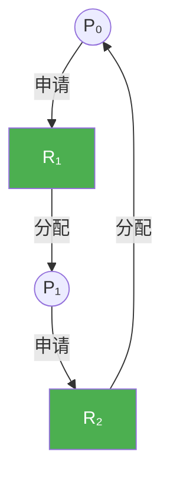
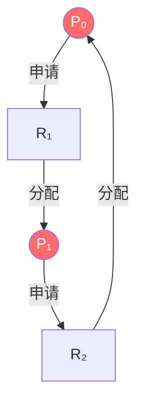
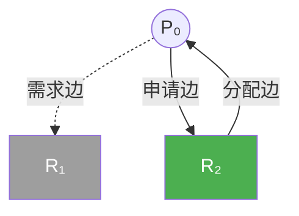
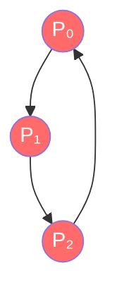

# 第七章 死锁

> [!abstract] 本章解决什么问题？
> 当多个进程互相等待对方持有的资源时，会陷入无限期的阻塞状态（死锁）。本章系统介绍死锁的定义、四个必要条件、资源分配图表示，以及三种处理策略：死锁预防（破坏必要条件）、死锁避免（银行家算法）、死锁检测与恢复（检测并解除死锁）。

## 本章导航

- [[#7.1 系统模型|系统模型]]：资源类型、资源使用生命周期、死锁定义。
- [[#7.2 死锁特征|死锁特征]]：四个必要条件、资源分配图、死锁判定定理。
- [[#7.3 死锁的处理方法|死锁的处理方法]]：预防、避免、检测与恢复、鸵鸟算法。
- [[#7.4 死锁预防|死锁预防]]：破坏四个必要条件的具体策略。
- [[#7.5 死锁避免|死锁避免]]：安全状态、资源分配图算法、银行家算法。
- [[#7.6 死锁检测|死锁检测]]：等待图、单实例与多实例检测算法。
- [[#7.7 死锁恢复|死锁恢复]]：进程终止、资源抢占、回滚与饥饿问题。

## 学习目标

- [ ] 能陈述死锁的四个必要条件及打破每个条件的方法。
- [ ] 能使用资源分配图判断死锁状态。
- [ ] 能解释安全状态与安全序列的概念。
- [ ] 能描述银行家算法的核心数据结构和决策流程。
- [ ] 能区分死锁预防、避免、检测与恢复的适用场景。
- [ ] 能分析现实操作系统中采用"鸵鸟算法"的原因。
- [ ] 能描述死锁检测算法的原理（等待图与矩阵运算）。
- [ ] 能解释死锁恢复的策略（进程终止、资源抢占）及权衡。

---

## 7.1 系统模型

### 系统资源的定义与分类

系统资源分为不同类型（如 CPU、I/O 设备、文件），每种类型包含若干个**实例**。同种类型的任意一个实例通常可满足进程的申请，但如果存在物理隔离差异，它们可能被定义为不同的资源类型。

> [!important] 锁也是一种资源
> 互斥锁和信号量本身就属于系统资源。为了保护不同的数据结构（如队列、链表），系统通常会使用多种不同的锁，每一种锁都被视为单独的资源类型。关于锁和信号量的讨论，见 [[第六章 同步]]。

### 资源使用的标准生命周期

进程使用资源必须严格遵守**"申请 → 使用 → 释放"**三步走模型：

1. **申请（Request）**：进程请求资源。如果资源不可用，进程进入等待队列（阻塞）。
2. **使用（Use）**：进程对资源执行操作。
3. **释放（Release）**：进程完成操作后释放资源。

操作系统会通过一个系统表来**持续记录**每个资源是被分配给了哪个进程，还是处于空闲状态。

### 死锁（Deadlock）的精确定义

**死锁状态**：当一个集合中的所有进程都在等待一个事件，而这个事件**只能**由该集合中的另一个进程触发时，这组进程就陷入了死锁。最典型的引发死锁事件是**资源的获取和释放**（包括物理资源和逻辑资源）。

### 死锁的两个经典示例

1. **同种资源竞争**：3 个进程各自持有一台 CD 刻录机，同时都在请求另一台刻录机。由于总共只有 3 台，所有进程都会互相等待对方释放，形成死锁。
2. **不同资源交叉持有**：进程 P_i 占有 DVD 驱动，请求打印机；进程 P_j 占有打印机，请求 DVD 驱动。双方互不相让，形成死锁。

---

## 7.2 死锁特征

### 7.2.1 必要条件

#### 死锁的四个必要条件

| 条件 | 描述 |
|------|------|
| **互斥（Mutual Exclusion）** | 资源不能同时被多个进程共享使用。 |
| **占有并等待（Hold and Wait）** | 进程必须持有一个资源的同时，再去请求另一个已被其他进程占有的资源。 |
| **非抢占（No Preemption）** | 资源一旦被进程占有，就不能被系统强行剥夺，必须由进程主动释放。 |
| **循环等待（Circular Wait）** | 进程之间形成了一条环形的等待链（P₀ 等 P₁，P₁ 等 P₂，...，Pₙ 等 P₀）。 |

#### 关键认知：缺一不可

这四个条件是**死锁发生的必要条件**，但不是充分条件。只有**四个条件同时满足**时，系统才会陷入死锁。因此，只要**打破任何一个条件**，死锁就不可能发生。

### 7.2.2 资源分配图

#### 图的构成与语义

- **两种节点**：圆代表**进程（P）**，矩形代表**资源类型（R）**，矩形内部的黑点代表该资源实例的数量。
- **两种边**：
  - **申请边（Pᵢ → Rⱼ）**：进程 Pᵢ 正在申请资源类型 Rⱼ 的一个实例。
  - **分配边（Rⱼ → Pᵢ）**：资源类型 Rⱼ 的一个实例已经被分配给了进程 Pᵢ。



#### 死锁判定的核心定理

| 情况 | 判定结果 |
|------|----------|
| 资源分配图中**没有环** | 系统**绝对没有**处于死锁状态。 |
| 资源分配图中**有环** | 系统**不一定**死锁，需根据资源实例数量判断。 |

#### 实例数量对死锁判定的影响

- **单实例资源类型**：如果图中涉及的每种资源都**只有一个实例**，那么只要图中**存在环**，就**必定存在死锁**。
- **多实例资源类型**：如果资源有**多个实例**，图中**存在环**只是死锁的**必要条件，而非充分条件**。可能存在打破死锁的中间人进程。



> [!danger] 死锁！循环等待链 P₀→R₂→P₁→R₁→P₀

---

## 7.3 死锁的处理方法

### 三种死锁处理策略

| 策略 | 描述 | 代价 |
|------|------|------|
| **死锁预防** | 通过破坏四个必要条件之一，从根源上杜绝死锁。 | 显著限制进程对资源的使用方式，资源利用率低。 |
| **死锁避免** | 系统在每次分配前进行动态计算，只有确认分配后系统处于"安全状态"才允许分配。 | 需要提前获取进程的未来资源需求信息。 |
| **死锁检测与恢复** | 允许死锁发生，系统定期检测并执行恢复算法。 | 检测算法开销大，恢复时可能丢失进程计算结果。 |

### "鸵鸟算法"（忽略问题）

绝大多数通用操作系统（如 **Linux 和 Windows**）在生产环境中**采用第三种策略：假装死锁不会发生**。

> [!warning] 代价/收益权衡
> - **性能开销**：死锁预防、避免和检测算法本身需要频繁执行，会带来巨大的系统性能开销。
> - **低发生率**：在实际工程中，死锁的发生率极低（例如"一年才发生一次"）。与其为了极低概率的事件持续消耗昂贵的系统性能，不如直接忽略它，等真的发生时由管理员手动重启。

---

## 7.4 死锁预防

### 7.4.1 互斥

互斥条件必须成立，至少有一个资源应是非共享的。可共享资源（如只读文件）不要求互斥访问，因此不会参与死锁。**通常不能通过否定互斥条件来预防死锁**，因为有的资源本身是非共享的（例如互斥锁）。关于互斥锁的讨论，见 [[第六章 同步]]。

### 7.4.2 持有且等待

#### 两种破坏"持有且等待"的协议

| 协议 | 描述 |
|------|------|
| **协议一（全有或全无）** | 进程必须在执行前一次性申请并获得其所需的所有资源。如果任何一项资源得不到满足，则进程一个资源都不能获得。 |
| **协议二（逐级释放）** | 进程在申请新资源前，必须先释放其当前已持有的所有资源。 |

#### 示例对比

以"DVD 数据复制 → 排序 → 打印"的任务为例：
- **协议一的后果**：一开始就需要把 DVD、磁盘、打印机全部锁住，打印机在复制和排序过程中一直闲置。
- **协议二的优化**：可以先申请 DVD 和磁盘，复制完就释放它们，等到需要打印时再重新申请。

#### 两大主要缺点

1. **资源利用率低**：大量稀缺资源可能被进程提前锁定，导致其他进程长时间等待。
2. **可能引发饥饿**：如果一个进程需要多个"热门"资源，它可能永远等不到"所有资源同时空闲"的那一刻。

### 7.4.3 无抢占

#### 核心思想：允许资源被强制剥夺

如果进程 A 申请资源 R 失败（被 B 占用），且 B 正在等待其他资源，那么系统可以**强行从 B 手中剥夺资源 R**，并将其分配给 A。被剥夺资源的进程 B 会进入等待状态，只有当 B 重新获得了被剥夺的资源和它之前正在申请的资源后，才能恢复执行。

> [!warning] 适用范围与局限性
> - **适用资源**：此协议仅适用于**状态可以被保存和完全恢复**的资源，例如 CPU 寄存器、内存页。关于抢占的讨论，见 [[第五章 进程调度]]。
> - **禁用资源**：**绝对不能**用于互斥锁和信号量！如果进程在持有一把互斥锁修改共享数据时被强行抢占，会导致共享数据处于不一致状态，且无法简单地"回滚"。关于互斥锁和信号量的讨论，见 [[第六章 同步]]。

### 7.4.4 循环等待

#### 核心思想：资源排序与强制递增申请

1. **资源排序**：为系统中所有资源类型分配一个唯一的递增序号（即定义函数 F）。
2. **强制递增申请**：规定每个进程**只能按照编号递增的顺序**申请资源。如果已持有编号较高的资源，则不能再申请编号较低的资源，除非先释放。

**示例**：磁带驱动器(1) < 磁盘驱动器(5) < 打印机(12)。想同时用磁带和打印机，必须**先申请磁带，再申请打印机**。

#### 为什么能杜绝死锁？

**反证法**：如果系统陷入死锁，必然存在一个循环等待链。按照递增规则，申请 Rᵢ₊₁ 时必须满足 F(Rᵢ) < F(Rᵢ₊₁)。推导到最后会得出 F(R₀) < F(R₀) 的荒谬结论。因此，**循环等待在数学上变得不可能**。

#### 动态获取锁的致命陷阱

```c
void transaction(Account from, Account to, double amount) {
    mutex lock1, lock2;
    lock1 = get_lock(from);
    lock2 = get_lock(to);

    acquire(lock1);
    acquire(lock2);

    withdraw(from, amount);
    deposit(to, amount);

    release(lock2);
    release(lock1);
}
```

**问题**：锁的获取顺序依赖于 `from` 和 `to` 的动态值。如果两个线程分别调用顺序相反的方法，就会产生死锁。

**解决方案**：在 `transaction` 函数中，**强制对 `from` 和 `to` 的指针或 ID 进行排序**，永远按照固定的顺序去获取锁。

---

## 7.5 死锁避免

### 死锁预防的致命缺陷

通过破坏四个必要条件来预防死锁（如强制一次性申请所有资源），虽能保证系统不发生死锁，但代价极其高昂，会导致**设备资源利用率极低**和**系统吞吐量大幅下降**。

### 死锁避免的核心思想

系统要求**提前获得每个进程在未来对各类资源需求的额外信息**。在每次进程发起资源申请时，系统会进行**动态风险评估**：结合当前的可用资源、已分配资源以及进程的最大需求，计算出若满足此次申请是否会将系统带入"可能发生死锁"的危险状态。

### 7.5.1 安全状态

#### 安全状态与安全序列的定义

- **安全状态**：如果系统存在一个**安全序列**，使得所有进程都能按该顺序顺利执行完毕，则系统处于安全状态。
- **安全序列**：对于序列中的每一个进程 Pᵢ，它所需的资源必须满足：**它当前仍需的资源数 ≤ 当前可用资源 + 序列中前面所有进程已占有的资源**。

#### 安全状态、非安全状态与死锁的关系

> [!important] 核心判定模型
> - **安全状态 ⇒ 绝对不可能发生死锁**
> - **死锁 ⇒ 必然处于非安全状态**
> - **非安全状态 ≠ 必然发生死锁**（只是可能发生）

> [!example] 动态示例分析（12 台磁带驱动器）
> 
> | 进程 | Max | Allocation | Need |
> |------|-----|------------|------|
> | P₀ | 10 | 5 | 5 |
> | P₁ | 4 | 2 | 2 |
> | P₂ | 9 | 2 | 7 |
> 
> **初始状态（安全）**：可用资源 = 3，安全序列 ⟨P₁, P₀, P₂⟩。
> 
> **非安全状态**：如果将 1 台空闲驱动器分配给 P₂，可用资源减少到 2，系统再也找不出任何安全序列。正确的做法是：拒绝 P₂ 的这次申请。

### 7.5.2 资源分配图算法

#### 适用前提

该算法**仅适用于"每种资源类型只有一个实例"**的系统。

#### 引入需求边（Claim Edge）

为了在分配前知道未来的潜在请求，图引入了**用虚线表示的需求边**（Pᵢ → Rⱼ），表明进程 Pᵢ 在将来的某刻**"可能会"**申请资源 Rⱼ。



> [!note] 图例：虚线 = 需求边（可能申请），实线 = 申请边/分配边

#### 边的动态转换过程

1. **申请时**：虚线（需求边）转换为实线（申请边）。
2. **获取时**：实线（申请边）转换为反向实线（分配边）。
3. **释放时**：反向实线（分配边）转换回虚线（需求边）。

> [!tip] 死锁避免的判定准则
> 
> 每次资源分配前，系统必须先预判："如果我把这条申请边变成分配边，图中**会不会形成一个环**？"
> 
> - **安全状态**：如果转换后**没有形成环**，说明分配资源是安全的。
> - **非安全状态**：如果转换后**形成了环**，即使资源当前是空闲可用的，也必须拒绝该请求。
> 
> 算法复杂度为 **O(n²)**（n 为进程数量）。

### 7.5.3 银行家算法

#### 适用场景与核心理念

**适用前提**：针对系统中**每种资源类型可以有多个实例**的情况。此算法借鉴了银行的贷款模型——银行不可能把所有现金都借光，导致无法满足所有客户的提款需求。

> [!info] 四个核心数据结构
> 
> | 数据结构 | 类型 | 描述 |
> |----------|------|------|
> | `Available` | 向量（长度 m） | 当前系统每种资源的空闲实例数量。 |
> | `Max` | 矩阵（n×m） | 每个进程声明的对每种资源的最大需求量。 |
> | `Allocation` | 矩阵（n×m） | 当前时刻每个进程实际已占有的每种资源数量。 |
> | `Need` | 矩阵（n×m） | 每个进程为了完成任务还需要的资源数量。 |
> 
> **核心公式**：`Need[i][] = Max[i][] - Allocation[i][]`

> [!note] 资源分配决策规则
> 
> 当进程提出一组资源申请时，操作系统会执行以下安全性检查：
> 
> 1. 假设将资源分配给该进程，更新系统的可用资源状态。
> 2. 检查更新后的状态是否依然处于**安全状态**（即是否存在安全序列）。
> 3. **决定**：如果更新后仍处于安全状态，则真正分配资源；否则，回滚假设分配状态，**拒绝该申请**。

#### 7.5.3.1 安全算法

```pseudo
// 输入: Available, Max, Allocation, Need
// 输出: true (安全) 或 false (非安全)

1. 初始化:
   Work = Available
   Finish[i] = false, for all i

2. 循环查找:
   while 存在 i 使得 Finish[i] == false 且 Need[i] <= Work:
       Work = Work + Allocation[i]
       Finish[i] = true

3. 结果判定:
   return (所有 Finish[i] == true)
```

**时间复杂度**：O(m × n²)，其中 m 为资源类型数，n 为进程数。

#### 7.5.3.2 资源请求算法

```pseudo
// 输入: Request_i, Available, Max, Allocation, Need
// 输出: 允许分配或拒绝

1. 请求合法性检查:
   if Request_i > Need[i]:
       返回错误（进程超过最大需求）

2. 资源可用性检查:
   if Request_i > Available:
       进程等待（资源不够）

3. 试探性预分配:
   Available = Available - Request_i
   Allocation[i] = Allocation[i] + Request_i
   Need[i] = Need[i] - Request_i

4. 安全性验证:
   if 安全算法(Available, Max, Allocation, Need) == true:
       正式执行分配
   else:
       回滚到步骤3之前的状态
       进程等待
```

> [!example] 银行家算法说明示例
> 
> **初始状态**：
> 
> | 进程 | Max | Allocation | Need |
> |------|-----|------------|------|
> | P₀ | 7,5,3 | 0,1,0 | 7,4,3 |
> | P₁ | 3,2,2 | 2,0,0 | 1,2,2 |
> | P₂ | 9,0,2 | 3,0,2 | 6,0,0 |
> | P₃ | 2,2,2 | 2,1,1 | 0,1,1 |
> | P₄ | 4,3,3 | 0,0,2 | 4,3,1 |
> 
> `Available = (3, 3, 2)`
> 
> **安全序列**：⟨P₁, P₃, P₄, P₀, P₂⟩
> 
> **处理进程 P₁ 的资源请求**：`Request₁ = (1, 0, 2)`
> 
> 1. 合法性检验：`Request₁ ≤ Need₁` 和 `Request₁ ≤ Available`，满足。
> 2. 试探性分配后，再次运行安全算法，发现依然存在安全序列，因此真正分配资源。
> 
> **拒绝请求的原则**：
> 
> - **拒绝 P₄ 的请求 (3, 3, 0)**：请求向量中的 A 超过了可用量（3 > 2），资源不够。
> - **拒绝 P₀ 的请求 (0, 2, 0)**：虽然资源够，但满足请求后系统找不到任何安全序列，强行分配会将系统带入非安全状态。

---

## 7.6 死锁检测

### 7.6.1 每种资源类型只有单个实例

#### 等待图（Wait-for Graph）的构建

**转换规则**：从资源分配图中**删除所有资源节点**。若存在进程 Pᵢ 申请资源 R_q，且该资源 R_q 已被进程 Pⱼ 占有，则**在等待图中直接添加一条有向边 Pᵢ → Pⱼ**。



> [!danger] 死锁！存在环 P₀→P₁→P₂→P₀

#### 死锁的判定标准

**充分必要条件**：在等待图中**如果存在"环"**，则**必定存在死锁**。

**时间复杂度**：O(n²)，其中 n 为进程数量。

### 7.6.2 每种资源类型可有多个实例

#### 死锁检测算法逻辑

```pseudo
// 输入: Available, Allocation, Request
// 输出: 死锁进程列表

1. 初始化:
   Work = Available
   Finish[i] = (Allocation[i] == 0), for all i

2. 循环搜索与资源回收:
   while 存在 i 使得 Finish[i] == false 且 Request[i] <= Work:
       Work = Work + Allocation[i]
       Finish[i] = true

3. 最终判定:
   死锁进程 = { i | Finish[i] == false }
```

**时间复杂度**：O(m × n²)

#### 案例演示推导

**初始安全场景**：

| 进程 | Allocation | Request |
|------|------------|---------|
| P₀ | 0,1,0 | 0,0,0 |
| P₁ | 2,0,0 | 2,0,2 |
| P₂ | 3,0,3 | 0,0,1 |
| P₃ | 2,1,1 | 1,0,0 |
| P₄ | 0,0,2 | 0,0,2 |

`Available = (0, 0, 0)`

**检测过程**：
- P₀ 的 Request = (0,0,0) ≤ Available = (0,0,0)，执行完毕，释放资源。
- Work = (0,0,0) + (0,1,0) = (0,1,0)
- P₃ 的 Request = (1,0,0) ≤ Work = (0,1,0)，执行完毕，释放资源。
- Work = (0,1,0) + (2,1,1) = (2,2,1)
- 继续按此方式，最终所有进程都能完成，说明**系统无死锁**。

**触发死锁场景**：

当进程 P₂ 的请求增加了 1 个资源类型 C（Request 变为 `0,0,2`）后：

| 进程 | Allocation | Request |
|------|------------|---------|
| P₀ | 0,1,0 | 0,0,0 |
| P₁ | 2,0,0 | 2,0,2 |
| P₂ | 3,0,3 | 0,0,2 |
| P₃ | 2,1,1 | 1,0,0 |
| P₄ | 0,0,2 | 0,0,2 |

`Available = (0, 0, 0)`

**检测过程**：
- P₀ 执行完毕，释放资源后 Work = (0,1,0)。
- 此时没有其他进程的 Request ≤ Work，系统无法继续推进。
- 因此判定系统**发生了死锁**，未完成的进程（P₁、P₂、P₃、P₄）即为死锁进程。

### 7.6.3 应用检测算法

#### 调用频率的考量因素

1. 死锁在系统中发生的频率。
2. 参与死锁的进程数量。

> [!tip] 两种检测策略的权衡
> 
> | 策略 | 描述 | 缺点 |
> |------|------|------|
> | **高频调用** | 在每一次资源分配请求无法立即满足时，立即调用死锁检测算法。 | 计算开销巨大，严重影响系统性能。 |
> | **定期/条件触发** | 定期调用（如每小时），或当 CPU 使用率低于 40% 时触发。 | 可能累积多个死锁链，难以准确定位引发死锁的进程。 |

---

## 7.7 死锁恢复

### 7.7.1 进程终止

> [!note] 两种进程终止策略
> 
> | 策略 | 描述 | 优缺点 |
> |------|------|--------|
> | **一刀切** | 中止**所有**死锁进程。 | 优点：直接破除死锁。缺点：大量进程的计算结果都会丢失。 |
> | **迭代试探** | 每次仅中止**一个**死锁进程，随后再次运行检测算法。 | 优点：逐步恢复。缺点：需要反复执行检测算法，开销较大。 |

> [!tip] 最小代价选择策略
> 
> 选择"最小代价"的进程进行终止需要考虑：
> - 进程的优先级高低
> - 已耗费的计算时间及剩余时间
> - 当前占用资源的数量及类型
> - 还需要的资源数量
> - 总共需要终止多少个进程才能解除死锁
> - 进程的类型（交互式还是批处理）

### 7.7.2 资源抢占

#### 选择牺牲进程

系统必须决定从哪个进程"夺走"资源，决策目标是最小化总体代价。

> [!info] 回滚机制
> 
> | 方式 | 描述 | 优缺点 |
> |------|------|--------|
> | **完全回滚** | 直接中止进程并从头重新执行。 | 优点：容易实现。缺点：浪费已完成的计算。 |
> | **部分回滚** | 仅将进程回滚到某个足够安全的状态。 | 优点：高效。缺点：需要持续维护大量的进程"检查点"状态信息。 |

> [!warning] 饥饿问题
> 
> 如果系统总是基于"代价最低"的原则选择同一个进程来抢占资源，该进程可能会被**无限次地牺牲**，导致它永远无法完成任务。
> 
> **解决方案**：将**"回滚的次数"**也加入到代价计算的因素中。一个进程被回滚的次数越多，其在"牺牲代价"中的权重就越大。
