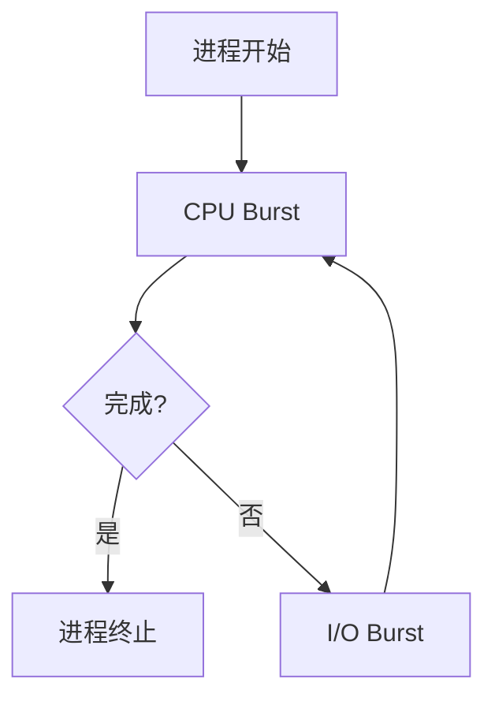
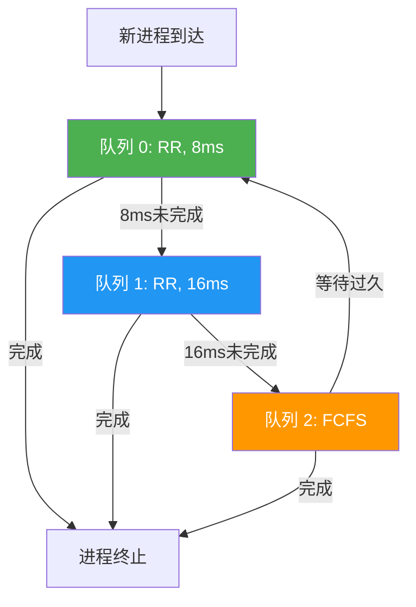

# 第五章 进程调度

> [!abstract] 本章解决什么问题？
> 在多道程序系统中，多个进程共享有限的 CPU 资源。进程调度（CPU Scheduling）回答的核心问题是：**操作系统如何决定何时以及让哪个进程获得 CPU 执行权？** 本章从基本概念出发，系统介绍调度准则、经典调度算法、线程调度、多处理器调度、实时调度，以及 Linux/Windows/Solaris 的实际实现。

## 本章导航

- [[#5.1 基本概念|基本概念]]：CPU-I/O 执行周期、调度程序职责、抢占调度、调度延迟。
- [[#5.2 调度准则|调度准则]]：CPU 使用率、吞吐量、周转时间、等待时间、响应时间。
- [[#5.3 调度算法|调度算法]]：FCFS、SJF、优先级、RR、多级队列、多级反馈队列。
- [[#5.4 线程调度|线程调度]]：PCS 与 SCS 竞争范围。
- [[#5.5 多处理器调度|多处理器调度]]：SMP、处理器亲和性、负载平衡、多核调度。
- [[#5.6 实时CPU调度|实时CPU调度]]：RMS、EDF、比例分享调度。
- [[#5.7 操作系统例子|操作系统例子]]：Linux CFS、Windows、Solaris 调度实现。
- [[#5.8 算法评估|算法评估]]：确定性模型、排队模型、仿真、实际实现。

## 学习目标

- [ ] 能区分 CPU 密集型与 I/O 密集型进程的特征差异。
- [ ] 能解释抢占调度与非抢占调度的区别及竞态条件风险。
- [ ] 能说明调度延迟的组成及优化方向。
- [ ] 能对比 FCFS、SJF、RR、优先级、多级反馈队列算法的优劣。
- [ ] 能推导 SJF 的指数平均预测公式。
- [ ] 能解释饥饿问题及老化机制的解决原理。
- [ ] 能区分 PCS 与 SCS 线程调度范围。
- [ ] 能说明处理器亲和性与负载平衡的权衡关系。
- [ ] 能解释 RMS 与 EDF 实时调度算法的原理与理论界限。
- [ ] 能描述 Linux CFS 的 `vruntime` 机制。

---

## 5.1 基本概念

在多道程序系统中，进程并不总是占用 CPU。当进程发起 **I/O 请求**（如读取文件、等待用户输入）时，如果让 CPU 干等会产生巨大资源浪费。多道程序设计的核心目标就是**提高 CPU 利用率**。

进程的运行状态遵循 **"计算 → 等待I/O → 计算 → 等待I/O"** 的循环模式。当一个进程进入 **I/O执行区间**（等待I/O完成）时，操作系统会立即**保存当前进程的状态**，并将 **CPU 控制权移交给另一个就绪的进程**。一旦 I/O 完成，该进程会重新进入就绪队列，等待下一次被 CPU 调度。

### 5.1.1 CPU-I/O执行周期

进程的生命周期是**"CPU 计算 → I/O 等待 → CPU 计算 → I/O 等待……"**的不断交替过程，直至进程完全终止（以最后一次 CPU 执行为结束）。

- **CPU 执行（CPU Burst）**：进程占用 CPU 进行计算的时间段。
- **I/O 执行（I/O Burst）**：进程等待 I/O 完成的时间段。

CPU 执行时间的频率分布呈现典型的**"长尾"效应（指数或超指数分布）**：绝大多数进程拥有**大量短 CPU 执行**，只有极少数进程拥有**少量长 CPU 执行**。

基于此分布特征，进程可分为两类：

| 类型 | 特征 | 典型场景 |
|------|------|----------|
| **I/O 密集型（I/O-bound）** | 频繁但极短的 CPU 执行区间 | 打字、网页浏览 |
| **CPU 密集型（CPU-bound）** | 少量但很长的 CPU 执行区间 | 视频渲染、科学计算 |

### 5.1.2 CPU调度程序

当 **CPU 空闲**时，由**短期调度程序（CPU 调度程序）**从就绪队列中挑选一个进程，并为其分配 CPU 执行权。

就绪队列在逻辑上是"等待 CPU 的队列"，但底层实现非常灵活，不必是简单的 FIFO 队列：
- **FIFO 队列**：最简单的实现
- **优先队列**：用于优先级调度
- **红黑树**：高效的有序检索
- **无序链表**：适合小规模场景

队列中存放的是进程的 **[[第三章 进程#3.1.3 进程控制块|PCB（进程控制块）]]**，调度程序通过读取 PCB 中的信息（如进程优先级、状态等）来决定下一个该由谁运行。

### 5.1.3 抢占调度

触发调度的四类情况：**运行→等待**（如 I/O）、**运行→就绪**（如中断）、**等待→就绪**（如 I/O 完成）、以及**进程终止**。

> [!important] 抢占与非抢占的关键区分
> 只有在 **"运行→就绪"** 和 **"等待→就绪"** 这两种情况下发生调度，才属于**抢占调度（Preemptive）**。前两者和最后一种属于**非抢占调度（Nonpreemptive / 协作调度）**。

非抢占的特点是进程一旦拿到 CPU，必须主动交出（直到终止或等待 I/O），系统无法强制剥夺。

> [!warning] 抢占的核心隐患：数据竞争
> - **用户态数据**：进程 A 修改共享数据时被抢占，进程 B 读取到损坏或不一致的数据（后续章节将专门讨论此问题）。
> - **内核态数据**：进程在内核态执行系统调用时被抢占，可能导致内核数据结构混乱。

操作系统应对内核抢占问题的方案：
- **方案一（放弃抢占权）**：上下文切换前强制等待系统调用完成或 I/O 阻塞（如传统 UNIX）。保证数据一致性，但牺牲实时性。
- **方案二（禁用/启用中断）**：进入临界区前禁用中断，执行完毕后启用中断。禁用时间极短，不影响系统响应。

### 5.1.4 调度程序（Dispatcher）

**调度程序（Dispatcher）**是负责**执行** CPU 调度决策的底层模块，接收短期调度程序选定的进程，并真正将 CPU 控制权移交给它。

调度程序执行的三个核心动作：
1. **切换上下文**：保存当前进程的 CPU 状态（寄存器、程序计数器等），加载新进程的上下文。
2. **切换到用户模式**：确保 CPU 从内核态切换回用户态。
3. **跳转到合适位置**：将指令指针指向新进程上次暂停的位置。

**调度延迟（Dispatch Latency）**是调度程序**停止当前进程**并**启动新进程**所需的时间。这是纯粹的**系统开销**，必须尽可能缩短。

---

## 5.2 调度准则

### 五大核心评价指标

| 指标 | 定义 | 优化目标 |
|------|------|----------|
| **CPU 使用率** | CPU 忙碌时间占比（理想 100%，实际 40%~90%） | 最大化 |
| **吞吐量（Throughput）** | 单位时间内完成的进程数 | 最大化 |
| **周转时间（Turnaround Time）** | 从进程提交到完成的总时间 | 最小化 |
| **等待时间（Waiting Time）** | 进程在就绪队列中等待 CPU 的总时间 | 最小化 |
| **响应时间（Response Time）** | 从提交请求到产生第一响应的时间 | 最小化 |

> [!note] 关键洞察
> **CPU 调度算法只能影响等待时间**，无法影响实际 CPU 执行时间和 I/O 等待时间。

### 优化目标与权衡

总体目标是最大化 CPU 使用率和吞吐量，最小化周转时间、等待时间和响应时间。

在交互式系统（如桌面操作系统）中，**最小化响应时间的方差（即让系统表现稳定、可预测）**，比单纯追求更低的平均响应时间更能提升用户体验。

---

## 5.3 调度算法

### 5.3.1 先到先服务调度（FCFS）

FCFS 使用简单的 **FIFO 队列**：进程 PCB 入队尾，CPU 空闲时从队头取出。它是**非抢占性**的，进程一旦获得 CPU，运行直到主动释放（终止或 I/O 请求）。

> [!warning] 核心缺陷：平均等待时间波动极大
> 平均等待时间严重依赖进程到达顺序。短作业后接长作业时平均等待时间仅 **3ms**，而长作业先执行时高达 **17ms**。

```mermaid
gantt
    title FCFS 调度示例
    dateFormat  X
    axisFormat %sms
    
    section P1(24ms)
    P1 :0, 24
    
    section P2(3ms)
    P2 :24, 27
    
    section P3(3ms)
    P3 :27, 30
```

> [!danger] 护航效应（Convoy Effect）
> 当 **1 个 CPU 密集型进程**和 **多个 I/O 密集型进程**共存时，所有 I/O 密集型进程必须排队等待长进程用完 CPU，导致 **I/O 设备空闲**，系统整体利用率严重下降。

FCFS **完全不适用于分时（交互式）操作系统**，但可用于批处理系统。

### 5.3.2 最短作业优先调度（SJF）

SJF 每次选择就绪队列中**"下次 CPU 执行时间最短"**的进程执行；时间相同时采用 FCFS。在非抢占式且所有进程同时到达的情况下，SJF 是**平均等待时间最短**的最优算法。

#### 预测 CPU 执行时间

系统采用**指数平均（Exponential Average）**法基于历史数据预测：

$$
\tau_{n+1} = \alpha t_n + (1 - \alpha)\tau_n
$$

- $t_n$：最近一次实际 CPU 执行时间
- $\tau_n$：过去的预测值
- $\alpha \in [0,1]$：权重参数（越大越依赖最近执行时间）

通过递归展开公式可以发现，越早的历史 CPU 执行时间，其权重会随着指数衰减 $((1-\alpha)^j)$。

#### 抢占式 SJF（最短剩余时间优先）

新进程到达时，若其预估执行时间 < 当前进程剩余执行时间，则**抢占**当前进程。

### 5.3.3 优先级调度

系统为每个进程分配优先级，调度器始终选择就绪队列中优先级最高的进程执行；优先级相同时采用 FCFS。SJF 是优先级调度的特例，进程优先级与 CPU 执行时间成反比。

优先级的定义来源：
- **内部定义**：基于内存需求、打开文件数、I/O/CPU 执行时长比率等。
- **外部定义**：基于进程重要性、用户付费额度、所属部门等。

> [!warning] 核心缺陷：饥饿（Starvation）
> 高负载下，低优先级进程可能**永远得不到 CPU 执行机会**。

> [!tip] 解决方案：老化（Aging）机制
> 系统定期**逐渐提升等待时间过长的进程的优先级**，确保低优先级进程最终能获得执行机会。

### 5.3.4 轮转调度（RR）

RR 专为**分时（交互式）系统**设计，CPU 时间划分为固定大小的**时间片（Time Quantum）**，通常为 $10 \sim 100ms$。维护 **FIFO 循环队列**，时间片耗尽后进程被抢占并放回队尾。

对于 $n$ 个进程，时间片为 $q$，进程等待时间界限为 $(n-1)q$，保证每个进程在一定周期内获得 CPU。

> [!important] 时间片大小的核心权衡
> - **过大**：退化为 FCFS，无法保证响应时间。
> - **过小**：频繁上下文切换，系统开销激增。
> - **设计准则**：时间片应远大于上下文切换时间，且 **80% 的 CPU Burst 应小于时间片**。

### 5.3.5 多级队列调度

不同类型进程（前台交互 vs 后台批处理）对响应时间要求不同，统一调度策略难以满足所有需求。多级队列调度将就绪队列**划分为多个独立子队列**，进程根据类型/优先级**永久分配**到特定队列。

- **前台队列**：使用 RR 调度（快速响应）
- **后台队列**：使用 FCFS 或 SJF 调度（吞吐量优先）

队列间调度策略：
- **策略一：固定优先级抢占**：高优先级队列绝对优先，低优先级队列可能饥饿。
- **策略二：按比例分配 CPU 时间**：每个队列分配固定比例的 CPU 时间，解决饥饿问题。

### 5.3.6 多级反馈队列调度（MLFQ）

多级队列调度中进程一旦分配就不会改变队列，不够灵活。MLFQ 允许进程根据其 CPU 执行行为在队列之间**动态迁移**：短作业获得高优先级，长作业被降级。

> [!example] MLFQ 实例机制
> - **队列 0（最高优先级）**：RR，时间片 8ms。新进程入队 0，未完成则降级到队列 1。
> - **队列 1（中等优先级）**：RR，时间片 16ms。未完成则降级到队列 2。
> - **队列 2（最低优先级）**：FCFS。仅在队列 0、1 为空时运行。
> - **抢占规则**：高优先级队列进程可随时抢占低优先级进程。
> - **老化机制**：队列 2 中等待过久的进程升级到更高优先级队列。

MLFQ 的五大核心参数：队列数量、每个队列的调度算法、升级策略、降级策略、初始队列分配策略。

---

## 5.4 线程调度

### 5.4.1 竞争范围

| 维度 | 进程竞争范围（PCS） | 系统竞争范围（SCS） |
|------|---------------------|---------------------|
| 适用对象 | 用户级线程（多对一、多对多模型） | 内核级线程（一对一模型） |
| 调度主体 | 用户空间线程库 | 操作系统内核 |
| 竞争范围 | 同一进程内部用户线程 | 整个系统所有线程 |
| 典型系统 | 传统线程库 | Windows、Linux、Solaris |

PCS 的调度结果是将用户线程分配给 **LWP（轻量级进程/虚拟处理器）**，而 SCS 的调度结果是将内核线程分配给**物理 CPU** 执行。关于线程模型的详细讨论，见 [[第四章 多线程编程]]。

### 5.4.2 Pthread调度

> [!mechanism] Pthreads 如何请求调度属性
> 线程属性对象可通过 `pthread_attr_setschedpolicy()` 指定策略、通过 `pthread_attr_setschedparam()` 指定优先级，并用 `pthread_attr_setinheritsched()` 决定继承创建者还是采用显式属性。POSIX 定义接口，但有效策略、优先级范围和普通用户能否启用实时策略由具体系统决定；程序必须检查每一步返回码，不能假定请求一定生效。

> [!example] 对照代码
> [[MOC - 操作系统示例代码#第五章：线程与实时调度|查看 Pthread 竞争范围示例]]。

---

## 5.5 多处理器调度

多处理器系统的核心优势是负载分配成为可能，多个 CPU 可同时处理任务，显著提升吞吐量。但相比单处理器，调度算法面临更多权衡和约束，没有"最佳方案"。

本节主要聚焦于同构多处理器系统，即系统中的**所有处理器在功能上完全等价**。

### 5.5.1 多处理器的调度方法

#### 非对称多处理（Asymmetric Multiprocessing）

系统指定一个特定的处理器作为**主处理器（Master）**，专门负责处理所有的调度决策、中断和 I/O 操作；其余处理器作为**从处理器（Slave）**，仅用于执行用户代码。

优点是架构简单，因为只有主处理器能够访问和修改操作系统的核心数据结构（如就绪队列），避免了多核并发访问带来的复杂同步问题。

#### 对称多处理（SMP）

每个处理器都可以独立运行操作系统的调度程序，自主决定下一个执行哪个进程。所有处理器是对等的，没有主从之分。

队列实现方式：
- **共同就绪队列**：所有处理器共享同一个全局就绪队列。
- **私有就绪队列**：每个处理器维护自己专属的就绪队列。

如果采用全局队列，当多个处理器同时访问队列来选择进程时，可能引发竞争。操作系统必须通过**同步机制**来确保两个处理器不会选择同一个进程，且进程不会在队列中丢失。

**几乎所有现代操作系统**（Windows、Linux、Mac OS X）都采用并支持 SMP 架构。

### 5.5.2 处理器亲和性

在多核系统中，每个 CPU 都有自己的缓存。如果进程频繁在不同 CPU 核心之间迁移，会导致**旧核心的缓存失效**，同时**新核心的缓存必须重新填充**。这种缓存失效与重填的开销极大，因此 SMP 系统倾向于让进程尽量绑定在同一个 CPU 核心上运行，这被称为**处理器亲和性**。

亲和性的两种类型：
- **软亲和性（Soft Affinity）**：操作系统"尽力"让进程留在同一个 CPU 上运行，但并非强制。
- **硬亲和性（Hard Affinity）**：系统提供系统调用（例如 Linux 中的 `sched_setaffinity()`），允许程序员**强制指定**进程只能运行在特定的一个或一组 CPU 核心上。

在 **NUMA（非统一内存访问）**架构中，系统由多个"CPU+内存"的板卡/节点组成。CPU 访问**本板内存**的速度远快于访问**其他板内存**。调度器需与内存分配器协同，将进程和其内存分配在同一板卡上。

### 5.5.3 负载平衡

在 SMP 系统中，为了避免"有的 CPU 忙死，有的 CPU 闲死"的情况，必须进行负载平衡以最大化多核并行效率。

如果系统采用**全局公共就绪队列**，天然实现了负载平衡。但现代操作系统大多采用**每个 CPU 私有就绪队列**（为了减少多核竞争锁的开销），这就使得显式的负载平衡机制变得极其重要。

负载平衡的两种核心实现方法：
- **推迁移（Push Migration）**：专门任务定期检查各 CPU 负载，主动将任务推到空闲 CPU。
- **拉迁移（Pull Migration）**：空闲 CPU 主动从忙碌 CPU 队列中拉取任务。

> [!important] 负载平衡与处理器亲和性的冲突
> 亲和性追求进程长时间运行在同一 CPU（利用缓存），而负载平衡必然导致进程迁移（缓存失效），二者存在根本矛盾，需要权衡取舍。

### 5.5.4 多核处理器

将多个处理器核集成到单个物理芯片上（多核架构），能以更快的速度和更低的功耗运行。但 CPU 访问内存发生**缓存未命中**时，等待数据的时间可能高达 **50%** 的 CPU 时间，纯属资源浪费。

为了解决内存停顿，现代 CPU 为每个物理核配备了**多个硬件线程（逻辑处理器）**。当一个线程因等待内存数据而停顿（Memory Stall）时，物理核可以**立即切换**到另一个硬件线程继续执行，从而掩藏了内存访问延迟。

硬件多线程的两种实现策略：
- **粗粒度多线程**：仅在发生长延迟事件（如内存停顿）时切换线程，切换代价高昂。
- **细粒度/交错多线程**：在指令周期边界上执行线程切换，切换开销极小。

多核硬件导致操作系统需要处理**两个不同级别的调度**：
- **第一级（软件调度）**：操作系统内核决定将哪个软件线程分配给哪个逻辑处理器。
- **第二级（硬件调度）**：物理核内部的硬件逻辑决定哪个硬件线程在物理核上实际执行。

---

## 5.6 实时CPU调度

> [!important] 软实时 vs 硬实时
> - **软实时系统**：不保证截止期限，仅保证实时进程优先于非关键进程。
> - **硬实时系统**：任务必须在截止期限前完成；超时与未完成等价。

### 5.6.1 最小化延迟

- **事件延迟**：从事件发生到事件得到服务的时间。
- **中断延迟**：从 CPU 收到中断信号到开始执行中断服务程序（ISR）的时间。
- **调度延迟**：调度程序从停止当前进程到启动新进程的时间。

对于硬实时系统，中断延迟不仅要"尽可能小"，更必须**"有界"**（即最坏情况下的延迟也有明确的上限）。造成该延迟的一个重要因素是**操作系统禁用中断**的时间。

调度延迟的关键在于"冲突阶段"：
1. **抢占**：强行剥夺在内核模式下运行的任何进程的 CPU 使用权。
2. **资源释放**：低优先级进程释放占有的资源，以便高优先级实时进程能够立即获得资源并执行。

### 5.6.2 优先权调度

实时操作系统必须采用**抢占式的基于优先级的调度**，高优先级进程可随时抢占低优先级进程。许多现代操作系统（如 Windows、Linux、Solaris）都支持将最高的调度优先级专门分配给实时进程。

硬实时系统中，需要调度的进程通常具有**周期性（Periodic）**的特征。每个周期任务可以用三个核心参数描述：
- **处理时间（t）**：每次执行所需的 CPU 时间
- **截止期限（d）**：必须完成的时间点
- **周期（p）**：任务再次启动的时间间隔
- **约束**：$0 \le t \le d \le p$，速率 = $1/p$

> [!mechanism] 准入控制（Admission Control）
> 进程启动前必须向调度器公布截止期限要求，调度器根据系统负载决定是否接纳：
> - **接纳**：保证任务能在截止期限前完成。
> - **拒绝**：无法满足实时性要求时拒绝请求。

### 5.6.3 单调速率调度（RMS）

RMS 采用**抢占式、静态优先级**，优先级与任务周期**成反比**——周期越短（频率越高），优先级越高。RMS 是**最优的静态优先级调度算法**，若任务集无法被 RMS 调度，则无法被任何其他静态优先级算法调度。

```mermaid
gantt
    title RMS 调度示例（P1: 25/50, P2: 35/80）
    dateFormat  X
    axisFormat %sms
    
    section P1(短周期高优先级)
    P1_1 :0, 25
    P1_2 :50, 75
    P1_3 :100, 125
    
    section P2(长周期低优先级)
    P2_1 :25, 60
    P2_2 :80, 115
```

调度 $N$ 个周期性任务，RM 算法能保证截止期限的**最坏情况 CPU 利用率上限**为：

$$
N(2^{1/N} - 1)
$$

- $N=1$ 时，上限为 **100%**
- $N=2$ 时，上限为 **83%**
- $N \to \infty$ 时，上限趋近于 **69%**（$\ln 2 \approx 0.693$）

### 5.6.4 最早截止期限优先调度（EDF）

EDF 采用**动态优先级**，调度完全取决于截止期限：**截止期限越近，优先级越高**。进程就绪时向系统公布截止期限，系统实时调整调度优先级。

```mermaid
gantt
    title EDF 调度示例（P1: 25/50, P2: 35/80）
    dateFormat  X
    axisFormat %sms
    
    section P1(截止期限100)
    P1_1 :0, 25
    P1_2 :80, 105
    
    section P2(截止期限80)
    P2_1 :25, 60
    P2_2 :60, 80
```

EDF 是**理论上最优**的实时调度算法，可实现 **100%** 的 CPU 利用率（只要总利用率不超过 100%）。它不要求进程必须是周期性的，也不要求 CPU 执行时间固定。

> [!warning] 实际限制
> 由于上下文切换、内核调度开销和中断处理消耗 CPU，**实际无法达到 100% 利用率**。

### 5.6.5 比例分享调度

系统将处理器时间抽象为"总股数"（$T$），每个进程根据重要性获得一定"股数"（$N$），进程精确获得总处理时间的 $N/T$。

新进程请求进入时，调度器检查剩余可用股数：请求股数 ≤ 可用股数则允许进入，否则拒绝进入。

### 5.6.6 POSIX实时调度

> [!summary] POSIX 实时策略
> POSIX 常见策略包括 `SCHED_FIFO`（同优先级先到先服务，不设时间片）、`SCHED_RR`（同优先级时间片轮转）和普通分时策略 `SCHED_OTHER`。系统总是先选择最高静态优先级的可运行实时线程；设置策略可使用 `sched_setscheduler()` 或线程属性接口，但通常需要相应权限，并应通过 `sched_get_priority_min()` / `sched_get_priority_max()` 查询实现支持的范围。

> [!example] 对照代码
> [[MOC - 操作系统示例代码#第五章：线程与实时调度|查看带权限检查的 SCHED_FIFO 示例]]。

---

## 5.7 操作系统例子

### 5.7.1 Linux系统

#### 调度算法的历史演进

- **传统 UNIX 调度器**（Linux 2.5 之前）：不支持 SMP，大型系统性能差。
- **O(1) 调度器**（Linux 2.5）：常数时间复杂度，支持 SMP 和负载平衡，但交互性欠佳。
- **完全公平调度器（CFS）**（Linux 2.6.23）：以虚拟运行时间近似公平共享，是现代 Linux 公平调度类的重要基础；Linux 6.6 起开始把任务选择逻辑转向 EEVDF，不能再把经典 CFS 描述为不变的“当前默认算法”。

#### CFS 的核心机制：vruntime

CFS 不采用传统的时间片轮转，而是根据系统"目标延迟"按比例分配 CPU 时间。

- **友好值（Nice Value）**：范围 $-20 \sim +19$，数值越小优先级越高。
- **虚拟运行时间（`vruntime`）**：
  - 记录进程的"虚拟运行时长"
  - 不同优先级进程的 `vruntime` 增长速率不同：低优先级增长快，高优先级增长慢
  - 调度时选择 `vruntime` **最小**的任务运行

I/O 密集型任务因频繁阻塞，累积的 `vruntime` 很小；CPU 密集型任务持续累积很高的 `vruntime`。因此，CFS 自然将 CPU 优先分配给 I/O 密集型任务，提升了桌面系统的交互响应性。

#### Linux 优先级范围

- **实时任务**：优先级 $0 \sim 99$，数值越小优先级越高。
- **普通任务**：优先级 $100 \sim 139$，$-20$ 映射到 $100$，$+19$ 映射到 $139$。

### 5.7.2 Windows系统

Windows 使用**基于优先级、抢占式**的调度算法，最高优先级线程始终运行。

Windows 的优先级共有 **32** 个级别（0~31，0 级专用于内存管理）：
- **可变类（Variable Class）**：优先级 $1 \sim 15$，系统可动态调整。
- **实时类（Real-Time Class）**：优先级 $16 \sim 31$，优先级绝对固定。

动态优先级调整策略：
- **防止饥饿**：可变优先级线程时间片用尽后优先级降低（不低于基值）。
- **交互式提升**：等待键盘/鼠标的线程获得大幅提升，等待磁盘 I/O 的线程获得中等提升。
- **前台优待**：前台进程时间片变为通常的 3 倍。

Windows 7 引入了 **UMS（用户模式调度）**，应用程序可在用户态创建和调度线程，无需频繁陷入内核，创建和切换开销极大降低。

### 5.7.3 Solaris系统

Solaris 采用基于优先级的线程调度，线程分为 6 种类型：
- **分时（TS）**：默认类型，多级反馈队列动态调整优先级。
- **交互（IA）**：同分时，但给予 GUI 应用更高优先级。
- **系统（SYS）**：专用于内核线程，优先级固定。
- **实时（RT）**：最高优先级，确保严格时间响应。
- **公平分享（FSS）**：基于 CPU 份额调度。
- **固定优先级（FP）**：优先级不可动态变化。

Solaris 将各个调度类型的优先级映射到范围 **0 ~ 169 的全局优先级**：
- **中断线程**：$160 \sim 169$（最高）
- **实时类（RT）**：$100 \sim 159$
- **系统类（SYS）**：$60 \sim 99$
- **分时、交互、公平分享、固定优先级**：$0 \sim 59$

---

## 5.8 算法评估

没有"万能算法"，评估前必须先定义明确的选择准则（参考 5.2 节的评价指标）。

### 5.8.1 确定性模型

采用预先确定的任务负载（进程集合、到达时间、执行时间），通过手动计算或模拟得出具体数值。

优点是计算简单快捷，能给出精确数值对比；缺点是结果仅对特定输入场景有效，无法体现动态变化和随机性。

> [!example] 案例结果
> 5 个进程同时到达时：
> - **FCFS**：平均等待时间 = 28ms
> - **非抢占 SJF**：平均等待时间 = 13ms（最优）
> - **RR（时间片=10ms）**：平均等待时间 = 23ms

### 5.8.2 排队模型

将系统看作服务器网络，进程到达和运行时间服从统计分布（通常为指数分布），对系统性能进行长期平均评估。

排队模型的理论基石是 **Little 公式（Little's Law）**，描述系统处于**稳定状态**时三个关键变量的关系：

$$
n = \lambda \times W
$$

- $n$：平均队列长度
- $\lambda$：平均到达率
- $W$：平均队列等待时间

Little 公式**适用于任何调度算法**（只要系统达到稳定状态），具有极强的通用性。

排队模型的局限性：数学复杂性高，需做出不现实的假设（如泊松分布），结果为近似值。

### 5.8.3 仿真

通过建立软件模型模拟真实系统运行，包含虚拟时钟，动态更新设备、进程和调度器状态，收集性能统计指标。

仿真输入数据的两种生成方式：
- **随机数生成**：根据概率分布生成输入，无法体现事件顺序关联。
- **跟踪磁带**：真实记录实际系统运行事件，能产生最精确的比较结果。

仿真的局限性：时间成本高昂、存储需求巨大、开发难度复杂。

### 5.8.4 实现

将算法实际编码进操作系统，在真实环境中运行观察，这是最精确的评估方法，但代价最高。

系统的运行环境是动态变化的，用户的程序行为会根据调度策略做出调整。例如，为了让短作业获得更多 CPU，用户可能会将长作业分解为多个短作业；如果交互进程优先级高，用户可能会故意通过频繁的终端 I/O 操作"伪装"成交互进程。

最灵活的方式是允许系统管理员或用户自行调整调度参数：
- **管理员级别**：如 Solaris 的 `dispadmin` 命令。
- **程序员级别**：Java、POSIX、Windows API 提供优先级调整接口。

> [!note] Linux 调度版本核实
> Linux 内核文档说明，公平调度从 6.6 起开始转向 EEVDF。参见 [EEVDF Scheduler](https://www.kernel.org/doc/html/latest/scheduler/sched-eevdf.html) 与 [CFS Scheduler](https://www.kernel.org/doc/html/latest/scheduler/sched-design-CFS.html)，核实于 2026-07-14。
