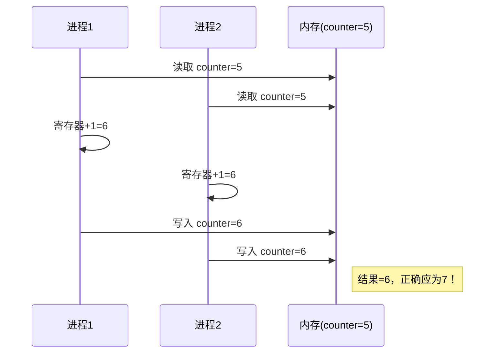
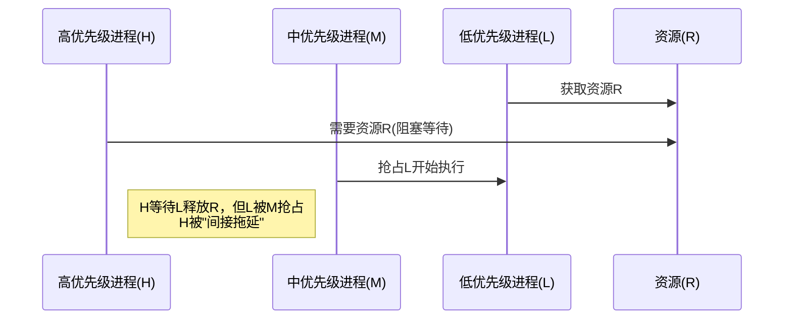
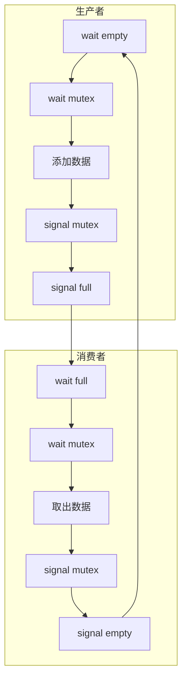
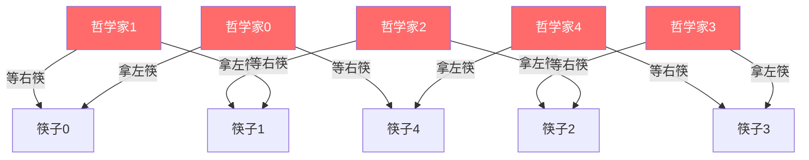

# 第六章 同步

> [!abstract] 本章解决什么问题？
> 当多个进程或线程并发访问和操作共享数据时，其执行顺序变得不可预测，可能导致数据被破坏（竞争条件）。本章介绍进程同步与协调机制，确保共享资源的互斥访问，包括临界区问题、硬件同步、互斥锁、信号量、经典同步问题、管程以及现代替代方案。

## 本章导航

- [[#6.1 背景|背景]]：并发与并行带来的竞争条件问题。
- [[#6.2 临界区问题|临界区问题]]：互斥、进步、有限等待三大要求。
- [[#6.3 Peterson解决方案|Peterson解决方案]]：纯软件的双进程互斥算法。
- [[#6.4 硬件同步|硬件同步]]：原子指令与自旋锁。
- [[#6.5 互斥锁|互斥锁]]：自旋锁的原理与适用场景。
- [[#6.6 信号量|信号量]]：wait/signal 操作、死锁与饥饿、优先级反转。
- [[#6.7 经典同步问题|经典同步问题]]：有界缓冲、读者-作者、哲学家就餐。
- [[#6.8 管程|管程]]：高级同步工具、条件变量。
- [[#6.9 同步例子|同步例子]]：Windows、Linux、Solaris、Pthreads。
- [[#6.10 替代方法|替代方法]]：事务内存、OpenMP、函数式编程。

## 学习目标

- [ ] 能解释竞争条件的成因（机器指令的非原子性）。
- [ ] 能陈述解决临界区问题的三大核心要求。
- [ ] 能描述 Peterson 算法的原理及其在现代硬件上的局限性。
- [ ] 能解释 test_and_set 和 compare_and_swap 原子指令。
- [ ] 能区分互斥锁与自旋锁的适用场景。
- [ ] 能使用信号量实现互斥和同步（顺序控制）。
- [ ] 能分析死锁和饥饿的成因及解决方案。
- [ ] 能描述优先级反转问题及优先级继承协议。
- [ ] 能用信号量解决生产者-消费者、读者-作者、哲学家就餐问题。
- [ ] 能解释管程的核心思想及条件变量的使用。

---

## 6.1 背景

### 并发与并行带来的问题

- **单核系统**：并发通过进程的快速切换实现（进程随时可能被中断）。
- **多核系统**：多个进程可以真正地在不同的处理核上**并行执行**。
- **共享数据风险**：当这些进程或线程**共享数据**时，其执行顺序变得不可预测，进而导致数据被破坏。

### 竞争条件（Race Condition）的成因

根源在于机器指令的**非原子性**。像 `counter++` 这样看似一条的高级语言语句，在 CPU 机器指令级别上被拆分成 **3 个步骤**：

1. 将 `counter` 读入寄存器。
2. 在寄存器中进行加 1 操作。
3. 将寄存器的结果写回 `counter`。



**竞争条件定义**：当**多个进程并发访问和操作同一数据**，并且最终的**执行结果取决于特定的访问顺序**时，就产生了**竞争条件**。

### 为什么必须解决这个问题？

- **破坏数据一致性**：竞争条件会导致系统中共享资源的状态错误（如缓冲区项目数量与实际不符）。
- **多核时代更加严重**：随着多核处理器的普及，多个线程真正并行的场景急剧增加，竞争条件发生的概率和风险随之放大。
- **本章主旨**：引入**进程同步（Process Synchronization）**和**协调机制**，确保在同一时刻，只有一个进程可以操作共享变量（即**互斥访问**）。

---

## 6.2 临界区问题

### 临界区的定义

进程中**访问共享资源（如修改全局变量、维护链表、写文件等）** 的代码段，被称为临界区。关于进程和共享资源的概念，见 [[第三章 进程]]。

**根本原则**：在任何时刻，**最多只能有一个进程**处于其临界区内执行（即保证互斥，防止数据被破坏）。

### 解决临界区问题的三大核心要求

| 要求 | 描述 |
|------|------|
| **互斥（Mutual Exclusion）** | 如果进程 Pi 在临界区，其他所有进程都不得进入临界区。 |
| **进步（Progress）** | 如果临界区空闲，并且有多个进程想进入，不能无限期地拖延它们的选择，必须尽快选出一个进入。 |
| **有限等待（Bounded Waiting）** | 当一个进程发出进入请求后，其他进程能进入临界区的次数必须**有限制**，防止某个进程无限期等待（避免饥饿）。 |

### 抢占式内核 vs 非抢占式内核

| 类型 | 特点 | 优点 | 缺点 |
|------|------|------|------|
| **非抢占式内核** | 普通内核执行路径不会被调度器任意抢占，但仍可能主动阻塞并受中断影响 | 减少同一 CPU 上的部分并发情形，设计相对简单 | 响应不够及时，且 SMP 与中断仍要求同步 |
| **抢占式内核** | 允许在满足安全条件时抢占内核态任务；临界区仍会禁止抢占或加锁 | 响应速度快，适合低延迟需求 | SMP 下必须精确保护共享内核数据。关于调度和抢占的讨论，见 [[第五章 进程调度]]。 |

---

## 6.3 Peterson解决方案

### 核心思想与数据结构

**适用场景**：仅适用于**两个**进程（P0 和 P1）的交替执行。

**共享变量**：
- `flag[2]`：布尔数组，`flag[i] = true` 表示进程 Pi 想要进入临界区。
- `turn`：整型变量，表示当前**轮到**哪个进程进入临界区。体现了**“谦让”机制**。

### 算法逻辑解析

```c
// 进程 Pi 的代码
do {
    flag[i] = true;           // 举旗示意
    turn = j;                 // 把通行证让给对方
    while (flag[j] && turn == j);  // 忙等待
    
    // 临界区
    critical_section();
    
    flag[i] = false;          // 放下旗帜
    
    // 剩余区
    remainder_section();
} while (true);
```

### 满足临界区三大要求

- **互斥**：成立。因为 `turn` 的值在任意时刻非 0 即 1，两个进程不可能同时通过 `while` 循环的检查。
- **进步**：成立。如果临界区空闲且另一个进程不打算进入，当前进程一定会通过检查并进入。
- **有限等待**：成立。即便两个进程都在忙等待，一个进程在另一个进程进入并退出临界区后，**最多只需再等待一次**就能获得进入资格。

### 实际使用中的局限性

> [!warning] 现实失效
> 由于现代计算机处理器（尤其是多核、SMP 架构）采用了高级流水线、乱序执行和缓存机制，**`load` 和 `store` 指令很可能不是原子性的，或者执行顺序在实际机器级上被打乱**。因此，**Peterson 算法在现代硬件上不一定能保证正确工作**。实际工程中依赖硬件提供的原子指令或操作系统提供的同步原语。

---

## 6.4 硬件同步

### 为什么需要硬件支持？

- **Peterson 算法失效**：纯软件解决方案在多核、乱序执行、缓存不一致的现代 CPU 架构下无法保证原子性。
- **单核禁用中断**：在单核 CPU 上，可以通过在执行临界区代码时**禁用中断**来保证互斥。但这种方法在多核 CPU 上**不可行**（广播禁用中断开销巨大，且会严重影响系统时钟的准确性）。

### 原子硬件指令

现代 CPU 提供了**原子（不可中断）**的硬件指令来支持并发，这些指令能在一条机器指令级别完成“读-改-写”的操作。

**核心指令**：

```c
// test_and_set 指令
boolean test_and_set(boolean *target) {
    boolean rv = *target;
    *target = true;
    return rv;
}

// compare_and_swap 指令
boolean compare_and_swap(int *value, int expected, int new_value) {
    if (*value == expected) {
        *value = new_value;
        return true;
    }
    return false;
}
```

### 基于原子指令的自旋锁

```c
// 基于 test_and_set 的简单自旋锁
void acquire_lock(boolean *lock) {
    while (test_and_set(lock));  // 忙等待直到获取锁
}

void release_lock(boolean *lock) {
    *lock = false;
}
```

这种实现满足了**互斥**，但存在**饥饿**的风险（不满足有限等待条件）。

### 满足三大要求的硬件锁

为了彻底解决饥饿问题，引入 `waiting[n]` 数组记录每个进程的等待状态：

```c
boolean waiting[n];  // 记录进程等待状态
boolean lock;        // 全局锁

// 进程 Pi 的进入区
waiting[i] = true;
key = true;
while (waiting[i] && key) {
    key = test_and_set(&lock);
}
waiting[i] = false;

// 临界区...

// 进程 Pi 的退出区
j = (i + 1) % n;
while ((j != i) && !waiting[j]) {
    j = (j + 1) % n;
}
if (j == i) {
    lock = false;  // 没有其他等待进程，释放锁
} else {
    waiting[j] = false;  // 唤醒下一个等待进程
}
```

**核心机制**：退出区不是简单地释放 `lock`，而是主动扫描下一个等待的进程并唤醒它。这种**转交唤醒**的机制完美保证了**有限等待**。

---

## 6.5 互斥锁

### 为什么需要互斥锁？

纯粹的硬件原子指令虽然能解决问题，但对普通程序员来说太复杂、太底层。操作系统将其封装为**互斥锁**这一高级工具，使用者只需关注 `acquire()`（获取锁）和 `release()`（释放锁）即可。

### 核心实现

互斥锁的核心是一个布尔状态变量 `available`（表示锁是否空闲）。`acquire()` 和 `release()` 的执行过程**必须是原子的**，底层依托于硬件原子指令（如 `test_and_set`）实现。

### 忙等待与自旋锁

```c
// 简单互斥锁实现（自旋锁）
boolean available = true;

void acquire() {
    while (!available);  // 忙等待
    available = false;
}

void release() {
    available = true;
}
```

**自旋锁**：因为进程在不停“自旋”等待，这种互斥锁也被称为**自旋锁**。

### 优缺点权衡

| 维度 | 说明 |
|------|------|
| **缺点** | 在单核系统中，忙等待会浪费大量本可用于其他进程的 CPU 周期。 |
| **优点** | 不会产生上下文切换（Context Switch），相比让出 CPU 再唤醒的高昂开销，忙等待在原地转圈的开销反而可能更小。 |
| **适用场景** | 临界区代码极短的场景，且在**多处理器（SMP）系统**中效果最好（一个 CPU 上自旋等待，另一个 CPU 上执行临界区代码）。 |

---

## 6.6 信号量

信号量本质上是一个**整型变量 S**（通常是非负整数），提供两个标准的原子操作：`wait(S)` 和 `signal(S)`。

### 互斥锁与信号量的核心区别

| 类型 | 值范围 | 主要用途 |
|------|--------|----------|
| **互斥锁** | 0 或 1（二值信号量） | 保护单一共享资源的互斥访问 |
| **信号量** | 非负整数（计数信号量） | 资源计数（如连接池、打印机数量） |

### 6.6.1 信号量的使用

#### 二进制信号量（Binary Semaphore）

取值范围仅为 0 或 1，功能上**等同于互斥锁**，专门用于保护单一临界资源的**互斥访问**。

#### 计数信号量（Counting Semaphore）

取值范围不受限制，用于管理**数量大于 1 的相同资源池**。

**工作机制**：信号量值初始化为“可用资源总数”。
- `wait()`：请求资源，计数减 1。若减到 0 还继续请求，则进程阻塞。
- `signal()`：释放资源，计数加 1。若有进程在等待该资源，则唤醒一个进程。

#### 经典的顺序执行同步

**场景**：强制规定两个并发进程的执行顺序（必须 P1 执行完某段代码，P2 才能执行后续代码）。

```c
semaphore synch = 0;  // 初始值为 0

// 进程 P1
S1();
signal(synch);

// 进程 P2
wait(synch);
S2();
```

### 6.6.2 信号量的实现

#### 无忙等待的原理

当 `wait()` 发现信号量不满足条件时，进程不会在 `while` 循环中“空转”，而是调用 `block()`，**将自己阻塞并移出 CPU**，放入该信号量的等待队列中。当其他进程调用 `signal()` 后，会从队列中唤醒一个阻塞进程（调用 `wakeup()`），将其状态改为就绪。

#### 核心数据结构

信号量结构体包含一个整数 `value` 和一个进程链表 `list`。

**负值的含义**：如果信号量 `S->value < 0`，其绝对值（`-value`）代表当前**有多少个进程正在等待**这个信号量。

#### 临界区的缩小

虽然消除了整个 `wait()` 循环期间的忙等待，但**修改信号量自身的 `value` 和 `list`** 依然是临界区。在单核系统上用**禁止中断**实现；在 SMP 多核系统上，依赖硬件原子指令来保护这些“微型临界区”。

忙等待的弊端被**从“长时间等待”缩小到了“极短时间的锁保护”**。

### 6.6.3 死锁与饥饿

#### 死锁的定义与发生机制

**核心定义**：一组进程中的每一个进程都在等待一个事件，而该事件只能由该组内的另一个进程触发，导致所有进程无限期地互相等待。

**示例**：进程 P0 拥有信号量 S 并等待 Q，进程 P1 拥有信号量 Q 并等待 S，双方互不相让，形成死循环。

> [!note] 死锁的后续扩展
> 死锁不仅发生在信号量的 `wait` 和 `signal` 上，其他类型的资源事件也能引发死锁。[[第七章 死锁]] 将会专门讨论如何预防、避免、检测和解除死锁。

#### 饥饿（无限阻塞）

进程无限等待信号量，永远得不到执行机会。潜在原因：如果信号量的等待队列采用 **LIFO（后进先出）** 或**不公平**的策略来增加和唤醒等待进程，可能导致某些先进来等待的进程始终不被唤醒。

### 6.6.4 优先级的反转

#### 什么是“优先级反转”？

高优先级进程因为等待一个被低优先级进程占用的资源，而被中等优先级进程“间接拖延”的现象。



#### 解决方案：优先级继承协议

**核心原理**：当一个低优先级进程（L）访问了一个高优先级进程（H）正在等待的资源时，低优先级进程 L 会**临时继承**高优先级进程 H 的优先级，直到它用完该资源。

**最终效果**：L 临时获得了与 H 一样高的优先级，M 无法抢占 L，L 得以快速执行完并释放资源 R，H 就能立即获得调度执行。

---

## 6.7 经典同步问题

### 6.7.1 有界缓冲问题

#### 三种信号量的协同作用

| 信号量 | 类型 | 初始值 | 作用 |
|--------|------|--------|------|
| `mutex` | 互斥信号量 | 1 | 保护临界区（缓冲池） |
| `empty` | 计数信号量 | n | 代表缓冲池中**空闲槽位**的数量 |
| `full` | 计数信号量 | 0 | 代表缓冲池中**已填满数据**的数量 |

#### 生产者的执行流程

```c
// 生产者进程
do {
    wait(empty);     // 确保有空位
    wait(mutex);     // 获取操作权限
    
    // 临界区：向缓冲区添加新数据
    add_item(item);
    
    signal(mutex);   // 释放互斥锁
    signal(full);    // 通知消费者有新数据
} while (true);
```

#### 消费者的执行流程

```c
// 消费者进程
do {
    wait(full);      // 确保有数据
    wait(mutex);     // 获取操作权限
    
    // 临界区：从缓冲区取出数据
    remove_item(&item);
    
    signal(mutex);   // 释放互斥锁
    signal(empty);   // 通知生产者有空位
} while (true);
```



### 6.7.2 读者-作者问题

#### 问题的核心冲突

- **读者**：只读数据，彼此之间**不冲突**，可以并发读取。
- **作者**：修改数据，与任何其他人（包括读者和其他作者）**都冲突**，需要独占访问权。

#### 第一读者-作者问题（读者优先）的实现

```c
semaphore mutex = 1;      // 保护 read_count
semaphore rw_mutex = 1;   // 作者与首位读者之间的互斥锁
int read_count = 0;       // 当前正在读取的进程数

// 读者进程
void reader() {
    wait(mutex);
    read_count++;
    if (read_count == 1) {
        wait(rw_mutex);   // 第一个读者，阻止作者进入
    }
    signal(mutex);
    
    // 临界区：读取数据
    read_data();
    
    wait(mutex);
    read_count--;
    if (read_count == 0) {
        signal(rw_mutex); // 最后一个读者，释放锁
    }
    signal(mutex);
}

// 作者进程
void writer() {
    wait(rw_mutex);
    
    // 临界区：写入数据
    write_data();
    
    signal(rw_mutex);
}
```

> [!warning] 作者饥饿风险
> 这种“读者优先”的实现可能导致**作者饥饿**（如果读者源源不断，作者永远拿不到锁）。更完善的变种（如“写者优先”或“公平读写锁”）在商业系统中会得到进一步优化。

### 6.7.3 哲学家就餐问题

#### 问题背景

5 个哲学家、5 根筷子围成一圈。哲学家吃饭必须同时持有左右两根筷子，思考时则放下筷子。

#### 简单的信号量解法及其致命缺陷

```c
semaphore chopstick[5];  // 5 根筷子，初始值均为 1

// 哲学家 i 的代码
do {
    wait(chopstick[i]);
    wait(chopstick[(i+1) % 5]);
    
    // 进餐
    
    signal(chopstick[i]);
    signal(chopstick[(i+1) % 5]);
    
    // 思考
} while (true);
```

**死锁场景**：如果 5 个哲学家**同时**拿起了自己左边的筷子，所有筷子都被占用，每个人都在等待右边的筷子，系统陷入**循环等待**（死锁）。



#### 避免死锁的三种经典策略

1. **资源限额**：限制同一时刻最多 4 个人坐在桌前。
2. **原子获取**：要求哲学家必须在一个临界区内，同时检查并拿起左右两根筷子。
3. **非对称解法**：规定**奇数号**哲学家先拿左再拿右，**偶数号**哲学家先拿右再拿左。

---

## 6.8 管程

### 信号量的问题

信号量是底层同步工具，需要程序员**显式、严格**地正确配对使用 `wait()` 和 `signal()` 操作。一旦人为写错，就会引发只有特定并发场景才能触发的**时序错误**，这类错误极难调试。

### 6.8.1 使用方法

#### 管程的核心思想

管程将**共享数据结构**和对其操作的**过程**封装在一起。系统**自动保证**同一时刻只有一个进程能在管程内执行。程序员**不再需要手动调用 `wait` 和 `signal`**，从而从根本上杜绝了编码错误。

#### 条件变量

管程引入了**条件变量**（如 `condition x, y;`），供程序员在需要额外同步控制时使用。

**核心操作**：
- `x.wait()`：挂起当前进程，并将其放入与条件变量 x 关联的等待队列中，释放管程的互斥锁。
- `x.signal()`：唤醒等待在条件变量 x 上的**正好一个**进程。

> [!important] 与信号量的关键区别
> 如果条件变量上没有进程在等待，`signal()` 调用**没有任何作用**；而信号量 `signal` 操作总是会将计数器加 1。

#### 信号语义的两种风格

| 风格 | 描述 | 特点 |
|------|------|------|
| **Hoare 风格（Signal and Wait）** | P 挂起，交出管程使用权，让 Q 立即执行 | 保证 Q 等待的条件在它醒来时依然成立，但增加了上下文切换开销 |
| **Mesa 风格（Signal and Continue）** | P 继续执行，直到它退出管程时才将 CPU 交给 Q | 效率较高，是 Java 和 C# 采用的标准方案，但要求 Q 在醒来后需要重新检查条件 |

#### 语言层面的应用

现代高级编程语言的内置并发库，如 **Java** 的 `synchronized` 关键字配合 `wait()`/`notify()`/`notifyAll()`，以及 **C#** 的 `lock` 语句配合 `Monitor.Wait()`/`Monitor.Pulse()`，都是建立在管程思想之上的高层封装。

### 6.8.2 哲学家就餐问题的管程解决方案

```c
monitor DiningPhilosophers {
    enum { THINKING, HUNGRY, EATING } state[5];
    condition self[5];
    
    void pickup(int i) {
        state[i] = HUNGRY;
        test(i);
        if (state[i] != EATING) {
            self[i].wait();
        }
    }
    
    void putdown(int i) {
        state[i] = THINKING;
        test((i + 4) % 5);  // 测试左邻居
        test((i + 1) % 5);  // 测试右邻居
    }
    
    void test(int i) {
        if (state[i] == HUNGRY &&
            state[(i + 4) % 5] != EATING &&
            state[(i + 1) % 5] != EATING) {
            state[i] = EATING;
            self[i].signal();
        }
    }
}
```

**杜绝死锁的原因**：哲学家只有在 **“两根筷子同时可用”** 的严密条件下才会被唤醒并开始进餐，绝对不会出现“只拿一根筷子等另一根”的局面，从而破坏了形成死锁的“请求与保持”条件。

### 6.8.3 采用信号量的管程实现

每个管程维护一个全局互斥信号量 `mutex`（初始为 1），以及紧急等待队列 `next`（实现 Hoare 风格的管程语义）。

**条件变量的底层实现**：`condition x` 由信号量 `x_sem` 和计数器 `x_count` 构成。

### 6.8.4 管程的局限性

1. **无法强制协议执行**：管程无法强制外部开发者按照正确的逻辑顺序调用 API。
2. **访问控制问题**：管程内部的 `mutex` 锁只能锁定管程内部的函数调用，但**无法阻止外来代码直接读取或修改共享变量**。真正的解决之道在于引入操作系统底层的**“附加机制”**（对应本书[[第十四章 系统保护]]），例如利用硬件或操作系统提供的内存隔离、权限控制。

---

## 6.9 同步例子

### 6.9.1 Windows

#### 内核级同步策略

- **单处理器**：通过短暂屏蔽中断来保护全局资源。
- **多处理器（SMP）**：使用**自旋锁**，要求被保护的代码段极短。

#### 调度对象（Dispatcher Objects）

Windows 为用户级线程提供了统一的同步抽象，包括**互斥锁、信号量、事件、定时器**。

#### 临界区对象（Critical-Section Object）

**“两步走”策略**：
1. 当试图获取锁且没有竞争时，**完全在用户态完成**，无需进入内核。
2. **只在发生资源争用**时，操作系统才**“降级”分配一个内核态互斥锁，并让当前线程放弃 CPU**。

### 6.9.2 Linux

#### 内核抢占性的演化

- **早期 Linux 内核**：普通内核执行路径通常不可抢占，但中断、主动睡眠和 SMP 并发仍然存在。
- **Linux 2.6 及以后**：逐步提供可配置的内核抢占模型；是否、何处可以抢占取决于内核配置和当前临界区，不能概括为“完全可抢占”。

#### 原子整数操作

内核提供 `atomic_t` 类型及配套的原子加减操作，在单变量更新场景下无需加锁，性能极高。

#### 互斥锁与自旋锁的分工

| 类型 | 行为 | 适用场景 |
|------|------|----------|
| **互斥锁（Mutex）** | 锁不可用时进程进入睡眠状态 | 需要长时间持有锁的场景 |
| **自旋锁（Spinlock）** | 锁不可用时进程自旋等待 | SMP 多核系统且临界区极短的场景 |

#### 单处理器与多处理器的优化

- **多处理器（SMP）**：使用实际的**自旋锁**。
- **单处理器**：用**“禁用/启用内核抢占”**来等价替代自旋锁，避免 CPU 的无效浪费。

#### 内核抢占安全性保障

Linux 在每个任务的 `thread-info` 结构中维护一个 `preempt_count`：
- `preempt_count > 0`：内核当前持有锁，禁止抢占。
- `preempt_count == 0`：安全状态，允许被抢占。

### 6.9.3 Solaris

#### 自适应互斥锁（Adaptive Mutex）

加锁失败时，系统动态判断：
- **自旋**：如果锁正被另一个 CPU 上正在运行的线程持有，当前线程会主动自旋等待。
- **睡眠**：如果锁正被不处于运行状态的线程持有，当前线程会立即阻塞并进入睡眠。

#### 十字转门（Turnstile）

管理阻塞在锁上的线程的队列。Solaris 为**每个内核线程**分配一个十字转门（而非每个同步对象），极其节省内核内存。

#### 优先级继承协议

十字转门在组织队列时严格应用优先级继承协议，当低优先级线程阻塞了高优先级线程时，低优先级线程会临时继承高优先级线程的优先级。

### 6.9.4 Pthreads

#### 互斥锁

```c
pthread_mutex_t mutex;
pthread_mutex_init(&mutex, NULL);

pthread_mutex_lock(&mutex);
// 临界区
pthread_mutex_unlock(&mutex);
```

#### 条件变量与读写锁

Pthreads 支持条件变量和读写锁，其行为和语义与通用模型一致。

#### POSIX 信号量扩展

- **命名信号量**：有文件系统路径名，可被多个不相关的进程共享使用。
- **无名信号量**：仅在内存中存在，只能被同一进程内的线程共享。

---

## 6.10 替代方法

### 6.10.1 事务内存

#### 传统锁的困境

- **死锁风险**：复杂的锁嵌套极易导致死锁。
- **可伸缩性差**：随着并发线程数急剧增加，线程争夺同一把锁的竞争会变得极其激烈。
- **编程复杂**：程序员需要手动管理锁的获取和释放。

#### 事务内存的解法

将一组内存读写操作封装为一个**原子事务**，核心语法是 `atomic { ... }`。

**核心优势**：无需手动加锁、消除死锁、自动优化并发。

#### 两种实现方式

| 类型 | 实现方式 | 优点 | 缺点 |
|------|----------|------|------|
| **软件事务内存（STM）** | 完全靠软件实现，编译器插入检测代码 | 不需要特殊的 CPU 硬件支持 | 存在一定的代码执行开销 |
| **硬件事务内存（HTM）** | 依赖于特殊的 CPU 硬件支持 | 性能和效率极高 | 需要硬件厂商修改 CPU 缓存架构 |

### 6.10.2 OpenMP

#### 解决并发冲突的利器

OpenMP 提供了 `#pragma omp critical` 指令，用于将一段代码标记为**临界区**，行为严格等价于一个互斥锁。

#### 对多个临界区的支持

开发者可以为不同的临界区分配单独名称，只有具有相同名称的临界区之间才会保持互斥。

> [!warning] 局限与警告
> OpenMP 的 `critical` 指令依然需要程序员主动识别出代码中哪里存在竞争条件，系统无法自动判断。死锁风险依然存在。

### 6.10.3 函数式编程语言

#### 命令式语言的同步困境

像 C、C++、Java、C# 等主流语言属于**命令式语言**，其核心特点是**维护可变状态**。正是因为**“共享的可变数据”**，才导致了竞争条件和死锁问题。

#### 函数式语言的变革

**核心差异**：函数式语言**摒弃了可变状态**。一旦一个变量被赋值，它的值就是**不可变（Immutable）**的，永远不能被修改。

**革命性影响**：既然数据是不可变的，那么**就不存在“共享数据的并发修改”**。因此，竞争条件和死锁在理论层面上自动消失了。
