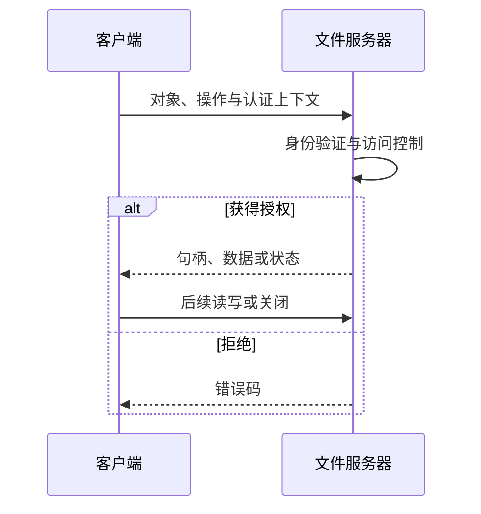

# 10.5 文件共享

本节聚焦于**文件共享**，是[[第十章 文件系统]]中的独立知识节点。

## 10.5.1 多用户

共享使不同用户或进程访问同一文件对象。文件常记录所有者和组；系统根据已经认证的主体、组关系及文件/目录的授权规则做决定。所有者并非在所有系统中都拥有无条件的最高权限：管理员策略、ACL、不可变属性和强制访问控制都可能施加额外限制。

## 10.5.2 远程文件系统

FTP、HTTP 等协议主要用于显式传输资源；分布式文件系统（distributed file system, DFS）则把服务器导出的目录接入客户端名称空间，使打开、读、写、关闭等操作经网络协议执行。HTTP 并不是 FTP 的图形封装，二者的资源模型、缓存和认证机制彼此独立。

远程句柄是协议对象，未必等同于本地进程的文件描述符。客户端和服务器可构成一对多、多对一或多对多关系，同一主机也可以同时承担两种角色。

## 身份、命名与故障

只凭 IP 地址或客户端自报 UID 不能提供可靠身份保证，容易遭受伪造或映射不一致。早期 NFS 部署常依赖 UID/GID 对齐和受信网络；现代部署应结合明确的认证、传输保护和最小授权。LDAP、Active Directory 等目录服务可集中管理身份和资源，但本身不是文件访问协议，也不自动等同于单点登录。

网络中断、超时、服务器重启和重复请求是远程访问的正常失败路径。协议需要定义重试、幂等性、缓存失效、锁或租约以及恢复规则。无状态协议便于服务端恢复，但并不天然更不安全；安全性取决于每个请求的认证、完整性和授权。有状态协议能表达会话和锁，却增加状态同步与恢复成本。

> [!warning] 不要假设远程访问等同于本地访问
> 客户端缓存、离线写入、超时重试与网络分区可能改变关闭操作的成功含义、读后写可见性和锁行为。依赖精确语义的程序必须查阅具体协议版本与挂载选项。

## 10.5.3 一致性语义

文件一致性语义说明：并发会话访问同一文件时，一个会话的修改何时、以何种顺序对其他会话可见。一次从打开到关闭的访问可称为文件会话（file session）。语义需要回答读到哪个版本、写是否立即可见、并发写如何排序，以及崩溃或网络分区时如何处理未完成工作。

| 模型 | 修改可见性 | 取舍 |
| --- | --- | --- |
| UNIX 语义（教材模型） | 修改反映在共享文件图像中 | 直观；并发更新仍必须同步 |
| 会话语义 | 修改常在关闭后对后续会话可见 | 降低交互频率；可能出现冲突或覆盖 |
| 不可变共享 | 发布后内容不再修改 | 易缓存和复现；更新须创建新对象 |

> [!warning] “UNIX 语义”不等于所有情况下的强一致性
> 现实行为还受页缓存、延迟写回、网络缓存、强制持久化、锁和故障恢复影响。是否满足线性一致性等形式化性质，必须针对具体操作和实现判断。

若两个进程都读取偏移 $p$，各自计算后写回 $p$，即使单次读写均成功，也可能发生丢失更新。文件锁、追加模式、版本号和事务日志分别处理不同层面的冲突；其基本同步问题与 [[第六章 同步]] 中的临界区和互斥相同。

> [!info] 章节导航
> 上一节：[[10.4 文件系统安装]]　｜　章节：[[第十章 文件系统]]　｜　下一节：[[10.6 保护]]
