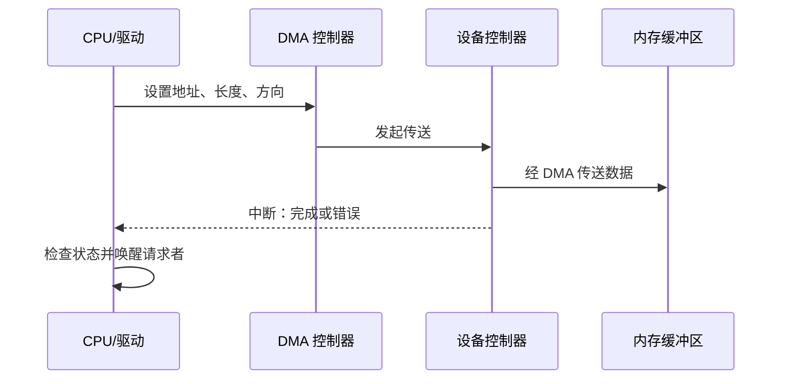

# 13.2 I/O 硬件

本节聚焦于**I/O 硬件**，是[[第十三章 IO系统]]中的独立知识节点。

## 端口、总线与控制器

端口是设备与主机交换信号的接口；总线定义连接与传输协议；控制器执行设备命令、维护寄存器和缓存，并向主机报告状态。复杂控制器可含固件和处理器，因而可能自行重排命令或缓存写入；操作系统看到的完成顺序不必等同于介质上的实际执行顺序。

控制器常暴露数据、状态和控制寄存器。驱动通过端口 I/O 或内存映射 I/O 读写这些寄存器；内存映射 I/O 使用与普通内存访问相似的地址空间，但仍需遵守设备访问顺序、屏障和缓存属性。

## 13.2.1 轮询

轮询（polling）由 CPU 重复读取状态寄存器，直到设备准备好或发生错误。它实现简单，适用于等待极短、不可睡眠或中断代价反而更高的场景；等待较长时会浪费 CPU 周期，并延迟其他任务。

## 13.2.2 中断

中断（interrupt）使设备在需要服务或完成请求时通知 CPU。CPU 保存当前执行上下文，进入中断处理程序，确认中断来源、读取状态、完成最小必要工作，并唤醒或通知后续处理。中断降低空等开销，却引入上下文切换、优先级和中断风暴问题。

> [!warning] 中断处理程序应短小
> 耗时操作通常应移交给下半部、工作队列或内核线程。长时间关闭中断或在中断上下文中阻塞，会损害系统响应性甚至造成丢失事件。

## 13.2.3 直接内存访问

直接内存访问（DMA）由 DMA 控制器在设备与内存之间传送一批数据，CPU 只负责设置缓冲区地址、长度和方向，并在完成时处理通知。它减少逐字节复制的 CPU 参与，但仍需要处理缓冲区生命周期、缓存一致性、地址转换和访问控制。

IOMMU 可把设备 DMA 地址映射到受控内存页，限制设备可访问范围并支持虚拟化；它是 I/O 保护机制的一部分，不应与 CPU 的普通页表混为一谈。

> [!info] 章节导航
> 上一节：[[13.1 概述]]　｜　章节：[[第十三章 IO系统]]　｜　下一节：[[13.3 应用程序 I - O 接口]]
