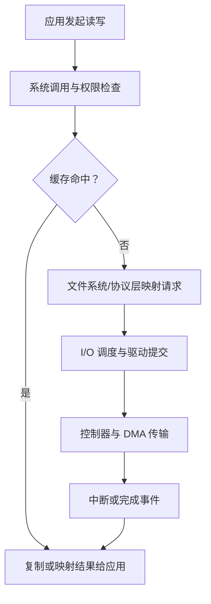

# 13.5 I/O 请求转换为硬件操作

本节聚焦于**I/O 请求转换为硬件操作**，是[[第十三章 IO系统]]中的独立知识节点。

一次读请求可能经过系统调用参数检查、文件或套接字对象定位、权限验证、缓存查找、逻辑块映射、请求合并与调度、驱动提交、DMA 传输和中断完成。某些步骤会因缓存命中、非阻塞模式或对象类型而跳过。

> [!warning] 不能在任意上下文中等待
> 持有自旋锁、处于中断上下文或禁止调度的代码路径通常不能执行可能睡眠的 I/O。驱动和内核调用者必须明确请求是同步完成、异步完成还是可延后处理。

> [!info] 章节导航
> 上一节：[[13.4 内核 I - O 子系统]]　｜　章节：[[第十三章 IO系统]]　｜　下一节：[[13.6 流]]
