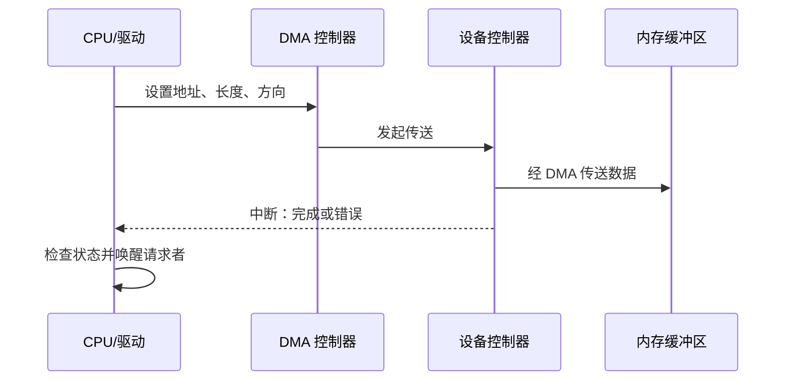
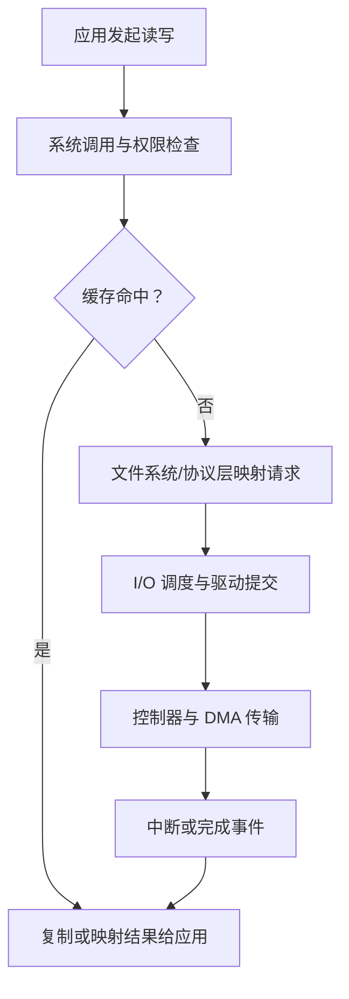

# 第十三章 I/O 系统

> [!abstract] 本章解决什么问题？
> 输入/输出设备在功能、速度和故障模式上差异很大。I/O 子系统通过设备驱动、统一接口、缓冲与调度，将硬件细节封装为内核和应用可使用的操作；同时处理数据传送、并发、保护、错误和性能。本章说明从应用请求到控制器完成 I/O 的完整路径。

## 本章导航

- [[#13.1 概述|13.1 概述]]：I/O 子系统与设备驱动的抽象作用。
- [[#13.2 I/O 硬件|13.2 I/O 硬件]]：端口、总线、控制器、轮询、中断和 DMA。
- [[#13.3 应用程序 I/O 接口|13.3 应用程序 I/O 接口]]：设备类型、定时器、异步与向量 I/O。
- [[#13.4 内核 I/O 子系统|13.4 内核 I/O 子系统]]：调度、缓冲、缓存、假脱机、保护与错误处理。
- [[#13.5 I/O 请求转换为硬件操作|13.5 I/O 请求转换为硬件操作]]：系统调用到驱动和中断的路径。
- [[#13.6 流|13.6 流]]：模块化的字符 I/O 处理链。
- [[#13.7 性能|13.7 性能]]：排队、复制、并行性和测量。

## 学习目标

- [ ] 能区分端口、总线、控制器和设备驱动的职责。
- [ ] 能比较轮询、中断和 DMA 的适用条件与开销。
- [ ] 能区分阻塞、非阻塞和异步 I/O 的完成语义。
- [ ] 能解释缓冲、缓存与假脱机分别解决的问题。
- [ ] 能画出一次 I/O 请求从用户态到设备、再经中断返回的路径。
- [ ] 能分析 I/O 性能的瓶颈并提出可验证的优化方向。

## 13.1 概述

设备驱动程序（device driver）理解特定控制器和设备协议，向上提供符合内核 I/O 框架的操作。驱动不是应用程序可直接调用的“设备库”：它运行在受内核保护的环境中，必须处理并发请求、DMA 内存、硬件中断、设备移除和错误恢复。

I/O 子系统的目标是提供统一性而非抹平所有差异。文件、套接字、终端和定时器可能共享打开、关闭、读写等接口，但它们的可寻址性、缓存、阻塞条件、失败模式和控制操作并不相同。

> [!tip] 机制与策略
> 驱动把请求提交给控制器是**机制**；按到达顺序、截止时间或优先级选择下一个请求是**策略**。将两者分离，才能在不重写驱动的情况下调整调度行为。

## 13.2 I/O 硬件

### 端口、总线与控制器

端口是设备与主机交换信号的接口；总线定义连接与传输协议；控制器执行设备命令、维护寄存器和缓存，并向主机报告状态。复杂控制器可含固件和处理器，因而可能自行重排命令或缓存写入；操作系统看到的完成顺序不必等同于介质上的实际执行顺序。

控制器常暴露数据、状态和控制寄存器。驱动通过端口 I/O 或内存映射 I/O 读写这些寄存器；内存映射 I/O 使用与普通内存访问相似的地址空间，但仍需遵守设备访问顺序、屏障和缓存属性。

### 13.2.1 轮询

轮询（polling）由 CPU 重复读取状态寄存器，直到设备准备好或发生错误。它实现简单，适用于等待极短、不可睡眠或中断代价反而更高的场景；等待较长时会浪费 CPU 周期，并延迟其他任务。

### 13.2.2 中断

中断（interrupt）使设备在需要服务或完成请求时通知 CPU。CPU 保存当前执行上下文，进入中断处理程序，确认中断来源、读取状态、完成最小必要工作，并唤醒或通知后续处理。中断降低空等开销，却引入上下文切换、优先级和中断风暴问题。

> [!warning] 中断处理程序应短小
> 耗时操作通常应移交给下半部、工作队列或内核线程。长时间关闭中断或在中断上下文中阻塞，会损害系统响应性甚至造成丢失事件。

### 13.2.3 直接内存访问

直接内存访问（DMA）由 DMA 控制器在设备与内存之间传送一批数据，CPU 只负责设置缓冲区地址、长度和方向，并在完成时处理通知。它减少逐字节复制的 CPU 参与，但仍需要处理缓冲区生命周期、缓存一致性、地址转换和访问控制。

IOMMU 可把设备 DMA 地址映射到受控内存页，限制设备可访问范围并支持虚拟化；它是 I/O 保护机制的一部分，不应与 CPU 的普通页表混为一谈。

## 13.3 应用程序 I/O 接口

应用通常通过系统调用和文件描述符/句柄访问 I/O 对象。统一接口降低学习成本，但应用仍应检查对象类型和平台文档，特别是定位、轮询、取消、超时和错误码的语义。

### 13.3.1 块与字符设备

块设备按可寻址的固定大小块传输，适合磁盘等随机访问介质；字符设备提供字节流或记录流，常见于终端、串口和部分传感器。该分类是传统内核接口模型，现代设备也可能同时提供多种抽象。

### 13.3.2 网络设备

网络设备传输分组而非持续字节流；内核网络栈在链路层、网络层和传输层处理封装、路由、校验和拥塞控制。套接字把网络通信呈现为面向流或报文的端点，但其读写语义仍受协议、对端状态和网络故障影响。

### 13.3.3 时钟与定时器

硬件时钟提供时间基准和定时中断；内核据此实现时间片、超时、睡眠、统计和定时器。时钟分辨率、单调性、时钟源漂移和节能策略会影响定时精度，不能把一次计时结果简单视为绝对时间。

### 13.3.4 非阻塞与异步 I/O

| 模式 | 调用返回时表示什么 | 调用者如何获知完成 |
| --- | --- | --- |
| 阻塞 I/O | 操作已完成、失败或满足返回条件 | 调用本身返回 |
| 非阻塞 I/O | 当前不能立即完成时立即返回“稍后重试” | 再次尝试或等待就绪通知 |
| 异步 I/O | 请求已提交，完成尚在未来 | 完成队列、回调、事件或信号 |

阻塞与非阻塞描述调用在“当前无法继续”时是否等待；异步描述提交和完成是否分离。三者可组合，实际 API 的取消、部分读写和缓冲语义必须按平台核实。

### 13.3.5 向量 I/O

向量 I/O（vectored I/O）一次操作传入多个不连续缓冲区，内核按顺序收集或分散数据。它可减少系统调用次数和用户态拼接复制，但并不保证绕过内核复制，也不自动保证所有缓冲区一次完成。

## 13.4 内核 I/O 子系统

### 13.4.1 I/O 调度

内核根据队列、优先级、截止时间、设备特性和公平性选择提交顺序。对于机械磁盘，调度常试图减少寻道；对于网络、SSD 或多队列设备，重点可能变为尾延迟、吞吐、隔离或服务质量。调度必须避免让低优先级请求无限期等待。

### 13.4.2 缓冲

缓冲（buffering）使用内存暂存正在传输的数据，解决生产者和消费者速度、大小或时序不匹配的问题。例如双缓冲可使设备传送和应用处理重叠。缓冲关注“传输中的适配”，不等同于长期复用数据。

### 13.4.3 缓存

缓存（caching）保存近期或高概率复用的数据副本，以避免重复访问慢设备。页缓存、目录项缓存和设备缓存都属于此类。缓存需要定义失效、写回和一致性规则；命中率提升不代表数据已经持久化。

### 13.4.4 假脱机与设备预留

假脱机（spooling）把面向独占设备的输出请求排入磁盘队列，由后台服务依次提交，例如打印服务。设备预留则在一段时间内独占设备，防止多个主体互相干扰；二者都需要处理取消、配额、权限和故障后的队列清理。

### 13.4.5 错误处理

I/O 错误可能来自设备离线、传输校验失败、超时、权限拒绝、介质错误或驱动缺陷。内核可重试、降级、重置设备、记录错误并向上报告，但盲目重试可能放大延迟或重复非幂等操作。错误码应保留足够原因，应用也应设计超时和恢复路径。

### 13.4.6 I/O 保护

用户态程序不能直接随意访问设备寄存器、DMA 缓冲区或内核地址。特权指令、系统调用检查、内存保护、IOMMU 和设备访问控制共同限制权限范围。仅“拥有设备文件”不必然拥有所有控制操作；实际授权依赖操作系统安全模型。

### 13.4.7 内核数据结构

内核通常用设备对象、驱动操作表、请求队列、缓冲区描述符、打开对象和等待队列表示 I/O 状态。请求可经历排队、映射、提交、传输、完成和回收等状态；任何状态转换都要在并发、取消、超时和设备移除条件下保持不变量。

## 13.5 I/O 请求转换为硬件操作

一次读请求可能经过系统调用参数检查、文件或套接字对象定位、权限验证、缓存查找、逻辑块映射、请求合并与调度、驱动提交、DMA 传输和中断完成。某些步骤会因缓存命中、非阻塞模式或对象类型而跳过。

> [!warning] 不能在任意上下文中等待
> 持有自旋锁、处于中断上下文或禁止调度的代码路径通常不能执行可能睡眠的 I/O。驱动和内核调用者必须明确请求是同步完成、异步完成还是可延后处理。

## 13.6 流

流（stream）是一种把字符设备处理组织为模块链的抽象：上游模块产生消息，下游模块转换、过滤、排队或发送消息。终端行规程、协议模块和驱动可作为不同层级的模块。其价值在于可组合性；代价是额外队列、复制、背压和错误传播复杂度。

流式接口还可泛指应用层的连续数据处理，但不能把不同操作系统的 STREAMS 框架、网络字节流和语言运行时流对象视为同一实现。

## 13.7 性能

I/O 性能由设备服务时间、软件处理开销、数据复制次数、队列等待、缓存命中和并发程度共同决定。优化前应先测量吞吐量、平均延迟、尾延迟、CPU 使用率、队列深度和错误率，并明确负载、设备、文件系统和缓存状态。

| 常见瓶颈 | 可考虑的机制 | 需要同时验证的风险 |
| --- | --- | --- |
| 小而频繁的 I/O | 批量提交、向量 I/O、缓冲 | 延迟增加、内存占用 |
| 设备等待时间长 | 并发队列、异步 I/O、预读 | 队列膨胀、尾延迟 |
| 复制开销高 | 缓冲区复用、零拷贝接口 | 生命周期和安全边界 |
| 中断过多 | 合并中断、轮询模式 | CPU 占用、响应延迟 |
| 缓存失效频繁 | 调整缓存策略和访问局部性 | 脏页回写与一致性 |

> [!tip] 性能优化的原则
> 尽量使 CPU、内存总线、设备和应用处理并行工作；避免不必要的数据移动；用有界队列与背压控制过载。任何优化都应以测量为依据，并验证错误处理、取消和持久化语义没有被破坏。

## 关联与待核实

- 存储设备、调度与 RAID：[[第十二章 大容量存储设备]]。
- 文件系统的缓存、块映射与恢复：[[第十一章 文件系统实现]]。
- 中断、特权与内核结构：[[第二章 操作系统结构]]。
