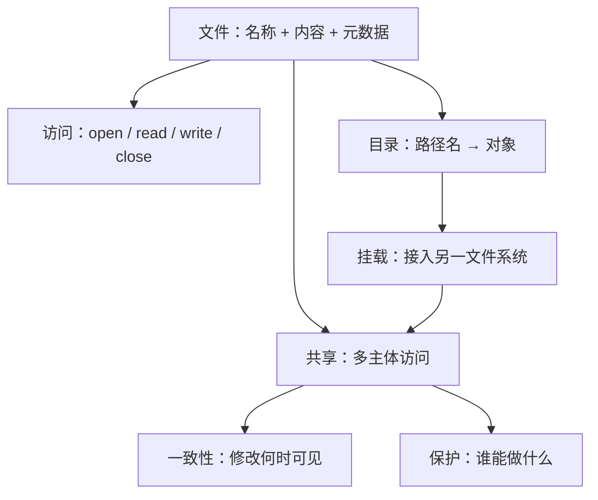
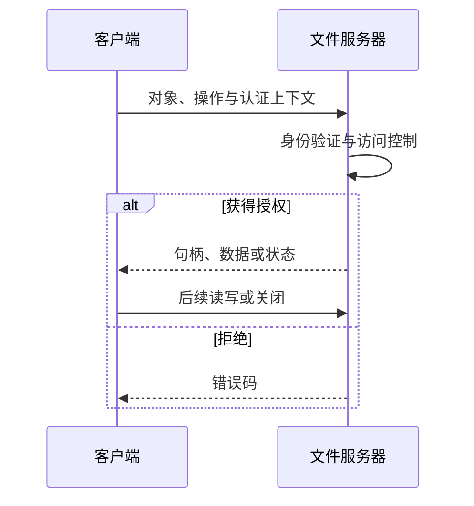

# 第十章 文件系统

> [!abstract] 本章解决什么问题？
> 文件系统将外存组织为可命名、可持久保存、可共享且可保护的文件，并通过统一接口屏蔽底层存储介质的物理细节。本章依次讨论文件的属性与操作、访问方法、目录结构、挂载、文件共享、远程文件系统、一致性语义和访问保护。

## 本章导航

- [[#10.1 文件概念|10.1 文件概念]]：文件抽象、元数据、内部结构和打开状态。
- [[#10.2 访问方法|10.2 访问方法]]：顺序、直接和索引访问。
- [[#10.3 目录与磁盘的结构|10.3 目录与磁盘的结构]]：卷、目录组织和链接。
- [[#10.4 文件系统安装|10.4 文件系统安装]]：挂载点与命名空间。
- [[#10.5 文件共享|10.5 文件共享]]：多用户共享、远程文件系统和一致性。
- [[#10.6 保护|10.6 保护]]：访问类型、基础权限和 ACL。

## 学习目标

- [ ] 能区分文件名、文件标识符、文件内容与元数据。
- [ ] 能说明顺序访问、直接访问和索引访问的适用场景。
- [ ] 能比较树形目录、无环图目录与一般图目录的取舍。
- [ ] 能解释挂载如何把多个文件系统接入同一命名空间。
- [ ] 能区分文件共享中的一致性、认证与访问控制问题。
- [ ] 能说明所有者—组—其他权限模型与 ACL 的差异。

图中从“对象”到“保护”的链条分别回答：数据是什么、如何找到、如何访问、多个主体如何协作，以及哪些操作被允许。

## 10.1 文件概念

### 文件、名称与元数据

> [!definition] 文件
> 文件是文件系统管理的持久数据对象。对应用而言，它常表现为字节序列或记录序列；对文件系统而言，它由内容、对象标识和元数据（metadata）共同构成。

文件名服务于用户和路径解析，不一定唯一，也不等同于文件身份。文件系统通常为对象分配内部标识符：目录项保存“名称 $\rightarrow$ 标识符”的映射，标识符再定位到属性和数据映射信息。以 inode 风格的 UNIX 文件系统为例，目录项通常指向 inode；这只是常见实现，不能概括为“所有元数据都保存在目录中”。

常见元数据如下：

| 类别 | 典型字段 | 作用 |
| --- | --- | --- |
| 身份 | 名称、内部标识符、类型 | 路径解析与对象识别 |
| 空间 | 逻辑长度、块映射、配额 | 定位内容与容量管理 |
| 保护 | 所有者、组、权限、ACL | 授权访问请求 |
| 时间与审计 | 创建、修改、访问时间 | 备份、同步、审计与缓存 |

扩展属性（extended attributes, xattrs）还可保存安全上下文、标签或校验信息。其可用性、命名空间和继承规则均依赖具体文件系统与操作系统。

### 文件内容与逻辑结构

文本、源代码、媒体、数据库页和可执行程序都可以存放在文件中。大多数通用操作系统把普通文件提供为无结构字节流：内核负责按偏移读写字节，行、记录、函数等语义由用户态程序解释。这种机制允许新格式出现而无需修改内核。

可执行文件是重要例外。加载器至少要理解其可加载段、入口点和目标 ABI，才能映射到进程地址空间并开始执行。扩展名常用于用户界面和程序关联，但不是内容真实性的可靠证据；魔数、MIME 类型和数字签名也有各自适用边界。

### 块、记录与内部碎片

应用可能以变长逻辑记录处理数据，设备和文件系统却通常按固定大小的块或分配单元管理空间。若文件逻辑长度为 $S$ 字节、分配单元为 $B$ 字节，且按整块分配，则最后一块的内部碎片为：

$$
f = \lceil S/B \rceil B - S,\qquad 0 \le f < B.
$$

例如 $B=512\ \text{B}$、$S=1949\ \text{B}$ 时，需要 $4$ 块，内部碎片为 $99\ \text{B}$。增大 $B$ 可减少元数据和寻址开销，却可能浪费更多小文件空间；这是空间效率与管理开销之间的策略取舍。稀疏文件还可能拥有很大的逻辑长度，却未为所有偏移实际分配块。

### 文件操作与打开状态

创建会建立目录项和元数据；删除解除名称与对象的关联，并在对象不再被链接或打开时回收空间。读、写、追加传输数据；定位操作改变当前偏移，通常不直接传输用户数据；截断改变逻辑长度但常保留对象身份和部分属性。

打开操作把路径解析结果转为进程持有的文件描述符或句柄，关闭操作释放该引用。实现常有进程级与系统级打开文件表，以记录访问模式、当前偏移、对象引用和缓存状态；表的具体层次和“偏移是否共享”取决于系统调用、句柄继承与实现。

> [!warning] 文件锁不是文件格式
> 共享锁允许多个读者并存，独占锁限制写者。锁可以覆盖整个文件或字节范围；强制锁由系统拒绝违规 I/O，建议锁要求应用协作遵守。锁的等待关系仍可能形成死锁，应结合 [[第七章 死锁]] 设计获取与释放顺序。

## 10.2 访问方法

访问方法规定应用如何从逻辑位置找到数据；它不等同于底层的磁盘地址，也不等同于文件分配算法。

| 方法 | 定位依据 | 适合场景 | 局限 |
| --- | --- | --- | --- |
| 顺序访问 | 当前文件位置 | 日志、流式扫描、编译输入 | 任意跳转不便或代价较高 |
| 直接（随机）访问 | 字节偏移、相对块号 | 数据库页、媒体索引、二进制格式 | 应用需维护定位规则 |
| 索引访问 | 键到记录或块的索引 | 按键检索的大记录集 | 索引须占空间并维护更新 |

### 顺序访问

顺序访问围绕当前位置进行：读取后位置前移，写入或追加后位置到达新末尾；重置或跳过操作改变位置。该模型源于磁带等顺序介质，但同样适用于磁盘和 SSD 上的流式工作负载。

### 直接访问

直接访问允许进程按文件内的逻辑偏移读取或写入。对于从 $0$ 编号、长度固定为 $L$ 字节的第 $N$ 条记录，其起始偏移为 $N\times L$。变长记录不能直接套用此式，必须保存长度、偏移表或索引。

> [!example] 逻辑偏移不暴露物理布局
> 应用以文件内偏移提出读写请求；文件系统仍须通过元数据把它映射到当前物理块。重分配、压缩或 RAID 布局变化不应改变应用看到的偏移。

### 索引访问

索引把检索键映射为记录或数据块位置。小索引可缓存于内存；数据规模增加时可分级，先定位上层索引，再读取下层索引和数据块。ISAM 是历史上的索引顺序访问方法；现代系统还会选择 B 树、哈希或日志结构，分别在查找、更新、范围查询和恢复方面取舍。

## 10.3 目录与磁盘的结构

### 分区、卷与文件系统

物理设备可划分为分区（partition）；承载文件系统的可用存储单元常称卷（volume）。卷可以是一个分区、整块设备或跨设备的逻辑集合，例如 RAID 或卷管理器提供的逻辑卷。文件系统也未必对应持久磁盘：tmpfs 主要使用易失内存，procfs 等把内核状态呈现为文件接口。

目录是文件系统中用于组织名称空间的特殊对象。路径解析从根目录或当前工作目录逐段查找名称，并在每一步按系统规则检查目录的搜索权限。

### 目录组织

| 结构 | 主要优点 | 主要问题 |
| --- | --- | --- |
| 单级目录 | 简单 | 所有主体争用同一名称空间 |
| 两级目录 | 每用户独立命名 | 共享与分组不自然 |
| 树形目录 | 层次分组、相对路径清晰 | 共享对象需要链接或复制 |
| 无环图目录 | 可共享对象且路径遍历可终止 | 删除与引用计数更复杂 |
| 一般图目录 | 表达能力更强 | 必须处理循环遍历 |

硬链接为同一对象增加一个名称引用；通常只有最后一个链接删除且对象未被打开后，空间才能回收。符号链接保存的是目标路径，目标被删除或改名后可能悬空。允许图结构的系统要通过禁止环、访问标记或深度限制等手段避免无限路径遍历。

> [!warning] 目录权限与文件权限不同
> 访问路径通常要求对路径中的目录具有搜索权限；创建或删除名称通常还取决于父目录权限。能读取目标文件不必然能列出其父目录，具体规则随 POSIX、Windows 及文件系统实现而变化。

## 10.4 文件系统安装

挂载（mount）把另一个文件系统的根接入当前名称空间中的挂载点。挂载后，路径解析到达该点会进入新文件系统；卸载后才重新看到原挂载点的内容。多数系统要求挂载点为空或受限，以避免内容被遮蔽造成误操作。

POSIX 系统通常使用单一根目录和挂载点；Windows 可以使用盘符，也支持将 NTFS 卷挂载到目录。两者体现的是命名空间策略差异。

## 10.5 文件共享

### 10.5.1 多用户

共享使不同用户或进程访问同一文件对象。文件常记录所有者和组；系统根据已经认证的主体、组关系及文件/目录的授权规则做决定。所有者并非在所有系统中都拥有无条件的最高权限：管理员策略、ACL、不可变属性和强制访问控制都可能施加额外限制。

### 10.5.2 远程文件系统

FTP、HTTP 等协议主要用于显式传输资源；分布式文件系统（distributed file system, DFS）则把服务器导出的目录接入客户端名称空间，使打开、读、写、关闭等操作经网络协议执行。HTTP 并不是 FTP 的图形封装，二者的资源模型、缓存和认证机制彼此独立。

远程句柄是协议对象，未必等同于本地进程的文件描述符。客户端和服务器可构成一对多、多对一或多对多关系，同一主机也可以同时承担两种角色。

### 身份、命名与故障

只凭 IP 地址或客户端自报 UID 不能提供可靠身份保证，容易遭受伪造或映射不一致。早期 NFS 部署常依赖 UID/GID 对齐和受信网络；现代部署应结合明确的认证、传输保护和最小授权。LDAP、Active Directory 等目录服务可集中管理身份和资源，但本身不是文件访问协议，也不自动等同于单点登录。

网络中断、超时、服务器重启和重复请求是远程访问的正常失败路径。协议需要定义重试、幂等性、缓存失效、锁或租约以及恢复规则。无状态协议便于服务端恢复，但并不天然更不安全；安全性取决于每个请求的认证、完整性和授权。有状态协议能表达会话和锁，却增加状态同步与恢复成本。

> [!warning] 不要假设远程访问等同于本地访问
> 客户端缓存、离线写入、超时重试与网络分区可能改变关闭操作的成功含义、读后写可见性和锁行为。依赖精确语义的程序必须查阅具体协议版本与挂载选项。

### 10.5.3 一致性语义

文件一致性语义说明：并发会话访问同一文件时，一个会话的修改何时、以何种顺序对其他会话可见。一次从打开到关闭的访问可称为文件会话（file session）。语义需要回答读到哪个版本、写是否立即可见、并发写如何排序，以及崩溃或网络分区时如何处理未完成工作。

| 模型 | 修改可见性 | 取舍 |
| --- | --- | --- |
| UNIX 语义（教材模型） | 修改反映在共享文件图像中 | 直观；并发更新仍必须同步 |
| 会话语义 | 修改常在关闭后对后续会话可见 | 降低交互频率；可能出现冲突或覆盖 |
| 不可变共享 | 发布后内容不再修改 | 易缓存和复现；更新须创建新对象 |

> [!warning] “UNIX 语义”不等于所有情况下的强一致性
> 现实行为还受页缓存、延迟写回、网络缓存、强制持久化、锁和故障恢复影响。是否满足线性一致性等形式化性质，必须针对具体操作和实现判断。

若两个进程都读取偏移 $p$，各自计算后写回 $p$，即使单次读写均成功，也可能发生丢失更新。文件锁、追加模式、版本号和事务日志分别处理不同层面的冲突；其基本同步问题与 [[第六章 同步]] 中的临界区和互斥相同。

## 10.6 保护

文件保护限制主体可执行的操作，以维持机密性、完整性与可用性。它回答“谁能做什么”，与数据加密、备份和一致性相关但不能互相替代。

### 10.6.1 访问类型

常见受控操作包括读、写、执行、追加、删除与列出属性。目录还涉及搜索路径、列出条目、创建与删除名称。复制、重命名和编辑由多个底层操作组合而成，授权往往同时取决于源文件、目标目录和路径，而不是只检查一个文件的读权限。

### 10.6.2 访问控制

POSIX 风格的基础模型按所有者、所属组和其他用户划分主体，并对每类设置读、写和执行/搜索权限。它紧凑而易于检查，但难以表达“仅额外允许某一个用户”。访问控制列表（access control list, ACL）可以为指定用户或组添加条目，部分系统还支持继承；掩码、拒绝条目和优先级在不同平台中的语义不同。

| 模型 | 优点 | 代价 |
| --- | --- | --- |
| 所有者—组—其他 | 简洁、快速、易观察 | 表达能力有限 |
| ACL | 主体粒度更细，可继承 | 管理和审计更复杂 |
| 基于能力/令牌的授权 | 易于委托最小权限 | 泄露、撤销和传播需要专门设计 |

身份验证（authentication）确认请求主体是谁；授权（authorization）决定该主体是否可操作对象。把用户名、UID 或 IP 地址本身视为充分认证会产生伪造和映射错误风险。远程系统还必须处理凭据生命周期、传输保护和服务器端重新授权。

> [!tip] 复习时的三个区分
> - **目录**解决名称到对象的映射，**挂载**连接多个文件系统。
> - **锁与一致性**处理并发可见性，**权限与 ACL**处理访问授权。
> - **认证**确认身份，**授权**判断权限；**加密**保护数据，但不自动决定谁被允许访问。
