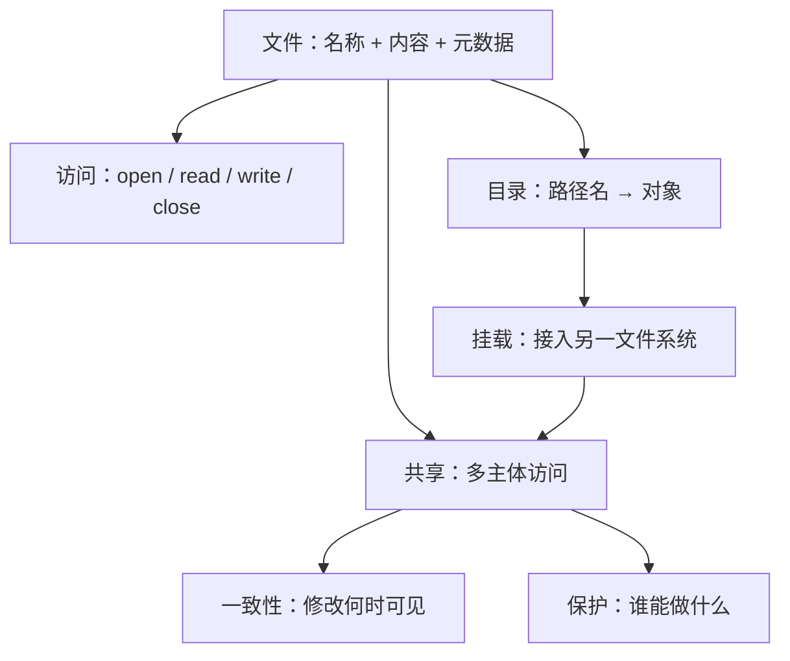

# 第十章 文件系统

> [!abstract] 本章解决什么问题？
> 文件系统将外存组织为可命名、可持久保存、可共享且可保护的文件，并通过统一接口屏蔽底层存储介质的物理细节。本章依次讨论文件的属性与操作、访问方法、目录结构、挂载、文件共享、远程文件系统、一致性语义和访问保护。

> [!abstract] 章节定位
> 本章已按稳定知识对象拆分为 6 篇主题笔记。先沿下表建立机制主线，再进入具体主题查看定义、状态、算法、实现边界与例子。

## 章节结构

| 顺序 | 主题笔记 | 核心对象 |
| ---: | --- | --- |
| 1 | [[10.1 文件概念]] | 文件概念 |
| 2 | [[10.2 访问方法]] | 访问方法 |
| 3 | [[10.3 目录与磁盘的结构]] | 目录与磁盘的结构 |
| 4 | [[10.4 文件系统安装]] | 文件系统安装 |
| 5 | [[10.5 文件共享]] | 文件共享 |
| 6 | [[10.6 保护]] | 保护 |

## 学习目标

- [ ] 能区分文件名、文件标识符、文件内容与元数据。
- [ ] 能说明顺序访问、直接访问和索引访问的适用场景。
- [ ] 能比较树形目录、无环图目录与一般图目录的取舍。
- [ ] 能解释挂载如何把多个文件系统接入同一命名空间。
- [ ] 能区分文件共享中的一致性、认证与访问控制问题。
- [ ] 能说明所有者—组—其他权限模型与 ACL 的差异。



图中从“对象”到“保护”的链条分别回答：数据是什么、如何找到、如何访问、多个主体如何协作，以及哪些操作被允许。

## 与计算机科学引论的联系

> [!info] 从引论到专业课程
> [[04-系统软件]]、[[07-二级存储]]提供相关的系统、硬件、编程或安全背景；本章进一步进入操作系统的机制、策略、状态和失败边界。

## 动态索引

```dataview
TABLE file.link AS "主题", section AS "节", status AS "状态"
FROM "计算机系统/操作系统/知识点"
WHERE course = "操作系统" AND chapter = 10 AND type != "MOC"
SORT order ASC
```

> [!info] 章节导航
> 上一章：[[第九章 虚拟内存管理]]　｜　下一章：[[第十一章 文件系统实现]]

> [!note] 原始记录
> 拆分前的完整章笔记保存在 `计算机系统/操作系统/原始章笔记/第十章 文件系统.md.original`，用于回溯，不参与 Obsidian 普通知识索引。
