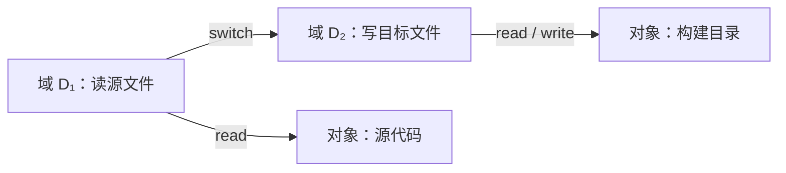

# 14.3 保护域

本节聚焦于**保护域**，是[[第十四章 系统保护]]中的独立知识节点。

对象（object）是受保护资源的抽象，可包括硬件对象（CPU、内存段、设备）和软件对象（文件、程序、同步对象）。对象只能通过预定义操作访问，例如内存段可读写、程序文件可读写执行、磁带设备还可倒带。

保护域（domain）描述一个执行环境当前拥有的权限集合。若域 $D_i$ 对对象 $O_j$ 拥有权限集合 $R_{ij}$，则在该域执行的进程只能对 $O_j$ 执行属于 $R_{ij}$ 的操作。域可以与用户、进程、过程、容器或角色对应，但它们不是必然一一对应关系。

## 14.3.1 域结构

域可以静态关联到进程，也可以在执行期间切换。域切换必须本身受控：进程只有具备目标域的切换权限时才能进入该域。嵌套域、调用门、受限令牌和临时提权都是表达“在有限范围内增加权限”的不同机制。

图示强调域切换也是一种被授权的操作；不能因为进程曾经拥有某个高权限域，就默认所有代码路径都可使用它。

## 14.3.2 例子：UNIX

传统 UNIX 将用户标识、组标识和文件权限作为重要保护依据。进程的有效用户标识会影响文件访问判断；设置用户标识（set-user-ID）程序可在执行期间以文件所有者身份运行。这种机制便于受控提权，但若输入验证、环境处理或权限收回设计不当，风险很高。

> [!warning] 实现相关
> 用户标识、文件能力、沙箱、强制访问控制和容器隔离在不同 UNIX/Linux 系统中组合方式不同。不要把历史的 set-user-ID 教材模型视为现代系统的完整安全方案。

## 14.3.3 例子：MULTICS

MULTICS 以环（ring）表示嵌套保护域：较内层环拥有更多特权，跨环调用通过受控入口完成。它展示了域分层和硬件支持的思想，但复杂的保护设计也会增加实现、验证和运维成本。保护强度必须与系统目标、性能和可理解性平衡。

> [!info] 章节导航
> 上一节：[[14.2 保护原则]]　｜　章节：[[第十四章 系统保护]]　｜　下一节：[[14.4 访问矩阵]]
