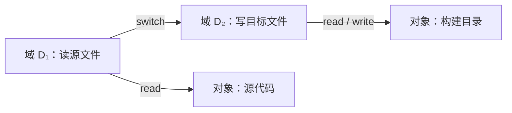

# 第十四章 系统保护

> [!abstract] 本章解决什么问题？
> 系统保护（protection）规定进程、用户和组件可以对哪些对象执行哪些操作，并限制错误或恶意行为的影响范围。它关注系统内部资源使用的授权与隔离；身份认证、网络安全和密码学是相关但不同的主题。本章以保护域和访问矩阵为统一模型，比较 ACL、能力、RBAC 与语言级保护。

## 本章导航

- [[#14.1 保护目标|14.1 保护目标]]：可靠性、授权边界和机制—策略分离。
- [[#14.2 保护原则|14.2 保护原则]]：最低特权与需要知道原则。
- [[#14.3 保护域|14.3 保护域]]：对象、权限、域切换、UNIX 与 MULTICS。
- [[#14.4 访问矩阵|14.4 访问矩阵]]：统一授权模型及其传播边界。
- [[#14.5 访问矩阵的实现|14.5 访问矩阵的实现]]：全局表、ACL、能力和锁—钥匙。
- [[#14.6 访问控制|14.6 访问控制]]：基于角色的访问控制。
- [[#14.7 访问权限的撤回|14.7 访问权限的撤回]]：撤销维度与实现代价。
- [[#14.8 基于能力的系统|14.8 基于能力的系统]]：Hydra 与剑桥 CAP。
- [[#14.9 基于语言的保护|14.9 基于语言的保护]]：编译器与 Java 教材案例。

## 学习目标

- [ ] 能区分保护、认证、授权和加密的职责。
- [ ] 能用“域—对象—权限”描述一个资源访问规则。
- [ ] 能解释访问矩阵、ACL 和能力列表之间的行列对应关系。
- [ ] 能比较权限复制、撤销与信息流控制的边界。
- [ ] 能说明 RBAC 如何支持最低特权。
- [ ] 能指出语言级保护的优势、可信基础与版本边界。

## 术语速查

> [!note]- 先区分四个概念
> - **认证（authentication）**：确认请求主体是谁。
> - **授权（authorization）**：决定该主体是否可执行某操作。
> - **保护（protection）**：提供并强制执行资源访问约束的机制与策略体系。
> - **加密（cryptography）**：保护数据的机密性、完整性或来源；它不自动决定谁被授权访问。

## 14.1 保护目标

保护产生于多道程序和资源共享：不可信或存在缺陷的组件必须共享 CPU、内存、文件、设备和信号量等对象，但不应相互破坏。其目标不仅是拒绝恶意访问，也包括限制程序错误的扩散，从而提升系统可靠性和可维护性。

> [!definition] 机制与策略
> **机制（mechanism）**规定系统如何检查和强制权限，例如访问矩阵检查或 ACL 查询；**策略（policy）**规定谁应获得何种权限。分离二者可以在不重写底层机制的前提下调整管理规则。^mechanism-policy

保护机制应支持细粒度授权、最小权限、审计和动态调整。应用开发者同样需要正确使用这些机制：内核只能保护其看得到的对象和边界，无法替应用自动推导业务规则。

## 14.2 保护原则

### 最低特权与需要知道

最低特权原则要求用户、进程和服务仅拥有完成当前任务所必需的最小权限；需要知道原则进一步限制其只接触当前任务所需的信息子集。二者降低了漏洞、误操作或凭据泄露后的影响范围。

| 原则 | 关注点 | 例子 |
| --- | --- | --- |
| 最低特权 | 可执行的操作范围 | 备份服务没有安装软件的权限 |
| 需要知道 | 可见信息范围 | 编译器只读取本次构建所需的源文件 |
| 默认拒绝 | 未显式授权时的行为 | ACL 无匹配条目时拒绝访问 |
| 完全调解 | 每次受保护操作都应按规则检查 | 不能仅因曾经打开过对象而绕过新策略 |

> [!warning] 最低特权不是“一次配置，永久安全”
> 权限会随着任务、角色、进程派生和资源生命周期改变。过大的特权集合、长期有效的令牌和没有审计的例外都会削弱这一原则。

## 14.3 保护域

对象（object）是受保护资源的抽象，可包括硬件对象（CPU、内存段、设备）和软件对象（文件、程序、同步对象）。对象只能通过预定义操作访问，例如内存段可读写、程序文件可读写执行、磁带设备还可倒带。

保护域（domain）描述一个执行环境当前拥有的权限集合。若域 $D_i$ 对对象 $O_j$ 拥有权限集合 $R_{ij}$，则在该域执行的进程只能对 $O_j$ 执行属于 $R_{ij}$ 的操作。域可以与用户、进程、过程、容器或角色对应，但它们不是必然一一对应关系。

### 14.3.1 域结构

域可以静态关联到进程，也可以在执行期间切换。域切换必须本身受控：进程只有具备目标域的切换权限时才能进入该域。嵌套域、调用门、受限令牌和临时提权都是表达“在有限范围内增加权限”的不同机制。

图示强调域切换也是一种被授权的操作；不能因为进程曾经拥有某个高权限域，就默认所有代码路径都可使用它。

### 14.3.2 例子：UNIX

传统 UNIX 将用户标识、组标识和文件权限作为重要保护依据。进程的有效用户标识会影响文件访问判断；设置用户标识（set-user-ID）程序可在执行期间以文件所有者身份运行。这种机制便于受控提权，但若输入验证、环境处理或权限收回设计不当，风险很高。

> [!warning] 实现相关
> 用户标识、文件能力、沙箱、强制访问控制和容器隔离在不同 UNIX/Linux 系统中组合方式不同。不要把历史的 set-user-ID 教材模型视为现代系统的完整安全方案。

### 14.3.3 例子：MULTICS

MULTICS 以环（ring）表示嵌套保护域：较内层环拥有更多特权，跨环调用通过受控入口完成。它展示了域分层和硬件支持的思想，但复杂的保护设计也会增加实现、验证和运维成本。保护强度必须与系统目标、性能和可理解性平衡。

## 14.4 访问矩阵

访问矩阵以“行是域、列是对象、单元格是权限集合”统一描述保护状态。令 $A[i,j]$ 表示域 $D_i$ 对对象 $O_j$ 的权限集合，则操作 $r$ 被允许当且仅当 $r \in A[i,j]$。矩阵通常稀疏，实际系统不会直接存储完整二维表。^access-matrix

| 域 \ 对象 | 文件 F | 打印机 P | 域 D₂ |
| --- | --- | --- | --- |
| 域 D₁ | 读、写 | 打印 | 切换 |
| 域 D₂ | 读 | — | — |

域本身也可作为对象；在矩阵中授予“切换”权限即可表达受控域转换。矩阵还可表达复制、所有者和控制等元权限：复制决定权限能否传播，所有者可管理对象列的条目，控制可管理某个域行的权限。

> [!warning] 访问控制不等于信息流控制
> 若进程可读敏感文件，又可写公开文件，它仍可能主动泄露信息。访问矩阵能约束直接操作授权，却不能在通用情形下完全解决禁闭（confinement）与信息外泄问题。

## 14.5 访问矩阵的实现

### 14.5.1 全局表

全局表将每项授权存为三元组 $\langle 域, 对象, 权限集合 \rangle$。它概念直接，适合审计或集中查询；在对象和主体很多时表可能巨大，需要索引、分区与缓存，且难以利用默认规则和层级结构。

### 14.5.2 对象的访问列表

访问控制列表（ACL）是按对象存储的矩阵列：每个对象记录“主体或域 $\rightarrow$ 权限集合”。文件系统中的所有者—组—其他权限和扩展 ACL 是常见例子，详见 [[第十章 文件系统#10.6 保护]]。

ACL 擅长回答“谁可以访问这个对象”，也便于修改某对象的授权；但回答“这个用户能访问什么”通常需要跨对象搜索。默认权限、组、继承与拒绝条目的优先级必须由具体系统定义。

### 14.5.3 域的能力列表

能力列表（capability list）是按域存储的矩阵行：它保存主体持有的、指向对象及其权限的受保护令牌。能力必须不可由普通用户态数据伪造或修改，可由硬件标签、内核维护的表项或受控地址空间实现。

能力擅长回答“此主体能做什么”，并可使后续操作快速验证；代价是令牌分发、转移、审计和撤销更复杂。打开文件后的内核文件表条目可被理解为一种受内核保护的、受限的能力。

### 14.5.4 锁—钥匙机制

锁—钥匙机制让对象保存锁值、域保存钥匙值，匹配时允许相应操作。它试图兼顾按对象管理和按域持有令牌的优点；锁与钥匙同样必须受系统保护，不能当作可由应用任意篡改的普通字符串。

### 14.5.5 比较

| 实现 | 组织视角 | 擅长回答 | 主要代价 |
| --- | --- | --- | --- |
| 全局表 | 所有授权三元组 | 任意主体—对象关系 | 表规模与查询开销 |
| ACL | 对象 | 谁能访问此对象 | 查询某主体的全部权限困难 |
| 能力列表 | 域/主体 | 此主体能访问什么 | 分发与撤销困难 |
| 锁—钥匙 | 双方匹配 | 是否持有对应钥匙 | 密钥管理与审计复杂 |

> [!tip] 常见组合
> 系统可在打开对象时按 ACL 检查授权，再向内核打开文件表放入受限句柄；后续读写依据该句柄快速检查。这结合了对象侧授权与主体侧快速引用，但权限变化、继承和已打开句柄的语义必须明确。

## 14.6 访问控制

基于角色的访问控制（RBAC）把权限授予角色，再把角色分配给用户或进程，降低逐用户管理大量权限的复杂度。角色应对应职责而非个人；会话激活角色时仍应遵守最低特权，避免“为了方便”长期启用所有角色。

RBAC 是访问矩阵策略的一种组织方式。它不自动解决认证、职责分离、角色爆炸或特权审计问题；这些需要身份管理、审批流程和日志共同支持。

## 14.7 访问权限的撤回

撤销设计可从四个维度描述：**立即或延迟**、**可选或一般**、**部分或全部**、**临时或永久**。选择取决于威胁模型、令牌分布、可用性和实现成本。

| 机制 | 撤销思路 | 能力与限制 |
| --- | --- | --- |
| ACL | 删除或修改对象上的条目 | 易做可选、部分、立即撤销 |
| 重新获得 | 令牌定期失效，使用时重新申请 | 实现简单，但撤销可能延迟 |
| 后指针 | 对象记录所有派生能力 | 可精确撤销，但维护成本高 |
| 间接表 | 能力先指向可失效的表项 | 易做一般撤销；粒度取决于表项设计 |
| 锁—钥匙 | 更换对象锁或钥匙 | 可快速使旧钥匙失效；选择性撤销需额外结构 |

> [!warning] 已获得的权限需要定义失效点
> 修改 ACL 后，已打开文件、已缓存令牌、长连接和正在执行的 DMA 是否立即失效，属于系统语义的一部分。只修改配置而不定义运行中对象的行为，可能留下意外授权窗口。

## 14.8 基于能力的系统

### 14.8.1 例子：Hydra

Hydra 是能力系统的经典案例。除预定义读写等基本权限外，它允许为用户定义对象附加辅助权限（auxiliary rights）。可信的类型实现代码可在限定作用域内进行权限扩充（right amplification），访问对象内部表示；返回后扩充权限失效。

这有助于解决调用者与服务提供者的双向不信任：调用者不应获得服务实现的私有资源，服务也不应获得调用者全部数据。关键前提是权限扩充入口、参数边界和可信代码本身都可验证。

### 14.8.2 例子：剑桥 CAP 系统

剑桥 CAP 系统同样基于能力。数据能力由微码直接解释，提供读写执行等基本操作；软件能力由受保护的子系统代码解释。密封和解封（seal/unseal）等原语可控制谁能解释某种能力。

CAP 的思想是把可信基础保持在较小的底层机制中：上层保护程序即使有缺陷，也应尽量将故障限制在所属子系统，而非扩散到整个系统。Hydra 与 CAP 的历史细节用于说明能力设计空间，不应直接视作现代系统的部署模板。

## 14.9 基于语言的保护

语言级保护把抽象数据类型、对象封装、类型检查、模块边界和调用顺序约束纳入保护模型。与每次都进入内核检查相比，编译器和运行时可在更接近应用语义的位置限制不合法操作；其可信基础也相应扩展到编译器、运行时、内存安全和加载机制。

### 14.9.1 基于编译程序的实现

声明式权限、类型系统和模块接口可表达“谁能使用何种对象、能调用哪些操作、必须遵循何种顺序”。编译期检查通常开销低、表达灵活，但无法单独保证运行时输入、动态加载、原生代码或内存破坏下的安全；需要与内核隔离和运行时检查配合。

### 14.9.2 Java 的保护

教材中的 Java 案例讨论按代码来源和签名划分保护域，并通过堆栈检查识别受保护操作的调用链。受信代码可在受限范围内声明特权操作，避免把其全部权限无条件传递给不可信调用者。

> [!warning] 版本边界：这是历史模型
> Java 的安全管理器、沙箱策略、模块系统和部署方式在不同 JDK 版本中变化很大。JDK 24 已将 Security Manager 永久禁用，无法再在运行时启用。不要把教材中的 `SecurityManager`、堆栈检查或动态 Applet 场景直接用于现代 Java 设计；应查阅目标 JDK 的官方安全文档。

语言级保护的基础仍是类型安全和内存隔离：代码不能任意伪造引用、越界访问内存或绕过对象接口。若存在不受控本地代码、反射权限或运行时漏洞，语言层策略也可能被破坏。

## 关联与待核实

- 文件权限与 ACL：[[第十章 文件系统#10.6 保护]]。
- 内核设备访问与 IOMMU：[[第十三章 IO系统#13.4 内核 I/O 子系统]]。
- 访问矩阵定义：[[#14.4 访问矩阵|访问矩阵]]，机制与策略区分：[[#^mechanism-policy|机制与策略]]。
- 本章中的 MULTICS、Hydra、CAP 和教材 Java 安全模型主要用于阐释设计思想；具体实现、版本状态和 API 需要按目标平台的官方资料核实。
- Java 状态来源：[Oracle JDK 24 — The Security Manager Is Permanently Disabled](https://docs.oracle.com/en/java/javase/24/security/security-manager-is-permanently-disabled.html)，核实于 2026-07-14。
