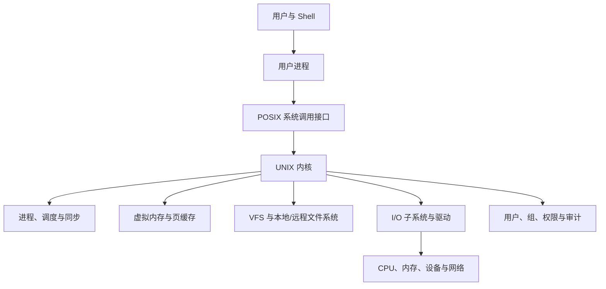
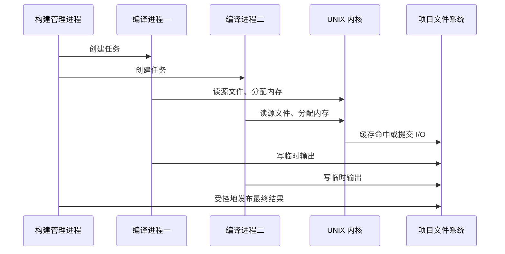

# 例子 - UNIX 操作系统

UNIX 是理解操作系统如何把进程、虚拟内存、文件、设备和用户组织为统一环境的经典案例。本笔记不把 UNIX 等同于某一个发行版，而以教材中的 POSIX/UNIX 抽象为主线，串联从应用发起系统调用到内核、设备和保护机制协作完成请求的全过程。

> [!abstract] 案例目标
> 用一个“用户编辑、编译并运行程序”的连续场景，连接全书的系统调用、进程与线程、同步、内存、文件系统、I/O、存储和保护知识；同时区分 UNIX 的稳定设计思想与具体系统版本差异。

## 案例导航

- [[#系统全景]]：用户态、内核、VFS、I/O 与保护边界。
- [[#从登录到命令执行]]：Shell、进程、线程、调度与系统调用。
- [[#场景一：编辑并编译源文件]]：文件、目录、虚拟内存与调页。
- [[#场景二：并发构建与进程同步]]：多进程构建、竞态与发布。
- [[#内核、I/O 与存储]]：VFS、缓存、驱动和块设备。
- [[#保护、安全与网络]]：权限、受控提权与远程访问。

## 系统全景

图中的内核不是单一功能模块：它协调资源、维护不变量并在用户态与硬件之间建立保护边界。传统 UNIX 常被描述为单体内核，但现代 UNIX-like 系统可采用模块化驱动、不同的文件系统、调度器和安全模块。

## 从登录到命令执行

用户通过终端或图形会话认证后获得身份与初始进程。Shell 是普通用户态程序：它解析命令、创建子进程、设置输入输出重定向并等待或管理后台任务；它本身不是内核的一部分。

典型命令执行路径为：

1. Shell 创建子进程，子进程继承部分执行环境与打开文件描述符。
2. 子进程装入新的可执行映像，内核建立新的地址空间、初始线程和用户栈。
3. 调度器在 [[第五章 进程调度]] 的策略下为可运行线程分配 CPU。
4. 程序经系统调用请求文件、内存、网络或进程服务；发生时从用户态切换到内核态。
5. 正常退出、信号、异常或父进程等待都会改变进程状态并触发资源回收。

> [!important] 进程、程序与线程
> **程序**是静态文件；**进程**是正在执行的资源容器；**线程**是实际调度执行单元。它们的区别与 [[第三章 进程]]、[[第四章 多线程编程]] 共同构成 UNIX 进程模型的理解前提。

## 场景一：编辑并编译源文件

假设用户运行编辑器修改源文件，再调用编译器生成可执行文件。

### 文件与目录

编辑器通过路径名请求打开文件。内核依次解析目录项、检查路径搜索权限和目标对象权限，再在成功时返回文件描述符。描述符是进程持有的、受内核保护的引用；后续读写依据该引用和打开模式执行。

| 操作 | 关联的 UNIX 抽象 | 对应知识 |
| --- | --- | --- |
| 解析路径 | 目录、挂载点、符号链接 | [[10.3 目录与磁盘的结构]] |
| 打开文件 | 文件描述符、打开文件表 | [[10.1 文件概念]] |
| 读写数据 | 页缓存、逻辑块、文件偏移 | [[第十一章 文件系统实现]] |
| 写回介质 | 缓冲、设备队列、驱动 | [[第十三章 IO系统]] |
| 分配空间 | 块映射、空闲空间与恢复 | [[11.4 分配方法]] |

编译器读取源文件、头文件和库文件，在用户地址空间中解析它们；输出的目标文件或可执行文件经文件系统写入存储。文件格式由编译器、链接器和加载器约定，普通文件系统通常只将其视为字节序列。

### 虚拟内存与调页

编辑器和编译器看到的是各自独立的虚拟地址空间。代码段、堆、栈和映射文件按页组织；缺页时内核从后备存储取回页面或分配零页。内存不足时，页面可能被换出到交换空间，具体机制见 [[第九章 虚拟内存管理]] 与 [[12.6 交换空间管理]]。

> [!warning] 逻辑地址不是物理位置
> 用户程序的指针不直接等于内存芯片地址，也不直接等于磁盘地址。地址转换、页表、文件块映射和设备逻辑块地址由不同层完成；混淆这些层次会导致对性能和保护边界的错误判断。

## 场景二：并发构建与进程同步

构建工具可同时启动多个编译任务以利用多核 CPU。各任务通常拥有独立地址空间，但会共享项目目录、构建缓存或日志文件。内核调度器负责 CPU 分配；应用和工具则需通过锁、原子重命名、临时文件或其他协议避免竞态。

若两个进程同时修改同一个文件，文件系统的写入成功不等于应用语义正确。临界区、互斥、死锁与文件锁分别见 [[第六章 同步]]、[[第七章 死锁]] 和 [[10.5 文件共享]]。

## 内核、I/O 与存储

用户的读写请求经过系统调用接口进入内核，可能由 VFS 分派到本地文件系统或网络文件系统；文件系统把文件偏移映射为逻辑块，I/O 子系统调度请求，设备驱动与控制器完成传输。DMA 可将数据在设备和内存之间批量移动，完成后以中断或完成事件通知内核。

| 层次 | UNIX 案例中的作用 | 关键边界 |
| --- | --- | --- |
| VFS | 统一本地、远程和伪文件系统接口 | 不统一所有文件系统语义 |
| 页缓存/缓冲区缓存 | 复用近期数据并合并 I/O | 缓存命中不等于数据已持久化 |
| 驱动与 DMA | 访问具体设备并传送数据 | 需要处理并发、错误和内存保护 |
| 块设备与 RAID | 提供容量、冗余和性能 | RAID 不是独立备份 |

设备延迟、排队与文件布局会影响用户可感知的响应时间。机械磁盘可使用调度降低寻道，SSD 仍有队列、垃圾回收和写放大等不同瓶颈；详见 [[第十二章 大容量存储设备]]。

## 保护、安全与网络

UNIX 的基础保护将对象所有者、组和其他用户的权限与进程有效身份相匹配。目录搜索权限、文件 ACL、挂载选项和受保护描述符共同决定一次访问是否允许。设置用户标识程序可临时进入更高权限域，但必须将输入、环境和可访问对象限制在完成任务所需的最小范围。

> [!danger] 不把受控提权当作全能权限
> 设置用户标识、管理员账户或服务账号都应只提供一项受限能力。若程序能被不可信输入驱动去执行任意命令，保护域切换会成为特权扩大漏洞。

网络服务进一步引入远程身份、协议、缓存和故障问题。远程文件系统可被挂载到本地命名空间，但其一致性和认证不应默认等同于本地磁盘。保护与安全的概念边界见 [[第十四章 系统保护]]、[[第十五章 系统安全]]。

## 贯通全书的复盘

> [!note] 以“运行编译器”为线索
> 1. 导论与结构：系统调用从用户态进入内核。  
> 2. 进程与调度：Shell 和编译器作为并发进程运行。  
> 3. 同步：构建结果发布需要避免竞态。  
> 4. 内存：独立虚拟地址空间、按需调页和交换。  
> 5. 文件与存储：路径、VFS、块映射、缓存、I/O 和 RAID。  
> 6. 保护与安全：身份、权限、最小特权与审计限制影响范围。

## 版本边界与关联

- UNIX 是家族名称；进程 API、权限、文件系统、MAC、容器和网络栈在 BSD、Linux、macOS、Solaris 等系统中不同。
- 本文以教材机制为主，不是任一系统的配置或安全操作手册。
- 相关入口：[[第二章 操作系统结构]]、[[第十章 文件系统]]、[[第十一章 文件系统实现]]、[[第十三章 IO系统]]、[[第十四章 系统保护]]、[[第十五章 系统安全]]。
